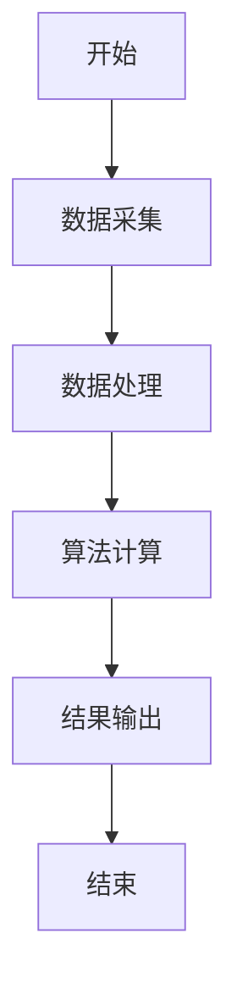

                 


```markdown
# 光伏发电效率提升带来的新一轮投资机会

> 关键词：光伏发电、效率提升、投资机会、可再生能源、能源转型

> 摘要：随着全球能源结构的转型，光伏发电作为一种清洁、可持续的能源形式，正成为能源市场的重要组成部分。本文深入分析了光伏发电效率提升的关键技术，探讨了效率提升对投资回报的影响，并结合市场趋势和政策支持，揭示了光伏发电效率提升带来的新一轮投资机会。

---

## 第一章：光伏发电效率提升的背景与现状

### 1.1 全球能源转型与可再生能源的重要性

能源结构的转型已成为全球关注的焦点。随着化石燃料的枯竭和环境问题的加剧，可再生能源逐渐成为主流。光伏发电作为一种清洁、环保的能源形式，因其广泛分布和可持续性，受到了广泛关注。

#### 1.1.1 全球能源结构变化趋势

近年来，全球能源结构正在向低碳化、清洁化方向转变。根据国际能源署（IEA）的报告，可再生能源在全球能源结构中的占比逐年增加，预计到2030年，可再生能源将占全球电力装机容量的40%以上。

#### 1.1.2 可再生能源在能源转型中的地位

可再生能源是实现能源转型的核心。光伏发电作为其中的重要组成部分，凭借其高效、环保的特点，正在全球范围内快速推广。

#### 1.1.3 光伏发电在全球能源结构中的作用

光伏发电不仅能够减少碳排放，还能降低对化石燃料的依赖。通过提升光伏发电效率，可以进一步降低成本，推动其在能源结构中的广泛应用。

### 1.2 光伏发电技术的发展历程

光伏发电技术经历了多年的发展，从早期的实验室研究到如今的商业化应用，取得了显著的进步。

#### 1.2.1 光伏发电的基本原理

光伏发电的核心是将太阳光转化为电能。通过半导体材料（如硅）吸收光能，产生电子-空穴对，进而形成电流。

#### 1.2.2 光伏发电技术的历史演变

早期的光伏发电技术效率较低，随着材料科学和制造技术的进步，光伏电池的转换效率不断提高。例如，单晶硅电池的转换效率已从最初的10%提升至20%以上。

#### 1.2.3 当前光伏发电技术的现状与挑战

尽管光伏发电技术取得了显著进步，但仍有诸多挑战。例如，如何进一步提升电池效率、降低成本，以及如何应对天气变化对发电效率的影响。

### 1.3 光伏发电效率提升的必要性

提升光伏发电效率是降低成本、提高竞争力的关键。

#### 1.3.1 光伏发电效率对能源成本的影响

效率提升意味着单位面积产生的电能增加，从而降低单位电量的成本。例如，高效电池可以减少组件数量，降低安装成本。

#### 1.3.2 提升效率对环境保护的意义

通过提高效率，可以减少土地使用和资源消耗，进一步降低光伏发电对环境的影响。

#### 1.3.3 效率提升对能源安全的重要性

高效光伏发电系统能够更有效地利用自然资源，减少对外部能源的依赖，提升能源供应的安全性。

---

## 第二章：光伏发电效率提升的核心技术

### 2.1 光伏电池效率提升的关键因素

电池效率是光伏发电效率的核心因素，涉及材料选择、结构设计等多个方面。

#### 2.1.1 电池材料的选择与优化

选择合适的材料是提升效率的关键。例如，使用高质量的硅材料可以减少电子复合，提高转换效率。

#### 2.1.2 电池结构的创新设计

通过优化电池结构，如增加光线路径长度，可以提高光能的利用率。例如，背钝化技术可以减少电子损失，提高效率。

#### 2.1.3 光伏电池转换效率的理论极限

根据Shockley-Qin理论，单结电池的理论最大效率为30%。通过多结电池等技术，实际效率可以进一步提升。

### 2.2 光资源优化利用技术

合理利用光资源是提升光伏发电效率的重要手段。

#### 2.2.1 光跟踪系统（PV-T）的应用

光跟踪系统通过调整组件角度，确保太阳光始终垂直照射在组件上，提高发电效率。例如，双轴跟踪系统可以实现全天候优化。

#### 2.2.2 光伏组件的智能控制技术

智能控制系统可以根据光照强度和环境条件，自动调整组件参数，如电压和电流，以实现最大效率。

#### 2.2.3 光资源分布与地理环境的影响

不同地区的光照条件差异显著，合理设计系统以适应当地条件是提升效率的关键。例如，在高纬度地区，优化倾角可以提高发电量。

### 2.3 智能运维与能量管理技术

智能化运维和能量管理是提升效率的重要手段。

#### 2.3.1 智能监控系统在光伏发电中的应用

智能监控系统可以实时监测系统运行状态，及时发现并解决问题，如组件污损或故障。

#### 2.3.2 能量管理系统的设计与实现

能量管理系统通过优化能量流动，减少能量损耗。例如，智能逆变器可以根据电网需求调整输出电压和频率。

#### 2.3.3 数据分析与预测技术在运维中的作用

通过数据分析和预测，可以优化系统运行策略。例如，使用机器学习算法预测天气变化，提前调整系统参数。

---

## 第三章：光伏发电效率提升的系统架构与实现

### 3.1 光伏发电系统的整体架构

光伏发电系统由多个模块组成，每个模块协同工作以实现高效发电。

#### 3.1.1 系统组成与功能模块划分

典型的光伏发电系统包括：
- 光伏组件：将太阳光转化为电能。
- 逆变器：将直流电转换为交流电。
- 蓄电池：存储多余的能量，用于阴天或夜晚使用。
- 控制系统：监控和管理整个系统。

#### 3.1.2 系统架构的优化设计

优化系统架构可以提高效率和可靠性。例如，采用模块化设计，便于维护和升级。

### 3.2 光伏发电效率提升的算法实现

通过优化算法，可以进一步提升光伏发电效率。

#### 3.2.1 算法原理与流程图

以下是光伏发电效率优化的流程图：



#### 3.2.2 算法优化与性能提升

通过机器学习算法，可以实时优化系统参数，例如使用粒子群算法优化组件倾角。

### 3.3 系统实现的关键技术

实现高效光伏发电系统需要多项关键技术。

#### 3.3.1 系统实现的硬件基础

硬件部分包括高效光伏组件、智能逆变器和先进的监控设备。

#### 3.3.2 系统实现的软件支持

软件部分包括数据采集、处理和分析系统，以及智能控制算法。

#### 3.3.3 系统实现的集成与测试

系统集成和测试是确保高效运行的关键步骤。例如，通过模拟不同光照条件下的系统响应，验证系统的稳定性和效率。

---

## 第四章：光伏发电效率提升的投资机会分析

### 4.1 光伏发电市场的现状与趋势

光伏发电市场正快速增长，尤其是在政策支持和技术创新的推动下。

#### 4.1.1 全球光伏发电市场的发展现状

根据统计，全球光伏发电装机容量已超过700GW，且仍在快速增长中。

#### 4.1.2 中国光伏发电市场的特点

中国是全球最大的光伏发电市场，占据了全球装机容量的三分之一以上。

#### 4.1.3 光伏发电市场的未来发展趋势

随着技术进步和成本下降，光伏发电将成为最经济的能源形式之一。

### 4.2 光伏发电效率提升的投资回报分析

提升效率可以带来更高的投资回报。

#### 4.2.1 投资成本与收益的对比

高效系统虽然初期投资较高，但其发电效率和使用寿命的提升可以显著降低单位电量成本。

#### 4.2.2 效率提升对投资回报的影响

例如，高效组件的投资回收期可能缩短至3-4年，而低效组件可能需要5-6年。

#### 4.2.3 投资风险与收益的平衡

通过多元化投资和风险控制，可以有效降低投资风险，提高收益。

### 4.3 光伏发电效率提升的投资策略

投资者应根据市场趋势和自身条件制定合理策略。

#### 4.3.1 技术驱动型投资策略

优先投资于技术创新的企业，如高效电池和智能系统开发商。

#### 4.3.2 市场导向型投资策略

根据市场容量和政策环境，选择投资区域和项目类型。

#### 4.3.3 风险控制与投资组合优化

通过分散投资和定期评估，优化投资组合，降低风险。

---

## 第五章：光伏发电效率提升的政策支持与行业趋势

### 5.1 光伏发电行业的政策支持

政策支持是推动光伏发电发展的重要因素。

#### 5.1.1 国家层面的政策支持

例如，中国政府推出的“光伏扶贫”政策，鼓励在贫困地区发展光伏发电。

#### 5.1.2 地方政府的扶持措施

地方政府 often 提供补贴、优惠贷款等，支持光伏发电项目。

### 5.2 光伏发电行业的未来趋势

技术创新和成本下降将继续推动行业增长。

#### 5.2.1 技术创新与产业升级

高效电池技术和智能运维系统的应用将推动行业向高端化发展。

#### 5.2.2 市场竞争与整合

随着市场的扩大，行业将面临更激烈的竞争，优胜劣汰将加速。

#### 5.2.3 可再生能源的协同发展

光伏发电将与风能等其他可再生能源协同发展，形成更稳定的能源供应。

---

## 参考文献

1. 国际能源署（IEA）：《全球能源展望报告》
2. 美国国家可再生能源实验室（NREL）：《光伏技术发展报告》
3. 中国光伏协会：《中国光伏发电市场分析报告》
4. 光伏技术权威期刊：《Journal of Photovoltaics》

---

## 作者：AI天才研究院 & 禅与计算机程序设计艺术

感谢您的阅读！如需进一步了解光伏发电效率提升的投资机会，请随时联系。
```

