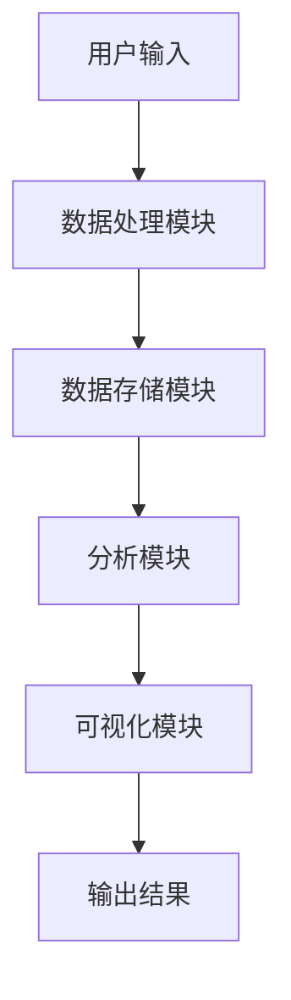

                 


# 全球经济体市值与GDP比较分析

> 关键词：全球经济体、市值、GDP、经济分析、数据对比

> 摘要：本文通过详细分析全球经济体系中的市值与GDP的概念、计算方法及其相互关系，探讨市值与GDP在经济分析中的作用，并通过实际案例分析，深入比较不同经济体的市值与GDP的变化趋势和内在联系。文章结合理论分析与实践应用，为读者提供一个全面理解全球经济体系的视角。

---

## 第1章：全球经济体市值与GDP的背景介绍

### 1.1 全球经济体系的基本概念

#### 1.1.1 经济体系的定义与分类
- 经济体系是社会资源分配和生产活动的组织方式，主要分为市场经济、计划经济和社会市场经济等类型。
- 全球经济体系是一个复杂的网络，涵盖各国的经济活动及其相互影响。

#### 1.1.2 市值与GDP的定义与特点
- **市值（Market Value）**：指企业在股票市场上的总价值，通常用于衡量企业的市场地位和经济影响力。
- **GDP（国内生产总值）**：衡量一个国家或地区在一定时期内生产的最终产品和服务的总价值。

#### 1.1.3 问题背景与研究意义
- 经济学研究中，市值与GDP是两个重要的指标，但它们的计算方法和应用场景存在差异。
- 比较市值与GDP，有助于更好地理解经济体系的运行机制和内在联系。

### 1.2 市值与GDP的核心概念
- **市值**：反映企业的市场价值，受市场供需关系、企业盈利能力等多种因素影响。
- **GDP**：反映一个国家或地区的经济总量，包括消费、投资、政府支出和净出口等多个组成部分。

### 1.3 市值与GDP的关系与应用
- **关联性分析**：市值与GDP之间存在一定的相关性，但并非完全一致。
- **经济分析中的作用**：市值反映市场的微观表现，GDP反映经济的宏观表现，两者结合可以更全面地分析经济状况。

---

## 第2章：市值与GDP的核心概念对比

### 2.1 市值与GDP的定义与属性

#### 2.1.1 市值的核心属性
- **市场价值**：市值是企业在股票市场上的总价值，反映市场的认可程度。
- **流动性**：市值高的企业通常具有较高的流动性。
- **波动性**：受市场情绪和经济环境影响较大。

#### 2.1.2 GDP的核心属性
- **总量**：GDP是衡量一个国家或地区经济总量的重要指标。
- **构成**：包括消费、投资、政府支出和净出口。
- **地域性**：GDP是按国家或地区计算的。

### 2.2 市值与GDP的对比分析

#### 2.2.1 市值与GDP的异同点对比
| **属性**       | **市值**                     | **GDP**                     |
|----------------|------------------------------|------------------------------|
| **定义**       | 市场上的企业总价值           | 经济总量的度量               |
| **计算方式**   | 股价乘以股票数量             | 各个经济部门的总和           |
| **时间维度**   | 实时变化                    | 按季度或年度计算            |
| **影响因素**   | 市场供需、企业盈利           | 消费、投资、政府支出等      |

#### 2.2.2 市值与GDP的相互影响
- 市值反映企业的市场表现，而GDP反映整个经济的运行状况。
- 例如，当GDP增长时，企业利润增加，通常会推动市值上升。

### 2.3 市值与GDP的ER实体关系图
```mermaid
er
    entity 市值 {
        key: 名称
        attributes: 总市值, 股价, 股票数量
    }
    entity GDP {
        key: 名称
        attributes: 国内生产总值, 消费, 投资, 政府支出, 净出口
    }
    市值 --GDP: 经济表现相关性
```

---

## 第3章：市值与GDP的算法原理

### 3.1 算法原理概述

#### 3.1.1 市值计算公式
- 市值 = 股价 × 股票数量

#### 3.1.2 GDP计算公式
- GDP = 消费（C）+ 投资（I）+ 政府支出（G）+ 净出口（X - M）

### 3.2 算法实现

#### 3.2.1 Python代码实现
```python
# 示例代码：计算市值和GDP

# 市值计算
def calculate_market_value(stock_price, quantity):
    return stock_price * quantity

# GDP计算
def calculate_gdp(consumption, investment, government_expenditure, net_exports):
    return consumption + investment + government_expenditure + net_exports

# 示例数据
stock_price = 100
quantity = 10
market_value = calculate_market_value(stock_price, quantity)
print(f"市值：{market_value}")

consumption = 1000
investment = 500
government_expenditure = 300
net_exports = 200
gdp = calculate_gdp(consumption, investment, government_expenditure, net_exports)
print(f"GDP：{gdp}")
```

#### 3.2.2 算法流程图
```mermaid
graph TD
    A[开始] -> B[读取输入数据]
    B -> C[计算市值]
    C -> D[计算GDP]
    D -> E[输出结果]
    E -> F[结束]
```

---

## 第4章：市值与GDP的系统分析与架构设计

### 4.1 系统功能设计
- **数据收集模块**：收集各国的市值和GDP数据。
- **分析模块**：计算市值与GDP的比率、趋势等。
- **可视化模块**：生成图表展示结果。

### 4.2 系统架构设计


---

## 第5章：市值与GDP的项目实战

### 5.1 项目背景
- 分析全球主要经济体的市值与GDP变化趋势。

### 5.2 核心实现代码
```python
import pandas as pd
import matplotlib.pyplot as plt

# 示例数据
data = {
    '国家': ['美国', '中国', '日本', '德国'],
    '市值': [10000, 8000, 5000, 4000],
    'GDP': [20000, 15000, 12000, 10000]
}

df = pd.DataFrame(data)

# 绘制柱状图
plt.figure(figsize=(10, 6))
plt.bar(df['国家'], df['市值'], label='市值', color='blue')
plt.bar(df['国家'], df['GDP'], label='GDP', color='green')
plt.title('市值与GDP对比分析')
plt.xlabel('国家')
plt.ylabel('数值')
plt.legend()
plt.show()
```

### 5.3 案例分析
- 通过上述代码生成的图表，可以看出美国的市值和GDP均远高于其他国家。

---

## 第6章：总结与展望

### 6.1 最佳实践
- 在进行市值与GDP比较分析时，建议结合具体经济指标和市场环境。
- 使用工具如Python、Pandas、Matplotlib进行数据分析和可视化。

### 6.2 小结
- 市值与GDP是衡量经济的重要指标，但它们的计算方法和应用场景存在差异。
- 通过深入分析和比较，可以更好地理解经济体系的运行机制。

### 6.3 注意事项
- 数据来源的准确性是分析的基础。
- 需要考虑经济环境的变化对市值和GDP的影响。

### 6.4 拓展阅读
- 建议读者进一步学习其他经济指标，如PMI、失业率等。

---

## 作者：AI天才研究院/AI Genius Institute & 禅与计算机程序设计艺术 /Zen And The Art of Computer Programming

