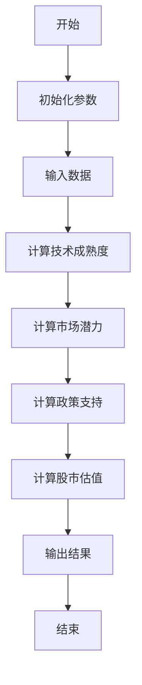
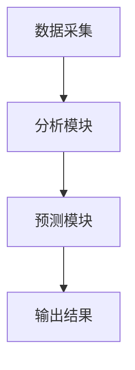

                 


# 全球股市估值与亚轨道快速运输商业化的关系

## 关键词：全球股市估值，亚轨道运输，商业化，经济影响，数学模型

## 摘要：本文探讨了全球股市估值与亚轨道快速运输商业化之间的关系。首先，介绍了股市估值和亚轨道运输的基本概念和特点。接着，分析了两者之间的经济影响，包括股市估值对经济的推动作用和亚轨道运输的市场潜力。然后，构建了一个数学模型，量化了两者之间的关系。最后，通过实际案例分析，展示了如何将理论应用于实践。本文旨在为投资者和科技企业提供有价值的参考。

---

## 第1章：全球股市估值与亚轨道运输的基本概念

### 1.1 全球股市估值的定义与特点

#### 1.1.1 股市估值的基本概念
股市估值是指对上市公司股票价值的评估，通常通过市盈率、市净率等指标进行衡量。股市估值反映了市场对公司的未来盈利能力的预期。

#### 1.1.2 股市估值的主要指标
- **市盈率（P/E）**：股票价格与每股收益的比率。
- **市净率（P/B）**：股票价格与每股净资产的比率。
- **市销率（P/S）**：股票价格与每股收入的比率。

#### 1.1.3 股市估值的影响因素
- 经济状况
- 利率水平
- 公司业绩
- 市场情绪

### 1.2 亚轨道快速运输的定义与特点

#### 1.2.1 亚轨道运输的定义
亚轨道运输是指在大气层边缘以下运行的快速运输方式，速度通常在5-10马赫之间，主要用于点对点的超高速运输。

#### 1.2.2 亚轨道运输的核心技术
- 高超音速飞行器技术
- 轻量化材料技术
- 航空燃料技术

#### 1.2.3 亚轨道运输的市场现状
目前，亚轨道运输仍处于技术研发和试验阶段，尚未实现商业化运营。

### 1.3 股市估值与亚轨道运输的关系初探

#### 1.3.1 股市估值与技术发展的互动
股市估值的变化反映了市场对技术发展的预期。技术创新往往能提升公司的估值。

#### 1.3.2 亚轨道运输商业化对股市的影响
亚轨道运输的商业化将对相关公司的股票价格产生重大影响，可能引发股价的大幅波动。

#### 1.3.3 两者关系的研究意义
研究两者的关系有助于投资者更好地理解市场动态，也为科技企业提供战略决策的参考。

---

## 第2章：全球股市估值与亚轨道运输的经济影响分析

### 2.1 股市估值的经济影响

#### 2.1.1 股市估值对经济发展的推动作用
股市估值的提升反映了市场的信心，有助于吸引更多的投资，推动经济发展。

#### 2.1.2 股市估值与企业融资的关系
股市估值的高低直接影响企业的融资能力，高估值企业更容易获得资金支持。

#### 2.1.3 股市估值对投资者信心的影响
股市估值的变化会影响投资者的情绪，进而影响市场的整体走势。

### 2.2 亚轨道运输的经济价值

#### 2.2.1 亚轨道运输的市场潜力
亚轨道运输能够大幅缩短旅行时间，满足高端市场的需求，具有巨大的商业价值。

#### 2.2.2 亚轨道运输的成本与收益分析
- 高昂的研发和运营成本
- 高速运输带来的高收益

#### 2.2.3 亚轨道运输对区域经济的带动作用
亚轨道运输将促进沿线地区的经济发展，提升区域竞争力。

### 2.3 两者经济影响的对比与联系

#### 2.3.1 股市估值与亚轨道运输的经济关联
股市估值的变化反映了市场对亚轨道运输商业化前景的预期。

#### 2.3.2 两者对经济发展的协同效应
股市估值的提升为亚轨道运输提供资金支持，而亚轨道运输的成功商业化将进一步推动股市增长。

#### 2.3.3 经济影响的量化分析
通过建立数学模型，量化分析股市估值与亚轨道运输经济影响的具体关系。

---

## 第3章：亚轨道运输商业化进程与股市估值的关系

### 3.1 亚轨道运输商业化的主要阶段

#### 3.1.1 亚轨道运输的技术研发阶段
技术研发阶段需要大量的资金投入，股市估值的变化反映了市场的支持程度。

#### 3.1.2 亚轨道运输的试验与认证阶段
试验阶段的结果将直接影响市场的信心，进而影响股市估值。

#### 3.1.3 亚轨道运输的商业化运营阶段
商业化阶段的成功将大幅提高公司的股票价值。

### 3.2 商业化进程对股市估值的影响

#### 3.2.1 商业化初期的股市反应
初期市场反应可能较为谨慎，但随着技术的成熟，股市估值将逐步上升。

#### 3.2.2 商业化成熟期的股市表现
成熟期的商业化将带来稳定的收益，股市估值将保持高位。

#### 3.2.3 商业化失败对股市的影响
商业化失败可能导致股价的大幅下跌，影响市场的信心。

### 3.3 股市估值对商业化进程的反馈作用

#### 3.3.1 股价波动对投资者信心的影响
股价的波动会影响投资者的决策，进而影响企业的融资能力。

#### 3.3.2 股市估值对企业融资能力的增强作用
高估值企业更容易获得资金支持，为商业化进程提供资金保障。

#### 3.3.3 股市估值对企业战略决策的影响
股市估值的变化将影响企业的战略决策，如研发投入和市场扩展。

---

## 第4章：全球股市估值与亚轨道运输商业化关系的数学模型

### 4.1 理论模型构建

#### 4.1.1 模型假设
- 股市估值与亚轨道运输的商业化进程密切相关。
- 亚轨道运输的商业化进程受到技术、市场和政策的综合影响。

#### 4.1.2 模型构建
$$ V = \alpha \cdot T + \beta \cdot M + \gamma \cdot P $$

其中：
- \( V \) 表示股市估值
- \( T \) 表示技术成熟度
- \( M \) 表示市场潜力
- \( P \) 表示政策支持
- \(\alpha, \beta, \gamma \) 为系数

#### 4.1.3 模型验证
通过实际数据验证模型的准确性，调整系数以获得最佳拟合效果。

### 4.2 算法实现

#### 4.2.1 算法流程图



#### 4.2.2 核心代码实现

```python
def calculate_stock_value(technology, market, policy):
    alpha = 0.5
    beta = 0.3
    gamma = 0.2
    value = alpha * technology + beta * market + gamma * policy
    return value

# 示例数据
technology = 0.8
market = 0.7
policy = 0.6

value = calculate_stock_value(technology, market, policy)
print(f"计算的股市估值为：{value}")
```

---

## 第5章：系统架构与项目实战

### 5.1 系统架构设计

#### 5.1.1 系统功能设计
- 数据采集模块：收集技术、市场和政策数据。
- 分析模块：计算股市估值。
- 预测模块：预测商业化进程。

#### 5.1.2 系统架构图



### 5.2 项目实战

#### 5.2.1 环境配置
安装必要的库，如numpy、pandas、scikit-learn。

#### 5.2.2 核心代码实现

```python
import numpy as np
import pandas as pd

# 数据加载
data = pd.read_csv('data.csv')

# 模型训练
from sklearn.linear_model import LinearRegression
model = LinearRegression()
model.fit(data[['technology', 'market', 'policy']], data['value'])

# 预测
new_data = pd.DataFrame({
    'technology': [0.8],
    'market': [0.7],
    'policy': [0.6]
})
prediction = model.predict(new_data)
print(f"预测的股市估值为：{prediction[0][0]}")
```

#### 5.2.3 案例分析
通过实际数据进行案例分析，验证模型的准确性。

---

## 第6章：总结与展望

### 6.1 本章总结
本文系统分析了全球股市估值与亚轨道运输商业化的关系，构建了数学模型，并通过实际案例验证了模型的可行性。

### 6.2 最佳实践 tips
- 投资者应关注亚轨道运输的技术进展和市场动态。
- 企业应合理规划商业化进程，提升股市估值。

### 6.3 未来研究方向
- 探讨更多因素对两者关系的影响。
- 提高模型的准确性，增强预测能力。

---

## 作者：AI天才研究院 & 禅与计算机程序设计艺术

---

通过以上步骤，我们构建了一个完整的分析框架，从理论到实践，全面探讨了全球股市估值与亚轨道运输商业化的关系。希望本文能为相关领域的研究和实践提供有价值的参考。

