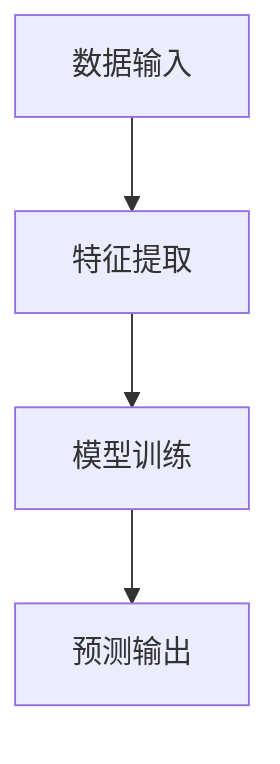

                 

# 全球股市估值与人工智能伦理的关联

## 关键词
全球股市估值、人工智能伦理、金融创新、技术伦理、算法交易、风险管理

## 摘要
本文探讨了全球股市估值与人工智能伦理之间的深层关联，分析了人工智能技术在金融领域的应用及其带来的伦理挑战。通过详细的技术分析和案例研究，本文揭示了如何在技术创新与伦理约束之间找到平衡，以确保金融市场的健康发展。

---

# 第一部分: 全球股市估值与人工智能伦理的背景与基础

## 第1章: 全球股市估值概述

### 1.1 全球股市估值的基本概念

#### 1.1.1 股市估值的定义与意义
股市估值是指通过对公司财务数据、市场环境和行业趋势的分析，对股票的内在价值进行评估的过程。其意义在于帮助投资者做出理性决策，避免市场波动的短期干扰。

#### 1.1.2 全球股市估值的特点
- 全球性：涉及多个国家和地区的市场，具有高度的复杂性和多样性。
- 动态性：受宏观经济、政策变化和市场情绪的影响，实时波动。
- 技术性：依赖于复杂的数学模型和算法进行分析。

#### 1.1.3 股市估值的核心要素
- 公司基本面：收入、利润、资产负债表等财务指标。
- 市场环境：宏观经济政策、行业趋势、市场情绪。
- 风险因素：市场风险、信用风险、流动性风险。

### 1.2 全球股市估值的现状与挑战

#### 1.2.1 当前股市估值的主要方法
- 市盈率（P/E）：市价与每股收益的比率。
- 市净率（P/B）：市价与每股净资产的比率。
- 现金流折现法：将未来现金流折现至当前价值。

#### 1.2.2 全球化背景下的估值挑战
- 多市场联动性：全球经济一体化导致市场相互影响，增加了估值的复杂性。
- 货币政策不确定性：各国央行的货币政策变化对股市估值产生重大影响。
- 地缘政治风险：国际贸易摩擦、地缘政治冲突等事件会引发市场波动。

#### 1.2.3 技术驱动下的估值变革
- 数据驱动的估值模型：利用大数据和人工智能技术进行更精准的估值。
- 自动化交易：算法交易占据了全球股市交易量的绝大部分，改变了传统的估值方式。

---

## 第2章: 人工智能伦理的基本概念

### 2.1 人工智能伦理的定义与范围

#### 2.1.1 人工智能伦理的核心概念
人工智能伦理是指在设计、开发和应用人工智能系统时，应遵循的道德原则和规范，以确保技术的使用符合人类社会的价值观。

#### 2.1.2 人工智能伦理的边界与外延
- 边界：人工智能系统的决策范围和影响程度。
- 外延：从算法设计到数据隐私，从系统运行到社会责任。

#### 2.1.3 人工智能伦理的主体与客体
- 主体：技术开发者、企业、政府。
- 客体：人工智能系统、用户、数据。

### 2.2 人工智能伦理的框架与原则

#### 2.2.1 人工智能伦理的框架体系
- 透明性：确保人工智能系统的决策过程可解释。
- 责任归属：明确人工智能系统出现问题时的责任主体。
- 公平性：避免算法偏见，确保决策的公平性。

#### 2.2.2 人工智能伦理的核心原则
- 尊重人类尊严：人工智能系统应尊重人类的基本权利。
- 避免伤害：确保人工智能系统的应用不会对人类或社会造成伤害。
- 追求公共利益：人工智能技术应服务于社会的整体利益。

#### 2.2.3 人工智能伦理的实施路径
- 技术开发者：在设计阶段考虑伦理问题。
- 企业：建立伦理审查机制。
- 政府：制定相关政策和法规。

---

# 第二部分: 人工智能在金融领域的应用与影响

## 第3章: 人工智能在股市估值中的技术基础

### 3.1 人工智能技术在金融中的应用

#### 3.1.1 机器学习在金融分析中的应用
- 股价预测：利用机器学习模型分析历史数据，预测未来股价走势。
- 风险评估：通过机器学习算法评估投资组合的风险。

#### 3.1.2 自然语言处理在金融新闻中的应用
- 情感分析：分析新闻标题和文章的情感倾向，预测市场情绪。
- 信息提取：从新闻中提取关键信息，用于估值模型。

#### 3.1.3 时间序列分析在股市预测中的应用
- 使用LSTM（长短期记忆网络）模型处理时间序列数据。
- 通过ARIMA（自回归积分滑动平均模型）预测未来走势。

### 3.2 人工智能算法在股市估值中的实现

#### 3.2.1 常见算法概述
- 线性回归：用于简单的线性关系建模。
- 支持向量机：适用于分类和回归问题。
- 神经网络：用于复杂非线性关系的建模。

#### 3.2.2 算法流程图

#### 3.2.3 算法优缺点分析
- 优点：提高估值的准确性和效率。
- 缺点：算法可能存在过拟合风险，且缺乏透明性。

---

## 第4章: 人工智能算法原理与数学模型

### 4.1 机器学习算法原理

#### 4.1.1 线性回归模型
$$y = \beta_0 + \beta_1x + \epsilon$$

#### 4.1.2 支持向量机模型
$$\text{最大化} \quad \text{间隔} \quad \text{最小化} \quad \text{模型复杂度}$$

#### 4.1.3 神经网络模型
$$\text{输入层} \rightarrow \text{隐藏层} \rightarrow \text{输出层}$$`

### 4.2 时间序列分析的数学模型

#### 4.2.1 ARIMA模型
$$ARIMA(p, d, q)$$

#### 4.2.2 LSTM模型
$$\text{门控机制} \rightarrow \text{记忆单元} \rightarrow \text{输出}$$

#### 4.2.3 GARCH模型

---

# 第三部分: 人工智能与金融伦理的挑战与解决方案

## 第5章: 人工智能算法的伦理挑战

### 5.1 算法偏见与透明性问题

#### 5.1.1 算法偏见的来源
- 数据偏差：训练数据中的不均衡或片面性。
- 算法设计：开发者主观判断导致的偏见。

#### 5.1.2 透明性的重要性
- 确保用户信任：用户需要了解算法的决策依据。
- 避免滥用：防止算法被用于不正当目的。

### 5.2 责任与公平性问题

#### 5.2.1 责任归属
- 技术开发者：算法的设计者。
- 企业：算法的应用者。
- 用户：算法的使用者。

#### 5.2.2 公平性原则
- 避免歧视：确保算法对所有用户公平。
- 保护弱势群体：关注算法对弱势群体的影响。

---

## 第6章: 人工智能伦理的解决方案

### 6.1 建立伦理审查机制

#### 6.1.1 审查流程
- 算法设计阶段：评估潜在的伦理风险。
- 应用阶段：监控算法的实际效果。

#### 6.1.2 审查标准
- 是否符合伦理原则。
- 是否符合法律法规。

### 6.2 制定伦理规范与监管框架

#### 6.2.1 伦理规范
- 明确人工智能技术的使用边界。
- 规定技术开发者和企业的责任。

#### 6.2.2 监管框架
- 制定相关政策法规。
- 设立监管机构。

---

# 第四部分: 全球股市估值与人工智能伦理的案例分析

## 第7章: 全球股市估值与人工智能伦理的典型案例

### 7.1 算法交易中的伦理问题

#### 7.1.1 算法交易的定义与特点
- 高频交易：利用算法进行快速交易。
- 程序化交易：通过算法自动执行交易策略。

#### 7.1.2 算法交易的伦理挑战
- 市场操纵风险：算法交易可能被用于操纵市场。
- 公平性问题：算法交易可能导致普通投资者的劣势。

### 7.2 量化投资中的伦理问题

#### 7.2.1 量化投资的定义与特点
- 依赖数学模型和算法进行投资决策。
- 强调数据驱动和自动化。

#### 7.2.2 量化投资的伦理挑战
- 数据隐私：大量收集和使用用户数据可能侵犯隐私。
- 模型不透明：复杂的算法可能让用户无法理解其决策依据。

---

## 第8章: 人工智能伦理的未来展望

### 8.1 人工智能技术的未来发展方向

#### 8.1.1 更加智能化的算法
- 自适应学习：算法能够根据环境变化自动调整。
- 多模态分析：结合文本、图像等多种数据源进行分析。

#### 8.1.2 更加透明的算法
- 可解释性：确保算法的决策过程可以被理解和解释。
- 透明性：公开算法的设计和使用过程。

### 8.2 人工智能伦理的未来挑战

#### 8.2.1 技术与伦理的平衡
- 如何在技术创新的同时，确保伦理原则的遵守。

#### 8.2.2 全球化背景下的伦理协调
- 不同国家和地区的伦理标准可能存在差异，如何在全球范围内协调这些问题。

---

# 作者
作者：AI天才研究院/AI Genius Institute  
作者：禅与计算机程序设计艺术/Zen And The Art of Computer Programming

