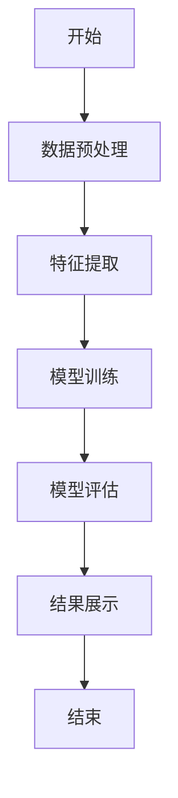

                 


# 全球股市估值与人工智能决策透明度的关联

> 关键词：全球股市估值，人工智能，决策透明度，金融分析，可解释性模型

> 摘要：本文探讨了全球股市估值与人工智能决策透明度之间的关联。首先，分析了传统股市估值方法的局限性，以及人工智能在金融领域的应用现状。接着，详细介绍了全球股市估值的核心概念与方法，包括传统与现代估值模型的对比。然后，深入探讨了人工智能决策透明度的核心原理，分析了透明度对投资者信任和市场稳定性的影响。最后，结合实际案例，展示了如何通过可解释性模型提高AI决策的透明度，并提出了未来的研究方向。

---

## 第一部分: 全球股市估值的背景与现状

### 第1章: 全球股市估值的背景

#### 1.1 传统股市估值方法的局限性

股市估值是金融领域的重要组成部分，传统方法如市盈率（P/E）和市净率（P/B）广泛应用于企业估值。然而，这些方法存在局限性：

1. **数据依赖性**：传统方法依赖历史数据，无法预测未来市场变化。
2. **单一性**：传统方法通常只考虑单一因素，忽视了市场的复杂性。
3. **主观性**：不同分析师可能对同一公司的估值有不同的解读。

#### 1.2 人工智能在金融领域的应用现状

人工智能（AI）技术的兴起为金融领域带来了革新。AI在金融分析中的应用包括：

1. **金融数据分析**：利用机器学习模型处理海量数据，识别市场趋势。
2. **风险管理**：通过AI算法预测市场波动，降低投资风险。
3. **自动化交易**：AI驱动的算法交易已成为市场的重要组成部分。

#### 1.3 全球化经济背景下的股市挑战

全球化使得股市更加复杂，跨国公司的估值需要考虑全球市场因素。AI在这一背景下发挥了重要作用，但同时也带来了透明度的问题。

---

### 第2章: 全球股市估值的核心概念与方法

#### 2.1 传统股市估值方法

传统估值方法主要包括：

1. **市盈率（P/E）**：公式为 $P/E = \text{股价} / \text{每股收益}$，反映市场对公司未来盈利的预期。
2. **市净率（P/B）**：公式为 $P/B = \text{股价} / \text{每股净资产}$，适用于评估银行等资产密集型企业。
3. **股息率**：公式为 $\text{股息率} = (\text{每股股息} / \text{股价}) \times 100\%$，衡量投资回报。

#### 2.2 现代股市估值方法

现代方法结合了多种因素，如现金流折现模型（DCF）：

1. **DCF模型**：通过预测未来现金流，计算其现值以确定公司价值。公式为：
   $$\text{DCF} = \sum_{t=1}^{n} \frac{\text{现金流}_t}{(1 + r)^t} + \frac{\text{残值}}{(1 + r)^n}$$
   其中，$r$为折现率，$n$为预测年数。

2. **股权自由现金流模型**：基于企业的自由现金流，计算股权价值。公式为：
   $$\text{股权价值} = \text{企业价值} - \text{债务价值}$$

3. **企业价值倍数（EV/EBITDA）**：公式为 $\text{EV/EBITDA} = \text{企业价值} / \text{息税折旧及摊销前利润}$，用于评估企业整体价值。

#### 2.3 人工智能在股市估值中的应用

AI通过机器学习模型（如神经网络）处理非结构化数据，提高估值准确性。例如，使用自然语言处理（NLP）分析公司财报文本，提取关键信息辅助估值。

---

## 第二部分: 人工智能决策透明度的核心原理

### 第3章: 人工智能决策透明度的定义与挑战

#### 3.1 决策透明度的定义

透明度指AI系统决策过程的可解释性和可追溯性。高透明度意味着用户能够理解AI的决策依据，从而信任系统。

#### 3.2 人工智能决策透明度的挑战

1. **黑箱模型**：深度学习模型通常难以解释，导致决策缺乏透明度。
2. **数据隐私**：AI依赖大量数据，数据隐私问题影响透明度。
3. **算法偏见**：数据中的偏见可能影响AI决策，引发公平性问题。

#### 3.3 提升决策透明度的方法

1. **可解释性模型**：如线性回归模型比神经网络更易解释。
2. **透明化数据处理**：公开数据来源和处理流程。
3. **用户信任机制**：通过教育和反馈机制增强用户信任。

---

### 第4章: AI决策透明度对股市估值的影响

#### 4.1 AI决策透明度对投资者信任的影响

透明度高的AI系统能增强投资者信心，减少市场波动。例如，当投资者了解AI模型的依据时，更愿意依赖其估值结果。

#### 4.2 AI在股市估值中的透明度问题

AI模型的黑箱特性可能导致估值结果缺乏解释性，影响其可靠性。例如，当市场出现异常波动时，投资者难以理解AI的决策依据。

#### 4.3 提高透明度的方法与实践

1. **使用可解释性模型**：如线性回归或决策树模型，确保估值过程透明。
2. **提供解释性报告**：详细说明AI决策的依据和逻辑。
3. **建立反馈机制**：允许投资者对AI决策提出疑问并获得解答。

---

## 第三部分: 全球股市估值与AI决策透明度的关联分析

### 第4章: 全球股市估值与AI决策透明度的关联

#### 4.1 全球股市估值的核心概念与方法

通过分析传统与现代估值方法，结合AI技术的优势，可以提高估值的准确性和透明度。

#### 4.2 AI决策透明度对估值结果的影响

透明度高的AI系统能提供更可靠的估值结果，增强市场信任。

#### 4.3 提升透明度的方法与实践

1. **使用可解释性模型**：如线性回归模型。
2. **提供详细解释报告**：帮助投资者理解AI决策。
3. **建立反馈机制**：允许投资者对AI决策进行反馈和质疑。

---

## 第四部分: 技术实现与案例分析

### 第5章: 技术实现

#### 5.1 系统架构设计

系统包括数据采集、模型训练和结果展示三个部分：

1. **数据采集**：收集公司财务数据和市场信息。
2. **模型训练**：使用机器学习模型进行估值。
3. **结果展示**：输出估值结果并提供解释。

#### 5.2 算法流程图

使用Mermaid绘制算法流程图：



#### 5.3 Python实现代码

以下是一个简单的线性回归模型代码：

```python
import pandas as pd
from sklearn.linear_model import LinearRegression
from sklearn.metrics import mean_squared_error

# 加载数据
data = pd.read_csv('stock_data.csv')

# 分割特征和目标变量
X = data[['市盈率', '市净率']]
y = data['股票价格']

# 训练模型
model = LinearRegression()
model.fit(X, y)

# 预测
y_pred = model.predict(X)

# 评估
mse = mean_squared_error(y, y_pred)
print(f"均方误差: {mse}")
```

---

## 第五部分: 总结与展望

### 第6章: 总结

本文探讨了全球股市估值与人工智能决策透明度的关联，分析了传统估值方法的局限性和AI技术的应用优势。同时，强调了决策透明度对投资者信任和市场稳定性的重要性。

### 第7章: 未来展望

未来，随着AI技术的进步，可解释性模型和透明化数据处理将变得更加重要。建议进一步研究如何在AI系统中实现更高的透明度，以增强市场的信任和稳定性。

---

作者：AI天才研究院 & 禅与计算机程序设计艺术

---

本文通过详细分析全球股市估值与AI决策透明度的关联，展示了如何利用AI技术提升金融分析的准确性和透明度。希望本文能为金融领域的从业者和研究人员提供有价值的参考和启发。

