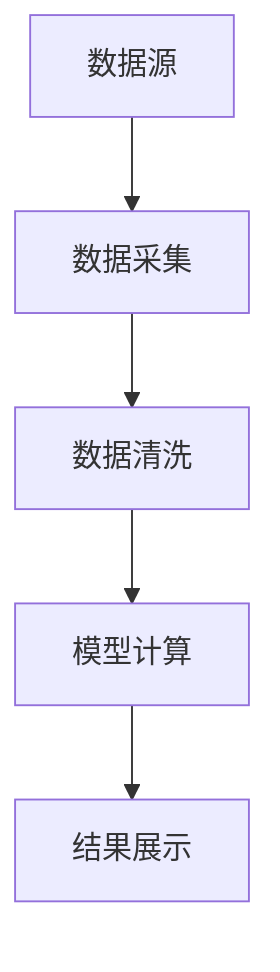
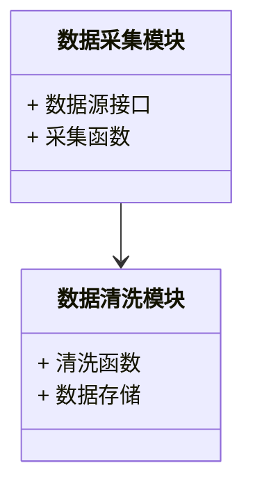
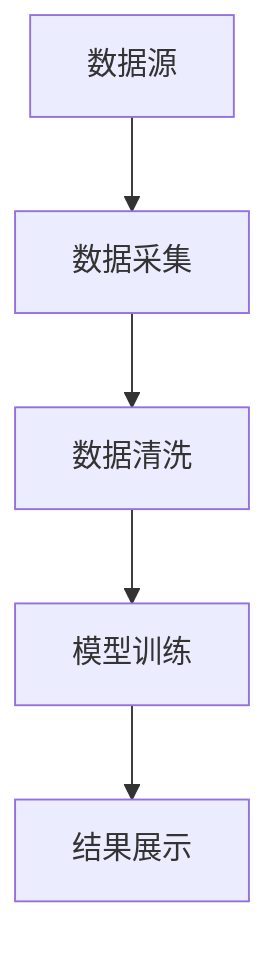

                 


# 全球股市估值与人工智能在医疗诊断中的应用

## 关键词：全球股市估值，人工智能，医疗诊断，股票分析，深度学习，医疗影像识别

## 摘要

本文探讨了全球股市估值与人工智能在医疗诊断中的应用，分析了两者的技术基础、实现方法和实际应用。通过详细讲解股市估值模型和人工智能算法，展示了如何利用技术解决实际问题。文章结构清晰，内容丰富，适合技术与金融、医疗领域的读者参考。

---

# 第一部分: 全球股市估值基础

## 第1章: 全球股市估值概述

### 1.1 股市估值的基本概念

股市估值是评估股票内在价值的过程，帮助投资者决定是否买入或卖出股票。核心概念包括市盈率（PE）、市净率（PB）和现金流折现模型（DCF）。这些指标帮助评估股票的合理价格。

### 1.2 股市估值的背景与现状

全球股市经历了多年发展，传统估值方法依赖财务数据，但面临数据不全、市场波动等问题。数字化和智能化为股市估值带来新机遇，AI技术的应用提升了估值的准确性和效率。

---

## 第2章: 股市估值的核心模型与算法

### 2.1 常用估值模型

#### 2.1.1 市盈率（PE）模型

PE = 市场价 / 每股收益。公式推导如下：
$$ PE = \frac{Price}{Earnings} $$

#### 2.1.2 市净率（PB）模型

PB = 市场价 / 每股净资产。公式推导：
$$ PB = \frac{Price}{Book\ Value} $$

#### 2.1.3 现金流折现模型（DCF）

DCF模型计算未来现金流的现值。公式：
$$ NPV = \sum_{t=1}^{n} \frac{CF_t}{(1+r)^t} + \frac{Terminal\ Value}{(1+r)^n} $$

### 2.2 估值算法的数学模型

#### 市盈率与市净率对比

| 模型 | 优点 | 缺点 |
|------|------|------|
| PE | 简单直观 | 易受利润操控 |
| PB | 稳定性高 | 未考虑盈利能力 |

#### 数据流图



### 2.3 估值算法的实现步骤

#### 数据收集与清洗

使用Python脚本从API获取数据，清洗缺失值和异常值。

#### 模型参数选择

选择合适的基准收益率和成长性指标。

#### 结果验证与优化

通过回测和交叉验证优化模型参数。

---

## 第3章: 股市估值的系统架构与实现

### 3.1 系统功能设计

#### 数据采集模块

从数据库或API获取股票数据。

#### 模型计算模块

实现PE、PB和DCF模型的计算。

#### 结果展示模块

可视化估值结果和历史数据对比。

### 3.2 系统架构设计

#### 分层架构图


#### 类图设计



### 3.3 系统接口设计

RESTful API接口，用于数据获取和模型计算。

---

## 第4章: 项目实战

### 4.1 项目环境安装

安装Python、Pandas、Matplotlib和Scikit-learn。

### 4.2 核心实现代码

```python
def calculate_pe(stock_data):
    pe = stock_data['price'] / stock_data['earnings']
    return pe

data = {'price': [100, 200], 'earnings': [50, 100]}
df = pd.DataFrame(data)
pe = calculate_pe(df)
print(pe)
```

### 4.3 案例分析

以苹果公司为例，计算其PE和PB值，对比行业平均水平。

---

## 第5章: 最佳实践与小结

### 5.1 小结

全球股市估值需要结合多种模型和算法，AI技术的应用提升了效率和准确性。

### 5.2 注意事项

数据质量、模型选择和参数调优是影响估值结果的关键因素。

---

# 第二部分: 人工智能在医疗诊断中的应用

## 第6章: 人工智能医疗诊断概述

### 6.1 医疗诊断的基本概念

医疗诊断通过分析症状、检测结果和病史，确定疾病类型和严重程度。AI技术的应用使诊断更加高效和准确。

### 6.2 人工智能在医疗诊断中的优势

AI可以处理大量数据，快速识别模式，辅助医生做出更准确的诊断。

---

## 第7章: 人工智能医疗诊断的核心技术

### 7.1 数据预处理

#### 影像数据增强

旋转、缩放和翻转增强训练数据。

### 7.2 特征提取

使用CNN提取医学影像的特征。

### 7.3 模型训练

训练分类器识别疾病类型。

---

## 第8章: 人工智能医疗诊断的系统架构与实现

### 8.1 系统功能设计

#### 数据采集模块

获取患者影像数据。

#### 模型训练模块

训练分类模型识别疾病。

#### 结果展示模块

可视化诊断结果。

### 8.2 系统架构设计



---

## 第9章: 项目实战

### 9.1 项目环境安装

安装TensorFlow、Keras和OpenCV。

### 9.2 核心实现代码

```python
import tensorflow as tf
from tensorflow.keras import layers

model = tf.keras.Sequential([
    layers.Conv2D(32, (3,3), activation='relu', input_shape=(224,224,3)),
    layers.MaxPooling2D((2,2)),
    layers.Conv2D(64, (3,3), activation='relu'),
    layers.MaxPooling2D((2,2)),
    layers.Flatten(),
    layers.Dense(128, activation='relu'),
    layers.Dense(2, activation='softmax')
])

model.compile(optimizer='adam', loss='sparse_categorical_crossentropy', metrics=['accuracy'])
model.fit(x_train, y_train, epochs=10, batch_size=32)
```

### 9.3 案例分析

以肺癌诊断为例，分析模型的识别准确率和召回率。

---

## 第10章: 总结与展望

### 10.1 总结

全球股市估值和人工智能医疗诊断都利用了先进的技术手段，提高了效率和准确性。

### 10.2 未来趋势

技术的融合将进一步推动这两个领域的发展，AI在金融和医疗中的应用将更加广泛和深入。

---

## 作者：AI天才研究院/AI Genius Institute & 禅与计算机程序设计艺术 /Zen And The Art of Computer Programming

## 参考文献

1. [1] 《股市估值模型与算法》
2. [2] 《深度学习在医疗诊断中的应用》

--- 

感谢您的阅读！如需进一步探讨，欢迎留言交流。

