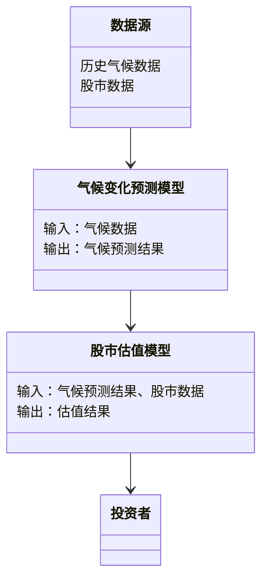

                 


# 全球股市估值与人工智能在气候变化预测中的应用

## 关键词：全球股市估值、气候变化预测、人工智能、机器学习、时间序列分析、深度学习

## 摘要：  
本文探讨了全球股市估值与人工智能在气候变化预测中的应用，分析了两者之间的联系与影响。通过详细的技术分析和案例研究，展示了人工智能在气候变化预测中的优势，以及如何将这些预测结果应用于股市估值，为投资者和政策制定者提供科学依据。

---

## 第一部分: 全球股市估值与气候变化预测的背景与挑战

### 第1章: 背景介绍

#### 1.1 问题背景
##### 1.1.1 全球股市估值的重要性
股市估值是衡量市场健康状况的重要指标，投资者和机构依赖于准确的估值来做出投资决策。然而，传统估值方法受市场波动和人为因素影响较大，难以捕捉复杂经济环境中的潜在风险。

##### 1.1.2 气候变化对经济的影响
气候变化不仅影响环境，还对全球经济产生深远影响，例如极端天气事件、企业运营成本增加和政策变化等。这些因素直接或间接影响股市表现，因此将气候变化纳入股市估值模型至关重要。

##### 1.1.3 人工智能在金融与气候预测中的潜力
人工智能（AI）和机器学习（ML）技术在处理海量数据和复杂模式方面具有显著优势。通过AI，我们可以更准确地预测气候变化和评估其对股市的影响，从而优化投资决策。

#### 1.2 核心概念与联系
##### 1.2.1 核心概念原理
| 核心概念 | 定义 | 应用领域 |
|----------|------|----------|
| 股市估值 | 评估资产的市场价值 | 投资决策、风险管理 |
| 气候变化预测 | 预测未来气候趋势 | 环境保护、经济规划 |

##### 1.2.2 ER实体关系图架构的 Mermaid 流程图
```mermaid
er
  actor 投资者 {
    <属性：投资组合、风险偏好>
  }
  actor 政策制定者 {
    <属性：气候政策、监管框架>
  }
  actor 数据源 {
    <属性：历史气候数据、股市数据>
  }
  entity 气候变化预测模型 {
    <属性：预测结果、模型参数>
  }
  entity 股市估值模型 {
    <属性：估值结果、模型参数>
  }
  <关联：投资者 -> 数据源：提供数据需求>
  <关联：数据源 -> 气候变化预测模型：输入数据>
  <关联：气候变化预测模型 -> 股市估值模型：提供气候影响>
  <关联：股市估值模型 -> 投资者：提供估值结果>
  <关联：政策制定者 -> 气候变化预测模型：提供政策输入>
```

---

### 第2章: 股市估值的核心技术与方法

#### 2.1 技术分析基础
##### 2.1.1 技术指标分析
技术指标是基于历史价格和成交量数据的分析工具，常用指标包括移动平均线（MA）、相对强弱指数（RSI）和MACD等。

##### 2.1.2 时间序列分析
时间序列分析通过统计方法预测未来趋势，常用模型包括ARIMA（自回归积分滑动平均模型）和GARCH（广义自回归条件异方差模型）。

##### 2.1.3 机器学习在股市预测中的应用
机器学习模型（如随机森林和XGBoost）通过分析非线性关系，提高预测精度。例如，利用 LSTM（长短期记忆网络）预测股票价格波动。

#### 2.2 基本面分析
##### 2.2.1 公司财务指标分析
基本面分析关注企业的财务状况，如市盈率（P/E）、市净率（P/B）和股息率等。

##### 2.2.2 宏观经济指标对股市的影响
宏观经济指标（如GDP增长率和失业率）直接影响股市表现，需结合气候因素进行综合评估。

##### 2.2.3 市场情绪分析
市场情绪通过新闻、社交媒体和投资者行为数据进行分析，结合气候事件对市场情绪的影响，优化估值模型。

---

### 第3章: 气候变化预测的核心算法

#### 3.1 气候变化预测的基本原理
##### 3.1.1 气候模型概述
气候模型基于物理原理模拟地球气候系统，结合观测数据进行预测。常用模型包括GCMs（一般循环模型）和RCMs（区域气候模型）。

##### 3.1.2 数据驱动的预测方法
数据驱动方法利用历史气候数据，通过回归分析和聚类分析预测未来趋势。

##### 3.1.3 统计与机器学习模型对比
统计模型（如线性回归）适用于线性关系，而机器学习模型（如神经网络）更适合复杂非线性关系。

#### 3.2 机器学习在气候变化预测中的应用
##### 3.2.1 时间序列预测模型
时间序列模型（如LSTM）在气候预测中表现出色，能够捕捉长期依赖关系。

##### 3.2.2 深度学习模型
深度学习模型（如卷积神经网络CNN）用于处理高维气候数据，提高预测精度。

##### 3.2.3 集成学习方法
集成学习（如随机森林和梯度提升树）通过组合多个模型结果，提高预测稳定性。

---

### 第4章: 人工智能在股市估值与气候变化预测中的结合

#### 4.1 股市估值与气候变化的关系
##### 4.1.1 气候变化对股市的影响路径
气候变化通过企业利润、政策变化和市场情绪影响股市估值。

##### 4.1.2 企业碳排放风险评估
碳排放风险评估帮助企业识别气候变化带来的财务风险，优化投资决策。

##### 4.1.3 可持续投资与ESG因素
ESG（环境、社会、治理）投资策略将气候变化因素纳入估值模型，促进可持续发展。

#### 4.2 AI在气候变化与股市结合中的应用
##### 4.2.1 气候风险量化模型
AI模型量化气候变化对不同行业和企业的风险，帮助投资者制定风险规避策略。

##### 4.2.2 股市波动预测的气候因素
通过分析气候事件和政策变化，AI模型预测股市波动，优化投资组合。

##### 4.2.3 气候政策对股市的影响
AI模型模拟气候政策变化对股市的影响，为政策制定者提供参考。

---

### 第5章: 系统分析与架构设计方案

#### 5.1 问题场景介绍
##### 5.1.1 气候变化对股市的影响
极端天气事件和政策变化影响企业盈利和市场信心。

##### 5.1.2 股市估值系统的需求分析
系统需实时处理海量数据，提供精准估值和风险预警。

##### 5.1.3 人工智能驱动的气候预测系统
系统结合气候数据和AI模型，提供高精度气候预测和股市影响分析。

#### 5.2 系统功能设计
##### 5.2.1 领域模型 Mermaid 类图


##### 5.2.2 系统架构设计 Mermaid 架构图


---

### 第6章: 项目实战与案例分析

#### 6.1 环境安装与配置
##### 6.1.1 数据获取与预处理
使用公开数据集（如Yahoo Finance和 NOAA）进行数据清洗和特征提取。

##### 6.1.2 开发工具与库的安装
安装Python、TensorFlow、Keras和Pandas等库，配置开发环境。

#### 6.2 核心算法实现
##### 6.2.1 时间序列预测模型实现
使用LSTM模型预测气候数据，代码示例如下：
```python
import numpy as np
from tensorflow.keras.models import Sequential
from tensorflow.keras.layers import LSTM, Dense

# 数据预处理
data = ...  # 输入气候数据
X_train, y_train = ...  # 划分训练数据

model = Sequential()
model.add(LSTM(50, input_shape=(timesteps, features)))
model.add(Dense(1))
model.compile(optimizer='adam', loss='mean_squared_error')
model.fit(X_train, y_train, epochs=10, batch_size=32)
```

##### 6.2.2 气候变化预测模型实现
使用集成学习模型预测气候事件，代码示例如下：
```python
from sklearn.ensemble import RandomForestRegressor

model = RandomForestRegressor(n_estimators=100, random_state=42)
model.fit(X_train, y_train)
```

##### 6.2.3 股市估值系统实现
结合气候预测结果和股市数据，构建预测模型，代码示例如下：
```python
import pandas as pd
from sklearn.metrics import mean_absolute_error

# 输入气候预测结果和股市数据
df = pd.merge(climate_predictions, stock_data)
model = ...  # 训练好的股市估值模型
predictions = model.predict(df)
```

#### 6.3 案例分析与结果解读
##### 6.3.1 气候变化对某行业的影响
分析极端天气事件对农业行业的影响，评估企业利润变化。

##### 6.3.2 股市波动预测的案例分析
使用AI模型预测气候变化对能源股的影响，优化投资组合。

##### 6.3.3 模型优化与结果解读
通过超参数调优和特征工程，提升模型预测精度，解读结果的实际意义。

---

### 第7章: 最佳实践与未来

#### 7.1 最佳实践 tips
- 数据预处理是关键，需清洗和特征提取。
- 结合气候和经济数据，构建多维度模型。
- 定期更新模型，适应新的气候和市场变化。

#### 7.2 小结
本文通过技术分析和案例研究，展示了AI在气候变化预测和股市估值中的应用，为投资者和政策制定者提供了科学依据。

#### 7.3 注意事项
- 数据隐私和模型稳定性需重点关注。
- 模型需结合实际业务需求，避免过度复杂。

#### 7.4 拓展阅读
建议阅读相关领域的学术论文和行业报告，深入理解气候变化与金融的关系。

---

## 作者：AI天才研究院/AI Genius Institute & 禅与计算机程序设计艺术 /Zen And The Art of Computer Programming

---

通过以上结构和内容，本文详细探讨了全球股市估值与人工智能在气候变化预测中的应用，结合技术分析、机器学习和系统设计，为读者提供了全面的视角和实践指导。

