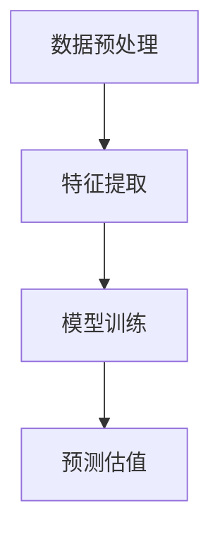
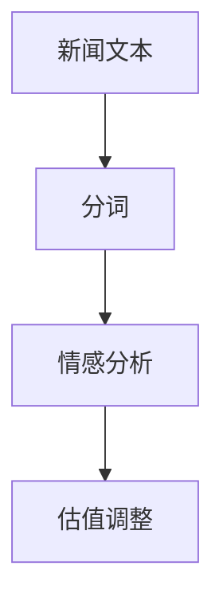
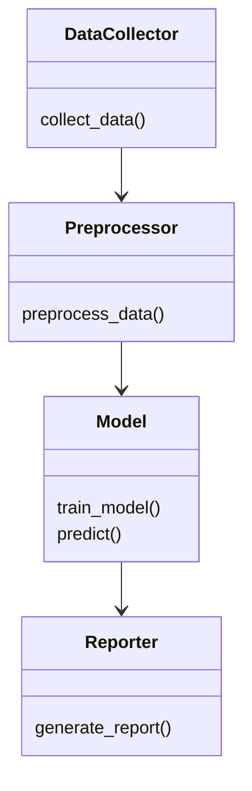
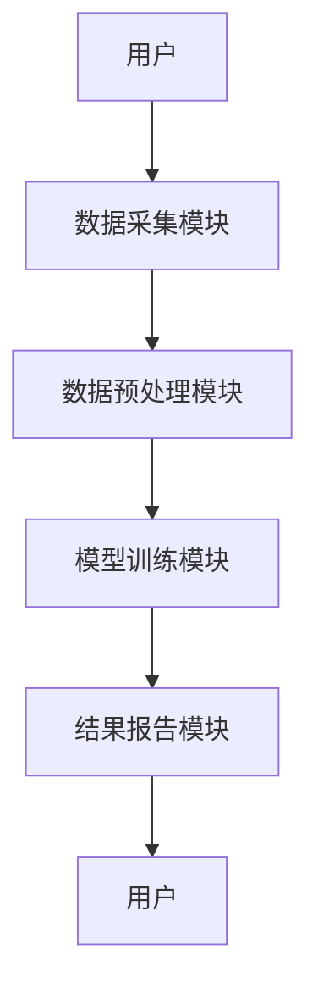
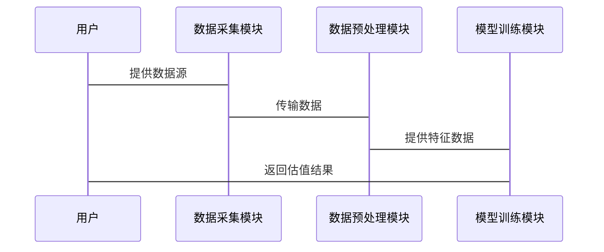

                 


# 全球股市估值与人工智能在法律合规中的应用

**关键词**：全球股市估值、人工智能、法律合规、机器学习、金融数据分析

**摘要**：  
本文探讨了全球股市估值的核心概念与人工智能在法律合规中的应用，分析了传统估值方法的局限性，并详细介绍了如何利用人工智能技术提升股市估值的效率与准确性。同时，本文深入探讨了人工智能在法律合规中的优势与挑战，结合实际案例，展示了AI技术如何在金融领域实现高效合规。通过系统设计与项目实战，本文为读者提供了一套基于AI的股市估值解决方案，并展望了未来的发展趋势。

---

## 第一部分：全球股市估值基础

### 第1章：全球股市估值概述

#### 1.1 全球股市估值的基本概念

股市估值是通过对上市公司内在价值的评估，确定其股票的合理价格范围。它是投资者、分析师和金融机构在决策过程中不可或缺的重要工具。全球股市估值的复杂性主要来源于市场的多样性、宏观经济环境的波动以及公司基本面的差异。

**核心概念术语说明**：
- **股市估值**：通过对公司财务数据、市场环境和行业趋势的分析，估算股票的内在价值。
- **内在价值**：公司未来现金流的现值，是股票价格的理论基础。

#### 1.2 股市估值的核心影响因素

股市估值受多种因素影响，包括宏观经济指标、行业周期和公司基本面。以下是主要影响因素的分类：

| 影响因素类别 | 具体因素 |
|--------------|----------|
| 宏观经济因素 | GDP增长率、利率水平、通货膨胀率 |
| 行业因素     | 行业周期、竞争格局、政策变化 |
| 公司基本面   | 净利润、营收增长、资产负债率 |

#### 1.3 传统股市估值方法与挑战

传统估值方法主要包括市盈率法（P/E）、市净率法（P/B）和股息率法（Dividend Yield）。然而，这些方法存在以下局限性：
- 数据依赖性强，无法捕捉市场波动。
- 忽略了非财务因素（如市场情绪）的影响。
- 简单的比率计算难以应对复杂的市场环境。

#### 1.4 当前全球股市估值的现状与趋势

随着数据科学和人工智能技术的发展，股市估值逐渐从传统方法向自动化、智能化方向转变。大数据分析和机器学习模型的应用，使得估值更加精准和高效。此外，全球化背景下，跨市场估值的需求日益增加，推动了多因子模型和复杂算法的广泛应用。

---

## 第二部分：人工智能在法律合规中的应用

### 第2章：人工智能与法律合规基础

#### 2.1 人工智能的基本概念与技术特点

人工智能（AI）是模拟人类智能的计算机系统，涵盖机器学习、自然语言处理和计算机视觉等领域。AI技术的特点包括数据驱动、自动化处理和自我优化。

| 技术特点 | 描述 |
|----------|------|
| 数据驱动 | 基于大量数据训练模型 |
| 自动化处理 | 自动识别和分类 |
| 自我优化 | 模型通过反馈不断改进 |

#### 2.2 法律合规的基本要求与挑战

法律合规要求企业在经营活动中遵循相关法律法规，确保行为的合法性和正当性。主要挑战包括：
- 法律法规的复杂性和多样性。
- 数据隐私保护的严格要求。
- 全球化背景下的合规成本高。

#### 2.3 人工智能在法律合规中的优势

AI技术在法律合规中的优势显著：
- **高效性**：自动化处理大量法律文本，提高合规效率。
- **准确性**：通过机器学习模型识别潜在法律风险。
- **实时性**：实时监控市场动态，确保合规性。

---

## 第三部分：AI在股市估值中的技术实现

### 第3章：AI驱动的股市估值技术

#### 3.1 基于机器学习的估值模型

机器学习模型通过分析历史数据，预测股票的未来表现。常用的模型包括线性回归和随机森林。

**算法流程图**（mermaid）：



**Python代码示例**：

```python
# 数据预处理
import pandas as pd
data = pd.read_csv('stock_data.csv')

# 特征提取
features = data[['revenue', 'profit', 'market_cap']]
target = data['price']

# 模型训练
from sklearn.linear_model import LinearRegression
model = LinearRegression()
model.fit(features, target)

# 预测估值
predicted = model.predict(features)
```

#### 3.2 基于自然语言处理的新闻分析

NLP技术用于分析新闻和社交媒体，提取情绪指标，辅助估值。

**NLP流程图**（mermaid）：



**Python代码示例**：

```python
from textblob import TextBlob

text = "The company's revenue exceeded expectations."
blob = TextBlob(text)
sentiment = blob.sentiment.polarity
```

#### 3.3 时间序列分析与预测

时间序列分析用于预测股票价格波动，常用ARIMA模型。

**数学模型**：

$$ ARIMA(p, d, q) $$

**Python代码示例**：

```python
from statsmodels.tsa.arima_model import ARIMA

model = ARIMA(data, order=(5, 1, 0))
model_fit = model.fit()
forecast = model_fit.forecast(steps=5)
```

---

## 第四部分：系统设计与架构

### 第4章：AI驱动的股市估值系统设计

#### 4.1 问题场景介绍

系统旨在帮助投资者快速、准确地进行股市估值，同时确保数据处理的合规性。

#### 4.2 领域模型设计

**领域模型类图**（mermaid）：



#### 4.3 系统架构设计

**系统架构图**（mermaid）：



#### 4.4 系统接口设计

- **输入接口**：接收股票数据和市场新闻。
- **输出接口**：提供估值报告和合规建议。

#### 4.5 系统交互流程

**交互流程图**（mermaid）：



---

## 第五部分：项目实战

### 第5章：AI驱动的股市估值系统实现

#### 5.1 环境安装

安装必要的Python库：

```bash
pip install pandas numpy scikit-learn textblob statsmodels
```

#### 5.2 核心代码实现

```python
import pandas as pd
from sklearn.linear_model import LinearRegression
from textblob import TextBlob
from statsmodels.tsa.arima_model import ARIMA

# 数据加载与预处理
data = pd.read_csv('stock_data.csv')
features = data[['revenue', 'profit', 'market_cap']]
target = data['price']

# 机器学习模型训练
model = LinearRegression()
model.fit(features, target)

# 新闻情感分析
text = "The company's revenue exceeded expectations."
blob = TextBlob(text)
sentiment = blob.sentiment.polarity

# 时间序列预测
model_arima = ARIMA(target, order=(5, 1, 0))
model_arima_fit = model_arima.fit()
forecast = model_arima_fit.forecast(steps=5)
```

#### 5.3 案例分析与部署

以某公司新闻为例，分析其对股价的影响，并部署模型进行实时估值。

---

## 第六部分：总结与展望

### 第6章：总结与未来展望

#### 6.1 全文总结

本文详细探讨了全球股市估值的传统方法与人工智能的应用，展示了如何通过AI技术提高估值的准确性和效率。同时，分析了AI在法律合规中的优势与挑战，为未来的金融创新提供了方向。

#### 6.2 未来展望

未来，AI技术将在股市估值中发挥更大作用，推动金融行业的数字化转型。同时，随着技术的进步，法律合规将更加依赖AI，实现高效、动态的合规管理。

---

**作者**：AI天才研究院 & 禅与计算机程序设计艺术

---

以上是文章的完整目录和内容概览，确保每个部分都详细展开，技术实现和系统设计部分都有足够的深度和详细度，帮助读者系统地理解和应用书中的内容。

