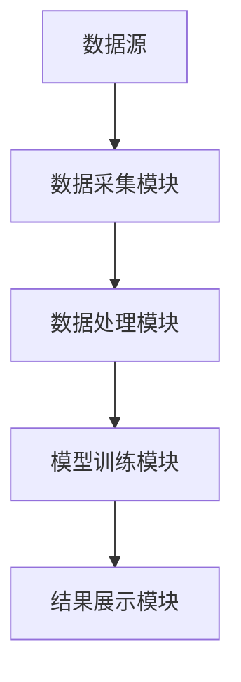

                 


# 全球股市估值与人工智能在法律合规中的应用

## 关键词：全球股市估值, 人工智能, 法律合规, 机器学习, 自然语言处理

## 摘要：  
本文探讨了全球股市估值与人工智能在法律合规中的应用。通过分析股市估值的基本概念、核心要素以及人工智能技术的基本原理，结合具体的算法模型和实际案例，详细阐述了人工智能在股市估值和法律合规中的应用价值和实现方式。文章还介绍了相关的数学模型、系统架构设计以及项目实战，为读者提供了全面而深入的技术解析。

---

## 第一部分: 全球股市估值与人工智能概述

### 第1章: 全球股市估值的基本概念

#### 1.1 全球股市估值的定义与背景

##### 1.1.1 股市估值的基本概念  
股市估值是指通过对公司的财务数据、市场环境和行业趋势等因素进行分析，评估公司股票的内在价值。其核心在于通过分析公司的盈利能力、成长潜力和风险水平，判断股票是否被市场合理定价。股市估值不仅是投资者做出投资决策的重要依据，也是企业融资和资本运作的关键参考。

##### 1.1.2 全球化背景下的股市估值特点  
在全球化背景下，股市估值呈现出以下特点：
- **国际化**：随着资本市场的全球化，股票的估值需要考虑全球市场环境、经济周期和地缘政治风险等因素。
- **多样性**：不同国家和地区的股市受到政策、文化、经济结构等多种因素的影响，估值方法和标准存在差异。
- **波动性**：全球经济的不确定性和突发事件（如疫情、战争等）会导致股市估值的剧烈波动。

##### 1.1.3 股市估值的核心要素与影响因素  
股票估值的核心要素包括：
1. **财务数据**：收入、利润、现金流等财务指标是评估公司价值的基础。
2. **行业地位**：公司在行业中的竞争地位、市场占有率等影响其估值。
3. **政策环境**：政府政策、法律法规的变化对股市估值有直接影响。
4. **市场情绪**：投资者的心理和行为也会显著影响股票价格。

#### 1.2 人工智能在法律合规中的应用背景

##### 1.2.1 人工智能技术的基本概念  
人工智能（AI）是模拟人类智能的计算机系统，主要技术包括：
- **机器学习**：通过数据训练模型，使其能够从经验中学习并做出预测。
- **深度学习**：一种基于人工神经网络的机器学习方法，能够处理复杂的非结构化数据。
- **自然语言处理（NLP）**：使计算机能够理解和生成人类语言的技术。

##### 1.2.2 传统法律合规工作中的痛点  
传统的法律合规工作面临以下问题：
- **效率低下**：法律文本的审查和分析需要大量人工劳动，效率低且容易出错。
- **主观性**：法律判断往往依赖于个人经验，主观性较强，难以量化。
- **信息孤岛**：不同部门和系统之间的信息不互通，导致合规工作难以协同。

##### 1.2.3 人工智能在法律合规中的潜在价值  
人工智能能够显著提升法律合规的效率和准确性：
- **自动化审查**：利用AI技术自动分析合同、法规等法律文本，识别关键条款和潜在风险。
- **实时监控**：通过AI实时监控市场动态和政策变化，及时调整合规策略。
- **数据驱动决策**：AI能够处理大量数据，提供基于数据的合规建议，减少人为错误。

---

## 第二部分: 股市估值的核心概念与人工智能的结合

### 第3章: 股市估值的核心概念与模型

#### 3.1 股市估值的基本原理

##### 3.1.1 股票价值的评估方法  
股票价值的评估方法主要有以下几种：
1. **相对估值法**：通过比较股票与行业平均市盈率、市净率等指标，判断其估值是否合理。
2. **绝对估值法**：基于公司未来现金流的折现值，计算其内在价值。
3. **技术分析法**：通过分析股票价格的历史走势，预测未来的市场价格。

##### 3.1.2 市盈率与市净率的计算与应用  
- **市盈率（P/E Ratio）**：股票价格除以每股净利润，用于衡量股票的估值水平。
- **市净率（P/B Ratio）**：股票价格除以每股净资产，用于判断股票是否被低估或高估。

##### 3.1.3 股票市场的波动性与预测模型  
股票市场的波动性是股市估值的重要挑战。通过时间序列分析、ARIMA模型等方法，可以对股票价格的短期波动进行预测。

#### 3.2 人工智能在股市估值中的应用

##### 3.2.1 数据驱动的股票估值模型  
基于机器学习的股票估值模型能够通过历史数据和市场信息，预测股票的未来价值。例如，使用回归分析模型预测股票价格的变化趋势。

##### 3.2.2 机器学习算法在股票预测中的应用  
常用的机器学习算法包括：
- **线性回归**：用于预测股票价格的线性关系。
- **支持向量机（SVM）**：用于分类和回归任务，能够处理非线性关系。
- **随机森林**：通过集成学习提高预测的准确性。

##### 3.2.3 自然语言处理在财经新闻分析中的应用  
NLP技术可以自动分析财经新闻，提取关键词和情感倾向，帮助投资者判断市场情绪和趋势。

### 第4章: 人工智能在法律合规中的核心概念

#### 4.1 法律文本的结构化与分析

##### 4.1.1 法律文本的特征与挑战  
法律文本具有高度的结构化和专业性，但通常缺乏统一的格式和语义标注，导致分析困难。

##### 4.1.2 文本挖掘与信息抽取技术  
通过文本挖掘技术，可以从法律文本中提取关键信息，如合同条款、法规条文等。

##### 4.1.3 法律知识图谱的构建与应用  
法律知识图谱是一种用于表示法律知识的图结构，能够帮助AI系统更好地理解和应用法律知识。

#### 4.2 人工智能在法律合规中的关键算法

##### 4.2.1 基于规则的法律文本分析  
通过预定义的规则，对法律文本进行分类和标注。

##### 4.2.2 基于深度学习的法律文本理解  
使用深度学习模型（如BERT）对法律文本进行语义分析，提取关键信息。

##### 4.2.3 法律案例分析的机器学习模型  
通过训练法律案例数据，构建分类模型，用于预测案件的判决结果。

---

## 第三部分: 股市估值与人工智能结合的算法原理

### 第5章: 机器学习算法在股市估值中的应用

#### 5.1 监督学习算法

##### 5.1.1 线性回归与股票价格预测  
线性回归是一种简单而有效的预测模型，适用于股票价格的线性关系预测。

##### 5.1.2 支持向量机（SVM）与股票分类  
SVM适用于股票价格的分类任务，能够处理非线性关系。

##### 5.1.3 随机森林与股票预测  
随机森林是一种集成学习算法，能够提高预测的准确性和稳定性。

### 5.2 深度学习算法

##### 5.2.1 卷积神经网络（CNN）与图像识别  
通过将股票图表转化为图像，使用CNN进行模式识别和预测。

##### 5.2.2 循环神经网络（RNN）与时间序列预测  
RNN适用于股票价格的时间序列预测，能够捕捉价格的短期波动。

---

## 第四部分: 项目实战与系统架构设计

### 第6章: 项目实战

#### 6.1 环境安装与配置  
- 安装Python、TensorFlow、Keras等必要的开发工具。
- 数据集获取与预处理。

#### 6.2 核心代码实现

##### 6.2.1 股票价格预测模型  
```python
import numpy as np
import pandas as pd
from sklearn.model_selection import train_test_split
from sklearn.linear_model import LinearRegression

# 加载数据
data = pd.read_csv('stock_data.csv')
X = data[['open', 'high', 'low', 'volume']]
y = data['close']

# 划分训练集和测试集
X_train, X_test, y_train, y_test = train_test_split(X, y, test_size=0.2, random_state=42)

# 训练模型
model = LinearRegression()
model.fit(X_train, y_train)

# 预测与评估
y_pred = model.predict(X_test)
print('预测结果:', y_pred)
print('真实结果:', y_test)
print('模型评分:', model.score(X_test, y_test))
```

##### 6.2.2 法律文本分析系统  
```python
import spacy
from spacy.lang.zh import Chinese

# 加载中文分词模型
nlp = spacy.load("zh_core_web_sm")

# 分析法律文本
text = "合同中规定，违约金不得超过合同金额的10%。"
doc = nlp(text)

for token in doc:
    print(token.text, token.pos_, token.dep_)
```

#### 6.3 系统架构设计

##### 6.3.1 系统功能模块  
- 数据采集模块：收集股票数据和法律文本。
- 数据处理模块：对数据进行清洗和预处理。
- 模型训练模块：训练机器学习模型。
- 结果展示模块：可视化分析结果。

##### 6.3.2 系统架构图  


---

## 第五部分: 最佳实践与总结

### 5.1 最佳实践  
- 数据质量是模型性能的关键，确保数据的完整性和准确性。
- 选择合适的算法和模型，根据具体任务需求进行调整。
- 在实际应用中，结合领域知识，优化模型的参数和结构。

### 5.2 小结  
本文详细探讨了全球股市估值与人工智能在法律合规中的应用，通过理论分析和实际案例，展示了人工智能在提升股市估值和法律合规效率中的巨大潜力。

### 5.3 注意事项  
- 人工智能模型的结果仅供参考，实际决策需要结合专业判断。
- 在法律合规领域，模型的应用需要遵守相关法律法规，确保合规性。

### 5.4 拓展阅读  
- 建议深入学习机器学习和深度学习的高级算法。
- 关注自然语言处理在金融领域的最新研究和应用。

---

## 作者：AI天才研究院 & 禅与计算机程序设计艺术

---

以上是文章的详细内容，涵盖了从理论到实践的各个方面，结合了股市估值和人工智能在法律合规中的应用，为读者提供了全面而深入的技术解析。

