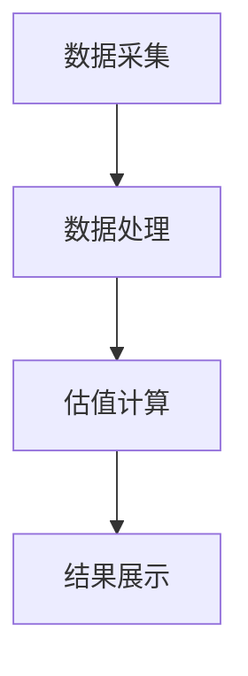
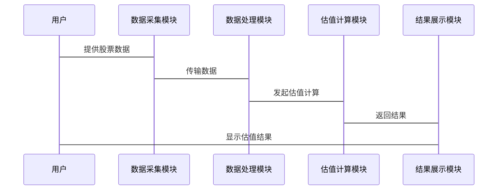
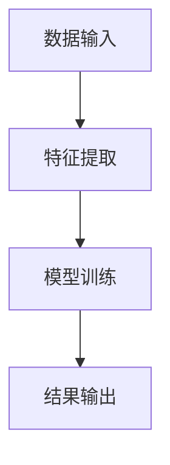

                 

# 全球股市估值与人工智能在海洋资源管理中的应用

## 关键词：股市估值、人工智能、海洋资源管理、机器学习、数据挖掘

## 摘要：本文深入探讨了全球股市估值的核心方法和人工智能在海洋资源管理中的创新应用。通过分析股市估值的数学模型和人工智能算法，展示了如何利用先进技术优化股市分析和提升海洋资源管理效率。文章从理论到实践，结合具体案例，为读者提供了全面的技术解读。

---

## 第一部分: 全球股市估值基础

### 第1章: 股市估值的基本概念

#### 1.1 股市估值的定义与意义

股市估值是通过对公司财务数据和市场信息的分析，确定股票的合理价格。其意义在于帮助投资者做出明智的投资决策，避免市场波动带来的风险。

- **定义**：股市估值是评估股票内在价值的过程，旨在确定其合理价格。
- **意义**：帮助投资者识别被低估或高估的股票，指导投资决策。

#### 1.2 股市估值的主要方法

股票估值方法多种多样，以下是几种常用的模型：

1. **市盈率法**：通过公司每股收益与股价的比率来衡量其估值。
2. **市净率法**：比较股价与每股净资产的比率。
3. **股息率法**：评估股票的分红能力。
4. **内在价值法**：基于公司未来现金流的折现值来计算。

#### 1.3 影响股市估值的主要因素

影响股市估值的因素包括宏观经济环境、行业发展趋势、公司基本面和市场情绪等。

---

### 第2章: 股市估值的数学模型与公式

#### 2.1 市盈率模型

市盈率（P/E）是衡量股票估值的重要指标，计算公式如下：

$$ P/E = \frac{Price}{Earnings} $$

其中，Price为股票价格，Earnings为每股收益。该模型适用于盈利稳定的企业。

#### 2.2 市净率模型

市净率（P/B）是股价与每股净资产的比率，公式为：

$$ P/B = \frac{Price}{Book\ Value} $$

适用于评估银行、房地产等资产密集型行业。

#### 2.3 股息率模型

股息率是每股股息与股价的比率，计算公式为：

$$ Dividend\ Yield = \frac{Dividend}{Price} $$

该模型适用于高分红的股票。

#### 2.4 内在价值模型

内在价值模型基于未来现金流折现，公式为：

$$ Intrinsic\ Value = \sum_{t=1}^{n} \frac{CF_t}{(1+r)^t} $$

其中，CF_t为第t年的现金流，r为折现率。

---

### 第3章: 股市估值的系统分析与架构设计

#### 3.1 股市估值系统的功能需求

- **数据采集模块**：获取股票价格、财务数据等。
- **数据处理模块**：清洗和预处理数据。
- **估值计算模块**：应用不同模型进行估值。
- **结果展示模块**：以图表形式展示结果。

#### 3.2 系统架构设计

#### 3.3 系统交互流程图

---

## 第二部分: 人工智能在海洋资源管理中的应用

### 第4章: 人工智能与海洋资源管理概

#### 4.1 海洋资源管理的定义与挑战

海洋资源管理涉及渔业、矿产资源、海洋能等领域。然而，传统管理方法面临数据不足、效率低下等问题。

#### 4.2 人工智能在海洋资源管理中的优势

AI能够处理海量数据，提供实时监控和预测，优化资源分配。

---

### 第5章: 人工智能在海洋资源管理中的具体应用

#### 5.1 渔业管理

AI可以通过分析水温、溶解氧等数据，预测鱼类分布，优化捕捞策略。

#### 5.2 海洋生态保护

AI技术用于监测海洋生物多样性，识别保护区内的非法活动。

#### 5.3 海洋能源管理

AI优化波浪能、潮汐能等海洋能源的收集和分配。

---

### 第6章: 人工智能在海洋资源管理中的算法实现

#### 6.1 算法选择

常用算法包括支持向量机、随机森林和神经网络。

#### 6.2 算法流程图

---

## 作者：AI天才研究院 & 禅与计算机程序设计艺术

