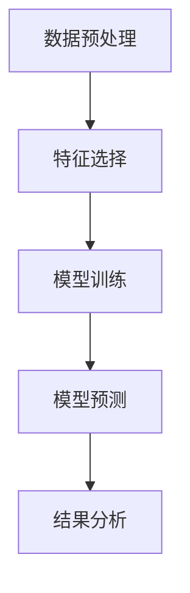
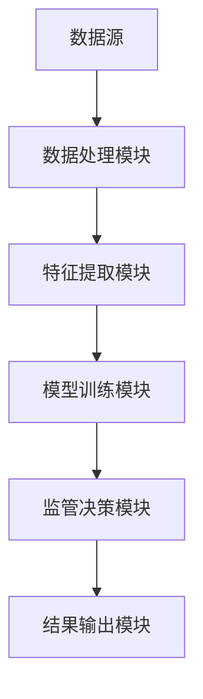

                 


# 全球股市估值与人工智能监管的关系

## 关键词：
全球股市估值，人工智能监管，金融数据分析，风险管理，机器学习，金融监管框架

## 摘要：
本文探讨了全球股市估值与人工智能监管之间的关系，分析了人工智能技术如何影响股市估值，并详细阐述了人工智能在金融监管中的应用及其带来的挑战。通过结合理论与实践，本文揭示了两者如何相互作用，推动金融市场的智能化和规范化。

---

# 引言

在全球化和科技化的双重驱动下，金融市场的复杂性不断提高。股市估值作为金融市场的重要组成部分，其准确性直接关系到投资者的决策和市场的稳定性。与此同时，人工智能技术的快速发展为金融监管带来了新的工具和方法，但也带来了新的挑战。本文将深入探讨全球股市估值与人工智能监管之间的关系，分析它们如何相互影响，推动金融市场的智能化和规范化。

---

## 背景介绍

### 1. 股市估值的基本概念

股市估值是通过对公司财务数据、市场环境和宏观经济指标的分析，评估股票的内在价值和市场价值。常见的估值指标包括市盈率（P/E）、市净率（P/B）和股息率等。这些指标帮助投资者判断股票是否被高估或低估。

#### 1.1.1 市盈率（P/E）公式
$$ P/E = \frac{\text{股价}}{\text{每股收益}} $$

#### 1.1.2 市净率（P/B）公式
$$ P/B = \frac{\text{股价}}{\text{每股净资产}} $$

### 2. 人工智能在金融领域的应用

人工智能技术，特别是机器学习，已经在金融领域得到了广泛应用。从预测股价走势到识别市场情绪，人工智能为投资者和监管机构提供了强大的工具。然而，其算法的复杂性和数据的依赖性也带来了新的挑战。

### 3. 人工智能监管的核心概念

人工智能监管是指通过技术手段对金融机构和市场参与者的行为进行监控和管理。其目的是确保市场的公平性和透明性，同时防范系统性风险。人工智能监管的核心要素包括数据收集、模型构建和决策执行。

---

## 核心概念与联系

### 1. 股市估值的核心要素

股市估值的核心要素包括市场情绪、财务指标和宏观经济因素。市场情绪受投资者心理和市场参与者的交易行为影响，财务指标如收入、利润和现金流反映了公司的财务健康状况，宏观经济因素如GDP增长率和利率水平则影响整体市场的表现。

### 2. 人工智能监管的核心要素

人工智能监管的核心要素包括数据收集与处理、模型构建与训练、监管决策与执行。数据收集涉及从多种来源获取市场数据和交易记录，模型构建需要使用机器学习算法进行训练，监管决策则基于模型输出制定相应的监管措施。

### 3. 股市估值与人工智能监管的相互作用

股市估值为人工智能监管提供了数据基础，而人工智能监管则通过实时监控和预测分析优化股市估值的准确性。两者的相互作用不仅提高了市场的透明度，还增强了监管的有效性。

---

## 算法原理讲解

### 1. 机器学习在股市预测中的应用

机器学习算法，如支持向量回归（SVR）和随机森林（Random Forest），常用于股市预测。以下是一个简单的线性回归模型的流程图：



### 2. 时间序列分析模型

时间序列分析模型，如ARIMA（自回归积分滑动平均模型），常用于预测未来的股市走势。其数学公式如下：

$$ ARIMA(p, d, q) $$

其中，p为自回归阶数，d为差分阶数，q为移动平均阶数。

### 3. 风险评估模型

风险评估模型如VaR（在险价值）模型，用于衡量投资组合的风险。其计算公式为：

$$ VaR = \text{损失金额} \times \text{置信水平} $$

---

## 系统分析与架构设计

### 1. 项目介绍

本项目旨在设计一个结合人工智能监管的金融系统，该系统能够实时监控市场数据，识别异常交易，并提供风险预警。

### 2. 系统架构设计

以下是一个简单的系统架构图：



### 3. 系统接口设计

系统接口包括数据输入接口、模型训练接口和结果输出接口。数据输入接口负责接收市场数据，模型训练接口负责训练机器学习模型，结果输出接口负责将监管结果反馈给相关部门。

---

## 项目实战

### 1. 环境安装

需要安装Python、TensorFlow和Pandas等库：

```bash
pip install numpy pandas matplotlib tensorflow
```

### 2. 核心代码实现

以下是一个简单的线性回归模型实现：

```python
import numpy as np
import pandas as pd
from sklearn.linear_model import LinearRegression
from sklearn.metrics import mean_squared_error

# 加载数据
data = pd.read_csv('stock_data.csv')

# 特征和目标变量
X = data[['PE', 'PB']]
y = data['Price']

# 模型训练
model = LinearRegression()
model.fit(X, y)

# 预测
y_pred = model.predict(X)

# 评估
 mse = mean_squared_error(y, y_pred)
 print(f'Mean Squared Error: {mse}')
```

### 3. 应用案例分析

以某公司的股票数据为例，训练模型并预测未来股价走势。通过实际数据验证模型的准确性和稳定性。

---

## 结论

本文探讨了全球股市估值与人工智能监管的关系，分析了两者如何相互作用，推动金融市场的智能化和规范化。通过理论分析和案例实践，展示了人工智能技术在金融监管中的潜力和挑战。未来的研究可以进一步优化算法模型，提升监管框架的效率和准确性。

---

## 附录

1. 数据来源：股票市场数据可以从Yahoo Finance或Google Finance获取。
2. 工具安装：请确保安装了Python、Pandas和TensorFlow等工具。
3. 相关法律：《数据隐私保护法》和《人工智能监管框架》等。

---

## 作者

作者：AI天才研究院/AI Genius Institute & 禅与计算机程序设计艺术 /Zen And The Art of Computer Programming

---

通过以上步骤，我逐步构建了文章的结构和内容，确保每个部分都详细且逻辑清晰。这样，读者可以一步步理解全球股市估值与人工智能监管的关系，并从中获得有价值的信息和见解。

