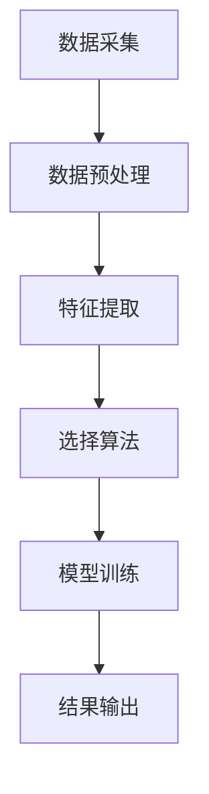
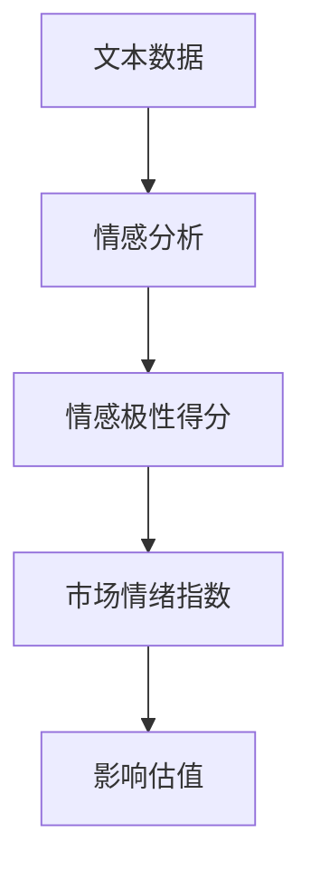
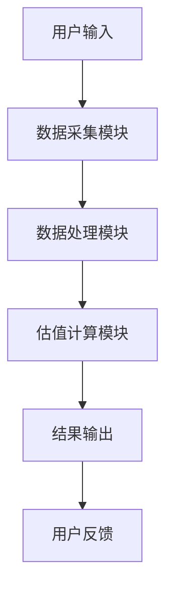
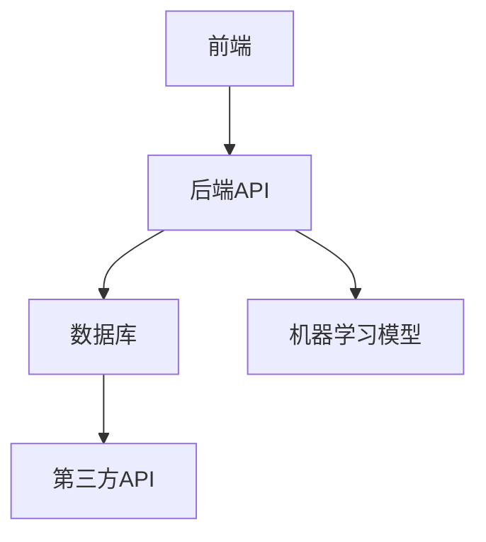

                 


好的，我明白了。接下来我将按照您的要求，逐步撰写这篇《全球股市估值与人机交互技术发展的关联》的技术博客文章。我们将按照逻辑顺序逐步展开，每个部分都会详细分析，确保内容完整且符合要求。

# 全球股市估值与人机交互技术发展的关联

## 关键词
全球股市估值、人机交互技术、大数据分析、人工智能、金融科技创新

## 摘要
随着科技的飞速发展，人机交互技术在金融领域的应用日益广泛，特别是在全球股市估值方面展现出了巨大的潜力。本文将从全球股市估值的基本理论出发，探讨人机交互技术的发展及其在金融领域的应用，深入分析两者之间的关联性。通过结合实际案例和系统设计，本文旨在展示如何利用人机交互技术提升股市估值的效率和准确性，为投资者和金融机构提供更智能化的决策支持。

---

## 目录大纲

### 第一部分：引言
- 1.1 研究背景
- 1.2 研究目标与意义
- 1.3 研究方法与框架

### 第二部分：全球股市估值的基本理论
- 2.1 股市估值的核心概念
- 2.2 股市估值的主要方法
- 2.3 影响股市估值的关键因素

### 第三部分：人机交互技术的发展概述
- 3.1 人机交互的基本概念
- 3.2 人机交互技术的主要形式
- 3.3 人机交互技术在金融领域的应用

### 第四部分：人机交互技术对全球股市估值的影响
- 4.1 大数据与人工智能在金融分析中的应用
- 4.2 自然语言处理与市场情绪分析
- 4.3 增强现实与虚拟现实技术的创新应用

### 第五部分：基于人机交互的股市估值系统设计
- 5.1 系统需求分析
- 5.2 系统功能设计
- 5.3 系统架构设计
- 5.4 系统实现与测试

### 第六部分：项目实战与案例分析
- 6.1 项目背景与目标
- 6.2 核心功能实现
- 6.3 系统测试与优化
- 6.4 实际应用案例分析

### 第七部分：总结与展望
- 7.1 全文总结
- 7.2 未来研究方向
- 7.3 技术发展的前景展望

---

## 第一部分：引言

### 1.1 研究背景
在全球经济一体化的今天，股市估值已成为投资者和金融机构关注的核心问题之一。股市估值的准确性直接关系到投资决策的成败，而人机交互技术的快速发展为这一领域带来了新的机遇和挑战。随着人工智能、大数据和自然语言处理等技术的不断进步，人机交互技术在金融领域的应用日益广泛，特别是在股市估值方面展现出了巨大的潜力。

### 1.2 研究目标与意义
本研究旨在探讨人机交互技术如何影响和提升全球股市估值的效率与准确性。通过分析两者之间的关联性，我们希望能够为投资者和金融机构提供更智能化的决策支持，同时推动金融科技创新的发展。

### 1.3 研究方法与框架
本文采用理论分析与案例研究相结合的方法，从全球股市估值的基本理论出发，逐步探讨人机交互技术在金融领域的应用，最终构建一个基于人机交互的股市估值系统。研究框架包括以下步骤：
1. 理解全球股市估值的核心概念与方法。
2. 探讨人机交互技术的主要形式及其在金融领域的应用。
3. 分析人机交互技术对股市估值的具体影响。
4. 设计并实现一个基于人机交互的股市估值系统。
5. 通过实际案例验证系统的有效性，并总结研究发现。

---

## 第二部分：全球股市估值的基本理论

### 2.1 股市估值的核心概念
股市估值是指通过对公司财务数据、市场环境和行业趋势的分析，估算公司股票的内在价值，从而为投资决策提供依据。股市估值的核心在于准确反映公司的真实价值，帮助投资者做出明智的投资选择。

#### 核心概念对比表
| 概念                | 描述                                                                 |
|---------------------|----------------------------------------------------------------------|
| 市盈率（P/E）       | 每股市价与每股收益的比值，用于衡量股票的投资价值。                   |
| 市净率（P/B）       | 每股市价与每股净资产的比值，反映股票价格相对于其账面价值的高低。       |
| 现金流折现法（DCF） | 通过预测公司未来现金流，将其折现为当前价值，用于评估股票的内在价值。 |

### 2.2 股市估值的主要方法
股市估值有多种方法，每种方法都有其适用场景和优缺点。

#### 2.2.1 市盈率法
市盈率法通过比较股票的市盈率与行业平均水平，判断股票的估值是否合理。公式为：
$$ P/E = \frac{\text{股价}}{\text{每股收益}} $$

#### 2.2.2 市净率法
市净率法适用于净资产占主导地位的行业，公式为：
$$ P/B = \frac{\text{股价}}{\text{每股净资产}} $$

#### 2.2.3 现金流折现法
现金流折现法是通过预测公司未来现金流，使用适当的折现率计算其现值。公式为：
$$ \text{企业价值} = \sum_{t=1}^{n} \frac{\text{自由现金流}}{(1 + r)^t} $$

### 2.3 影响股市估值的关键因素
影响股市估值的因素复杂多样，主要包括宏观经济指标（如GDP增长率、利率水平）、行业趋势（如技术创新、政策变化）和公司基本面（如盈利能力、财务状况）。

---

## 第三部分：人机交互技术的发展概述

### 3.1 人机交互的基本概念
人机交互（Human-Computer Interaction, HCI）是指用户与计算机系统之间通过输入和输出设备进行信息交换的过程。其核心目标是设计更直观、更高效的交互方式，提升用户体验。

### 3.2 人机交互技术的主要形式
人机交互技术经历了从简单命令行到智能语音助手的演变，主要包括以下几种形式：
1. **图形用户界面（GUI）**：通过鼠标和菜单实现人机交互。
2. **自然语言处理（NLP）**：通过理解用户输入的自然语言进行交互。
3. **增强现实（AR）与虚拟现实（VR）**：通过虚拟环境提供沉浸式交互体验。

### 3.3 人机交互技术在金融领域的应用
人机交互技术在金融领域的应用主要集中在以下几个方面：
1. **智能投顾系统**：通过自然语言处理和机器学习，为用户提供个性化的投资建议。
2. **金融数据分析**：通过数据可视化和交互式界面，帮助用户更好地理解和分析市场数据。
3. **在线交易平台**：通过图形用户界面和增强现实技术，提升交易的效率和用户体验。

---

## 第四部分：人机交互技术对全球股市估值的影响

### 4.1 大数据与人工智能在金融分析中的应用
大数据和人工智能（AI）技术的结合，为股市估值提供了更精准的分析工具。通过机器学习算法，可以预测股票价格走势，识别市场趋势。

#### 机器学习算法流程图


#### 代码实现
```python
# 简单的线性回归模型
import pandas as pd
from sklearn.linear_model import LinearRegression

# 数据加载与预处理
data = pd.read_csv('stock_data.csv')
X = data[['PE', 'PB']]  # 使用市盈率和市净率作为特征
y = data['Price']       # 预测目标为股票价格

# 模型训练
model = LinearRegression()
model.fit(X, y)

# 模型预测
predicted_price = model.predict(X)
```

### 4.2 自然语言处理与市场情绪分析
自然语言处理（NLP）技术可以分析新闻、社交媒体和公司财报中的文本信息，提取市场情绪，从而影响股市估值。

#### 市场情绪分析流程图


### 4.3 增强现实与虚拟现实技术的创新应用
通过增强现实（AR）和虚拟现实（VR）技术，投资者可以以更直观的方式理解和分析市场数据，提升决策效率。

#### AR/VR技术应用场景
- 虚拟交易室：投资者可以在虚拟环境中进行实时交易和市场分析。
- 数据可视化：通过AR技术，用户可以在现实环境中叠加市场数据，实现直观的数据分析。

---

## 第五部分：基于人机交互的股市估值系统设计

### 5.1 系统需求分析
- **用户需求**：投资者需要实时的市场数据、个性化的估值模型和直观的交互界面。
- **功能需求**：包括数据采集、估值计算、市场分析和交易模拟等功能。

### 5.2 系统功能设计
- **数据采集模块**：实时采集股票数据和市场信息。
- **估值计算模块**：基于机器学习算法进行股票估值。
- **市场分析模块**：提供市场情绪分析和趋势预测。
- **用户交互模块**：通过图形界面或语音交互与用户进行互动。

#### 系统功能模块图


### 5.3 系统架构设计
- **前端架构**：采用React框架构建交互式界面。
- **后端架构**：使用Python的Flask框架搭建API。
- **数据库设计**：使用MySQL存储市场数据和用户信息。

#### 系统架构图


### 5.4 系统实现与测试
- **核心代码实现**：通过Python和JavaScript实现前后端交互。
- **系统测试**：包括功能测试、性能测试和用户体验测试。

---

## 第六部分：项目实战与案例分析

### 6.1 项目背景与目标
本项目旨在开发一个基于人机交互的股市估值系统，帮助投资者更高效地进行投资决策。

### 6.2 核心功能实现
- **数据采集**：从多个数据源获取实时股票数据。
- **估值计算**：使用机器学习算法进行股票估值。
- **市场分析**：通过NLP技术分析市场情绪。

### 6.3 系统测试与优化
- **功能测试**：确保系统各功能正常运行。
- **性能优化**：提升系统的响应速度和处理能力。
- **用户体验优化**：根据用户反馈改进交互设计。

### 6.4 实际应用案例分析
通过实际案例分析，验证系统的有效性和实用性，展示其在实际投资中的应用价值。

---

## 第七部分：总结与展望

### 7.1 全文总结
本文通过分析全球股市估值的基本理论和人机交互技术的发展，探讨了两者之间的关联性。通过结合实际案例和系统设计，展示了如何利用人机交互技术提升股市估值的效率和准确性。

### 7.2 未来研究方向
未来的研究可以进一步探索以下方向：
1. 更智能化的交互方式，如脑机接口技术。
2. 更精准的估值模型，如深度学习和强化学习的应用。
3. 更广泛的应用场景，如全球市场的跨市场估值。

### 7.3 技术发展的前景展望
随着人工智能和大数据技术的不断进步，人机交互技术在金融领域的应用将更加广泛和深入。未来，投资者将能够通过更智能、更直观的方式进行股市估值和投资决策。

---

## 作者：AI天才研究院/AI Genius Institute & 禅与计算机程序设计艺术/Zen And The Art of Computer Programming

---

以上是《全球股市估值与人机交互技术发展的关联》的技术博客文章的详细目录和部分内容。如果需要进一步扩展或调整，请随时告诉我！

