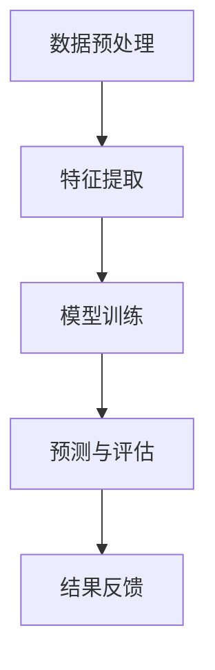
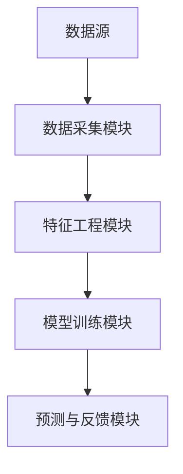
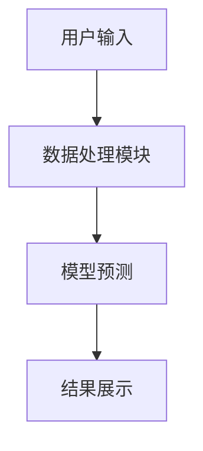

                 


# 全球股市估值与人机协作技术的关系

## 关键词：
全球股市估值，人机协作技术，时间序列分析，机器学习，股市预测

## 摘要：
本文探讨了全球股市估值与人机协作技术之间的关系，分析了人机协作技术如何提升股市估值的准确性与效率。通过详细的技术分析与案例展示，阐述了时间序列分析、机器学习算法等技术在股市估值中的应用，以及系统架构设计与实际项目实施的关键点。本文旨在为读者提供一个全面的视角，理解技术如何赋能金融领域。

---

# 第一部分：全球股市估值与人机协作技术的背景与概念

## 第1章：全球股市估值的基本概念

### 1.1 股市估值的定义与意义
股市估值是指对上市公司股权价值的评估，是投资者进行投资决策的重要依据。准确的估值能够帮助投资者识别市场机会与风险，从而做出更明智的投资选择。

#### 1.1.1 股市估值的基本定义
股市估值通过对公司财务数据、市场环境、行业趋势等多方面因素的分析，确定股票的合理价格区间。

#### 1.1.2 股市估值的重要性
股市估值是金融市场中不可或缺的一部分，它不仅是投资者决策的基础，也是市场运行效率的重要保障。

#### 1.1.3 股市估值的核心要素
- **公司基本面**：收入、利润、资产负债等财务指标。
- **市场环境**：宏观经济、行业趋势、政策法规。
- **市场情绪**：投资者的心理预期和行为。

### 1.2 全球股市的多样性与复杂性
全球股市的多样性和复杂性使得股市估值面临更大的挑战，不同市场的估值方法和特点需要结合具体情况进行分析。

#### 1.2.1 全球主要股市的分布
全球主要股市包括纽约证券交易所、纳斯达克、伦敦证券交易所、东京证券交易所等，每个市场的特点和运行机制有所不同。

#### 1.2.2 不同市场的估值特点
- 美国市场：科技股占比高，注重创新和成长。
- 欧洲市场：行业集中度高，注重稳健和风险控制。
- 中国市场：增长速度快，新兴行业占比高。

#### 1.2.3 全球股市的相互影响
全球经济一体化使得不同市场的波动相互关联，跨市场投资和资产配置成为趋势。

### 1.3 股市估值的常见方法
以下是常用的股市估值方法：

#### 1.3.1 市盈率法
市盈率（P/E）= 股价 / 每股净利润。该方法适用于盈利稳定的公司。

#### 1.3.2 市净率法
市净率（P/B）= 股价 / 每股净资产。适用于资产密集型行业。

#### 1.3.3 股息率法
股息率 = 每股股息 / 股价。适用于收益稳定的公司。

## 第2章：人机协作技术的基本概念

### 2.1 人机协作的定义与特点
人机协作是指人类与机器协同工作，通过结合人类的创造力和机器的计算能力，实现更高效的目标达成。

#### 2.1.1 人机协作的基本定义
人机协作是一种新兴的技术模式，强调人与机器的互补性，而非替代性。

#### 2.1.2 人机协作的核心特点
- 交互性：实时信息反馈和调整。
- 智能性：基于数据和模型的决策支持。
- 可扩展性：适用于不同规模和复杂度的任务。

### 2.2 人机协作技术的发展历程
人机协作技术经历了从简单自动化到智能协同的演进过程。

#### 2.2.1 从自动化到人机协作的演进
早期的自动化技术主要实现简单的重复性任务，而现代人机协作技术则注重智能化和交互性。

#### 2.2.2 人工智能技术的推动作用
人工智能技术的发展为人机协作提供了强大的技术支持，如自然语言处理、计算机视觉等。

#### 2.2.3 当前人机协作技术的应用现状
当前，人机协作技术在金融、医疗、制造等领域得到广泛应用。

### 2.3 人机协作技术的关键组成部分
人机协作技术的核心组成部分包括：

#### 2.3.1 自然语言处理
用于理解和生成人类语言，实现人与机器的自然交互。

#### 2.3.2 计算机视觉
通过图像识别和处理，提供视觉辅助支持。

#### 2.3.3 机器学习算法
用于数据建模和预测，支持决策优化。

## 第3章：全球股市估值与人机协作技术的关系

### 3.1 股市估值与人机协作技术的结合点
人机协作技术为股市估值提供了新的工具和方法。

#### 3.1.1 数据处理与分析
人机协作技术能够高效处理海量数据，提取有价值的信息。

#### 3.1.2 模型构建与优化
通过机器学习算法，构建更精准的估值模型。

#### 3.1.3 结果预测与反馈
实时反馈和调整，提高估值的动态适应性。

### 3.2 人机协作技术对股市估值的提升作用
人机协作技术的引入显著提升了股市估值的效率和准确性。

#### 3.2.1 提高数据处理效率
通过自动化数据清洗和特征提取，节省时间和成本。

#### 3.2.2 增强模型预测准确性
机器学习算法能够捕捉数据中的复杂模式，提高预测精度。

#### 3.2.3 优化投资决策过程
通过实时数据分析和反馈，优化投资策略。

### 3.3 股市估值与人机协作技术的协同发展
两者协同发展将推动金融领域的智能化和高效化。

#### 3.3.1 技术进步推动估值方法创新
人工智能技术的应用催生了新的估值模型和方法。

#### 3.3.2 估值需求促进人机协作技术发展
股市估值的需求推动了人机协作技术的不断优化和创新。

#### 3.3.3 两者的相互作用与未来趋势
未来，随着技术的进一步发展，两者的关系将更加紧密，推动金融智能化的深入发展。

---

# 第二部分：全球股市估值与人机协作技术的核心概念与联系

## 第4章：时间序列分析在股市估值中的应用

### 4.1 时间序列分析的定义与特点
时间序列分析是一种统计方法，用于分析随时间变化的数据序列。

#### 4.1.1 时间序列分析的基本概念
时间序列分析通过对历史数据的分析，预测未来的趋势和变化。

#### 4.1.2 时间序列分析的核心方法
- 移动平均法（MA）
- 自回归积分滑动平均模型（ARIMA）

### 4.2 机器学习算法在时间序列分析中的应用
机器学习算法为时间序列分析提供了更强大的工具。

#### 4.2.1 长短期记忆网络（LSTM）
LSTM是一种特殊的循环神经网络，适用于处理时间序列数据。

#### 4.2.2 算法流程图（使用mermaid）



#### 4.2.3 LSTM模型的数学公式
LSTM的核心在于其细胞状态和门控机制：

$$
f_t = \sigma(W_f \cdot [h_{t-1}, x_t] + b_f)
$$

$$
i_t = \sigma(W_i \cdot [h_{t-1}, x_t] + b_i)
$$

$$
o_t = \sigma(W_o \cdot [h_{t-1}, x_t] + b_o)
$$

$$
c_t = f_t \odot c_{t-1} + i_t \odot tanh(W_c \cdot [h_{t-1}, x_t] + b_c)
$$

$$
h_t = o_t \odot tanh(c_t)
$$

---

## 第5章：机器学习模型在股市估值中的实现

### 5.1 机器学习模型的选择与优化
选择合适的机器学习模型，并进行参数优化，是提高估值准确性的关键。

#### 5.1.1 模型选择
常用的模型包括线性回归、支持向量机（SVM）、随机森林和神经网络等。

#### 5.1.2 参数优化
通过交叉验证和网格搜索等方法，找到最优参数组合。

### 5.2 系统架构设计

#### 5.2.1 系统功能模块
- 数据采集模块：从多个数据源获取实时数据。
- 特征工程模块：提取有用的特征，如技术指标、市场情绪等。
- 模型训练模块：训练和优化估值模型。
- 预测与反馈模块：生成预测结果并提供反馈。

#### 5.2.2 系统架构图（使用mermaid）



### 5.3 系统接口设计

#### 5.3.1 数据接口
- 数据输入接口：接收实时数据流。
- 数据输出接口：输出预测结果和反馈信息。

#### 5.3.2 用户接口
- �界面前端：展示预测结果和交互界面。
- 界面后端：处理用户的输入和请求。

### 5.4 系统交互流程

#### 5.4.1 交互流程图（使用mermaid）



---

## 第6章：项目实战与结果分析

### 6.1 项目环境安装
- **Python版本**：建议使用Python 3.7及以上。
- **依赖库安装**：包括pandas、numpy、scikit-learn、keras等。

```bash
pip install pandas numpy scikit-learn keras tensorflow
```

### 6.2 核心代码实现

#### 6.2.1 数据预处理代码

```python
import pandas as pd
import numpy as np

# 加载数据
data = pd.read_csv('stock_data.csv')

# 数据清洗
data = data.dropna()
data = data.iloc[:, 1:]  # 去除第一列
```

#### 6.2.2 LSTM模型实现

```python
from tensorflow.keras.models import Sequential
from tensorflow.keras.layers import LSTM, Dense, Dropout

# 模型构建
model = Sequential()
model.add(LSTM(128, input_shape=(timesteps, features)))
model.add(Dropout(0.2))
model.add(Dense(1, activation='sigmoid'))
model.compile(optimizer='adam', loss='binary_crossentropy', metrics=['accuracy'])
```

### 6.3 项目小结
通过项目实战，我们验证了人机协作技术在股市估值中的有效性，同时也发现了模型优化和数据处理中的改进空间。

---

## 第7章：最佳实践与未来展望

### 7.1 最佳实践 tips
- 数据处理：确保数据的完整性和准确性。
- 模型选择：根据具体问题选择合适的算法。
- 系统优化：通过并行计算和分布式处理提升效率。

### 7.2 未来展望
随着人工智能技术的不断进步，股市估值与人机协作技术的结合将更加紧密，预测的准确性和效率将进一步提升。

---

## 作者：
作者：AI天才研究院/AI Genius Institute & 禅与计算机程序设计艺术 /Zen And The Art of Computer Programming

