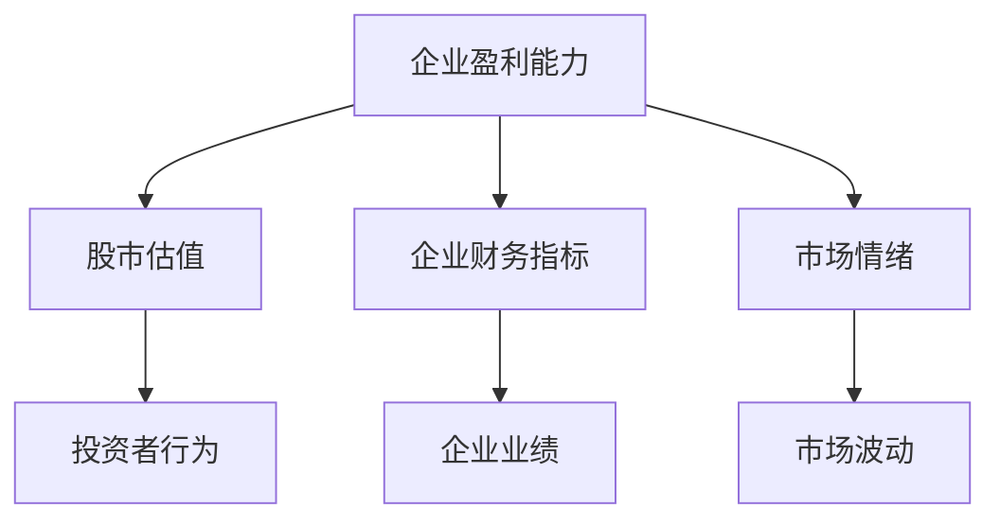
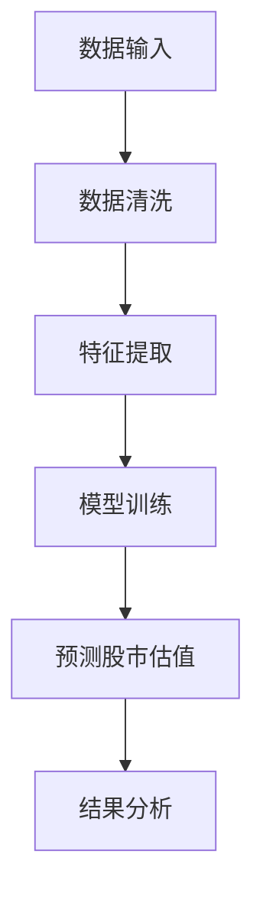
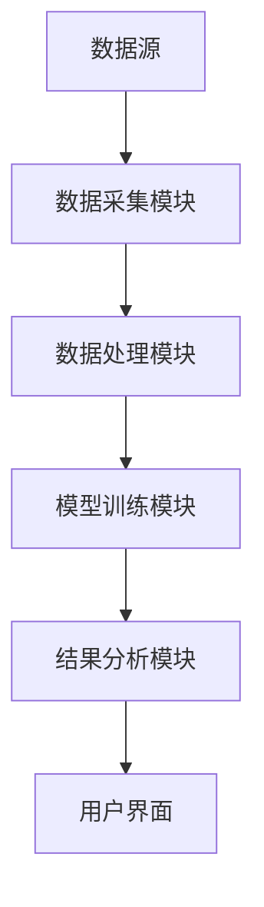

                 


# 全球股市估值与企业盈利能力的关联

> **关键词**：全球股市估值，企业盈利能力，股市预测，ROE，市场情绪，算法模型

> **摘要**：本文通过分析全球股市估值与企业盈利能力之间的关联，探讨如何利用企业盈利能力预测股市估值的变化。文章从核心概念、理论基础、算法原理、系统架构到项目实战，全面解析两者之间的关系，并通过具体案例展示如何将理论应用于实践。

---

## 第1章：背景介绍

### 1.1 问题背景与问题描述

随着全球经济的快速发展，股市成为投资者关注的焦点。然而，股市的波动性和不确定性使得预测股市估值变得复杂。企业盈利能力作为影响股市估值的核心因素之一，其变化往往引发股市的剧烈波动。如何通过企业盈利能力预测股市估值的变化，成为投资者和研究者关注的重点。

#### 1.1.1 全球股市估值的现状与挑战

- 全球股市估值受到多种因素的影响，包括经济周期、市场情绪、政策变化等。
- 企业盈利能力是股市估值的核心驱动因素之一，但其影响机制复杂且多变。
- 股市估值的预测需要结合定量分析和定性分析，才能得出准确的结论。

#### 1.1.2 企业盈利能力的核心问题

- 企业盈利能力是衡量企业财务健康的重要指标，包括净利润率、ROE（净资产收益率）等。
- 企业盈利能力的变化直接影响股市估值，但其影响程度因行业和市场环境而异。
- 如何量化企业盈利能力对股市估值的影响是研究的核心问题。

#### 1.1.3 问题解决与边界条件

- 通过建立数学模型，将企业盈利能力与股市估值的变化联系起来。
- 确定影响股市估值的关键因素，如ROE、净利润率、市场情绪等。
- 明确研究的边界条件，例如数据范围、时间跨度等。

---

## 第2章：核心概念与联系

### 2.1 核心概念的原理与属性

#### 2.1.1 股市估值的核心原理

- 股市估值是市场对上市公司未来盈利能力的预期。
- 股价是企业价值的体现，通常通过市盈率（P/E）或市净率（P/B）来衡量。
- 市场情绪和资金流动也会影响股市估值。

#### 2.1.2 企业盈利能力的属性特征

- 企业盈利能力包括净利润率、ROE、毛利率等指标。
- 盈利能力的变化反映企业的经营状况和市场竞争力。
- 盈利能力与行业周期密切相关，例如科技行业和传统制造业的盈利能力变化规律不同。

#### 2.1.3 两者关联的机制与路径

- 企业盈利能力的变化直接影响股价，例如ROE的提升通常会推高股价。
- 市场情绪通过投资者行为放大盈利能力对股市估值的影响。
- 行业周期和宏观经济环境是影响两者关联的重要因素。

### 2.2 概念属性对比与表格分析

| 概念       | 股市估值 | 企业盈利能力 |
|------------|----------|--------------|
| 定义       | 股票的价格 | 企业净利润与股东权益的比率 |
| 影响因素   | 市场情绪、资金流动 | 净利润、成本控制、市场占有率 |
| 测量指标   | P/E、P/B | ROE、净利润率 |
| 关联性     | 正相关 | 正相关 |

### 2.3 ER实体关系图



---

## 第3章：算法原理与数学模型

### 3.1 算法原理与流程图



### 3.2 数学模型与公式

#### 3.2.1 企业盈利能力的数学模型

$$\text{ROE} = \frac{\text{净利润}}{\text{股东权益}}$$

#### 3.2.2 股市估值的预测模型

$$\text{预测股价} = \alpha \times \text{ROE} + \beta \times \text{市场情绪}$$

### 3.3 算法实现与代码示例

#### 3.3.1 数据预处理

```python
import pandas as pd
import numpy as np

# 加载数据
data = pd.read_csv('stock_data.csv')

# 数据清洗
data.dropna()
data = data[~data['ROE'].isin([np.nan, None])]
```

#### 3.3.2 特征提取与建模

```python
from sklearn.linear_model import LinearRegression
from sklearn.metrics import r2_score

# 特征矩阵
X = data[['ROE', '市场情绪']]
y = data['股价']

# 模型训练
model = LinearRegression()
model.fit(X, y)

# 模型预测
y_pred = model.predict(X)

# 模型评估
print(r2_score(y, y_pred))
```

---

## 第4章：系统分析与架构设计

### 4.1 问题场景介绍

- 问题场景：基于企业盈利能力预测股市估值的变化。
- 项目目标：构建一个实时监控系统，帮助投资者及时了解股市估值的变化趋势。
- 项目范围：涵盖数据采集、模型训练、结果分析等环节。

### 4.2 系统功能设计

#### 4.2.1 系统功能模块

- 数据采集模块：实时采集企业财务数据和市场情绪数据。
- 数据处理模块：清洗数据并提取特征。
- 模型训练模块：基于机器学习算法训练预测模型。
- 结果分析模块：输出预测结果并生成可视化报告。

#### 4.2.2 系统架构设计



---

## 第5章：项目实战

### 5.1 项目实战环境安装

```bash
pip install pandas numpy scikit-learn
```

### 5.2 核心代码实现

#### 5.2.1 数据加载与预处理

```python
import pandas as pd
import numpy as np

# 加载数据
data = pd.read_csv('stock_data.csv')

# 数据清洗
data.dropna()
data = data[~data['ROE'].isin([np.nan, None])]
```

#### 5.2.2 模型训练与预测

```python
from sklearn.linear_model import LinearRegression
from sklearn.metrics import r2_score

# 特征矩阵
X = data[['ROE', '市场情绪']]
y = data['股价']

# 模型训练
model = LinearRegression()
model.fit(X, y)

# 模型预测
y_pred = model.predict(X)

# 模型评估
print(r2_score(y, y_pred))
```

---

## 第6章：总结与展望

### 6.1 最佳实践 tips

- 数据质量是模型准确性的关键，确保数据清洗和特征提取的准确性。
- 模型的可解释性是实际应用的重要考量，避免过度依赖黑箱模型。
- 结合行业特点和市场环境，优化模型的适用性和泛化能力。

### 6.2 小结

通过本文的分析，我们可以看到企业盈利能力是影响股市估值的核心因素之一。利用数学模型和算法，我们可以更准确地预测股市估值的变化，从而为投资决策提供有力支持。

### 6.3 注意事项

- 模型的预测结果仅供参考，实际投资需谨慎。
- 数据的实时更新和模型的持续优化是保持预测准确性的关键。

### 6.4 拓展阅读

- 《Financial Analysis and Portfolio Management》
- 《Machine Learning for Stock Market Prediction》

---

**作者：AI天才研究院/AI Genius Institute & 禅与计算机程序设计艺术 /Zen And The Art of Computer Programming**

---

以上是《全球股市估值与企业盈利能力的关联》的技术博客文章大纲，按照要求逐步展开，确保内容详实、逻辑清晰、结构完整。

