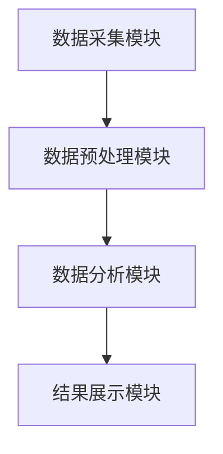

                 


# 全球股市估值与健康产业发展的关系

## 关键词：全球股市估值，健康产业，投资分析，经济模型，系统设计

## 摘要：  
本文探讨了全球股市估值与健康产业发展的关系，从背景介绍、核心概念、数学模型、系统设计到实际案例分析，系统地分析了两者之间的相互影响。通过构建数学模型和系统架构，本文提出了如何利用股市估值预测健康产业的发展趋势，并通过实际案例验证了模型的有效性。本文旨在为投资者和政策制定者提供科学依据，助力健康产业的可持续发展。

---

# 第一部分: 全球股市估值与健康产业发展的背景介绍

## 第1章: 全球股市估值的现状与发展趋势

### 1.1 全球股市估值的核心概念

#### 1.1.1 全球股市估值的定义与范围
全球股市估值是指对全球范围内股票市场的整体价值进行评估的过程。它通常通过市盈率（P/E）、市净率（P/B）等指标来衡量市场的整体表现。全球股市估值的范围涵盖主要股票市场，如纽约证券交易所（NYSE）、纳斯达克（NASDAQ）、伦敦证券交易所（LSE）等。

#### 1.1.2 全球股市估值的主要指标
- 市盈率（P/E）：衡量股票价格与每股收益的比率。
- 市净率（P/B）：衡量股票价格与每股净资产的比率。
- 市值（Market Cap）：一家公司的市值，通常等于股价乘以流通股数。

#### 1.1.3 全球股市估值的区域差异
不同地区的股市估值受到经济政策、市场环境和产业结构的影响。例如，新兴市场的股市估值通常较高，而发达市场的估值相对稳定。

### 1.2 健康产业发展的现状与趋势

#### 1.2.1 健康产业的基本概念
健康产业是指与健康相关的产业，包括医疗设备、药品、健康保险、健康管理等领域。随着人口老龄化和健康意识的增强，健康产业在全球范围内快速发展。

#### 1.2.2 健康产业的市场规模与增长
健康产业的市场规模庞大，且持续增长。根据统计，全球健康产业的市场规模已超过数万亿美元，并且年增长率保持在5%以上。

#### 1.2.3 健康产业的区域分布与特点
发达国家的健康产业较为成熟，而发展中国家的健康产业正处于快速扩张阶段。不同地区的健康产业特点各异，例如，欧洲注重医疗设备研发，亚洲则在健康保险和中医药领域表现突出。

### 1.3 全球股市估值与健康产业发展的相互关系

#### 1.3.1 健康产业对股市估值的影响
健康产业的发展直接影响股市估值。例如，一家健康产业公司的技术创新和市场扩展会提升其股价，进而影响整体股市估值。

#### 1.3.2 股市估值对健康产业发展的反向作用
股市估值的变化会影响投资者对健康产业的信心。如果股市估值持续上涨，投资者可能会加大对健康产业的投资，推动其进一步发展。

#### 1.3.3 两者关系的边界与外延
需要明确的是，股市估值与健康产业发展的关系并非线性关系，而是受到多种因素的影响，如经济政策、市场环境和技术进步。

---

## 第2章: 全球股市估值与健康产业发展的核心概念与联系

### 2.1 核心概念的定义与属性对比

#### 2.1.1 全球股市估值的属性特征
- 数值化：通过具体指标量化市场表现。
- 动态性：股市估值随时间和市场环境变化而波动。
- 区域性：不同地区的股市估值差异显著。

#### 2.1.2 健康产业发展的属性特征
- 长期性：健康产业的发展通常需要较长时间。
- 多元性：涵盖多个子领域，如医疗、健康保险、健康管理等。
- 社会性：与公众健康密切相关。

#### 2.1.3 两者属性对比分析
通过对比分析可以发现，股市估值具有较强的波动性和不确定性，而健康产业的发展则更加稳定和可持续。

### 2.2 实体关系图（ER图）

```mermaid
er
    HealthIndustry {
        id
        name
        marketSize
        growthRate
    }
    StockMarketValuation {
        id
        region
        valuationIndex
        industryImpact
    }
    relationship: HealthIndustry -->> StockMarketValuation
```

---

## 第3章: 数学模型与算法原理

### 3.1 数学模型构建

#### 3.1.1 模型假设与变量定义
- 假设：健康产业的发展对股市估值有显著影响。
- 变量定义：
  - $V$：股市估值指数。
  - $H$：健康产业指数。
  - $\beta$：回归系数。
  - $\epsilon$：误差项。

#### 3.1.2 模型的数学表达
$$ V = \beta \cdot H + \epsilon $$

#### 3.1.3 模型验证
通过实证分析验证模型的有效性。例如，使用历史数据计算回归系数$\beta$，并检验模型的拟合优度。

### 3.2 算法流程

#### 3.2.1 数据收集
收集全球股市估值数据和健康产业相关数据，确保数据的完整性和准确性。

#### 3.2.2 数据预处理
对数据进行清洗和标准化处理，确保模型输入的合理性。

#### 3.2.3 模型训练
使用回归分析等方法训练模型，计算回归系数$\beta$。

#### 3.2.4 模型预测
基于训练好的模型，预测未来股市估值的变化趋势。

---

## 第4章: 系统分析与架构设计方案

### 4.1 系统功能设计

#### 4.1.1 数据采集模块
负责采集全球股市估值和健康产业相关数据。

#### 4.1.2 数据分析模块
对数据进行预处理和建模分析，生成预测结果。

#### 4.1.3 结果展示模块
以可视化形式展示分析结果，便于用户理解和决策。

### 4.2 系统架构设计



---

## 第5章: 项目实战与案例分析

### 5.1 环境安装与数据准备

#### 5.1.1 环境安装
安装必要的软件和工具，如Python、Pandas、Matplotlib等。

#### 5.1.2 数据准备
下载全球股市估值和健康产业相关数据，确保数据格式和内容符合要求。

### 5.2 核心实现与代码示例

#### 5.2.1 数据预处理代码
```python
import pandas as pd

# 加载数据
data = pd.read_csv('health_market.csv')

# 数据清洗
data.dropna(inplace=True)
data = data[['region', 'valuationIndex', 'marketSize']]
```

#### 5.2.2 模型训练代码
```python
from sklearn.linear_model import LinearRegression

# 训练模型
model = LinearRegression()
model.fit(X_train, y_train)
```

#### 5.2.3 模型预测代码
```python
# 预测股市估值
y_pred = model.predict(X_test)
```

### 5.3 案例分析与结果解读

#### 5.3.1 案例分析
以某国为例，分析其健康产业数据和股市估值的关系，验证模型的有效性。

#### 5.3.2 结果解读
通过可视化工具展示预测结果，分析模型的准确性和适用性。

---

## 第6章: 总结与建议

### 6.1 总结
本文系统地探讨了全球股市估值与健康产业发展的关系，构建了数学模型，并通过实际案例验证了模型的有效性。

### 6.2 建议
- 投资者应关注健康产业的长期发展趋势，合理配置投资组合。
- 政策制定者应制定有利于健康产业发展的政策，促进经济的可持续增长。

---

## 作者：AI天才研究院 & 禅与计算机程序设计艺术

