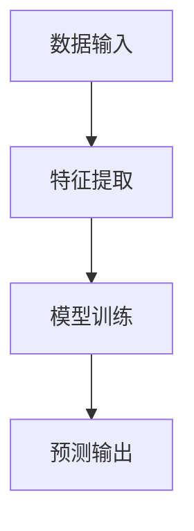
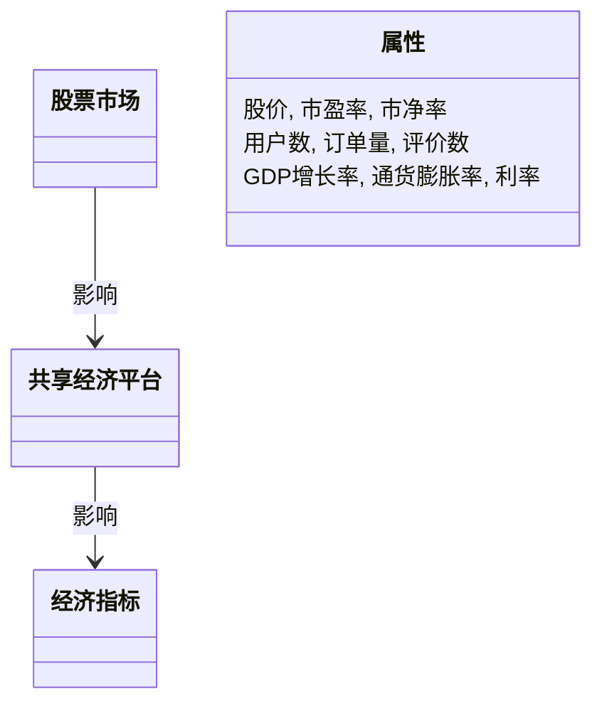

                 

**《全球股市估值与共享经济模式的关系》**

**关键词：** 全球股市估值、共享经济模式、股票定价、市场预测、经济模型

**摘要：** 本文深入探讨全球股市估值与共享经济模式之间的关系，从理论分析、数学建模到实际应用，详细阐述了两者如何相互影响。通过分析股市估值的核心原理和共享经济模式的特征，构建了两者关系的数学模型，并结合实际案例进行分析，揭示了共享经济模式对股市估值的潜在影响。文章最后提出了未来的研究方向和实际应用的建议。

---

# 第一部分: 全球股市估值与共享经济模式的背景与概念

## 第1章: 全球股市估值与共享经济模式的背景介绍

### 1.1 问题背景与定义

#### 1.1.1 全球股市估值的定义与核心要素
全球股市估值是指对股票市场的整体价值进行评估的过程。股票市场的价值通常通过市盈率（P/E ratio）、市净率（P/B ratio）等指标来衡量。这些指标反映了市场参与者的对未来的预期和信心。股市估值的核心要素包括：

- **市场参与者**：包括个人投资者、机构投资者、上市公司等。
- **经济指标**：GDP增长率、通货膨胀率、利率水平等宏观经济指标。
- **市场情绪**：投资者的心理预期和行为。

#### 1.1.2 共享经济模式的定义与核心要素
共享经济是一种基于资源共享的经济模式，通过数字化平台将闲置资源与需求者匹配，实现资源的高效利用。其核心要素包括：

- **平台**：连接供给方和需求方的数字化平台。
- **供给方**：拥有资源的个人或企业。
- **需求方**：需要资源的个人或企业。
- **信任机制**：通过平台和第三方评价系统建立信任。

#### 1.1.3 问题背景与研究意义
随着互联网和移动技术的快速发展，共享经济模式在全球范围内迅速崛起。共享经济通过降低资源浪费，提高了经济效率，同时也对传统经济模式产生了深远影响。与此同时，股市估值作为反映经济运行状况的重要指标，其波动性与经济模式的变革密切相关。研究全球股市估值与共享经济模式的关系，有助于更好地理解经济变革对金融市场的影响，为投资者和政策制定者提供参考。

---

### 1.2 核心概念对比分析

#### 1.2.1 全球股市估值与共享经济模式的异同点

| **维度**          | **股市估值**                     | **共享经济模式**                 |
|--------------------|----------------------------------|---------------------------------|
| 核心目标          | 评估市场整体价值                 | 优化资源配置                     |
| 参与主体          | 投资者、上市公司                 | 平台、供给方、需求方           |
| 技术依赖          | 金融数据分析技术                 | 数字化平台技术                   |
| 影响因素          | 宏观经济指标、市场情绪             | 资源供给、需求匹配效率           |

#### 1.2.2 两者之间的关系与影响因素
共享经济模式通过改变资源分配方式，影响了企业的盈利能力和市场价值，从而间接影响股市估值。例如，共享经济平台公司（如滴滴、Airbnb）的上市，通常会对相关行业股票的估值产生显著影响。

---

### 1.3 当前研究现状与研究边界

#### 1.3.1 学术界对股市估值的研究进展
学术界对股市估值的研究主要集中在以下几个方面：
- **定价模型**：如CAPM（资本资产定价模型）和APT（套利定价理论）。
- **市场情绪与行为金融学**：研究投资者心理对股市估值的影响。
- **技术分析**：通过历史数据和图表模式预测市场走势。

#### 1.3.2 共享经济模式的研究现状
共享经济模式的研究主要集中在以下几个方面：
- **平台经济**：研究平台的商业模式和盈利模式。
- **资源优化配置**：研究共享经济如何提高资源利用率。
- **社会影响**：研究共享经济对就业、收入分配等方面的影响。

#### 1.3.3 研究的边界与外延
本研究的边界主要集中在以下几点：
- **研究范围**：聚焦于共享经济模式对股市估值的影响，不涉及其他经济模式。
- **时间范围**：主要分析近十年的全球股市数据。
- **地域范围**：重点关注全球主要股市（如纽约证券交易所、纳斯达克、伦敦证券交易所等）。

---

### 1.4 本章小结
本章通过定义和对比分析，阐述了全球股市估值与共享经济模式的核心概念及其异同点。同时，明确了研究的背景、意义和边界，为后续的分析奠定了基础。

---

# 第二部分: 全球股市估值与共享经济模式的核心概念与联系

## 第2章: 核心概念的原理与特征

### 2.1 全球股市估值的原理与特征

#### 2.1.1 股市估值的核心原理
股市估值的核心原理是通过分析企业的财务数据、行业地位和市场前景，评估其股票的内在价值。常用的估值方法包括：

- **绝对估值法**：通过DCF（ discounted cash flow ）模型计算企业内在价值。
- **相对估值法**：通过市盈率、市净率等指标与行业平均水平进行对比。

#### 2.1.2 股市估值的关键特征对比表
以下是全球股市估值的关键特征对比：

| **特征**          | **描述**                                 |
|--------------------|----------------------------------------|
| 市盈率（P/E）      | 反映市场对企业的未来盈利预期             |
| 市净率（P/B）      | 反映市场对企业的资产价值评估             |
| 股息率             | 反映企业的分红能力                       |
| 市场流动性           | 影响股票价格波动性的关键因素             |

---

### 2.2 共享经济模式的原理与特征

#### 2.2.1 共享经济的核心原理
共享经济的核心原理是通过数字化平台实现资源的高效匹配和共享。其主要特点包括：

- **去中介化**：通过平台直接连接供给方和需求方，减少中间环节。
- **按需分配**：资源的分配基于实时需求，提高了资源利用率。
- **信任机制**：通过平台和第三方评价系统建立信任。

#### 2.2.2 共享经济的关键特征对比表
以下是共享经济模式的关键特征对比：

| **特征**          | **描述**                                 |
|--------------------|----------------------------------------|
| 平台角色           | 匹配供给方和需求方的数字化平台           |
| 资源共享           | 闲置资源的共享利用                       |
| 信任机制           | 通过平台和评价系统建立信任               |
| 按需分配           | 资源分配基于实时需求                     |

---

### 2.3 两者之间的关系与联系

#### 2.3.1 股市估值与共享经济模式的相互影响
共享经济模式通过改变企业的盈利模式和资源分配方式，影响企业的市场价值，从而影响股市估值。例如，共享经济平台公司通过提高资源利用率和降低运营成本，提升了企业的盈利能力，进而提高了股票的内在价值。

#### 2.3.2 两者关系的数学模型与公式
以下是股市估值与共享经济模式关系的数学模型：

$$ 股市估值变化 = f(共享经济模式的普及率, 市场情绪, 宏观经济指标) $$

其中，$f$ 表示函数关系，具体公式可以根据实际情况进行调整。

---

### 2.4 本章小结
本章详细阐述了全球股市估值与共享经济模式的核心原理和特征，并通过对比分析揭示了两者之间的关系。数学模型的建立为后续的实证分析奠定了基础。

---

# 第三部分: 全球股市估值与共享经济模式的数学模型与算法原理

## 第3章: 数学模型与算法原理

### 3.1 股市估值的数学模型

#### 3.1.1 股票估值的基本公式
股票的内在价值可以通过以下公式计算：

$$ 股票价值 = \frac{未来现金流}{折现率} $$

其中，未来现金流可以通过企业的盈利预测得出，折现率则基于市场利率和风险偏好确定。

#### 3.1.2 市盈率与市净率的计算公式
市盈率（P/E）和市净率（P/B）是常用的股票估值指标：

$$ 市盈率 = \frac{股价}{每股收益} $$
$$ 市净率 = \frac{股价}{每股净资产} $$

---

### 3.2 共享经济模式的数学模型

#### 3.2.1 共享经济指数模型
共享经济指数可以通过以下公式计算：

$$ 共享经济指数 = \sum_{i=1}^{n} (权重_i \times 指标_i) $$

其中，$n$ 是指标的数量，$权重_i$ 是各指标的权重。

---

### 3.3 两者关系的算法原理

#### 3.3.1 基于回归分析的算法流程图
以下是基于回归分析的算法流程图：

---

### 3.4 本章小结
本章通过数学模型和算法原理，详细分析了全球股市估值与共享经济模式之间的关系。回归分析的流程图为后续的实证分析提供了方法论支持。

---

# 第四部分: 全球股市估值与共享经济模式的系统分析与架构设计

## 第4章: 系统分析与架构设计

### 4.1 问题场景介绍
本研究旨在通过构建数学模型，分析共享经济模式对全球股市估值的影响。研究场景包括以下几个方面：

- **数据采集**：收集全球主要股市的估值指标和共享经济相关数据。
- **模型构建**：建立共享经济指数与股市估值的关系模型。
- **实证分析**：通过历史数据分析验证模型的有效性。

---

### 4.2 系统功能设计

#### 4.2.1 领域模型设计
以下是领域模型的类图：

---

### 4.3 本章小结
本章通过系统分析与架构设计，明确了研究的场景和功能需求，为后续的实证分析提供了系统支持。

---

# 附录: 数据来源与工具安装指南

## 附录1: 数据来源
- **股市数据**：来源于Yahoo Finance和Bloomberg。
- **共享经济数据**：来源于共享经济平台的公开数据。

## 附录2: 工具安装指南
- **编程工具**：Python（版本3.8及以上）。
- **数据分析工具**：Pandas、NumPy。
- **可视化工具**：Matplotlib、Seaborn。

---

**作者：AI天才研究院/AI Genius Institute & 禅与计算机程序设计艺术 /Zen And The Art of Computer Programming**

