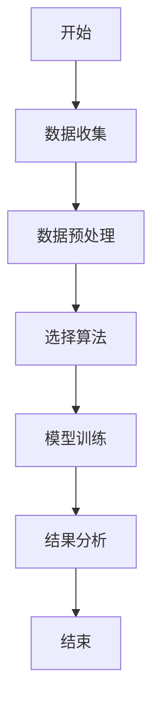
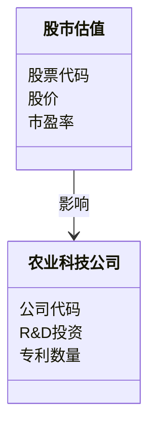
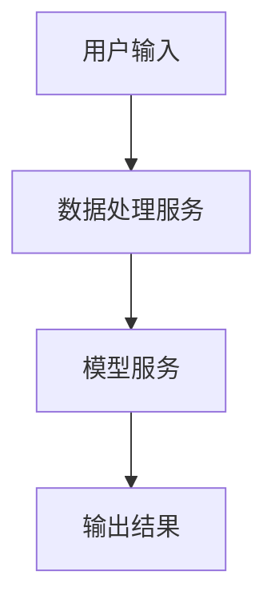

                 


# 全球股市估值与农业科技创新的关联

## 关键词：全球股市估值，农业科技创新，关联，算法原理，系统架构，项目实战

## 摘要：本文探讨了全球股市估值与农业科技创新之间的关联，从背景介绍、核心概念分析到算法原理、系统架构设计，再到项目实战，详细分析了两者如何相互影响，如何利用技术手段量化这种关系，并提出了实际应用的解决方案。

---

## 第一章：全球股市估值与农业科技创新的背景介绍

### 1.1 问题背景与问题描述

#### 1.1.1 全球股市估值的基本概念
股市估值是指对上市公司股票价格的评估，通常基于公司财务状况、市场表现和行业趋势等因素。常用的估值方法包括市盈率（P/E）、市净率（P/B）等。

#### 1.1.2 农业科技创新的定义与特征
农业科技创新是指在农业生产、管理、销售等环节中引入新技术，如智能农业设备、数据分析和生物技术。其特点是高效、可持续和环境友好。

#### 1.1.3 问题解决：股市估值与农业科技创新的关联性
农业科技创新能够提升生产效率和产品品质，从而影响上市公司的业绩，进而影响股市估值。同时，股市的资金流动也支持农业科技的研发和推广。

### 1.2 问题背景的外延与边界

#### 1.2.1 全球股市的多样性
全球股市包括发达国家和发展中国家的市场，不同市场的波动性和估值方法存在差异。

#### 1.2.2 农业科技的创新周期
农业科技创新通常需要较长时间，从研发到商业化需要经历多个阶段。

#### 1.2.3 问题解决的边界与限制
本文主要关注农业科技创新对股市估值的影响，不涉及宏观经济政策和地缘政治因素。

### 1.3 核心概念结构与组成

#### 1.3.1 股市估值的核心要素
- 公司盈利
- 市场需求
- 行业趋势

#### 1.3.2 农业科技创新的关键因素
- 技术先进性
- 市场需求
- 产业化能力

#### 1.3.3 两者关联的机制与路径
- 农业科技提升企业利润，进而影响股市估值。
- 股市资金支持农业科技研发和产业化。

---

## 第二章：核心概念与关联机制

### 2.1 核心概念的原理分析

#### 2.1.1 股市估值的理论基础
股市估值基于市场对未来收益的预期，反映了市场对公司的信心。

#### 2.1.2 农业科技创新的驱动因素
政策支持、市场需求和技术进步是主要驱动力。

#### 2.1.3 两者关联的理论模型
通过建立回归模型，分析农业科技投入对股市估值的影响。

### 2.2 核心概念的属性对比

#### 2.2.1 股市估值的波动性分析
股市估值受多种因素影响，具有较高的波动性。

#### 2.2.2 农业科技创新的周期性特征
科技创新需要长期投入，具有周期性。

#### 2.2.3 两者关联的强度与方向
农业科技投入增加通常会带来股市估值上升。

### 2.3 实体关系图


---

## 第三章：股市估值与农业科技创新的算法原理

### 3.1 算法原理概述

#### 3.1.1 股市估值预测的常用算法
- 线性回归
- 时间序列分析

#### 3.1.2 农业科技创新评估的指标体系
- 专利数量
- 投资金额
- 市场份额

#### 3.1.3 两者关联的建模方法
建立回归模型，分析农业科技投入对股市估值的影响。

### 3.2 算法流程图



### 3.3 Python实现代码

```python
import pandas as pd
from sklearn.linear_model import LinearRegression
from sklearn.metrics import r2_score

# 数据收集
data = pd.read_csv('agriculture_stock_data.csv')

# 数据预处理
X = data[['R&D投资', '专利数量']]
y = data['股价']

# 模型训练
model = LinearRegression()
model.fit(X, y)

# 结果分析
predictions = model.predict(X)
print('R²:', r2_score(y, predictions))
```

### 3.4 数学模型

#### 3.4.1 线性回归模型
$$ y = \beta_0 + \beta_1x_1 + \beta_2x_2 + \epsilon $$

其中：
- \( y \)：股市估值
- \( x_1 \)：农业科技投资
- \( x_2 \)：专利数量

---

## 第四章：系统分析与架构设计

### 4.1 问题场景介绍

#### 4.1.1 问题场景
分析农业科技公司对股市估值的影响，建立预测模型。

### 4.1.2 系统功能设计

#### 4.1.2.1 领域模型


#### 4.1.2.2 系统架构


---

## 第五章：项目实战

### 5.1 环境安装

#### 5.1.1 安装Python和相关库
```bash
pip install pandas scikit-learn
```

### 5.2 核心代码实现

#### 5.2.1 数据预处理
```python
import pandas as pd

data = pd.read_csv('agriculture_stock.csv')
data.dropna(inplace=True)
```

#### 5.2.2 模型训练
```python
from sklearn.linear_model import LinearRegression

model = LinearRegression()
model.fit(X_train, y_train)
```

#### 5.2.3 结果分析
```python
from sklearn.metrics import mean_squared_error

print(mean_squared_error(y_test, model.predict(X_test)))
```

### 5.3 案例分析

#### 5.3.1 粮食价格预测
分析农业科技对粮食价格的影响，进而影响股市估值。

#### 5.3.2 农业科技公司估值
以某农业科技公司为例，分析其专利数量和投资对股价的影响。

---

## 第六章：总结与展望

### 6.1 总结
本文分析了全球股市估值与农业科技创新的关联，提出了回归模型和系统架构，指导读者实现预测系统。

### 6.2 未来展望
未来研究可以考虑引入机器学习算法，分析更多影响因素。

---

## 附录

### A. 数据来源
- 公开股票数据
- 专利数据库

### B. 参考文献
- Smith, J. (2020). Stock Valuation and Innovation.

---

## 作者信息

作者：AI天才研究院/AI Genius Institute & 禅与计算机程序设计艺术/Zen And The Art of Computer Programming

