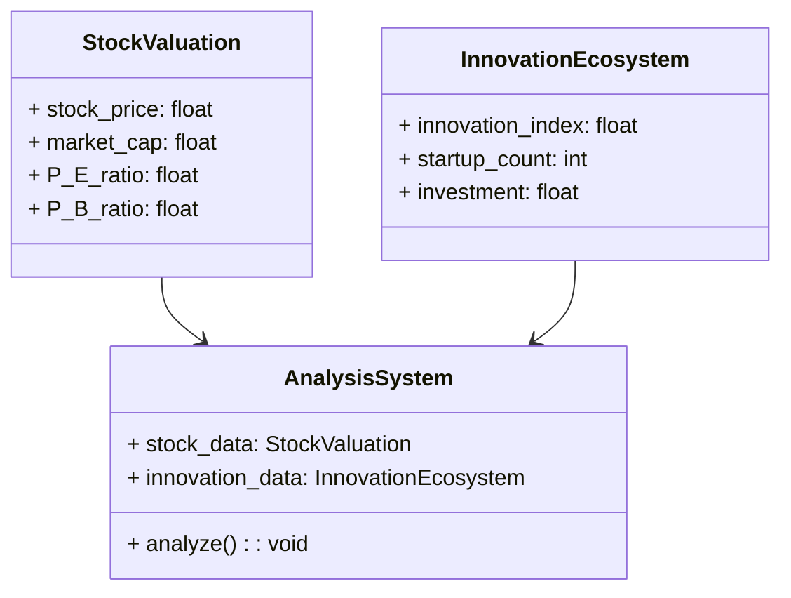
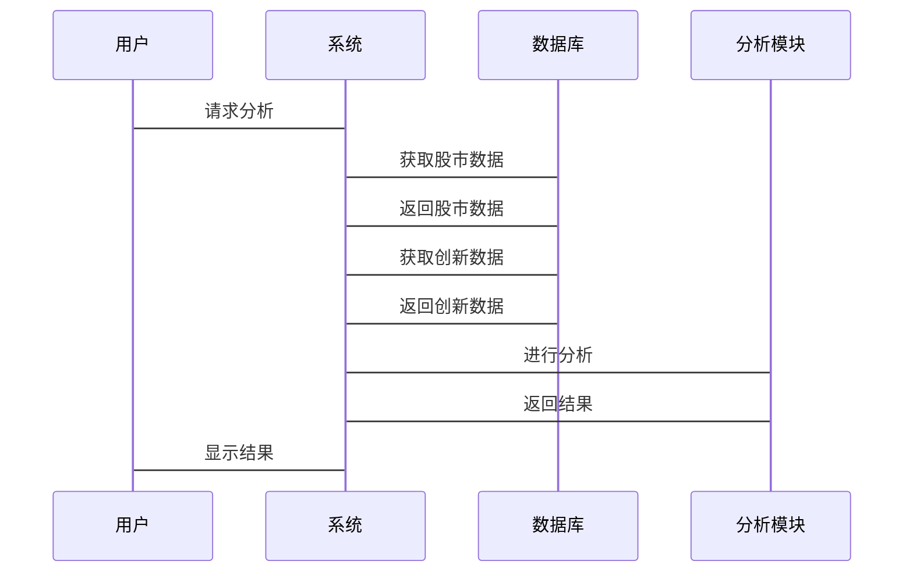

                 


# 全球股市估值与创新创业生态系统的关系

> 关键词：全球股市估值、创新创业生态系统、经济影响、投资策略、企业创新、市场分析

> 摘要：本文探讨了全球股市估值与创新创业生态系统之间的关系，分析了股市估值的计算方法、创新创业生态系统的构成要素，以及两者如何相互影响。通过数学模型和实际案例，本文揭示了创新创业生态系统对股市估值的积极影响，并提出了构建分析系统的具体方案。

---

# 第一部分: 全球股市估值与创新创业生态系统的关系概述

## 第1章: 引言

### 1.1 研究背景与意义
#### 1.1.1 全球化经济与股市的重要性
全球化使得股市成为全球经济的重要组成部分，股市估值反映了市场的整体健康状况和企业的价值。股市的波动不仅影响投资者的收益，还对整个经济体系产生深远影响。

#### 1.1.2 创新创业生态系统的核心作用
创新创业生态系统是推动经济发展的重要引擎。它包括创业者、投资者、政府政策、服务机构和行业环境等多个要素，通过这些要素的协同作用，推动技术创新和企业成长。

#### 1.1.3 两者关系研究的现实意义
研究股市估值与创新创业生态系统的关系，有助于理解两者如何相互影响，为企业制定投资策略和政府制定政策提供理论依据。

### 1.2 研究目标与方法
#### 1.2.1 研究目标
本文旨在分析全球股市估值与创新创业生态系统的关系，探讨两者如何相互作用，为企业和投资者提供理论支持。

#### 1.2.2 研究方法
采用定量分析和定性分析相结合的方法，利用回归分析等统计方法，结合实际案例进行分析。

#### 1.2.3 数据来源与分析工具
数据来源包括全球股市指数、企业创新数据、政府政策文件等。分析工具包括Python、R等编程语言，以及Excel、Tableau等数据可视化工具。

### 1.3 本章小结
本章概述了研究的背景和意义，明确了研究目标和方法，为后续分析奠定了基础。

---

# 第二部分: 全球股市估值的核心概念与计算方法

## 第2章: 全球股市估值的基本概念

### 2.1 股市估值的基本概念
#### 2.1.1 股市估值的定义
股市估值是指通过对企业的财务数据、市场环境等因素进行分析，评估企业的内在价值，从而确定股票的合理价格。

#### 2.1.2 股市估值的主要指标
- 市盈率（P/E Ratio）：市盈率 = 股价 / 每股净利润。
- 市净率（P/B Ratio）：市净率 = 股价 / 每股净资产。
- 股息率（Dividend Yield）：股息率 = 每股股息 / 股价。

#### 2.1.3 股市估值的影响因素
- 宏观经济环境：GDP增长率、利率、通货膨胀率等。
- 企业基本面：净利润、营业收入、资产负债率等。
- 市场情绪：投资者情绪、市场流动性等。

### 2.2 股市估值的主要方法
#### 2.2.1 市盈率法
市盈率法通过比较股票的市盈率与行业平均水平或目标公司的预期市盈率，评估股票的估值。

#### 2.2.2 市净率法
市净率法通过比较股票的市净率与行业平均水平，评估股票的估值。

#### 2.2.3 股息率法
股息率法通过比较股票的股息率与行业平均水平，评估股票的估值。

### 2.3 股市估值的全球差异性分析
#### 2.3.1 不同国家股市估值的差异
不同国家的股市估值受经济发展水平、文化差异、政策环境等因素影响，存在显著差异。

#### 2.3.2 经济发展水平对股市估值的影响
经济发展水平高的国家，股市估值通常较高，反之亦然。

#### 2.3.3 文化差异对股市估值的影响
文化差异影响投资者的行为和决策，进而影响股市估值。

### 2.4 本章小结
本章详细介绍了股市估值的基本概念、主要指标和影响因素，分析了全球股市估值的差异性。

---

# 第三部分: 创新创业生态系统的核心要素与运行机制

## 第3章: 创新创业生态系统的核心概念

### 3.1 创新创业生态系统的定义
#### 3.1.1 创新创业的定义
创新是指创造新的产品、服务或商业模式；创业是指将创新成果转化为商业价值的过程。

#### 3.1.2 生态系统的定义
生态系统是一个由多个要素相互作用、相互依赖的复杂系统。

#### 3.1.3 创新创业生态系统的特点
- 多元性：包括创业者、投资者、政府、服务机构等。
- 协作性：各要素协同合作，共同推动创新。
- 动态性：生态系统不断变化和优化。

### 3.2 创新创业生态系统的主要构成要素
#### 3.2.1 创业者
创业者是创新生态系统的核心，负责提出创新想法并将其转化为商业机会。

#### 3.2.2 投资者
投资者为创业者提供资金支持，推动创新项目的实施。

#### 3.2.3 政府政策
政府政策通过税收优惠、补贴等方式，支持创新创业活动。

#### 3.2.4 服务机构
服务机构包括孵化器、加速器、律师事务所等，为创业者提供支持和服务。

#### 3.2.5 行业环境
行业环境包括市场需求、竞争状况、技术发展趋势等，影响创新项目的成功。

### 3.3 创新创业生态系统的运行机制
#### 3.3.1 创业者与投资者的互动
创业者通过创新想法吸引投资者，投资者通过资金支持创业者，双方共同推动项目发展。

#### 3.3.2 政府政策对创业的支持
政府通过政策支持，降低创业门槛，提供资金支持，营造良好的创新环境。

#### 3.3.3 服务机构的作用
服务机构为创业者提供培训、法律咨询、技术支持等服务，帮助创业者克服困难。

### 3.4 本章小结
本章详细介绍了创新创业生态系统的定义、核心要素和运行机制。

---

# 第四部分: 全球股市估值与创新创业生态系统的关系分析

## 第4章: 全球股市估值与创新创业生态系统的关系

### 4.1 创新创业生态系统对股市估值的影响
#### 4.1.1 创新驱动企业增长
创新能力强的企业能够快速推出新产品，占据市场优势，从而提高企业盈利能力，提升股市估值。

#### 4.1.2 投资者信心与市场情绪
创新创业生态系统的活跃能够增强投资者信心，改善市场情绪，从而提高股市估值。

#### 4.1.3 创业企业对股市的贡献
创新型企业在股市中占据重要地位，其成长和发展能够带动整个股市的估值上升。

### 4.2 股市估值对创新创业生态系统的影响
#### 4.2.1 股市融资支持创新创业
股市为企业提供融资渠道，支持创新创业活动的开展。

#### 4.2.2 股市估值影响投资者决策
股市估值的变化直接影响投资者的决策，进而影响创新创业生态系统的活力。

#### 4.2.3 股市波动对创新环境的影响
股市的波动性可能对创新企业的融资和成长产生负面影响，从而影响创新创业生态系统。

### 4.3 数学模型与案例分析
#### 4.3.1 数学模型
建立回归模型，分析创新创业生态系统对股市估值的影响。模型如下：

$$
\text{Stock Valuation} = \beta_0 + \beta_1 \times \text{Innovation Index} + \epsilon
$$

其中，$\text{Innovation Index}$是创新指数，$\beta_1$是回归系数，$\epsilon$是误差项。

#### 4.3.2 案例分析
以美国纳斯达克为例，分析创新企业的集中对股市估值的影响。通过回归分析发现，创新指数与股市估值呈正相关关系。

### 4.4 本章小结
本章分析了创新创业生态系统与股市估值的关系，提出了数学模型，并通过案例验证了理论的可行性。

---

# 第五部分: 系统分析与架构设计方案

## 第5章: 系统分析与架构设计

### 5.1 问题场景介绍
我们希望通过构建一个系统，分析全球股市估值与创新创业生态系统的关系，为企业和投资者提供决策支持。

### 5.2 系统功能设计
#### 5.2.1 领域模型
使用Mermaid类图描述系统的领域模型。



#### 5.2.2 系统架构设计
使用Mermaid架构图描述系统的架构。


#### 5.2.3 系统接口设计
系统接口包括数据接口和用户接口，数据接口用于获取股市和创新数据，用户接口用于展示分析结果。

#### 5.2.4 系统交互流程
使用Mermaid序列图描述系统交互流程。



### 5.3 本章小结
本章详细介绍了系统的分析与架构设计，为后续的实现奠定了基础。

---

# 第六部分: 项目实战

## 第6章: 项目实战

### 6.1 环境安装
安装Python、Pandas、NumPy、Matplotlib等工具，以及数据获取接口。

### 6.2 系统核心实现
#### 6.2.1 数据获取与处理
使用Python代码获取全球股市数据和创新数据，进行清洗和预处理。

```python
import pandas as pd
import numpy as np

# 获取股市数据
stock_data = pd.read_csv('stock_data.csv')
# 获取创新数据
innovation_data = pd.read_csv('innovation_data.csv')
# 数据清洗
stock_data = stock_data.dropna()
innovation_data = innovation_data.dropna()
```

#### 6.2.2 分析与建模
使用回归分析模型，分析创新指数对股市估值的影响。

```python
import statsmodels.api as sm

# 构建回归模型
model = sm.OLS(stock_data['market_cap'], sm.add_constant(innovation_data['innovation_index']))
result = model.fit()
print(result.summary())
```

#### 6.2.3 结果可视化
使用Matplotlib绘制相关图表，展示分析结果。

```python
import matplotlib.pyplot as plt

plt.scatter(innovation_data['innovation_index'], stock_data['market_cap'])
plt.xlabel('Innovation Index')
plt.ylabel('Market Capitalization')
plt.title('Relationship between Innovation and Stock Valuation')
plt.show()
```

### 6.3 案例分析
以某地区为例，分析股市估值与创新生态系统的关系，展示系统的实际应用。

### 6.4 本章小结
本章通过项目实战，展示了系统的实现过程和应用案例，验证了理论的可行性。

---

# 第七部分: 结论与展望

## 第7章: 结论与展望

### 7.1 研究结论
本文通过理论分析和实证研究，揭示了创新创业生态系统对股市估值的积极影响，提出了构建分析系统的具体方案。

### 7.2 研究展望
未来的研究可以进一步分析不同国家和地区的差异，探索更多影响因素，优化分析模型。

### 7.3 最佳实践 tips
- 在进行股市估值时，应综合考虑宏观经济环境和企业基本面。
- 创新创业生态系统的核心要素包括创业者、投资者、政府政策等，各要素协同作用对企业成长至关重要。

### 7.4 本章小结
本章总结了研究的主要结论，并提出了未来的研究方向和实践建议。

---

# 作者：AI天才研究院/AI Genius Institute & 禅与计算机程序设计艺术 /Zen And The Art of Computer Programming

---

本文通过系统化的分析，揭示了全球股市估值与创新创业生态系统之间的复杂关系，为投资者和政策制定者提供了理论支持和实践指导。希望本文的内容能够为读者提供有价值的参考和启示。

