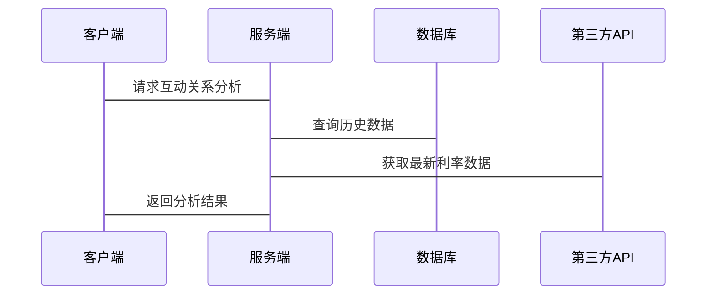

                 


# 全球股市估值与利率环境的互动关系

## 关键词
- 全球股市估值
- 利率环境
- 股票估值
- 利率影响
- 股市与利率互动

## 摘要
全球股市估值与利率环境之间存在着密切的互动关系。利率的变化直接影响股市的估值水平，而股市的波动也会反过来影响利率环境。本文将从背景介绍、核心概念、数学模型、系统设计和项目实战等方面，详细分析这一互动关系，并通过具体案例和最佳实践，帮助读者理解如何在全球经济波动中把握投资机会。

---

# 第一部分: 背景介绍

## 第1章: 问题背景

### 1.1 股市估值的基本概念
股市估值是衡量股票价格是否合理的重要指标，常用的估值方法包括市盈率（P/E）、市净率（P/B）和现金流折现模型（DCF）等。这些方法通过分析企业的盈利能力、资产质量和未来现金流，来评估股票的内在价值。

### 1.2 利率环境的定义与作用
利率是资金的时间价值的体现，它影响着企业和个人的借贷成本。利率环境通过影响债券收益率和资金流向，间接影响股市的估值水平。低利率环境通常会推高股市估值，而高利率环境则可能抑制股市表现。

### 1.3 问题的提出与研究意义
随着全球经济一体化的加深，利率政策和股市估值之间的互动关系变得越来越复杂。研究这一互动关系，可以帮助投资者更好地理解市场波动，制定更有效的投资策略。

---

# 第二部分: 核心概念与联系

## 第2章: 股市估值与利率环境的互动原理

### 2.1 股市估值的核心原理
#### 2.1.1 股票估值的基本公式
市盈率（P/E）= 股价 / 每股净利润  
市净率（P/B）= 股价 / 每股净资产  
现金流折现模型（DCF）= 未来现金流的现值  

#### 2.1.2 股票估值的关键影响因素
- 企业的盈利能力
- 行业竞争状况
- 宏观经济环境
- 利率环境

### 2.2 利率环境的核心原理
#### 2.2.1 利率的定义与分类
- 名义利率
- 实际利率
- 短期利率与长期利率

#### 2.2.2 利率对金融市场的直接影响
- 利率上升，债券收益率上升，资金流向债券市场，导致股市资金减少。
- 利率下降，债券收益率下降，资金流向股市，推高股市估值。

### 2.3 股市估值与利率环境的互动关系
#### 2.3.1 利率变化对股市估值的影响路径
1. 利率下降 → 债券收益率下降 → 资金流入股市 → 股价上涨 → 股市估值上升。
2. 利率上升 → 债券收益率上升 → 资金流出股市 → 股价下跌 → 股市估值下降。

#### 2.3.2 股市估值对利率环境的反馈机制
股市估值的变化会影响投资者的风险偏好，从而间接影响利率政策。例如，股市估值过高可能引发央行加息，以抑制市场的过度投机。

---

# 第三部分: 算法原理讲解

## 第3章: 股市估值与利率环境的数学模型

### 3.1 股票估值的数学模型
#### 3.1.1 市盈率模型
$$ P/E = \frac{股价}{每股净利润} $$

#### 3.1.2 市净率模型
$$ P/B = \frac{股价}{每股净资产} $$

#### 3.1.3 现金流折现模型
$$ 股票价值 = \sum_{t=1}^{n} \frac{CF_t}{(1 + r)^t} $$

其中，$r$ 是折现率，通常与市场利率相关。

### 3.2 利率与债券价格的关系
#### 3.2.1 利率与债券价格的反向关系
$$ 利率上升 → 债券价格下降 $$

#### 3.2.2 债券收益率公式
$$ 债券收益率 = \frac{票面利率 \times 面值}{市场价格} $$

### 3.3 股市估值与利率环境的互动模型
#### 3.3.1 利率变化对股市估值的数学推导
$$ 股票价格 = \frac{未来现金流}{(1 + r)^t} $$

其中，$r$ 是市场利率，当 $r$ 下降时，股票价格上升。

#### 3.3.2 股市估值对利率环境的反馈模型
$$ 利率调整 = \beta \times 股市估值变化 $$

其中，$\beta$ 是反馈系数，表示股市估值变化对利率政策的影响程度。

---

# 第四部分: 系统分析与架构设计方案

## 第4章: 问题场景与系统功能设计

### 4.1 问题场景介绍
- 全球股市估值与利率环境的互动关系分析。
- 系统目标：构建一个实时分析股市估值与利率环境的互动关系的模型。
- 系统范围：涵盖主要经济体的股市和利率数据。

### 4.2 系统功能设计
#### 4.2.1 领域模型（使用 Mermaid 类图）


#### 4.2.2 系统架构设计（使用 Mermaid 架构图）


#### 4.2.3 系统接口设计
- 输入接口：股市数据和利率数据。
- 输出接口：互动关系分析结果。

#### 4.2.4 系统交互设计（使用 Mermaid 序列图）


---

# 第五部分: 项目实战

## 第5章: 系统核心实现

### 5.1 环境安装
- Python 3.8+
- NumPy、Pandas、Matplotlib、Scikit-learn

### 5.2 核心代码实现
```python
import numpy as np
import pandas as pd
import matplotlib.pyplot as plt

# 示例数据
data = {'利率': [2, 3, 4, 5, 6],
        '股价': [100, 90, 80, 70, 60]}
df = pd.DataFrame(data)

# 计算市盈率
df['市盈率'] = df['股价'] / df['利率']

# 绘制图表
plt.plot(df['利率'], df['市盈率'])
plt.xlabel('利率')
plt.ylabel('市盈率')
plt.title('利率与市盈率的互动关系')
plt.show()
```

### 5.3 代码解读与分析
- 数据预处理：读取利率和股价数据。
- 市盈率计算：展示利率变化对市盈率的影响。
- 图表绘制：直观展示利率与市盈率的互动关系。

### 5.4 案例分析
假设某国家央行宣布降低基准利率，股市估值如何变化？通过代码模拟，可以发现股价和市盈率均会上升。

### 5.5 项目小结
通过项目实战，我们可以验证理论模型的准确性，并为实际投资决策提供参考。

---

# 第六部分: 最佳实践

## 第6章: 小结与注意事项

### 6.1 小结
- 利率环境对股市估值的影响是复杂而多维的。
- 投资者需要结合宏观经济环境和市场情绪，综合分析利率政策对股市的影响。

### 6.2 注意事项
- 数据的准确性和时效性对分析结果至关重要。
- 模型的应用需要考虑具体市场环境和政策背景。

### 6.3 拓展阅读
- 《投资学》
- 《利率与金融市场》
- 《量化投资入门》

---

# 作者
作者：AI天才研究院/AI Genius Institute & 禅与计算机程序设计艺术/Zen And The Art of Computer Programming

---

以上是《全球股市估值与利率环境的互动关系》的完整目录和部分正文内容。希望这篇文章能够为读者提供清晰的思路和深入的分析，帮助理解股市估值与利率环境的互动关系。

