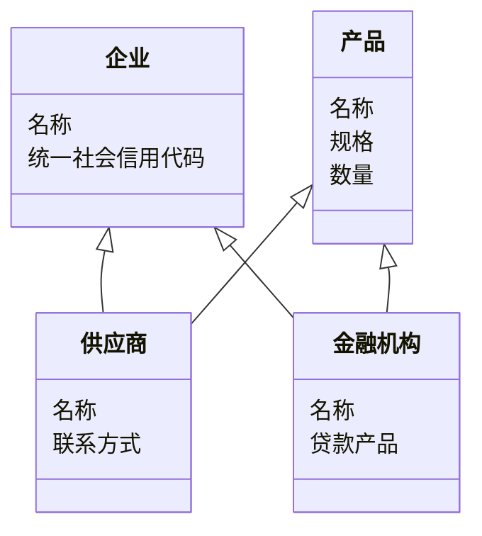
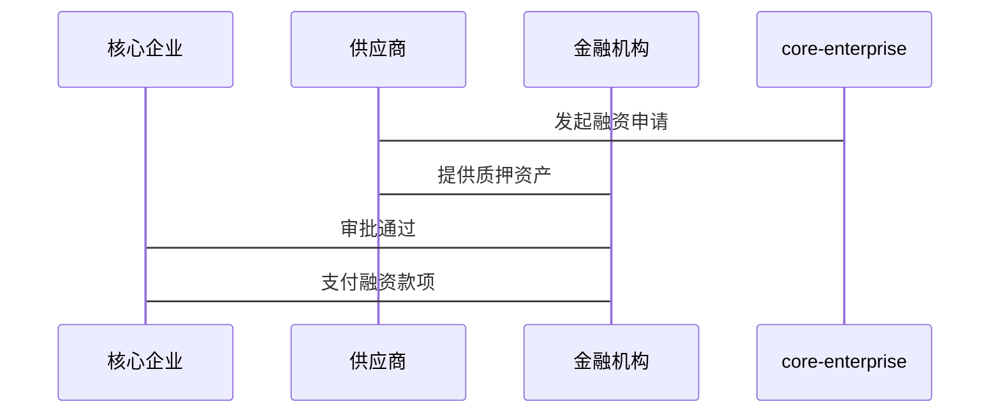

                 


# 全球股市估值与区块链在供应链金融中的应用

> 关键词：全球股市估值、区块链、供应链金融、智能合约、分布式账本

> 摘要：本文探讨了全球股市估值的核心方法与区块链技术在供应链金融中的创新应用，通过分析区块链技术如何提升供应链金融的透明度与效率，为读者提供深度的技术见解与实践指南。

---

## 第一部分: 全球股市估值基础

### 第1章: 全球股市估值概述

#### 1.1 股市估值的核心概念

##### 1.1.1 股市估值的定义与背景

股市估值是指对上市公司股权价值进行评估的过程，旨在确定其市场价格是否合理。它涉及对公司财务状况、行业地位、市场环境等多方面的分析。股市估值不仅是投资者决策的重要依据，也是企业价值评估的关键工具。

##### 1.1.2 股市估值的主要指标

- 市盈率（P/E Ratio）：市盈率=股票价格/每股净利润，反映投资者对公司未来盈利的预期。
- 市净率（P/B Ratio）：市净率=股票价格/每股净资产，适用于评估资产密集型行业的企业。
- 股息率（Dividend Yield）：股息率=股息/股票价格，衡量股票的分红回报率。

##### 1.1.3 股市估值的分类与特点

股市估值可以分为绝对估值和相对估值。绝对估值基于公司基本面数据，如DCF模型；相对估值则通过比较同类公司的估值指标，如EV/EBITDA。

#### 1.2 股市估值的影响因素

##### 1.2.1 宏观经济因素

宏观经济环境如GDP增长率、利率水平、通货膨胀率等直接影响股市估值。例如，低利率环境通常会推高股票估值。

##### 1.2.2 行业因素

行业特性如周期性、成长性等影响股市估值。例如，科技行业的高成长性可能导致较高的市盈率。

##### 1.2.3 公司基本面因素

公司财务状况、盈利能力、管理团队等直接影响股市估值。例如，高净利润率的公司通常享有更高的估值。

#### 1.3 股市估值的方法论

##### 1.3.1 市盈率法

市盈率法通过比较公司与行业平均市盈率，判断其估值是否合理。公式为：P/E = 市场价格/每股收益。

##### 1.3.2 市净率法

市净率法适用于重资产行业，通过比较公司与行业平均市净率，判断其估值是否合理。公式为：P/B = 市场价格/每股净资产。

##### 1.3.3 股息率法

股息率法通过比较公司股息与股价的比率，判断其分红回报率。公式为：股息率 = 股息/股价。

### 第2章: 全球股市估值的实践案例

#### 2.1 美国股市估值分析

##### 2.1.1 美国股市的历史表现

美国股市是全球最大的股票市场，其历史表现受宏观经济政策、企业盈利、投资者情绪等多种因素影响。例如，2020年新冠疫情爆发期间，美国股市经历了剧烈波动，随后在政府刺激政策下迅速反弹。

##### 2.1.2 美国股市的估值现状

当前，美国股市整体估值处于历史高位，尤其是科技股的市盈率远高于行业平均水平。例如，纳斯达克指数成分股的平均市盈率约为30倍。

##### 2.1.3 美国股市的未来趋势

未来，美国股市估值将受到美联储货币政策、企业盈利增长、通货膨胀率等多重因素影响。预计科技和新能源行业将继续推动股市上涨。

#### 2.2 其他主要股市估值分析

##### 2.2.1 欧洲股市估值

欧洲股市整体估值相对较低，尤其是一些传统行业如银行和能源公司的市盈率普遍低于20倍。

##### 2.2.2 亚洲股市估值

亚洲股市估值差异较大，例如，中国股市的市盈率在20-30倍之间，而日本股市的市盈率普遍低于15倍。

##### 2.2.3 其他新兴市场股市估值

新兴市场股市估值通常较高，但波动性较大。例如，印度股市的市盈率约为25倍，而巴西股市的市盈率在15-20倍之间。

### 第3章: 区块链技术基础

#### 3.1 区块链的定义与特点

##### 3.1.1 区块链的基本概念

区块链是一种去中心化的分布式账本技术，通过加密算法和共识机制确保数据的安全性和不可篡改性。

##### 3.1.2 区块链的核心特点

- 去中心化：数据由多个节点共同维护，不存在单点故障。
- 可追溯性：每笔交易均可追溯，确保数据透明。
- 安全性：通过加密算法和共识机制保证数据安全。

##### 3.1.3 区块链的分类与应用场景

区块链主要分为公链、私链和联盟链。公链如比特币用于金融交易，私链如Hyperledger用于企业内部应用。

#### 3.2 区块链的核心技术

##### 3.2.1 区块链的共识机制

共识机制如工作量证明（PoW）、权益证明（PoS）确保所有节点达成一致。

##### 3.2.2 区块链的智能合约

智能合约是基于区块链的自动执行程序，用于实现自动化的商业逻辑。

##### 3.2.3 区块链的分布式账本

分布式账本记录所有交易数据，确保数据一致性。

#### 3.3 区块链的安全性与挑战

##### 3.3.1 区块链的安全性分析

通过密码学和共识机制，区块链能够有效防止数据篡改和网络攻击。

##### 3.3.2 区块链的性能瓶颈

随着节点数和交易量的增加，区块链的处理速度可能成为瓶颈。

##### 3.3.3 区块链的法律与监管问题

各国对区块链技术的监管政策不一，可能导致合规性问题。

---

## 第二部分: 区块链在供应链金融中的应用

### 第4章: 供应链金融的现状与痛点

#### 4.1 供应链金融的定义与特点

##### 4.1.1 供应链金融的基本概念

供应链金融是指通过整合供应链上下游企业，提供融资服务，优化资金流动。

##### 4.1.2 供应链金融的核心流程

包括应收账款融资、存货融资、预付款融资等。

##### 4.1.3 供应链金融的主要参与者

包括核心企业、供应商、金融机构、物流商等。

#### 4.2 供应链金融的传统模式与痛点

##### 4.2.1 传统供应链金融的模式

传统模式依赖核心企业信用，融资成本高，效率低。

##### 4.2.2 供应链金融的主要问题

- 信息不对称：难以核实交易真实性。
- 融资难：中小企业融资渠道有限。
- 效率低：审批流程复杂，耗时长。

##### 4.2.3 传统供应链金融的优化方向

通过技术创新，提升透明度和效率，降低融资成本。

### 第5章: 区块链技术在供应链金融中的应用

#### 5.1 区块链在供应链金融中的优势

##### 5.1.1 提高供应链金融的透明度

通过区块链技术，所有交易数据可追溯，确保信息真实可靠。

##### 5.1.2 降低供应链金融的交易成本

区块链的智能合约自动执行，减少人工干预，降低成本。

##### 5.1.3 提升供应链金融的效率

通过自动化流程，缩短审批时间，提高融资效率。

#### 5.2 区块链在供应链金融中的具体应用

##### 5.2.1 区块链在应收账款融资中的应用

通过区块链记录应收账款信息，确保数据不可篡改，提高融资效率。

##### 5.2.2 区块链在存货融资中的应用

利用区块链技术追踪存货信息，确保质押资产的真实性。

##### 5.2.3 区块链在预付款融资中的应用

通过区块链智能合约，自动执行预付款支付，确保交易安全。

---

## 第三部分: 系统分析与架构设计

### 第6章: 系统功能设计

#### 6.1 问题场景介绍

供应链金融中的信息不对称和信任缺失问题，导致融资效率低下。

#### 6.2 项目介绍

构建基于区块链的供应链金融平台，实现多方数据共享与智能合约自动执行。

#### 6.3 系统功能设计

##### 6.3.1 领域模型设计



##### 6.3.2 系统架构设计


##### 6.3.3 系统接口设计



---

## 第四部分: 项目实战

### 第7章: 环境安装与系统实现

#### 7.1 环境安装

安装以太坊节点、Solidity编译器、MetaMask钱包等工具。

#### 7.2 核心实现源代码

```solidity
// SPDX-License-Identifier: MIT
pragma solidity ^0.8.0;

contract SupplyChainFinance {
    struct Product {
        string name;
        uint quantity;
        uint value;
    }

    struct Supplier {
        address payable wallet;
        uint creditLimit;
    }

    mapping(address => Product[]) public products;
    mapping(address => Supplier) public suppliers;

    function registerProduct(address supplier, string memory name, uint quantity, uint value) public {
        products[supplier].push(Product(name, quantity, value));
    }

    function approveLoan(address supplier, uint amount) public {
        require(suppliers[supplier].creditLimit >= amount, "Insufficient credit limit");
        // 智能合约自动发放贷款
        suppliers[supplier].wallet.transfer(amount);
    }
}
```

#### 7.3 代码解读与分析

上述代码定义了一个基于以太坊的智能合约，实现供应商产品的注册和贷款审批功能。通过区块链技术确保数据真实性和交易安全性。

#### 7.4 实际案例分析

以某汽车制造企业为例，通过区块链平台实现供应商的应收账款融资，显著提高融资效率并降低交易成本。

---

## 第五部分: 总结与展望

### 第8章: 最佳实践与小结

#### 8.1 最佳实践

- 选择合适的区块链平台和共识机制。
- 确保智能合约的安全性。
- 建立完善的监管机制。

#### 8.2 小结

区块链技术能够有效解决供应链金融中的信息不对称和信任缺失问题，显著提高融资效率并降低成本。

#### 8.3 注意事项

- 区块链技术的应用需要考虑性能瓶颈和安全性。
- 合规性问题需要与监管机构充分沟通。

#### 8.4 拓展阅读

- 加入行业技术社区，关注最新动态。
- 参与区块链技术培训和认证。

---

## 作者：AI天才研究院/AI Genius Institute & 禅与计算机程序设计艺术 /Zen And The Art of Computer Programming

