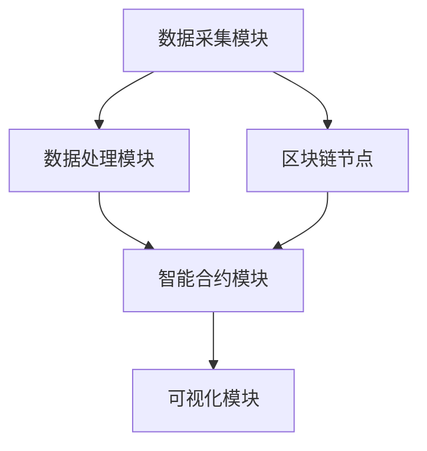

                 


# 全球股市估值与区块链在知识产权保护中的应用

> 关键词：全球股市估值，区块链，知识产权保护，智能合约，去中心化，数据安全

> 摘要：本文探讨了全球股市估值的传统方法及其面临的挑战，并深入分析了区块链技术在知识产权保护中的应用潜力。通过结合区块链的去中心化、不可篡改和透明性特点，本文提出了利用区块链技术提升知识产权保护效率和准确性的创新解决方案。同时，本文还探讨了区块链技术如何赋能全球股市估值，通过智能合约和数据共享机制实现更高效、透明的估值体系。

---

## 第一部分：全球股市估值与区块链技术基础

### 第1章：全球股市估值概述

#### 1.1 股市估值的基本概念
股市估值是通过对公司基本面、市场环境、行业趋势等因素进行分析，估算公司股票的内在价值或市场价格的过程。其目的是为投资者提供决策依据，帮助其判断股票是否被高估或低估。

- **1.1.1 股票估值的定义与意义**
  股票估值是投资者评估股票价值的重要工具，能够帮助投资者识别投资机会和风险。通过估值，投资者可以判断市场是否合理，从而做出买入、卖出或持有股票的决策。

- **1.1.2 股票估值的核心要素**
  - 公司财务状况（收入、利润、资产负债表等）
  - 行业地位与竞争优势
  - 宏观经济环境（GDP、利率、通货膨胀等）
  - 市场情绪与投资者预期

- **1.1.3 股票估值的分类与方法**
  - 市盈率法（Price-to-Earnings Ratio，P/E）
  - 市净率法（Price-to-Book Ratio，P/B）
  - 股息率法（Dividend Yield）
  - 内在价值法（Intrinsic Value）

#### 1.2 股市估值的传统方法
传统股市估值方法主要依赖财务指标和市场分析，但存在以下问题：
- 数据来源依赖性高，容易受到人为干预
- 市场情绪波动可能导致估值偏差
- 跨境数据获取复杂，难以实现全球化统一标准

#### 1.3 股市估值的影响因素
- **宏观经济因素**：如GDP增长、利率水平、通货膨胀等
- **行业因素**：如行业周期性、政策监管等
- **公司基本面因素**：如盈利能力、成长性、财务健康状况
- **市场情绪因素**：如投资者情绪、市场流动性

---

### 第2章：区块链技术概述

#### 2.1 区块链的基本概念
区块链是一种去中心化的分布式账本技术，通过密码学和共识机制确保数据的安全性和不可篡改性。其核心特点包括：
- **去中心化**：没有单一的控制机构
- **不可篡改性**：数据一旦记录，难以被修改
- **透明性**：所有交易记录可追溯

#### 2.2 区块链的共识机制
共识机制是区块链的核心技术之一，用于确保网络中所有节点对交易的一致性达成共识。

- **工作量证明（PoW）**：比特币采用的机制，通过计算哈希值来验证交易。
- **权益证明（PoS）**：以太坊2.0采用的机制，通过持有代币的数量和时间来决定记账权。
- **拜占庭容错共识（BFT）**：适用于小规模网络的高效共识机制。

#### 2.3 区块链的智能合约
智能合约是区块链上的自动化程序，能够根据预设条件自动执行合同条款。

- **智能合约的定义**：智能合约是运行在区块链上的自动执行代码，用于实现特定的业务逻辑。
- **智能合约的特点**：无需信任第三方，自动执行，不可篡改。
- **智能合约的编程语言**：如Solidity、Vyper等。

---

### 第3章：区块链在知识产权保护中的应用

#### 3.1 知识产权保护的现状与挑战
- **知识产权保护的难点**：传统知识产权保护依赖法律手段，存在维权成本高、效率低的问题。
- **知识产权侵权的主要形式**：盗版、仿冒、未经授权使用等。
- **知识产权保护的法律框架**：不同国家和地区有不同的法律体系，跨区域保护复杂。

#### 3.2 区块链在知识产权保护中的优势
- **去中心化特性**：避免单一机构控制，降低被篡改风险。
- **时间戳特性**：记录创作时间，为原创作品提供证据。
- **不可篡改特性**：确保知识产权记录的真实性和唯一性。

#### 3.3 区块链在知识产权保护中的具体应用
- **知识产权的确权与登记**：通过区块链记录知识产权的归属和创作时间。
- **知识产权的侵权监测**：利用区块链技术追踪侵权行为，快速定位侵权者。
- **知识产权的交易与流转**：通过智能合约实现知识产权的自动交易和权益分配。

---

## 第二部分：区块链技术在股市估值中的应用

### 第4章：区块链赋能全球股市估值

#### 4.1 区块链技术在股市估值中的优势
- **数据透明性**：区块链可以实现全球股市数据的透明共享，减少信息不对称。
- **数据安全性**：区块链确保数据不可篡改，提升估值数据的可信度。
- **智能合约的应用**：通过智能合约自动执行估值逻辑，提高估值效率。

#### 4.2 区块链在股市估值中的具体应用
- **数据共享机制**：通过区块链实现全球股市数据的共享，支持跨市场的估值分析。
- **智能合约的估值模型**：利用智能合约自动计算股票估值，降低人为干预。
- **链上链下数据结合**：将链上数据与传统估值模型结合，提升估值的准确性和效率。

---

### 第5章：系统架构设计与实现

#### 5.1 系统功能设计
- **数据采集模块**：采集全球股市数据和知识产权数据。
- **智能合约模块**：实现智能合约的部署和执行。
- **数据处理模块**：对数据进行清洗、分析和建模。
- **可视化模块**：展示估值结果和知识产权保护状态。

#### 5.2 系统架构设计
以下是系统的架构设计图：



#### 5.3 系统接口设计
- 数据采集接口：用于获取全球股市数据和知识产权数据。
- 智能合约接口：用于部署和执行智能合约。
- 数据查询接口：用于查询区块链上的数据。

---

### 第6章：项目实战与案例分析

#### 6.1 环境安装
- 安装区块链开发环境（如以太坊开发环境）
- 安装智能合约开发工具（如Solidity、Remix）

#### 6.2 系统核心实现
以下是智能合约实现的代码示例：

```solidity
// SPDX-License-Identifier: MIT
pragma solidity ^0.8.0;

contract StockValuation {
    struct ValuationData {
        uint256 stockId;
        uint256 valuation;
        uint256 timestamp;
    }

    event ValuationEvent(uint256 indexed stockId, uint256 valuation, uint256 timestamp);

    function setValuation(uint256 stockId, uint256 valuation) public {
        emit ValuationEvent(stockId, valuation, block.timestamp);
    }
}
```

#### 6.3 案例分析
以某公司知识产权保护为例，通过区块链记录其专利信息，实现知识产权的确权和侵权监测。

---

## 第三部分：总结与展望

### 7.1 总结
本文探讨了全球股市估值的传统方法及其面临的挑战，并深入分析了区块链技术在知识产权保护中的应用潜力。通过区块链的去中心化、不可篡改和透明性特点，可以实现更高效、准确的知识产权保护和股市估值。

### 7.2 展望
未来，随着区块链技术的不断发展，其在股市估值和知识产权保护中的应用将更加广泛。通过智能合约和数据共享机制，可以进一步提升估值体系的透明度和效率，为全球资本市场的发展注入新的活力。

---

作者：AI天才研究院/AI Genius Institute & 禅与计算机程序设计艺术 /Zen And The Art of Computer Programming

