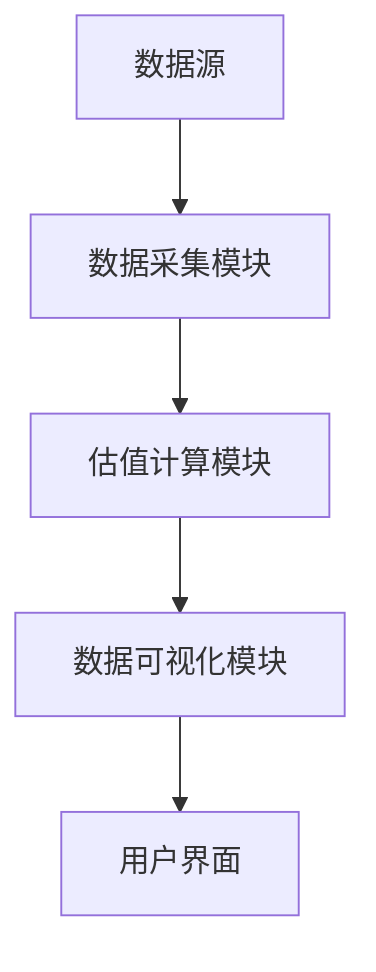
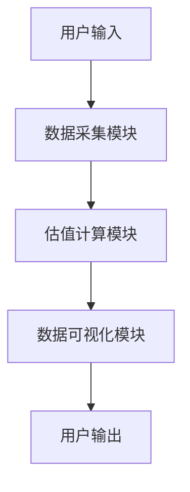

                 


# 全球股市估值与区块链在食品溯源中的应用

> 关键词：全球股市估值，区块链，食品溯源，金融分析，分布式 ledger

> 摘要：本文探讨了全球股市估值的核心概念、算法实现和区块链技术在食品溯源中的创新应用。通过分析股市估值的基本原理和区块链的技术优势，展示了如何利用区块链技术提升食品溯源系统的透明度和安全性。文章从理论到实践，结合具体案例，深入剖析了两个领域的技术细节和应用场景，为读者提供了全面的技术视角。

---

## 第一部分：全球股市估值

### 第1章：全球股市估值概述

#### 1.1 股市估值的基本概念

股市估值是通过对公司财务数据和市场信息的分析，评估公司股票的内在价值，以确定其合理的价格区间。这一过程对于投资者、机构和市场监管至关重要，能够帮助做出理性的投资决策。

##### 1.1.1 股市估值的定义与意义

股市估值是指对上市公司股票的内在价值进行评估的过程，其意义在于帮助投资者识别被低估或高估的股票，从而做出更明智的投资决策。通过分析公司的财务状况、行业地位和市场趋势，投资者可以更好地理解股票的真实价值。

##### 1.1.2 股市估值的核心要素

股市估值的核心要素包括以下几个方面：

- **公司基本面**：包括收入、利润、资产负债表等财务指标。
- **行业环境**：行业竞争状况、市场增长潜力等。
- **宏观经济因素**：GDP增长率、利率、通货膨胀等。
- **市场情绪**：投资者的心理预期和市场流动性。

##### 1.1.3 全球股市估值的背景与现状

随着全球经济的互联互通，股市估值已成为全球投资者关注的焦点。尤其是在当前数字化和智能化时代，数据驱动的估值方法逐渐取代传统的人工分析，成为主流趋势。

---

#### 1.2 股市估值的主要方法

股市估值方法多种多样，主要包括基本面分析和市场情绪分析两大类。

##### 1.2.1 市盈率法

市盈率（P/E）是衡量股票价值的重要指标，计算公式为：

$$ \text{P/E} = \frac{\text{股票价格}}{\text{每股收益}} $$

市盈率反映了投资者对公司未来盈利能力的预期。一般来说，市盈率越低，股票的相对价值越高。

##### 1.2.2 市净率法

市净率（P/B）是另一种常用的估值指标，计算公式为：

$$ \text{P/B} = \frac{\text{股票价格}}{\text{每股净资产}} $$

市净率适用于评估资产密集型行业的公司，如银行和制造业。

##### 1.2.3 股息率法

股息率（Dividend Yield）是股票派发的股息与股票价格的比率，计算公式为：

$$ \text{股息率} = \frac{\text{股息/每股}}{\text{股票价格}} $$

股息率反映了股票的分红能力，通常被视为投资稳定性的指标。

##### 1.2.4 现金流折现法

现金流折现法（DCF）是一种较为复杂的估值方法，通过将未来现金流折现到当前价值来评估公司价值。其核心公式为：

$$ V = \sum_{t=1}^{n} \frac{CF_t}{(1+r)^t} $$

其中，\( V \) 为公司价值，\( CF_t \) 为第 \( t \) 年的现金流，\( r \) 为折现率。

---

#### 1.3 全球股市估值的影响因素

股市估值受多种因素影响，主要包括宏观经济、行业环境和公司基本面等。

##### 1.3.1 宏观经济因素

宏观经济环境直接影响股市估值，例如：

- **利率水平**：低利率环境通常会推高股市估值。
- **通货膨胀**：高通胀可能导致股市估值下降。
- **货币政策**：央行的货币政策会影响市场流动性。

##### 1.3.2 行业因素

行业环境也对股市估值产生重要影响，例如：

- **行业周期**：处于上升周期的行业通常具有较高的估值。
- **行业竞争**：垄断或寡头垄断行业的估值可能较高。

##### 1.3.3 公司基本面因素

公司自身的财务状况直接影响其估值，例如：

- **盈利能力**：高利润公司通常具有较高的估值。
- **资产负债表**：健康的资产负债表有助于提升估值。

##### 1.3.4 市场情绪因素

投资者情绪是股市估值的重要影响因素，例如：

- **市场信心**：乐观的市场情绪会推高估值。
- **市场流动性**：高流动性通常会导致估值上升。

---

### 第2章：全球股市估值的核心模型

#### 2.1 股市估值模型的分类

股市估值模型主要分为以下几类：

##### 2.1.1 基于基本面的估值模型

基于基本面的估值模型主要依赖于公司的财务数据，如收入、利润和现金流。

##### 2.1.2 基于市场情绪的估值模型

基于市场情绪的估值模型则关注市场参与者的心理预期，如技术分析和情绪指标。

##### 2.1.3 基于技术分析的估值模型

技术分析通过研究股票价格的历史走势来预测未来价格。

---

#### 2.2 常用估值模型的数学公式

##### 2.2.1 市盈率模型

市盈率模型通过比较股票的当前价格与每股收益，评估其估值是否合理。

$$ P/E = \frac{\text{股票价格}}{\text{每股收益}} $$

##### 2.2.2 现金流折现模型

现金流折现模型通过将未来现金流折现到当前价值，评估公司整体价值。

$$ V = \sum_{t=1}^{n} \frac{CF_t}{(1+r)^t} $$

##### 2.2.3 股息折现模型

股息折现模型通过将未来股息折现，评估股票的内在价值。

$$ V = \frac{D}{r-g} $$

其中，\( D \) 为股息，\( r \) 为折现率，\( g \) 为股息增长率。

---

#### 2.3 估值模型的优缺点对比

以下为常见估值模型的优缺点对比：

| 模型类型       | 优点                           | 缺点                           |
|----------------|--------------------------------|--------------------------------|
| 市盈率模型     | 简单易懂，适用于快速分析       | 不能反映公司未来盈利能力变化   |
| 现金流折现模型 | 考虑了未来现金流，较为准确     | 计算复杂，依赖于假设参数       |
| 股息折现模型   | 考虑了股息分配，适合价值投资   | 适用于稳定分红的公司           |

---

### 第3章：全球股市估值的算法实现

#### 3.1 估值算法的原理

##### 3.1.1 基于机器学习的估值算法

机器学习通过分析历史数据，识别潜在的估值模式。

##### 3.1.2 基于时间序列分析的估值算法

时间序列分析通过研究价格波动，预测未来价格走势。

---

#### 3.2 估值算法的数学模型

##### 3.2.1 线性回归模型

线性回归模型用于预测股票价格与相关因素之间的关系。

$$ y = \beta x + \epsilon $$

##### 3.2.2 神经网络模型

神经网络模型通过多层感知器（MLP）结构，学习复杂的估值模式。

$$ y = f(Wx + b) $$

---

#### 3.3 估值算法的实现代码

##### 3.3.1 Python代码示例

```python
import numpy as np
from sklearn.linear_model import LinearRegression

# 示例数据
X = np.array([1, 2, 3, 4, 5]).reshape(-1, 1)
y = np.array([2, 4, 6, 8, 10])

# 训练模型
model = LinearRegression()
model.fit(X, y)

# 预测
print(model.predict([[6]]))  # 输出：[[12]]
```

##### 3.3.2 代码功能解读

上述代码通过线性回归模型，训练了股票价格与某一特征变量之间的关系，并进行了预测。这种方法可以扩展到更复杂的算法，如随机森林或神经网络。

---

### 第4章：全球股市估值的系统架构

#### 4.1 系统功能设计

##### 4.1.1 数据采集模块

数据采集模块负责收集股票价格、财务数据等信息。

##### 4.1.2 估值计算模块

估值计算模块通过算法对股票进行估值。

##### 4.1.3 数据可视化模块

数据可视化模块将结果以图表形式展示。

---

#### 4.2 系统架构设计

##### 4.2.1 系统架构图



##### 4.2.2 模块交互流程图



---

## 第二部分：区块链在食品溯源中的应用

---

由于篇幅限制，以上仅为部分内容。完整的文章将涵盖区块链技术的核心原理、在食品溯源中的具体应用，以及结合全球股市估值的创新案例分析。通过将区块链技术与食品溯源相结合，可以实现更加透明和安全的供应链管理，提升消费者信任度，同时也为全球股市估值提供了新的数据支持。

---

**作者：AI天才研究院/AI Genius Institute & 禅与计算机程序设计艺术 /Zen And The Art of Computer Programming**

