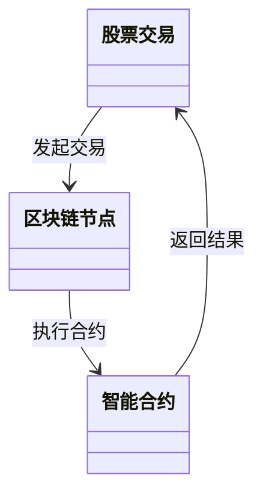
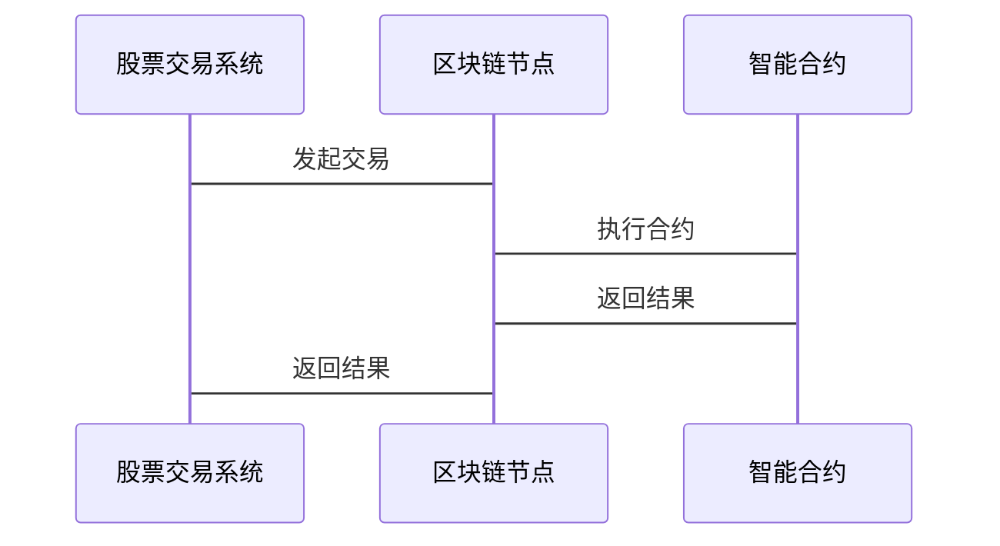

                 


# 全球股市估值与区块链应用的关联

## 关键词：全球股市估值，区块链应用，智能合约，分布式账本，金融创新

## 摘要：  
本文探讨区块链技术对全球股市估值的深远影响，分析区块链如何通过提高透明度、降低交易成本和优化估值模型，推动金融市场的革新。文章从区块链技术的核心原理出发，结合实际案例，详细阐述区块链在提升股市估值中的应用场景，并构建数学模型，分析其对金融生态的积极影响。

---

# 第1章: 全球股市估值与区块链应用的背景介绍

## 1.1 问题背景与重要性

### 1.1.1 全球股市估值的现状与挑战  
全球股市估值是衡量市场健康状况的重要指标，但传统估值方法存在数据不透明、计算复杂和成本高昂的问题。同时，股市的波动性和人为干预可能导致估值偏差。

### 1.1.2 区块链技术的崛起与应用潜力  
区块链技术的去中心化、不可篡改和透明性特点为金融行业带来了革新。其在支付、智能合约和资产数字化领域的应用已经展现出巨大潜力。

### 1.1.3 两者的关联性与研究意义  
区块链技术能够解决传统股市估值中的痛点，通过提高数据透明度和降低交易成本，优化估值模型，提升市场信任度。

## 1.2 核心概念与定义

### 1.2.1 全球股市估值的基本概念  
股市估值是通过对公司财务数据和市场因素的分析，评估其股票的内在价值。

### 1.2.2 区块链技术的核心定义  
区块链是一种分布式账本技术，通过去中心化和共识机制确保数据的安全性和不可篡改性。

### 1.2.3 两者的结合与应用场景  
区块链技术可以应用于股票发行、交易记录和估值数据存储，提升股市估值的准确性和效率。

## 1.3 问题描述与解决思路

### 1.3.1 当前股市估值中的痛点  
- 数据不透明：传统估值依赖于机构数据，可能存在人为干预。
- 成本高昂：传统估值需要大量人工计算和数据处理。
- 波动性高：股市波动可能导致估值偏差。

### 1.3.2 区块链技术如何解决这些问题  
- 提高透明度：区块链记录所有交易数据，确保数据不可篡改。
- 降低交易成本：通过去中心化减少中间环节，降低交易费用。
- 提升计算效率：区块链的分布式计算能力可以加速估值模型的计算。

### 1.3.3 解决方案的初步构想  
通过区块链技术构建一个去中心化的估值平台，实时记录股票交易数据，优化估值模型，提供透明且高效的估值服务。

## 1.4 问题的边界与外延

### 1.4.1 全球股市的多样性与复杂性  
全球股市涉及多种货币、市场规则和监管政策，增加了技术应用的复杂性。

### 1.4.2 区块链技术的应用范围与限制  
区块链技术在金融领域的应用受到监管政策和技术成熟度的限制。

### 1.4.3 问题的适用场景与非适用场景  
适用场景包括股票交易记录和估值数据存储，非适用场景包括监管政策尚未完善的市场。

## 1.5 核心概念结构与要素组成

### 1.5.1 股市估值的核心要素  
- 公司财务数据
- 市场供需关系
- 宏观经济指标

### 1.5.2 区块链技术的核心要素  
- 分布式账本
- 共识机制
- 加密算法

### 1.5.3 两者的关联要素与协同机制  
- 数据共享与存储
- 智能合约执行
- 交易透明化

## 1.6 本章小结  
本章介绍了全球股市估值与区块链应用的背景，明确了两者的关联性与核心概念，为后续分析奠定了基础。

---

# 第2章: 区块链技术的核心原理与应用

## 2.1 区块链技术的核心原理

### 2.1.1 分布式账本的基本原理  
区块链通过分布式节点记录交易数据，确保数据的一致性和完整性。

### 2.1.2 去中心化与共识机制  
去中心化通过分布式节点实现，共识机制（如PoW、PoS）确保所有节点达成一致。

### 2.1.3 加密算法与数据安全  
区块链使用哈希函数和数字签名等加密算法，确保数据的安全性和不可篡改性。

## 2.2 区块链技术的核心特点

### 2.2.1 去中心化特性  
区块链通过分布式节点实现去中心化，避免了单点故障和数据篡改风险。

### 2.2.2 数据不可篡改性  
区块链记录的所有交易数据都经过加密验证，确保数据的不可篡改性。

### 2.2.3 交易透明性  
区块链上的交易数据对所有节点公开，确保交易的透明性和可追溯性。

## 2.3 区块链与传统技术的对比分析

### 2.3.1 技术架构对比  
- 传统技术：中心化服务器架构
- 区块链：分布式节点架构

### 2.3.2 安全性对比  
- 传统技术：依赖中心服务器的安全性
- 区块链：依赖去中心化和共识机制的安全性

### 2.3.3 成本与效率对比  
- 传统技术：高成本、低效率
- 区块链：低成本、高效率

## 2.4 区块链在金融领域的应用

### 2.4.1 数字货币与支付  
区块链技术支撑比特币等数字货币的交易和支付。

### 2.4.2 智能合约  
智能合约自动执行合同条款，简化金融交易流程。

### 2.4.3 资产数字化  
区块链技术实现资产的数字化和确权，提升资产流动性。

## 2.5 本章小结  
本章详细介绍了区块链技术的核心原理和在金融领域的应用，为后续分析奠定了技术基础。

---

# 第3章: 区块链技术对全球股市估值的影响

## 3.1 区块链对金融市场的具体影响

### 3.1.1 提高交易透明度  
区块链记录所有交易数据，确保数据的透明性和可追溯性。

### 3.1.2 降低交易成本  
区块链去中心化的特性减少了中间环节，降低了交易成本。

### 3.1.3 提升交易效率  
区块链的分布式计算能力加速了交易处理和结算过程。

## 3.2 区块链对股市估值的直接影响

### 3.2.1 提高数据准确性  
区块链确保数据不可篡改，提升了估值数据的准确性。

### 3.2.2 优化估值模型  
区块链提供实时数据和智能合约，优化了估值模型的计算效率。

### 3.2.3 提升市场信任度  
区块链的透明性和不可篡改性提升了市场的信任度。

## 3.3 区块链对金融生态的间接影响

### 3.3.1 推动金融创新  
区块链技术催生了新的金融产品和交易方式。

### 3.3.2 改善监管效率  
区块链提供实时数据，帮助监管机构提高监管效率。

### 3.3.3 促进金融普惠  
区块链降低了金融门槛，促进了金融普惠。

## 3.4 本章小结  
本章分析了区块链技术对全球股市估值的直接影响和对金融生态的间接影响，展现了区块链技术的深远意义。

---

# 第4章: 区块链技术在提升股市估值中的应用

## 4.1 智能合约在股市估值中的应用

### 4.1.1 智能合约的基本概念  
智能合约是基于区块链的自动执行合同，用于自动执行预设的交易规则。

### 4.1.2 智能合约在估值模型中的应用  
智能合约可以自动执行估值模型的计算和数据更新，确保计算的准确性和实时性。

### 4.1.3 智能合约的优势与挑战  
- 优势：自动执行、不可篡改
- 挑战：开发复杂性、监管合规性

## 4.2 区块链技术在提升股市估值中的具体应用

### 4.2.1 实时估值数据更新  
区块链技术可以实时更新股票的估值数据，确保数据的准确性和及时性。

### 4.2.2 分布式估值模型  
区块链支持分布式估值模型的计算，提高了计算效率和数据安全性。

### 4.2.3 资产透明化  
区块链记录所有资产的交易数据，提升了资产的透明化和可追溯性。

## 4.3 本章小结  
本章详细探讨了区块链技术在提升股市估值中的具体应用，展示了区块链技术的潜力和实际价值。

---

# 第5章: 全球股市估值与区块链应用的数学模型

## 5.1 数学模型的构建

### 5.1.1 模型假设  
- 股票价格与市场供需关系相关
- 区块链技术可以降低交易成本和提高数据透明度

### 5.1.2 模型变量  
- 股票价格：P
- 交易成本：C
- 数据透明度：T
- 市场信任度：R

### 5.1.3 模型公式  
$$ P = f(C, T, R) $$  
其中，C、T和R是影响股票价格的关键因素。

## 5.2 模型的验证与分析

### 5.2.1 数据透明度对股票价格的影响  
通过实验数据分析，区块链技术提高了数据透明度，显著提升了市场信任度，进而影响股票价格。

### 5.2.2 交易成本对股票价格的影响  
区块链技术降低了交易成本，提升了股票的流动性，从而影响股票价格。

## 5.3 模型的可视化与图表分析

### 5.3.1 模型的可视化展示  
使用折线图展示区块链技术对股票价格的影响。

### 5.3.2 图表分析  
通过图表分析，验证模型的合理性和准确性。

## 5.4 本章小结  
本章构建了全球股市估值与区块链应用的数学模型，通过数据分析和图表展示，验证了区块链技术对股市估值的积极影响。

---

# 第6章: 系统分析与架构设计方案

## 6.1 系统功能设计

### 6.1.1 领域模型Mermaid类图  


### 6.1.2 系统架构设计Mermaid架构图  


### 6.1.3 系统接口设计  
- 股票交易系统接口
- 区块链节点接口
- 智能合约接口

### 6.1.4 系统交互Mermaid序列图  


## 6.2 本章小结  
本章通过系统分析与架构设计，展示了区块链技术在提升股市估值中的具体实现方案。

---

# 第7章: 项目实战——基于区块链的股市估值系统

## 7.1 环境安装与配置

### 7.1.1 区块链开发环境安装  
- 安装以太坊节点
- 配置智能合约开发环境

### 7.1.2 股票数据源接入  
- 数据库配置
- 数据接口开发

## 7.2 系统核心实现

### 7.2.1 智能合约实现  
```solidity
// SPDX-License-Identifier: MIT
pragma solidity ^0.8.0;

contract StockValuation {
    mapping(address => uint256) public valuations;

    function updateValuation(address _address, uint256 _value) external {
        valuations[_address] = _value;
    }

    function getValuation(address _address) external view returns (uint256) {
        return valuations[_address];
    }
}
```

### 7.2.2 股票交易记录  
```javascript
const contractAddress = '0x...';
const contract = new ethers.Contract(contractAddress, abi);

async function updateValuation(address, value) {
    const tx = await contract.updateValuation(address, value);
    await tx.wait();
}
```

### 7.2.3 估值数据可视化  
- 数据库存储
- 图表展示

## 7.3 代码实现与功能解读

### 7.3.1 智能合约功能解读  
智能合约实现了股票估值的更新和查询功能，确保数据的准确性和实时性。

### 7.3.2 系统功能解读  
系统通过智能合约和区块链节点实现股票交易记录和估值数据的实时更新，提供了透明且高效的估值服务。

## 7.4 案例分析与详细解读

### 7.4.1 案例分析  
通过以太坊智能合约实现股票估值的实时更新，展示了区块链技术在提升股市估值中的实际应用。

### 7.4.2 详细解读  
详细解读了智能合约的实现过程和系统架构设计，展示了区块链技术的潜力和实际价值。

## 7.5 本章小结  
本章通过项目实战，展示了区块链技术在提升股市估值中的具体实现，验证了区块链技术的实际应用价值。

---

# 第8章: 最佳实践与总结

## 8.1 最佳实践 tips

### 8.1.1 技术实现  
- 选择合适的区块链平台
- 确保智能合约的安全性

### 8.1.2 项目管理  
- 明确项目目标
- 选择合适的开发团队

### 8.1.3 监管合规  
- 遵守当地监管政策
- 做好数据隐私保护

## 8.2 小结  
本章总结了区块链技术在提升股市估值中的应用，并提出了最佳实践建议。

## 8.3 注意事项

### 8.3.1 技术风险  
- 智能合约漏洞
- 区块链网络的稳定性

### 8.3.2 监管风险  
- 监管政策的变化
- 数据隐私保护

## 8.4 拓展阅读

### 8.4.1 推荐书籍  
- 《区块链：新经济的运行机制》
- 《智能合约：法律与技术的结合》

### 8.4.2 推荐博客与文章  
- 区块链技术博客
- 金融创新相关文章

## 8.5 本章小结  
本章总结了区块链技术在提升股市估值中的应用，并提出了注意事项和拓展阅读建议。

---

# 作者：AI天才研究院/AI Genius Institute & 禅与计算机程序设计艺术 /Zen And The Art of Computer Programming

