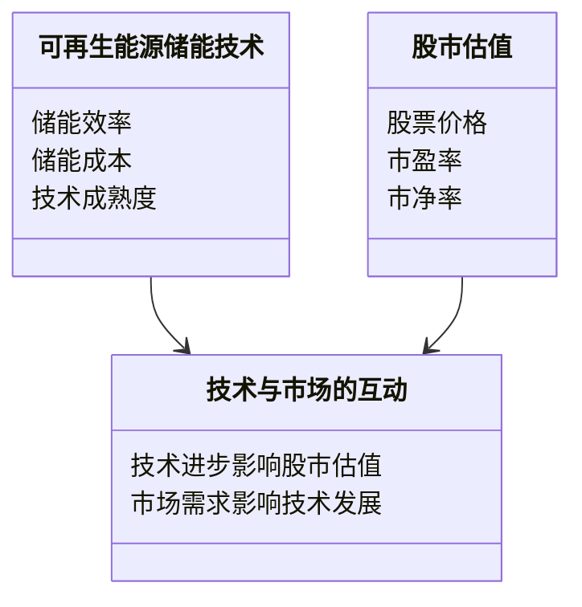
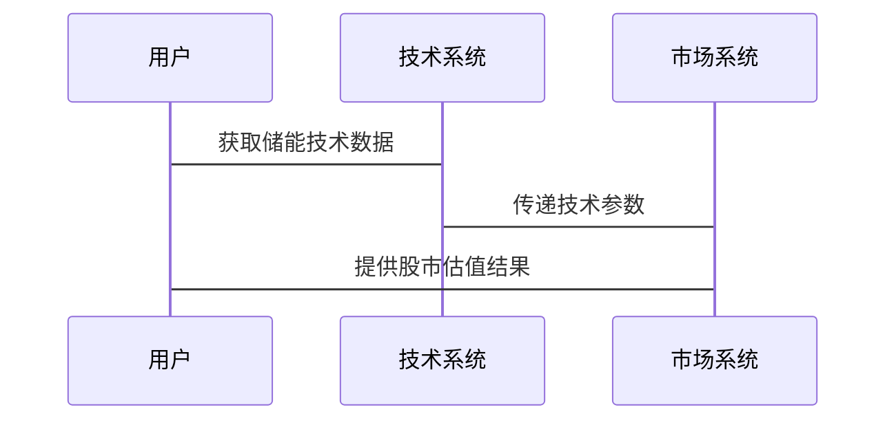

                 


# 全球股市估值与可再生能源储能技术的关系

> 关键词：全球股市估值、可再生能源、储能技术、能源转型、技术经济性、市场影响、投资策略

> 摘要：本文探讨全球股市估值与可再生能源储能技术之间的关系，分析储能技术如何影响企业价值和股市估值，以及股市如何反映技术进步和市场需求。通过系统分析和实际案例，揭示技术与市场的互动机制，并为企业投资和政策制定提供参考。

---

## 第一部分：全球股市估值与可再生能源储能技术的背景与核心概念

### 第1章：全球股市估值与可再生能源储能技术的关系概述

#### 1.1 背景介绍

##### 1.1.1 问题背景
- **全球能源结构转型的背景**：全球能源需求增长与环境压力促使能源结构向清洁化、可再生能源方向转型。
- **可再生能源发展的挑战与机遇**：可再生能源技术的进步和成本下降推动其广泛应用，但也面临储能技术不足的问题。
- **股市估值与能源技术发展的关联性**：股市作为经济晴雨表，其估值受技术创新、市场需求和政策变化的影响。

##### 1.1.2 问题描述
- **可再生能源储能技术的现状与未来**：当前储能技术面临效率和成本瓶颈，未来有望通过技术突破实现大规模应用。
- **股市估值的核心影响因素**：包括公司盈利能力、行业前景、政策支持和技术创新。
- **能源技术对经济和市场的双重影响**：技术创新推动行业发展，同时行业进步影响股市估值。

##### 1.1.3 问题解决
- **可再生能源储能技术如何影响企业价值**：通过提升能源效率和降低成本，增强企业的市场竞争力。
- **股市估值如何反映技术进步**：技术进步通过企业盈利能力和成长潜力影响股票价值。
- **技术与市场的互动关系**：技术推动市场发展，市场反馈促进技术优化。

##### 1.1.4 边界与外延
- **可再生能源储能技术的定义与范围**：涵盖电池储能、压缩空气储能等技术。
- **股市估值的适用范围与限制**：适用于公开上市公司，受限于信息不透明和市场情绪。
- **技术与市场的边界条件**：技术成熟度、政策支持和市场需求是关键变量。

##### 1.1.5 核心概念结构与组成
- **核心概念的组成要素**：技术（储能技术）和市场（股市估值）。
- **技术与市场的相互作用机制**：技术进步推动市场需求增长，市场需求反哺技术创新。
- **估值模型的核心要素**：现金流、市盈率、市净率等。

---

## 第二部分：可再生能源储能技术的核心原理与特征

### 第2章：可再生能源储能技术的核心原理与特征

#### 2.1 核心原理

##### 2.1.1 储能技术的基本原理
- **储能技术的分类与基本原理**：物理储能（抽水蓄能、压缩空气储能）、化学储能（电池储能）、热储能等。
- **储能效率的计算公式**：储能系统效率 = 输出能量 / 输入能量 × 100%。
- **储能成本的构成与影响因素**：设备成本、维护成本、能源价格等。

##### 2.1.2 储能技术的数学模型与公式
- **储能系统的能量平衡方程**：输入能量 = 输出能量 + 损失能量。
- **储能系统的成本模型**：总成本 = 初始投资 + 运行成本 + 维护成本。

#### 2.2 核心概念属性对比

##### 2.2.1 可再生能源与传统能源的对比
- **能源类型对比**：可再生能源（风能、太阳能） vs 传统能源（化石燃料）。
- **能源稳定性对比**：可再生能源间歇性 vs 传统能源稳定性。
- **能源成本对比**：可再生能源初期投资高，但运营成本低；传统能源初期投资低，但运营成本高。

##### 2.2.2 储能技术与传统储能方式的对比
- **技术原理对比**：电池储能 vs 机械储能。
- **成本效率对比**：电池储能成本下降快，机械储能成本相对稳定。
- **应用场景对比**：电池储能适用于分布式能源，机械储能适用于大规模储能。

---

## 第三部分：股市估值的核心原理与方法

### 第3章：股市估值的核心原理与方法

#### 3.1 股市估值的基本原理

##### 3.1.1 股票价值的定义
- **股票的内在价值与市场价值**：内在价值由公司基本面决定，市场价值受供需关系影响。
- **股票价值的计算公式**：内在价值 = 现金流折现值 + 股权价值。

##### 3.1.2 股票估值方法
- **市盈率法**：市盈率 = 股价 / 每股收益。
- **市净率法**：市净率 = 股价 / 每股净资产。
- **现金流折现法**：将未来现金流折现为当前价值。

#### 3.2 股市估值的核心影响因素

##### 3.2.1 宏观经济因素
- **经济周期对股市的影响**：经济增长推动股市上涨，经济衰退导致股市下跌。
- **利率政策对股市的影响**：低利率环境有利于股市上涨，高利率环境抑制股市。

##### 3.2.2 行业因素
- **行业周期对股市的影响**：行业处于成长期时，股市估值较高；行业处于衰退期时，股市估值较低。
- **行业政策对股市的影响**：政策支持推动行业增长，政策收紧抑制行业增长。

---

## 第四部分：可再生能源储能技术对股市估值的影响

### 第4章：可再生能源储能技术对股市估值的影响

#### 4.1 技术进步对股市估值的影响

##### 4.1.1 储能技术进步对能源公司的影响
- **技术进步对企业利润的影响**：技术创新降低成本，提升利润率。
- **技术进步对行业竞争力的影响**：技术领先企业获得竞争优势。

##### 4.1.2 技术进步对股市估值的影响
- **技术进步如何影响股票价格**：技术创新提升市场预期，推动股价上涨。
- **技术进步如何影响股票估值**：技术创新增强企业未来盈利能力，提高股票估值。

#### 4.2 市场需求对股市估值的影响

##### 4.2.1 可再生能源需求的增长
- **全球能源需求的变化**：可再生能源需求快速增长，传统能源需求逐步下降。
- **可再生能源需求的增长趋势**：政策支持和环保需求推动可再生能源市场扩大。

##### 4.2.2 储能技术市场需求的影响
- **储能技术市场需求对股市的影响**：市场需求增加推动企业收入增长，提升股价。
- **市场需求变化对股票估值的影响**：市场需求变化影响企业未来现金流，影响股票估值。

---

## 第五部分：可再生能源储能技术对能源转型的影响

### 第5章：可再生能源储能技术对能源转型的影响

#### 5.1 能源转型的背景与目标

##### 5.1.1 全球能源转型的背景
- **环境保护的需求**：减少碳排放，应对气候变化。
- **可持续发展的目标**：推动绿色能源发展，实现可持续经济增长。

##### 5.1.2 能源转型的核心目标
- **减少化石能源依赖**：通过发展可再生能源降低对化石能源的依赖。
- **提高能源效率**：通过技术创新提升能源利用效率。

#### 5.2 可再生能源与储能技术的协同发展

##### 5.2.1 可再生能源与储能技术的协同发展
- **可再生能源与储能技术的互补性**：可再生能源需要储能技术解决间歇性问题。
- **储能技术对可再生能源发展的支撑作用**：储能技术保障可再生能源稳定供应。

##### 5.2.2 能源转型中的技术与市场互动
- **技术进步推动能源转型**：技术创新降低可再生能源成本，提升储能效率。
- **市场发展促进技术进步**：市场需求推动企业技术创新和产品优化。

---

## 第六部分：系统分析与架构设计方案

### 第6章：系统分析与架构设计方案

#### 6.1 问题场景介绍
- **问题背景**：可再生能源储能技术的市场需求与技术瓶颈。
- **项目目标**：分析储能技术对股市估值的影响，构建技术与市场互动模型。

#### 6.2 项目介绍
- **项目名称**：全球股市估值与可再生能源储能技术关系分析。
- **项目目标**：构建技术与市场互动模型，评估储能技术对股市估值的影响。

#### 6.3 系统功能设计（领域模型）

##### 6.3.1 领域模型设计


#### 6.4 系统架构设计

##### 6.4.1 系统架构设计


#### 6.5 系统接口设计
- **技术接口**：储能技术参数接口，用于数据采集和分析。
- **市场接口**：股市数据接口，用于获取股票价格和估值指标。

#### 6.6 系统交互设计

##### 6.6.1 交互流程


---

## 第七部分：项目实战

### 第7章：项目实战

#### 7.1 环境安装

##### 7.1.1 环境需求
- **软件工具**：Python、数据分析工具、可视化工具。
- **数据来源**：公开股票数据、可再生能源储能技术数据。

#### 7.2 核心实现源代码

##### 7.2.1 数据分析代码
```python
import pandas as pd
import numpy as np

# 假设data为包含股票数据和储能技术数据的DataFrame
data = pd.DataFrame({
    '股票代码': ['AAPL', 'TSLA', 'GOOGL'],
    '股价': [100, 800, 2000],
    '储能技术投资': [10, 500, 300],
    '储能技术收益': [5, 200, 150]
})

# 计算储能技术对股价的影响
data['股价影响'] = data['储能技术收益'] / data['储能技术投资'] * data['股价']
print(data)
```

##### 7.2.2 估值模型代码
```python
def calculate_valuation(stock_price, eps):
    return stock_price / eps

# 示例计算
data['市盈率'] = calculate_valuation(data['股价'], data['每股收益'])
print(data)
```

#### 7.3 应用解读与分析
- **案例分析**：以特斯拉为例，分析储能技术对其股价的影响。
- **数据可视化**：绘制储能技术投资与股价增长的散点图，分析相关性。

#### 7.4 项目小结
- **储能技术对股市估值的影响**：储能技术的突破推动股价增长，技术创新是关键驱动力。
- **股市对技术发展的反馈作用**：股市估值的提升为技术发展提供资金支持。

---

## 第八部分：总结与最佳实践

### 第8章：总结与最佳实践

#### 8.1 核心结论
- **储能技术对股市估值的核心影响**：技术创新和市场需求是主要驱动力。
- **股市对储能技术发展的反馈作用**：股市估值为技术发展提供资金支持。

#### 8.2 最佳实践 tips
- **技术与市场的双向互动**：企业应关注技术进步和市场需求，制定灵活的投资策略。
- **风险管理**：投资者应关注政策变化和技术风险，分散投资以降低风险。

#### 8.3 注意事项
- **技术风险**：储能技术尚不成熟，存在技术瓶颈。
- **市场波动**：股市估值受多种因素影响，需关注宏观经济和行业政策。

#### 8.4 拓展阅读
- **相关书籍**：《可再生能源与储能技术》、《股市估值与投资策略》。
- **学术论文**：储能技术对经济影响的相关研究。

---

## 作者：AI天才研究院/AI Genius Institute & 禅与计算机程序设计艺术 /Zen And The Art of Computer Programming

---

**注**：以上目录大纲仅为内容框架，实际撰写时需根据具体数据和案例进行补充和调整。

