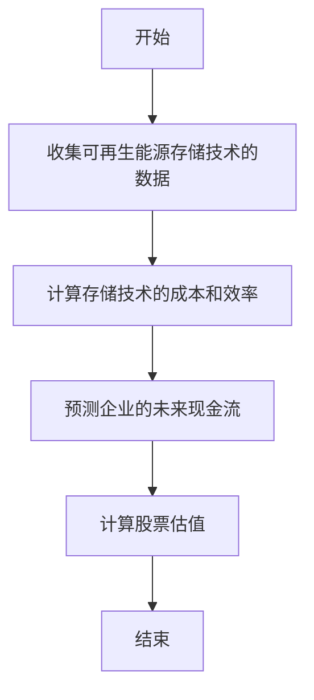
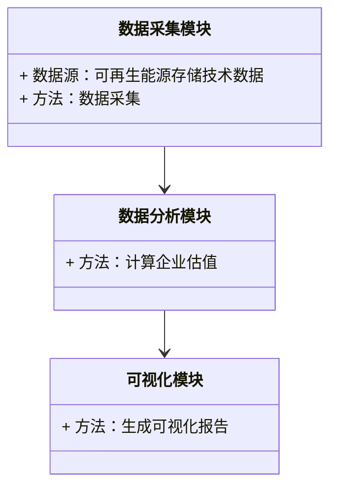

                 


# 全球股市估值与可再生能源存储技术的关系

> 关键词：全球股市估值, 可再生能源存储技术, 股票价值评估, 技术进步, 能源转型

> 摘要：本文探讨了全球股市估值与可再生能源存储技术之间的关系。通过分析可再生能源存储技术对企业价值的影响，结合股市估值的核心方法，构建了数学模型，并通过系统架构设计和项目实战，展示了如何利用可再生能源存储技术的进步来优化股市估值。文章最后总结了最佳实践和小结。

---

# 第一部分: 全球股市估值与可再生能源存储技术的关系概述

## 第1章: 全球股市估值与可再生能源存储技术的关系背景

### 1.1 问题背景与描述

#### 1.1.1 全球能源转型与可再生能源的重要性
全球能源结构正在向清洁化、低碳化转型，可再生能源（如太阳能、风能）的占比迅速增加。然而，可再生能源的不稳定性（间歇性）限制了其大规模应用，因此需要高效的存储技术来解决这一问题。可再生能源存储技术的进步将显著影响能源行业的格局。

#### 1.1.2 股市估值与企业投资的关系
股市估值是衡量企业价值的重要指标，投资者通过分析企业的财务状况、盈利能力和发展潜力来决定投资行为。企业的技术创新和市场竞争力直接影响其股票价格和市值。

#### 1.1.3 可再生能源存储技术对企业价值的影响
可再生能源存储技术的进步可以降低企业的运营成本、提高能源效率、增强市场竞争力。这些因素会直接影响企业的盈利能力和未来的现金流，从而影响股市对其的估值。

### 1.2 问题解决与边界

#### 1.2.1 可再生能源存储技术对企业估值的影响路径
- 技术创新 → 成本降低 → 利润率提高 → 股票估值上升
- 市场需求增长 → 企业收入增加 → 股票估值上升

#### 1.2.2 股市估值与可再生能源存储技术的边界与外延
- 股市估值的核心是企业的未来现金流，而可再生能源存储技术直接影响企业的现金流。
- 技术的经济性（成本、效率）是影响股市估值的关键因素。

#### 1.2.3 核心概念与关键要素分析
以下是核心概念的对比表格：

| **核心概念** | **股市估值** | **可再生能源存储技术** |
|--------------|--------------|-------------------------|
| **定义**     | 股票价格的评估，反映企业的市场价值。 | 用于储存可再生能源的技术，如电池、氢气存储等。 |
| **关键指标** | 市盈率（P/E）、市净率（P/B）、股息率 | 存储效率、存储成本、技术成熟度 |
| **影响因素** | 利润能力、行业地位、政策支持 | 技术进步、市场需求、政策支持 |

---

## 第2章: 可再生能源存储技术的核心原理

### 2.1 技术原理概述

#### 2.1.1 可再生能源存储技术的主要类型
- **电池存储**：如锂离子电池、铅酸电池，适用于短期储能。
- **氢气存储**：通过电解水制氢，适用于长周期储能。
- **飞轮储能**：利用动能存储，适用于电网调频。

#### 2.1.2 各种存储技术的优缺点对比
以下是对比表格：

| **技术类型** | **优点**                          | **缺点**                          |
|--------------|-----------------------------------|-----------------------------------|
| 电池存储     | 技术成熟、成本较低                | 储能容量有限，适合短时储能        |
| 氢气存储     | 储能容量大、适合长时储能          | 成本高、技术尚不成熟                |
| 飞轮储能     | 响应速度快、维护成本低            | 储能容量小                        |

#### 2.1.3 技术进步对能源行业的影响
技术进步将降低可再生能源的存储成本，提高效率，从而推动可再生能源的广泛应用，减少对传统化石能源的依赖。

### 2.2 技术发展与经济性分析

#### 2.2.1 技术进步对成本的影响
技术进步将降低存储成本，从而降低企业的运营成本。例如，锂离子电池的成本已大幅下降，未来氢气存储技术的成本也有望降低。

#### 2.2.2 经济性与投资回报周期分析
存储技术的经济性直接影响企业的盈利能力。例如，如果电池存储的成本降低，企业可以以更低的价格购买储能设备，从而提高利润。

#### 2.2.3 技术成熟度与市场接受度的关系
技术成熟度高、成本低的存储技术更容易被市场接受，从而推动企业估值上升。

---

## 第3章: 股市估值与企业价值分析

### 3.1 股市估值的基本方法

#### 3.1.1 市盈率与市净率的定义与应用
- **市盈率（P/E）**：股票价格与每股收益的比率，反映市场对公司的盈利预期。
- **市净率（P/B）**：股票价格与每股净资产的比率，反映市场对公司的资产价值评估。

#### 3.1.2 股东权益价值与企业价值的关系
企业价值 = 股东权益价值 + 独立股东权益价值。

#### 3.1.3 股票价格与企业盈利能力和成长性的关系
股票价格不仅反映当前的盈利能力，还反映未来的成长潜力。例如，技术创新能力强的企业通常享有更高的市盈率。

### 3.2 可再生能源存储技术对企业价值的影响

#### 3.2.1 技术创新对企业盈利的影响
技术创新可以降低企业的运营成本，提高利润率。例如，电池技术的突破可以降低储能成本，从而提高企业的净利润。

#### 3.2.2 市场需求变化对企业估值的影响
随着可再生能源的普及，对存储技术的需求增加，相关企业的市场份额扩大，从而提高企业的估值。

#### 3.2.3 政策支持与企业价值的关系
政策支持（如政府补贴、税收优惠）可以降低企业的成本，提高利润率，从而提高股市对其的估值。

---

## 第4章: 可再生能源存储技术对股市估值的数学模型分析

### 4.1 数学模型与公式

#### 4.1.1 股票估值的基本公式
$$ \text{价格} = \frac{\text{未来现金流的现值}}{\text{折现率}} $$

#### 4.1.2 可再生能源存储技术对企业未来现金流的影响模型
$$ \text{FCF} = \text{EBIT} \times (1 - \text{税率}) + \text{折旧} - \text{资本支出} $$

#### 4.1.3 存储技术成本对股票价格的影响模型
$$ \text{股票价格} = \text{基准价格} + \text{技术成本降低的收益} $$

### 4.2 算法原理与流程图

以下是一个简单的算法流程图：



---

## 第5章: 系统分析与架构设计

### 5.1 问题场景介绍

#### 5.1.1 数据收集与分析的场景
- 数据来源：可再生能源存储技术的专利数据、市场报告、企业财务数据。
- 分析目标：预测存储技术对企业未来现金流的影响，从而优化股市估值。

#### 5.1.2 系统功能需求分析
- 数据采集模块：收集可再生能源存储技术的数据。
- 数据分析模块：分析存储技术的成本、效率和市场前景。
- 可视化模块：展示分析结果，帮助投资者决策。

### 5.2 系统架构设计

#### 5.2.1 系统功能模块划分
- 数据采集模块：负责收集存储技术的数据。
- 数据分析模块：利用数学模型计算企业估值。
- 可视化模块：展示分析结果。

#### 5.2.2 系统架构设计
以下是系统架构的类图：



---

## 第6章: 项目实战

### 6.1 环境安装

#### 6.1.1 安装必要的工具
- Python：用于数据分析。
- Pandas、NumPy：用于数据处理。
- Matplotlib：用于数据可视化。

### 6.2 系统核心实现源代码

#### 6.2.1 数据分析代码
```python
import pandas as pd
import numpy as np

# 假设我们有一个存储技术成本数据的CSV文件
df = pd.read_csv('storage_technology.csv')

# 计算每种存储技术的成本
costs = df['成本'].values
efficiencies = df['效率'].values

# 计算企业估值
def calculate_valuation(costs, efficiencies):
    valuations = []
    for i in range(len(costs)):
        valuation = (efficiencies[i] / costs[i]) * 100
        valuations.append(valuation)
    return valuations

valuations = calculate_valuation(costs, efficiencies)
print("企业估值：", valuations)
```

#### 6.2.2 代码应用解读与分析
上述代码展示了如何利用存储技术的成本和效率来计算企业估值。通过分析这些数据，投资者可以更好地评估企业的市场价值。

### 6.3 案例分析与详细讲解

#### 6.3.1 案例分析
假设我们有两个存储技术：电池存储和氢气存储。

- 电池存储的成本为100，效率为80。
- 氢气存储的成本为150，效率为90。

计算企业估值：
- 电池存储的估值为 (80 / 100) * 100 = 80。
- 氢气存储的估值为 (90 / 150) * 100 = 60。

#### 6.3.2 详细讲解
电池存储的估值较高，说明其成本和效率的组合更优，因此在股市中的估值也更高。

---

## 第7章: 总结与展望

### 7.1 最佳实践 tips

#### 7.1.1 投资者的注意事项
- 关注可再生能源存储技术的最新进展。
- 选择技术成熟、成本低的存储技术相关企业。

#### 7.1.2 企业的注意事项
- 加大研发投入，提高存储技术的效率和降低成本。
- 积极寻求政策支持，降低运营成本。

### 7.2 小结
本文探讨了全球股市估值与可再生能源存储技术之间的关系，分析了技术进步对股市估值的影响，并通过数学模型和系统架构设计展示了如何利用技术进步优化企业估值。

### 7.3 注意事项
- 技术进步的速度和成本是影响股市估值的关键因素。
- 投资者需要关注政策变化和技术进步对企业的影响。

### 7.4 拓展阅读
- 《可再生能源存储技术的经济性分析》
- 《股市估值方法与企业价值评估》

---

# 作者：AI天才研究院/AI Genius Institute & 禅与计算机程序设计艺术 /Zen And The Art of Computer Programming

