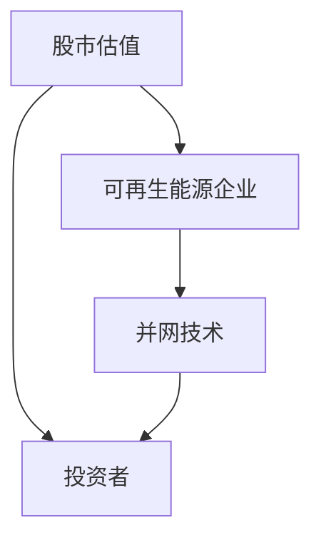
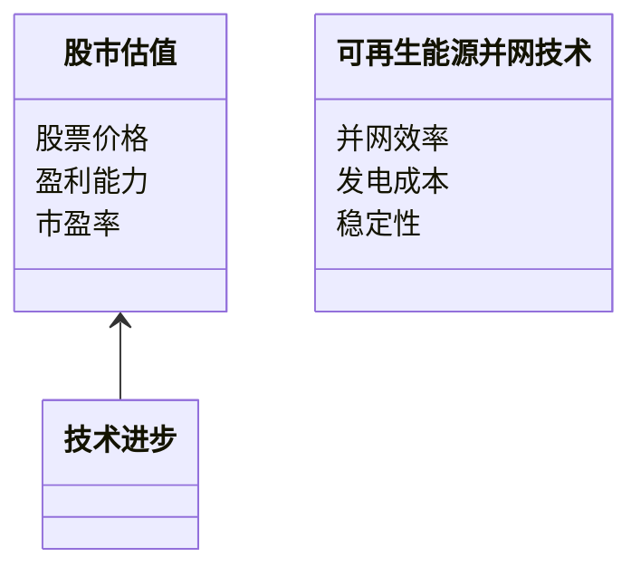
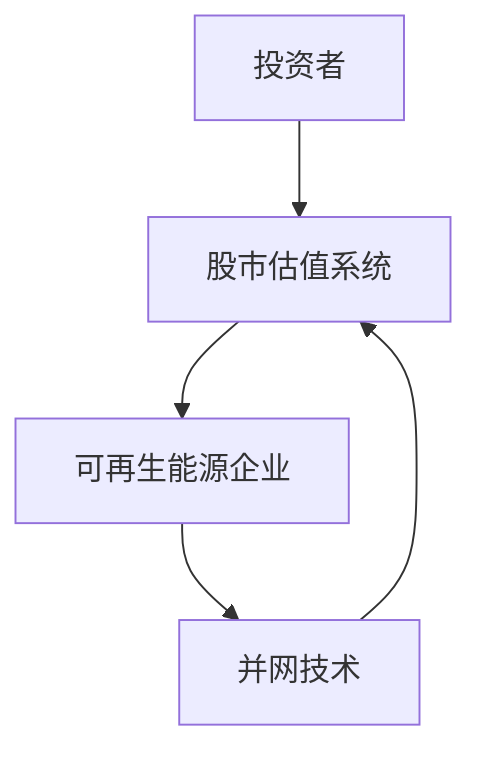

                 


# 全球股市估值与可再生能源并网技术的关系

> 关键词：全球股市估值、可再生能源并网技术、股市与能源技术关系、投资价值分析、技术进步对股市影响

> 摘要：本文探讨了全球股市估值与可再生能源并网技术之间的相互关系。通过分析股市估值的核心概念、可再生能源并网技术的特点，以及两者之间的联系，揭示了技术进步对股市估值的影响。同时，本文通过实际案例分析，展示了可再生能源并网技术对股市投资价值的提升作用，为投资者和政策制定者提供了重要的参考。

---

# 第一部分: 全球股市估值与可再生能源并网技术的关系概述

## 第1章: 引言

### 1.1 研究背景与意义
#### 1.1.1 全球股市估值的重要性
股市估值是衡量企业价值的重要指标，直接影响投资者的决策和市场的稳定性。随着全球经济的转型，绿色能源逐渐成为投资热点，可再生能源并网技术的发展也为股市带来了新的增长点。

#### 1.1.2 可再生能源并网技术的发展现状
可再生能源（如风能、太阳能）的并网技术是实现清洁能源高效利用的关键。随着技术的进步，可再生能源在电网中的占比越来越高，这不仅推动了能源结构的优化，也对股市估值产生了重要影响。

#### 1.1.3 两者关系的研究价值
研究股市估值与可再生能源并网技术的关系，有助于投资者更好地把握绿色能源的投资机会，同时为政策制定者提供科学依据，推动能源结构的优化和可持续发展。

### 1.2 研究目的与方法
#### 1.2.1 研究目标的设定
本文旨在分析可再生能源并网技术对股市估值的影响，揭示两者之间的内在联系，并提出相应的投资策略。

#### 1.2.2 研究方法的选择
本文采用理论分析与实证研究相结合的方法，结合数学模型和实际案例，深入探讨两者的相互作用。

#### 1.2.3 数据来源与分析框架
数据来源包括全球股市数据、可再生能源企业财务数据以及相关政策文件。分析框架基于加权平均收益率模型和市盈率、市净率等估值指标，结合可再生能源并网技术的效率和成本数据进行综合分析。

### 1.3 本章小结
本章主要介绍了研究的背景、意义和方法，为后续分析奠定了基础。

---

# 第二部分: 核心概念与理论基础

## 第2章: 全球股市估值的核心概念

### 2.1 股市估值的基本原理
#### 2.1.1 股票估值的定义与方法
股票估值是通过对企业未来现金流的折现，评估其内在价值的过程。常见的估值方法包括市盈率（P/E）、市净率（P/B）和股息率等。

#### 2.1.2 主要估值模型介绍
- **加权平均收益率模型**：$$ R = \sum_{i=1}^{n} w_i R_i $$
  其中，\( R \) 表示加权平均收益率，\( w_i \) 表示第 \( i \) 个资产的权重，\( R_i \) 表示第 \( i \) 个资产的收益率。
- **市盈率与市净率的计算公式**
  - $$ P/E = \frac{Price}{Earnings} $$
  - $$ P/B = \frac{Price}{Book\ Value} $$

#### 2.1.3 影响股市估值的关键因素
包括企业的盈利能力、行业地位、政策环境、宏观经济状况等。

### 2.2 可再生能源并网技术的定义与特点
#### 2.2.1 可再生能源并网的定义
可再生能源并网是指将风能、太阳能等可再生能源发电系统接入电网，实现电能的输送和分配。

#### 2.2.2 并网技术的核心特点
- 高效性：提高电能传输效率，减少能量损耗。
- 稳定性：确保电网的稳定性，避免因可再生能源波动引发的电网问题。
- 环保性：减少碳排放，推动绿色能源发展。

#### 2.2.3 可再生能源发电的技术优势
包括资源丰富、清洁环保、技术成熟等。

## 第3章: 核心概念的联系与对比

### 3.1 股市估值与可再生能源并网技术的关联性分析
#### 3.1.1 从金融角度分析可再生能源投资的估值影响
可再生能源项目的投资周期长、回报稳定，通常具有较高的市盈率和市净率，对股市估值有正向推动作用。

#### 3.1.2 可再生能源技术进步对股市估值的推动作用
技术进步降低了发电成本，提高了效率，增强了企业的盈利能力，从而提升了企业的估值。

#### 3.1.3 两者关系的动态演变
随着技术进步和政策支持，可再生能源并网技术对股市估值的影响力逐渐增强。

### 3.2 核心概念属性特征对比表
表3.1: 股市估值与可再生能源并网技术的核心属性对比

| 属性               | 股市估值                   | 可再生能源并网技术             |
|--------------------|----------------------------|-----------------------------|
| 核心目标           | 评估企业价值               | 实现清洁能源高效利用           |
| 主要影响因素       | 盈利能力、行业地位、政策   | 技术效率、成本、稳定性         |
| 发展趋势           | 绿色投资增加               | 技术创新加快                 |

### 3.3 ER实体关系图


## 第4章: 数学模型与公式解析

### 4.1 股市估值的数学模型
#### 4.1.1 加权平均收益率模型
$$ R = \sum_{i=1}^{n} w_i R_i $$

#### 4.1.2 市盈率与市净率的计算公式
$$ P/E = \frac{Price}{Earnings} $$
$$ P/B = \frac{Price}{Book\ Value} $$

### 4.2 可再生能源并网技术的数学模型
#### 4.2.1 并网效率计算公式
$$ Efficiency = \frac{输出电量}{输入电量} $$

#### 4.2.2 投资回报率模型
$$ ROI = \frac{净利润}{投资成本} \times 100\% $$

---

# 第三部分: 系统分析与架构设计

## 第5章: 系统分析与架构设计

### 5.1 问题场景介绍
随着可再生能源占比的增加，电网的稳定性受到挑战。通过优化并网技术，可以提高电网的运行效率，从而提升相关企业的估值。

### 5.2 项目介绍
本项目旨在通过分析可再生能源并网技术对股市估值的影响，构建一个综合评估模型，为企业和投资者提供参考。

### 5.3 系统功能设计
#### 5.3.1 领域模型


#### 5.3.2 系统架构设计


---

# 第四部分: 项目实战

## 第6章: 项目实战

### 6.1 环境安装
需要安装数据分析工具（如Python、Pandas）和可视化工具（如Matplotlib）。

### 6.2 核心实现源代码
以下是一个简单的估值模型代码：
```python
import pandas as pd
import matplotlib.pyplot as plt

# 假设数据
data = {
    '公司': ['公司A', '公司B'],
    '市盈率': [15, 20],
    '市净率': [2, 3],
    '并网效率': [85, 90]
}

df = pd.DataFrame(data)

# 可视化
plt.figure(figsize=(10,6))
plt.scatter(df['并网效率'], df['市盈率'])
plt.xlabel('并网效率 (%)')
plt.ylabel('市盈率')
plt.title('并网效率与市盈率的关系')
plt.show()
```

### 6.3 案例分析
以某国的风电企业为例，分析其并网技术对股市估值的影响。通过计算市盈率和市净率的变化，评估技术进步带来的估值提升。

---

# 第五部分: 最佳实践与结论

## 第7章: 最佳实践

### 7.1 总结与经验分享
通过案例分析，我们发现可再生能源并网技术的进步显著提升了企业的估值，建议投资者关注相关技术的发展。

### 7.2 注意事项
在实际操作中，需综合考虑技术、政策和市场等多方面因素，避免单一依赖技术指标。

### 7.3 拓展阅读
建议进一步研究可再生能源政策对股市估值的影响，以及新技术（如储能技术）对并网效率的提升作用。

## 第8章: 结论

本文通过分析全球股市估值与可再生能源并网技术的关系，揭示了技术进步对股市估值的正向影响。通过实际案例和数学模型，为投资者和政策制定者提供了重要的参考。未来的研究可以进一步探索更多技术与金融的交叉领域，推动绿色能源的可持续发展。

---

# 作者：AI天才研究院 & 禅与计算机程序设计艺术

