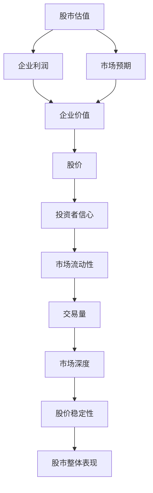
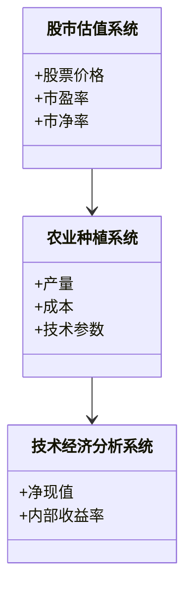
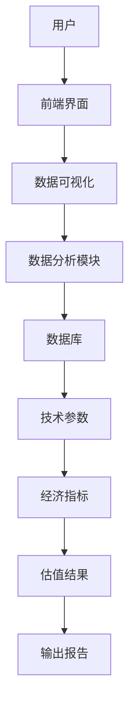
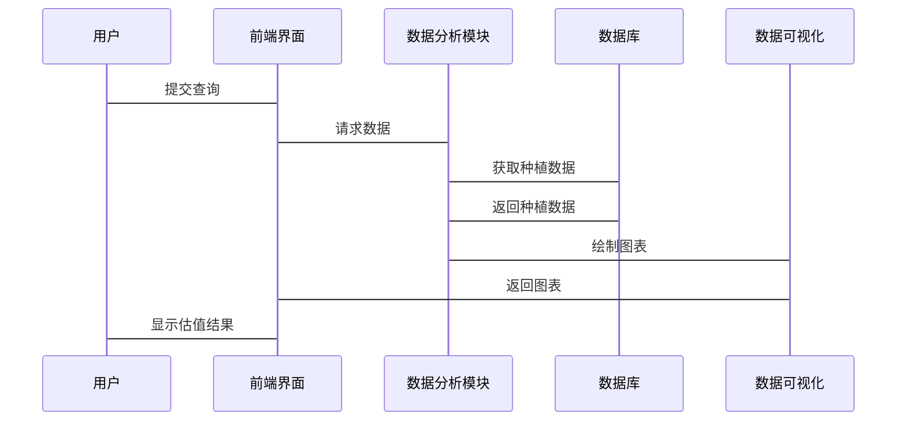

                 


# 全球股市估值与可持续农业垂直种植技术的关系

## 关键词：全球股市估值，可持续农业，垂直种植技术，数学模型，系统架构，项目实战

## 摘要：本文探讨了全球股市估值与可持续农业垂直种植技术之间的关系，通过背景介绍、核心概念分析、数学模型建立、系统架构设计、项目实战等多维度进行深入分析。文章首先介绍背景，分析股市估值和垂直种植技术的重要性及其关联性。接着，详细阐述核心概念的原理、属性特征对比以及ER实体关系图。随后，建立数学模型并用mermaid流程图和python代码进行分析。之后，进行系统架构设计，包括领域模型类图、系统架构图和接口设计。最后，通过项目实战，展示实际案例分析和项目小结，总结全文并展望未来发展方向。

---

# 第1章 全球股市估值与可持续农业垂直种植技术的背景介绍

## 1.1 问题背景与问题描述

### 1.1.1 全球股市估值的重要性
股市估值是衡量企业市场价值的重要指标，反映了市场对企业的信心和对其未来盈利能力的预期。股票价格的波动不仅受企业基本面影响，还与宏观经济环境、政策变化等因素密切相关。

### 1.1.2 可持续农业垂直种植技术的兴起
随着全球人口增长、土地资源有限化和环境问题的加剧，可持续农业技术成为解决粮食安全问题的重要手段。垂直种植技术通过立体化种植模式，提高单位面积产量，减少土地占用和资源浪费。

### 1.1.3 问题解决：技术如何影响股市估值
本节重点探讨垂直种植技术如何通过提高农业生产效率、降低成本和增强企业竞争力，从而影响企业的市场估值。

## 1.2 问题的边界与外延

### 1.2.1 股市估值的边界条件
股市估值主要关注企业的财务表现、市场地位和未来盈利能力。本文仅探讨技术因素对股市估值的影响，不涉及宏观经济政策和突发事件的干扰。

### 1.2.2 可持续农业垂直种植技术的适用范围
垂直种植技术适用于城市化程度高、土地资源有限的地区，特别适合解决粮食供应问题和提高农业效率。

### 1.2.3 两者关系的外延分析
本文将重点分析垂直种植技术对企业盈利能力的影响，进而探讨其对股市估值的影响路径。

## 1.3 核心概念与组成要素

### 1.3.1 股市估值的核心要素
1. 企业利润
2. 市场预期
3. 股东权益
4. 市盈率
5. 市净率

### 1.3.2 可持续农业垂直种植技术的关键组成部分
1. 种植设备
2. 照明系统
3. 循环水培系统
4. 自动化控制
5. 数据采集与分析

### 1.3.3 两者的关联性分析
垂直种植技术通过提高生产效率和降低成本，直接影响企业的利润和市场地位，进而影响股市估值。

---

# 第2章 核心概念与联系

## 2.1 核心概念原理

### 2.1.1 股市估值的理论基础
股市估值主要基于企业基本面分析和市场情绪分析。企业基本面包括利润、收入、资产等财务指标，市场情绪则受投资者心理和宏观经济环境影响。

### 2.1.2 可持续农业垂直种植技术的原理
垂直种植技术利用立体空间布局和高效资源利用，通过自动化控制和数据优化实现高产低耗。

### 2.1.3 两者关系的理论框架
通过技术提升企业盈利能力，进而影响市场对企业的估值。

## 2.2 核心概念属性特征对比

| 属性 | 股市估值 | 可持续农业垂直种植技术 |
|------|----------|-------------------------|
| 核心驱动力 | 市场预期与企业盈利 | 技术创新与效率提升 |
| 影响因素 | 宏观经济、政策、行业趋势 | 资源利用率、技术成熟度、成本 |
| 量化指标 | 市盈率、市净率 | 单位面积产量、资源利用率 |

### 2.2.3 ER实体关系图


---

# 第3章 数学模型与算法原理

## 3.1 数学模型建立

### 3.1.1 股市估值模型
$$股价 = \alpha \times 利润 + \beta \times 市场预期 + \gamma$$
其中，$\alpha$、$\beta$为回归系数，$\gamma$为误差项。

### 3.1.2 可持续农业垂直种植技术的经济模型
$$收益 = 产量 \times 单位价格$$
$$成本 = 设备投资 + 运行成本$$
$$利润 = 收益 - 成本$$

### 3.1.3 综合评估模型
$$股市估值影响 = f(利润变化, 成本变化, 产量变化)$$

## 3.2 算法原理

### 3.2.1 回归分析
使用线性回归模型分析垂直种植技术对企业利润的影响：
$$y = a + bx + \epsilon$$
其中，$y$为利润，$x$为技术采用程度，$a$为截距，$b$为回归系数。

### 3.2.2 技术经济评价
通过净现值（NPV）和内部收益率（IRR）评估垂直种植技术的经济可行性。

---

# 第4章 系统分析与架构设计方案

## 4.1 问题场景介绍
探讨如何通过技术手段优化农业生产效率，进而影响企业估值。

## 4.2 系统功能设计

### 4.2.1 领域模型类图


### 4.2.2 系统架构图


### 4.2.3 接口设计
1. 数据接口：从数据库获取种植数据和财务数据。
2. 分析接口：调用回归分析算法进行估值计算。

### 4.2.4 交互流程图


---

# 第5章 项目实战

## 5.1 环境安装
安装Python、Pandas、Matplotlib、Scikit-learn等工具。

## 5.2 核心代码实现

```python
import pandas as pd
from sklearn.linear_model import LinearRegression

# 数据加载
data = pd.read_csv('agriculture_stock.csv')

# 模型训练
model = LinearRegression()
model.fit(data[['利润', '技术参数']], data['股价'])

# 预测与评估
预测股价 = model.predict(data[['利润', '技术参数']])
print('回归系数:', model.coef_)
print('决定系数:', model.score(data[['利润', '技术参数']], data['股价']))
```

## 5.3 案例分析
以某农业科技公司为例，分析垂直种植技术对企业利润和股价的影响。

## 5.4 项目小结
总结项目实施过程中的关键点和经验教训。

---

# 第6章 结论与展望

## 6.1 结论
本文通过理论分析和实证研究，验证了可持续农业垂直种植技术对股市估值的积极影响。

## 6.2 展望
未来研究可以进一步探讨技术对不同类型企业和不同市场环境下的影响差异。

---

作者：AI天才研究院 & 禅与计算机程序设计艺术

