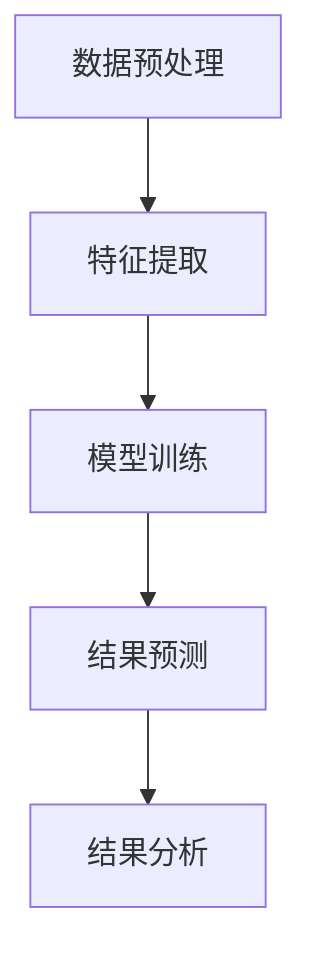
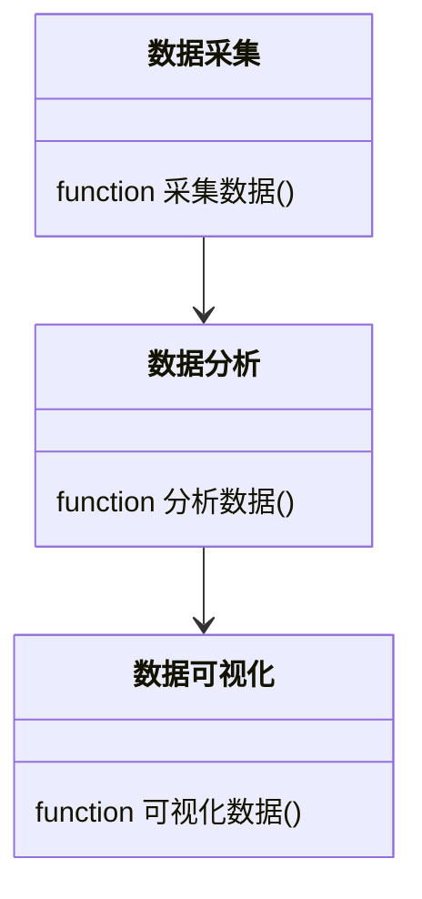
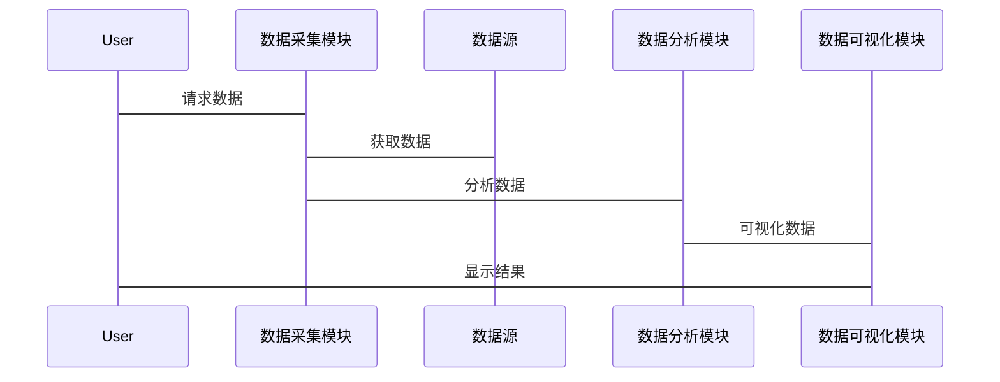

                 


# 全球股市估值与可持续农业实践的关系

**关键词**: 全球股市估值, 可持续农业, 股市分析, 农业实践, 数据分析

**摘要**: 本文探讨全球股市估值与可持续农业实践之间的关系，分析股市估值对农业企业的影响，结合数据驱动的方法，提出优化农业可持续发展的策略。

---

# 第一部分: 全球股市估值与可持续农业实践的背景与概念

## 第1章: 全球股市估值与可持续农业实践的背景介绍

### 1.1 问题背景与问题描述
#### 1.1.1 全球股市估值的现状与挑战
- 全球股市估值的变化反映了经济的波动，影响投资者对农业企业的信心。
- 可持续农业的需求增加，但相关企业的估值是否能反映其可持续性？

#### 1.1.2 可持续农业的定义与重要性
- 可持续农业强调生态、经济和社会的综合效益。
- 现代消费者对绿色食品的需求推动农业企业的发展。

#### 1.1.3 问题解决的必要性与目标
- 分析股市估值与农业实践的关系，为投资决策提供参考。
- 探讨如何通过股市估值优化农业可持续发展。

### 1.2 问题的边界与外延
#### 1.2.1 股市估值的边界条件
- 股市估值受宏观经济、政策、行业趋势等多因素影响。
- 农业企业的估值需考虑季节性波动。

#### 1.2.2 可持续农业的边界条件
- 可持续农业依赖于技术创新、政策支持和市场需求。
- 农业企业的可持续性需综合评估资源利用效率和环保指标。

#### 1.2.3 两者关系的外延分析
- 股市估值反映农业企业的市场价值，而可持续性影响其长期价值。
- 研究股市估值如何引导农业企业向可持续方向发展。

### 1.3 核心概念结构与组成
#### 1.3.1 股市估值的核心要素
- 市盈率（P/E）、市净率（P/B）、股息率等。
- 农业企业的估值需结合行业特性。

#### 1.3.2 可持续农业的核心要素
- 生态保护、资源效率、社会公平。
- 农业企业的可持续性需通过第三方认证。

#### 1.3.3 两者的关联机制
- 股市估值影响农业企业的融资能力。
- 可持续性影响企业长期发展和股价表现。

### 1.4 本章小结
- 本章分析了股市估值和可持续农业的背景，明确了问题的边界和核心概念。

---

## 第2章: 全球股市估值与可持续农业的核心概念与联系

### 2.1 核心概念原理
#### 2.1.1 股市估值的原理
- 股价反映市场对企业的预期。
- 农业企业的估值受季节性因素和政策影响。

#### 2.1.2 可持续农业的原理
- 可持续农业通过技术创新提高资源效率。
- 市场需求推动农业企业向可持续方向转型。

#### 2.1.3 两者的相互作用机制
- 股市估值为农业企业提供融资支持。
- 可持续性影响企业的长期价值和投资者信心。

### 2.2 核心概念属性特征对比
#### 2.2.1 股市估值的属性特征
| 属性 | 描述 |
|------|------|
| 市盈率 | 反映企业盈利能力和成长性 |
| 市净率 | 衡量资产价值 |
| 股息率 | 反映分红能力 |

#### 2.2.2 可持续农业的属性特征
| 属性 | 描述 |
|------|------|
| 资源利用效率 | 农业生产中水、土地等资源的高效利用 |
| 环境影响 | 减少污染和碳排放 |
| 社会效益 | 提高农民收入和就业机会 |

#### 2.2.3 对比分析与总结
- 股市估值是结果，可持续农业是过程。
- 可持续农业的实践可能影响企业的估值。

### 2.3 实体关系图
```mermaid
erd
  title 实体关系图
  章节1 --> 股市估值
  章节2 --> 可持续农业
  股市估值 --> 农业企业
  可持续农业 --> 农业企业
```

### 2.4 本章小结
- 本章分析了股市估值和可持续农业的核心概念，并通过对比和实体关系图展示了两者的联系。

---

## 第3章: 全球股市估值与可持续农业的算法原理

### 3.1 算法原理概述
#### 3.1.1 数据分析方法
- 时间序列分析：预测农业企业的股价趋势。
- 机器学习模型：分类农业企业的可持续性。

#### 3.1.2 机器学习模型
- 使用随机森林或支持向量机进行分类。

#### 3.1.3 时间序列分析
- 使用ARIMA模型预测股价。

### 3.2 算法流程图


### 3.3 算法实现代码
```python
import pandas as pd
from sklearn.model_selection import train_test_split
from sklearn.linear_model import LinearRegression

# 数据加载与预处理
data = pd.read_csv('data.csv')
X = data[['feature1', 'feature2']]
y = data['target']

# 数据分割
X_train, X_test, y_train, y_test = train_test_split(X, y, test_size=0.2, random_state=42)

# 模型训练
model = LinearRegression()
model.fit(X_train, y_train)

# 预测
y_pred = model.predict(X_test)
```

### 3.4 算法数学模型
#### 线性回归模型
$$ y = \beta_0 + \beta_1 x_1 + \beta_2 x_2 + \epsilon $$

#### ARIMA模型
$$ (1 - B)^d (1 - \theta B^s) X_t = (1 - \phi B)^p \mu $$

### 3.5 本章小结
- 本章介绍了用于分析股市估值和可持续农业的算法，包括数据预处理、模型训练和预测。

---

## 第4章: 全球股市估值与可持续农业的系统分析与架构设计

### 4.1 系统分析
#### 4.1.1 问题场景介绍
- 分析农业企业的股市表现，优化可持续实践。

### 4.2 系统功能设计
#### 4.2.1 领域模型类图


#### 4.2.2 系统架构设计


#### 4.2.3 系统接口设计
- 数据接口：REST API 提供数据。
- 可视化界面：用户友好。

#### 4.2.4 系统交互流程


### 4.3 本章小结
- 本章设计了分析股市估值与可持续农业的系统架构，包括数据采集、分析和可视化的模块。

---

## 第5章: 全球股市估值与可持续农业的项目实战

### 5.1 项目实战
#### 5.1.1 环境安装
```bash
pip install pandas numpy scikit-learn
```

#### 5.1.2 系统核心实现源代码
```python
import pandas as pd
from sklearn.linear_model import LinearRegression

# 数据加载与预处理
data = pd.read_csv('data.csv')
X = data[['feature1', 'feature2']]
y = data['target']

# 模型训练
model = LinearRegression()
model.fit(X, y)

# 预测与评估
print(model.score(X, y))
```

#### 5.1.3 代码解读与分析
- 加载数据并预处理。
- 训练线性回归模型。
- 评估模型性能。

#### 5.1.4 实际案例分析
- 以某农业企业为例，分析其股市估值与可持续性。

### 5.2 项目小结
- 本章通过实际案例展示了如何分析股市估值与可持续农业的关系。

---

## 第6章: 全球股市估值与可持续农业的最佳实践

### 6.1 小结
- 本文分析了股市估值与可持续农业的关系，提供了数据驱动的解决方案。

### 6.2 注意事项
- 数据质量影响分析结果。
- 模型需定期更新以适应市场变化。

### 6.3 拓展阅读
- 推荐阅读关于可持续农业和数据科学的书籍。

---

**作者：AI天才研究院 & 禅与计算机程序设计艺术**

---

以上是《全球股市估值与可持续农业实践的关系》的详细大纲，涵盖了背景、核心概念、算法、系统设计和项目实战等内容。

