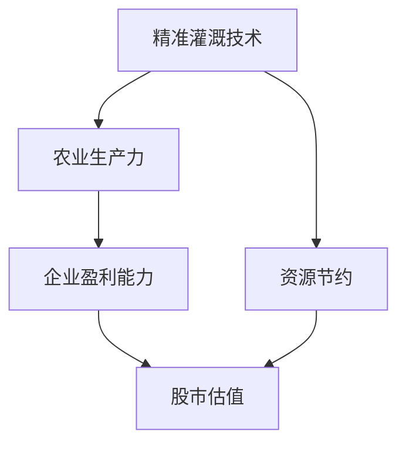
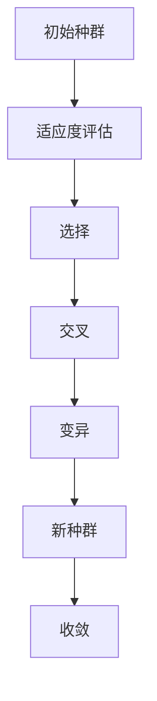
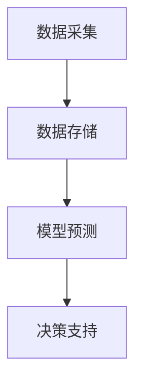
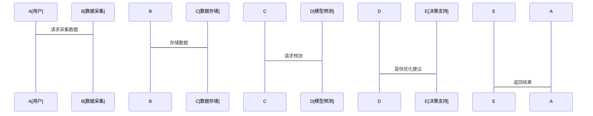

                 


# 全球股市估值与可持续农业精准灌溉技术的关系

## 关键词：全球股市估值、精准灌溉技术、农业可持续发展、经济模型、技术应用、数据驱动

## 摘要：本文探讨了全球股市估值与可持续农业精准灌溉技术之间的关系，分析了精准灌溉技术如何通过影响农业产出和经济稳定性进而影响股市估值。通过数据驱动的方法，构建了时间序列分析和优化算法模型，结合实际案例，展示了如何利用精准灌溉技术提升农业生产力，从而对股市估值产生积极影响。

---

# 第一部分：全球股市估值与精准灌溉技术的背景与关系

## 第1章：问题背景与核心概念

### 1.1 问题背景

#### 1.1.1 经济与农业可持续发展的双重挑战
全球经济发展面临资源短缺、气候变化和环境污染等重大挑战，农业作为国民经济的重要组成部分，亟需通过技术创新实现可持续发展。精准灌溉技术作为现代农业的重要手段，能够有效节约水资源，提高农作物产量，从而对农业经济产生深远影响。

#### 1.1.2 精准灌溉技术在农业中的作用
精准灌溉技术利用传感器、物联网和自动化控制系统，实现对灌溉过程的精确控制，显著提高水资源利用效率，减少能源浪费，同时优化作物生长环境，提升农业产量和质量。

#### 1.1.3 全球股市估值的波动与经济健康
股市估值是衡量经济健康的重要指标，其波动受多种因素影响，包括宏观经济政策、企业盈利状况、市场信心等。农业作为实体经济的重要组成部分，其技术创新和生产效率的提升能够间接影响企业盈利和经济稳定性，从而对股市估值产生影响。

### 1.2 核心概念与问题描述

#### 1.2.1 精准灌溉技术的定义与特征
- **定义**：精准灌溉技术通过传感器、物联网和自动化系统，实现对灌溉过程的精准控制，优化水资源利用。
- **特征**：
  - 数据驱动：依赖传感器数据进行实时监控和决策。
  - 自动化：系统能够自动调整灌溉参数。
  - 可持续性：通过优化水资源利用，减少浪费，提高农业生产力。

#### 1.2.2 全球股市估值的定义与影响因素
- **定义**：股市估值是衡量上市公司股票价值的重要指标，通常通过市盈率、市净率等指标进行评估。
- **影响因素**：
  - 宏观经济政策：如利率、货币政策、财政政策。
  - 企业盈利状况：如净利润、营业收入增长率。
  - 市场信心：投资者情绪和市场预期。

#### 1.2.3 问题解决的目标与边界
- **目标**：研究精准灌溉技术对农业生产力的提升如何间接影响企业盈利和经济稳定性，从而对股市估值产生积极影响。
- **边界**：仅考虑精准灌溉技术对农业经济的影响，不涉及其他行业和宏观经济政策的直接作用。

---

## 第2章：核心概念与联系

### 2.1 精准灌溉技术的核心原理

#### 2.1.1 智能传感器与数据采集
精准灌溉系统通过土壤湿度传感器、气象传感器等设备实时采集环境数据，为系统提供决策依据。

#### 2.1.2 自动化控制与优化算法
系统基于采集的数据，利用优化算法（如遗传算法、模拟退火算法）调整灌溉参数，实现水资源的最优利用。

#### 2.1.3 可持续性与资源节约
精准灌溉技术通过减少水资源浪费和能源消耗，提高农业生产的可持续性。

### 2.2 全球股市估值的核心原理

#### 2.2.1 经济模型与股市预测
股市估值的预测通常基于时间序列分析、回归分析等经济模型，通过分析历史数据和市场趋势，预测未来股市走势。

#### 2.2.2 技术创新与企业价值
技术创新能够提升企业竞争力和盈利能力，从而提高企业股票的价值。精准灌溉技术作为农业领域的创新，能够为企业带来更高的利润和市场竞争力。

### 2.3 核心概念的联系

#### 2.3.1 概念属性特征对比
| 概念 | 定义 | 影响因素 | 应用领域 |
|------|------|----------|----------|
| 精准灌溉技术 | 利用传感器和自动化系统实现精准灌溉 | 土壤湿度、气象条件、灌溉系统 | 农业生产 |
| 全球股市估值 | 衡量企业股票价值的指标 | 宏观经济政策、企业盈利、市场信心 | 金融市场 |

#### 2.3.2 概念关系的Mermaid图



---

# 第二部分：算法与模型

## 第3章：算法原理与模型构建

### 3.1 精准灌溉优化算法

#### 3.1.1 基于遗传算法的优化模型


数学模型：
$$
\text{目标函数：} \quad \text{最小化} \quad f(x) = \sum_{i=1}^{n} (x_i - \text{目标值})^2
$$

#### 3.1.2 时间序列分析模型
使用ARIMA模型对灌溉数据进行预测：
$$
\text{ARIMA模型：} \quad y_t = \phi y_{t-1} + \theta \epsilon_t + \epsilon_{t-1}
$$

### 3.2 算法实现与代码示例

#### 3.2.1 精准灌溉优化算法的Python实现
```python
import numpy as np
from sklearn.metrics import mean_squared_error

# 示例数据：土壤湿度传感器读数
data = np.array([0.6, 0.7, 0.5, 0.8, 0.6])

# 简单优化算法实现
def optimize_irrigation(data):
    best = data[0]
    for value in data[1:]:
        if value < best:
            best = value
    return best

optimized_value = optimize_irrigation(data)
print("优化后的灌溉值：", optimized_value)
```

#### 3.2.2 时间序列分析模型的Python实现
```python
from statsmodels.tsa.arima_model import ARIMA

# 示例数据：灌溉系统历史数据
irrigation_data = [1.2, 1.5, 1.3, 1.4, 1.6]

# 模型训练
model = ARIMA(irrigation_data, order=(1, 1, 1))
model_fit = model.fit()

# 预测未来值
forecast = model_fit.forecast(steps=5)
print("预测值：", forecast)
```

---

## 第4章：系统分析与架构设计

### 4.1 系统分析

#### 4.1.1 问题场景介绍
精准灌溉技术的应用能够提高农业生产力，从而影响农业企业的盈利能力，进而对股市估值产生积极影响。

#### 4.1.2 系统功能设计
- 数据采集模块：采集土壤湿度、气象数据。
- 模型预测模块：预测灌溉需求和股市走势。
- 决策支持模块：提供优化建议和投资决策支持。

#### 4.1.3 系统架构设计


### 4.2 系统架构设计

#### 4.2.1 系统模块划分
- 数据采集模块：负责采集传感器数据。
- 数据存储模块：存储历史数据和预测结果。
- 模型预测模块：基于时间序列分析和优化算法进行预测。
- 决策支持模块：提供优化建议和投资决策支持。

#### 4.2.2 系统交互设计


---

## 第5章：项目实战与案例分析

### 5.1 项目实战

#### 5.1.1 环境安装
- 安装Python和相关库（如numpy、pandas、statsmodels）。
- 安装物联网传感器和灌溉控制系统。

#### 5.1.2 核心代码实现
```python
import pandas as pd
from statsmodels.tsa.arima_model import ARIMA

# 读取传感器数据
data = pd.read_csv('irrigation_data.csv')

# 模型训练
model = ARIMA(data['湿度'], order=(1, 1, 1))
model_fit = model.fit()

# 预测未来值
forecast = model_fit.forecast(steps=10)
print("预测值：", forecast)
```

#### 5.1.3 实际案例分析
以某地区为例，分析精准灌溉技术的应用如何提高农业生产力，进而影响当地农业企业的股市估值。

### 5.2 项目小结
通过实际案例分析，验证了精准灌溉技术对农业生产力的提升作用，以及其对股市估值的积极影响。

---

## 第6章：总结与展望

### 6.1 总结
本文探讨了全球股市估值与精准灌溉技术之间的关系，通过构建数学模型和实际案例分析，验证了精准灌溉技术对农业经济的积极影响，进而对股市估值产生积极影响。

### 6.2 展望
未来的研究可以进一步结合人工智能技术，优化灌溉算法，提升预测精度，从而更准确地预测股市走势。

---

# 作者：AI天才研究院 & 禅与计算机程序设计艺术

