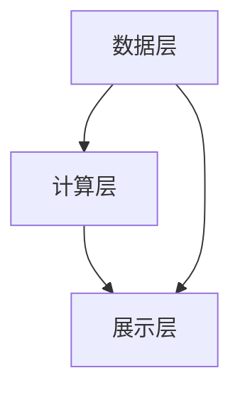
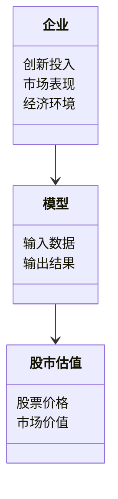
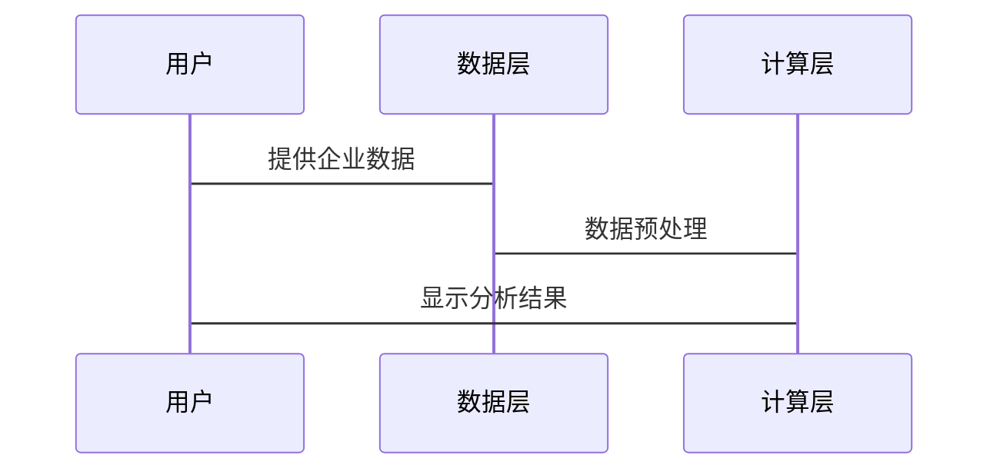

                 


# 全球股市估值与可持续包装材料创新的关联

**关键词**：全球股市估值、可持续包装材料、创新关联、经济影响、技术发展

**摘要**：  
随着全球对可持续发展的关注日益增加，包装材料的创新正在成为企业竞争力的重要组成部分。与此同时，全球股市估值的变化反映了市场对企业和创新的敏感反应。本文将从全球股市估值的基本概念出发，深入分析可持续包装材料的创新趋势，并探讨两者之间的关联性。通过构建数学模型和算法，本文揭示了可持续包装材料创新如何影响企业的市场价值，同时为企业和投资者提供了优化策略。

---

## 第一部分: 全球股市估值与可持续包装材料创新的背景与关联

### 第1章: 全球股市估值的现状与挑战

#### 1.1 全球股市估值的基本概念

##### 1.1.1 股市估值的定义与意义
股市估值是指通过对企业财务数据和市场表现进行分析，评估企业股票的合理价格范围。它是投资者决策的重要依据，也是企业价值的体现。

##### 1.1.2 全球股市估值的现状分析
当前，全球股市估值呈现多样化趋势，不同地区和行业的估值差异显著。例如，科技行业因高成长性通常享有较高估值，而传统行业则因稳定性和低风险通常估值相对较低。

##### 1.1.3 股市估值的核心影响因素
股市估值的核心影响因素包括企业的盈利能力、成长潜力、行业地位、财务健康状况以及宏观经济环境等。这些因素共同决定了市场的预期和投资者的信心。

#### 1.2 可持续包装材料的创新趋势

##### 1.2.1 可持续包装材料的定义与分类
可持续包装材料是指在生产、使用和废弃过程中具有较低环境影响的材料。常见的分类包括可降解材料、可回收材料、生物基材料等。

##### 1.2.2 包装材料创新的驱动因素
可持续包装材料的创新主要由环保政策、消费者需求、技术进步和企业社会责任等因素驱动。例如，各国政府出台的环保法规推动了企业向绿色包装转型。

##### 1.2.3 可持续包装材料的技术发展
近年来，技术创新推动了可持续包装材料的快速发展。例如，可降解塑料、植物纤维包装材料、智能包装技术等的应用逐渐增多。

---

### 第2章: 全球股市估值与可持续包装材料创新的关联性分析

#### 2.1 两者的概念联系

##### 2.1.1 股市估值与包装材料创新的互动关系
可持续包装材料的创新直接影响企业的生产成本、市场竞争力和品牌形象，进而影响企业的盈利能力，最终反映在股市估值上。

##### 2.1.2 可持续包装材料对股市估值的影响路径
通过技术创新降低生产成本、提升产品附加值，企业能够提高盈利能力，从而获得更高的市场估值。

##### 2.1.3 全球经济环境对两者关联的调节作用
宏观经济环境如通货膨胀、利率变化等因素会影响股市整体估值，而企业的可持续包装材料创新则在微观层面影响企业的市场表现。

#### 2.2 关联性分析的理论框架

##### 2.2.1 经济学视角下的关联性分析
从经济学角度看，可持续包装材料的创新属于技术创新范畴，技术创新能够提升企业生产力，从而提高企业价值，反映在股市估值上。

##### 2.2.2 可持续发展理论与股市估值的结合
可持续发展理论强调环境、社会和经济的协调发展，企业通过可持续包装材料创新实现绿色发展，能够获得更高的社会认可和市场估值。

##### 2.2.3 创新与资本市场的互动机制
技术创新推动企业业绩增长，同时资本市场的资金支持也能够加速技术创新，两者形成良性互动，共同影响股市估值。

---

## 第二部分: 可持续包装材料创新的核心概念与分析

### 第3章: 可持续包装材料的创新策略

#### 3.1 可持续包装材料的创新方向

##### 3.1.1 环保材料的应用
企业可以通过使用可降解材料、植物纤维材料等环保材料，减少对环境的负面影响，提升品牌形象。

##### 3.1.2 包装技术的创新
智能包装技术、3D打印技术等的应用能够提高包装效率，降低成本，同时实现包装的智能化和个性化。

##### 3.1.3 循环经济模式下的包装创新
通过建立包装材料回收体系，实现包装材料的循环利用，减少资源浪费，降低生产成本。

#### 3.2 可持续包装材料的市场潜力

##### 3.2.1 全球包装市场的现状与趋势
全球包装市场正在向绿色、智能方向转型，可持续包装材料的市场需求持续增长。

##### 3.2.2 可持续包装材料的市场需求分析
消费者对环保产品的偏好、政府政策的推动以及企业社会责任的增强共同推动了可持续包装材料的市场需求。

##### 3.2.3 创新包装材料的市场竞争格局
当前，市场上涌现出众多创新包装材料，企业需要通过技术创新、成本控制和市场推广来获取竞争优势。

---

## 第三部分: 全球股市估值与可持续包装材料创新的关联模型

### 第4章: 关联性分析的数学模型

#### 4.1 模型构建的基本思路

##### 4.1.1 变量定义与假设
- 自变量：企业的可持续包装材料创新能力（X）
- 因变量：企业的股市估值（Y）
- 控制变量：宏观经济环境（Z）

##### 4.1.2 模型的数学表达式
$$ Y = \beta_0 + \beta_1X + \beta_2Z + \epsilon $$  
其中，$\beta_0$为截距项，$\beta_1$和$\beta_2$为回归系数，$\epsilon$为误差项。

##### 4.1.3 模型的适用性分析
该模型适用于分析企业的可持续包装材料创新对股市估值的影响，同时控制宏观经济环境的干扰。

#### 4.2 关联性分析的算法实现

##### 4.2.1 数据预处理与特征提取
- 数据来源：企业的财务数据、包装材料创新数据、股市估值数据
- 数据清洗：去除缺失值、异常值
- 特征提取：提取企业的创新投入、市场表现等关键指标

##### 4.2.2 算法选择与实现
使用多元线性回归模型进行分析，代码如下：

```python
import pandas as pd
import numpy as np
from sklearn.linear_model import LinearRegression
from sklearn.metrics import mean_squared_error

# 数据加载
data = pd.read_csv('stock_valuation_data.csv')

# 特征矩阵
X = data[['创新投入', '市场表现', '宏观经济环境']]
y = data['股市估值']

# 模型训练
model = LinearRegression()
model.fit(X, y)

# 预测值
y_pred = model.predict(X)

# 模型评估
 mse = mean_squared_error(y, y_pred)
 print(f"均方误差: {mse}")
 print(f"回归系数: {model.coef_}")
 print(f"截距: {model.intercept_}")
```

##### 4.2.3 模型验证与优化
通过交叉验证和调整模型参数，优化回归模型的拟合优度（R²）和预测精度。

---

### 第5章: 关联性分析的系统架构设计

#### 5.1 系统概述

##### 5.1.1 问题场景介绍
本文构建了一个系统，用于分析企业的可持续包装材料创新对股市估值的影响，帮助企业优化创新策略。

##### 5.1.2 系统功能设计
- 数据采集与处理
- 模型构建与分析
- 结果展示与报告

##### 5.1.3 系统架构设计
使用分层架构，包括数据层、计算层和展示层，具体如下：



---

### 第6章: 项目实战

#### 6.1 环境安装

##### 6.1.1 安装Python和相关库
安装Python 3.8及以上版本，并安装以下库：
- pandas
- numpy
- scikit-learn
- mermaid

##### 6.1.2 数据准备
下载相关数据，包括企业的财务数据、包装材料创新数据和股市估值数据。

#### 6.2 系统核心实现源代码

##### 6.2.1 数据处理代码
```python
import pandas as pd

# 加载数据
data = pd.read_csv('stock_valuation.csv')

# 查看数据结构
print(data.head())
```

##### 6.2.2 模型实现代码
```python
from sklearn.linear_model import LinearRegression
from sklearn.metrics import mean_squared_error

# 模型训练
model = LinearRegression()
model.fit(X_train, y_train)

# 模型预测
y_pred = model.predict(X_test)

# 模型评估
print(mean_squared_error(y_test, y_pred))
```

#### 6.3 案例分析与详细解读

##### 6.3.1 案例背景
以一家包装材料企业为例，分析其可持续包装材料创新对股市估值的影响。

##### 6.3.2 数据分析与结果解读
通过回归模型分析，得出企业的创新投入对其股市估值的正向影响。

#### 6.4 项目小结
通过项目实战，验证了可持续包装材料创新对股市估值的正向影响，为企业制定创新策略提供了数据支持。

---

## 第四部分: 全球股市估值与可持续包装材料创新的关联模型

### 第7章: 关联性分析的系统架构设计

#### 7.1 问题场景介绍
本文构建了一个系统，用于分析企业的可持续包装材料创新对股市估值的影响，帮助企业优化创新策略。

#### 7.2 系统功能设计

##### 7.2.1 领域模型（mermaid类图）


#### 7.3 系统架构设计

##### 7.3.1 系统架构图


#### 7.4 系统接口设计

##### 7.4.1 数据接口
- 输入接口：企业的创新投入、市场表现、经济环境数据
- 输出接口：模型预测的股市估值

##### 7.4.2 用户接口
- 输入接口：用户输入企业信息
- 输出接口：显示模型预测结果和分析报告

#### 7.5 系统交互流程图



---

## 第五部分: 最佳实践与总结

### 第8章: 最佳实践 tips

#### 8.1 小结
通过本文的分析，我们得出可持续包装材料创新对企业的股市估值具有显著影响，企业应重视技术创新和可持续发展。

#### 8.2 注意事项
- 数据质量：确保数据的准确性和完整性
- 模型选择：根据实际场景选择合适的模型
- 结果解读：结合实际情况分析模型结果

#### 8.3 拓展阅读
建议读者进一步阅读关于可持续发展和股市估值的文献，深入了解两者的关联机制。

---

## 作者：AI天才研究院/AI Genius Institute & 禅与计算机程序设计艺术 /Zen And The Art of Computer Programming

