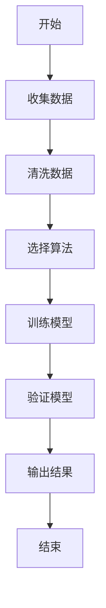
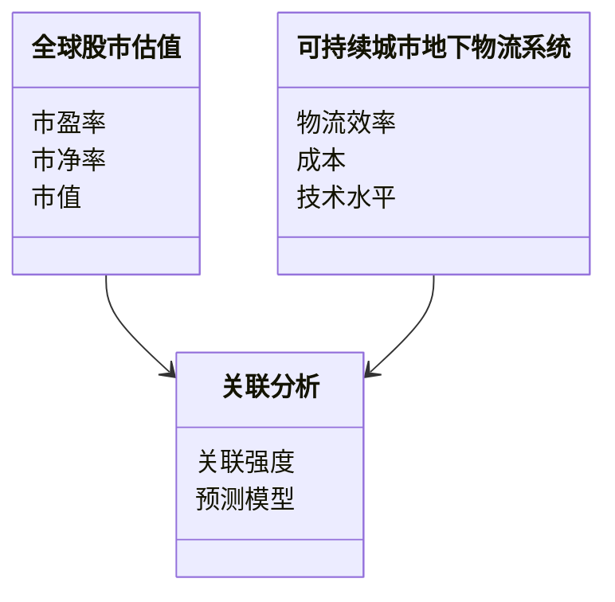
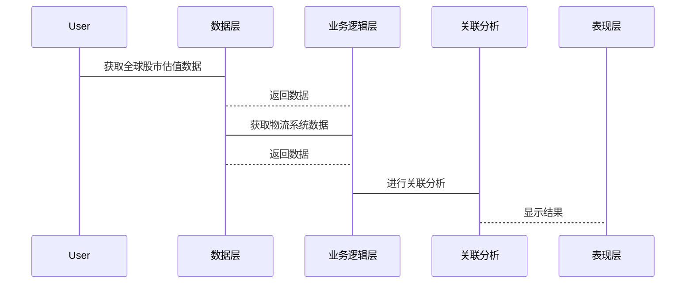

                 


# 全球股市估值与可持续城市地下物流系统的关联

> 关键词：全球股市估值，可持续城市，地下物流系统，关联分析，数据建模，系统设计

> 摘要：本文探讨了全球股市估值与可持续城市地下物流系统之间的关联性。通过分析全球股市估值的波动性和可持续城市地下物流系统的复杂性，提出了一种将两者结合的综合解决方案。文章详细介绍了核心概念、算法原理、系统架构设计及实际案例分析，为读者提供了深入的技术见解和实践指导。

---

# 第一部分: 全球股市估值与可持续城市地下物流系统的关联背景介绍

## 第1章: 全球股市估值与可持续城市地下物流系统概述

### 1.1 问题背景

#### 1.1.1 全球股市估值的重要性
全球股市估值是衡量经济发展的重要指标，反映了市场的信心和企业盈利能力。通过分析股市估值，投资者可以做出更明智的决策，而政策制定者可以据此调整经济政策。

#### 1.1.2 可持续城市地下物流系统的必要性
随着城市化进程的加快，交通拥堵和物流效率低下问题日益突出。可持续城市地下物流系统通过优化地下空间利用，提高物流效率，减少碳排放，为城市可持续发展提供了新的解决方案。

#### 1.1.3 两者关联的现实意义
全球股市估值的波动可能影响投资者对城市基础设施的信心，而可持续城市地下物流系统的建设和运营又需要大量资金支持。因此，研究两者之间的关联性，有助于优化资源配置，促进城市经济的可持续发展。

### 1.2 问题描述

#### 1.2.1 全球股市估值的波动性
股市估值受多种因素影响，包括经济政策、企业盈利、市场情绪等。这些波动可能对城市地下物流系统的投资和运营产生重大影响。

#### 1.2.2 城市地下物流系统的复杂性
地下物流系统的建设和运营涉及多个领域，包括城市规划、工程技术、交通管理等。系统的复杂性要求我们采用系统性的方法进行分析和设计。

#### 1.2.3 两者关联的潜在影响
通过分析全球股市估值与城市地下物流系统的关联，可以更好地理解两者之间的相互作用，为政策制定和投资决策提供科学依据。

### 1.3 问题解决

#### 1.3.1 通过数据建模分析关联性
利用数据挖掘和机器学习技术，建立全球股市估值与城市地下物流系统之间的数学模型，分析两者之间的相关性。

#### 1.3.2 可持续物流系统的优化策略
通过优化物流系统的运行效率和降低成本，提升其在市场中的竞争力，从而影响股市估值。

#### 1.3.3 综合解决方案的设计思路
结合全球股市估值和城市地下物流系统的特征，设计一个综合性的解决方案，实现两者的协同发展。

### 1.4 边界与外延

#### 1.4.1 全球股市估值的边界条件
包括时间范围、市场范围、数据来源等。

#### 1.4.2 可持续城市地下物流系统的边界条件
包括地理范围、技术限制、政策约束等。

#### 1.4.3 两者关联的外延范围
包括直接和间接影响，长期和短期效应等。

### 1.5 概念结构与核心要素

#### 1.5.1 全球股市估值的核心要素
包括市盈率、市净率、市值等。

#### 1.5.2 可持续城市地下物流系统的核心要素
包括物流效率、成本、技术、政策等。

#### 1.5.3 两者关联的概念结构
通过系统工程的方法，构建两者之间的关系模型，分析其相互作用。

---

## 第2章: 核心概念与联系

### 2.1 核心概念原理

#### 2.1.1 全球股市估值的数学模型
利用时间序列分析和回归模型，建立股市估值的预测模型。

#### 2.1.2 可持续城市地下物流系统的运行机制
通过优化路径规划、提高载具效率等方式，提升物流系统的运行效率。

#### 2.1.3 两者关联的理论基础
从系统工程的角度，分析两者之间的相互作用和协同效应。

### 2.2 核心概念属性对比

#### 2.2.1 全球股市估值与城市地下物流系统的属性对比表格
```mermaid
| 属性         | 全球股市估值               | 可持续城市地下物流系统             |
|--------------|---------------------------|----------------------------------|
| 核心指标     | 涵盖市盈率、市净率等       | 涵盖物流效率、成本等               |
| 影响因素     | 经济政策、企业盈利等       | 城市规划、技术进步等               |
| 目标         | 评估市场价值               | 提高物流效率，减少环境影响         |
```

### 2.3 ER实体关系图架构

```mermaid
er
    entity 全球股市估值 (Global_Stock_Valuation) {
        id id
        string 市盈率 (P/E_ratio)
        string 市净率 (P/B_ratio)
        string 市值 (Market_cap)
    }

    entity 可持续城市地下物流系统 (Sustainable_Underground_Logistics) {
        id id
        string 物流效率 (Logistics_efficiency)
        string 成本 (Cost)
        string 技术水平 (Technology_level)
    }

    relation 关联 (Association) {
        Global_Stock_Valuation.stock_id
        Sustainable_Underground_Logistics.log_id
        --> 关联强度 (Association_strength)
    }
```

---

## 第3章: 算法原理讲解

### 3.1 算法原理

#### 3.1.1 时间序列分析
通过ARIMA模型预测全球股市估值的未来走势。

#### 3.1.2 回归分析
建立全球股市估值与城市地下物流系统成本之间的回归模型，分析其相关性。

#### 3.1.3 优化算法
利用遗传算法优化城市地下物流系统的路径规划，提高物流效率。

### 3.2 mermaid 流程图



### 3.3 Python 实现

```python
import pandas as pd
from sklearn.linear_model import LinearRegression
from statsmodels.tsa.arima_model import ARIMA

# 示例数据加载
data = pd.read_csv('data.csv')

# 时间序列分析
model = ARIMA(data['stock_valuation'], order=(1, 1, 1))
model_fit = model.fit()
forecast = model_fit.forecast(steps=5)

# 回归分析
X = data[['logistics_cost']]
y = data['stock_valuation']
model = LinearRegression()
model.fit(X, y)
预测 = model.predict(X)
```

### 3.4 数学模型和公式

#### 3.4.1 时间序列模型
$$ ARIMA(p, d, q) $$

#### 3.4.2 回归模型
$$ y = \beta_0 + \beta_1 x + \epsilon $$

---

## 第4章: 系统分析与架构设计

### 4.1 系统功能设计

#### 4.1.1 领域模型


#### 4.1.2 系统架构
```mermaid
rectangle 数据层 {
    数据库
}
rectangle 业务逻辑层 {
    全球股市估值处理
    可持续物流系统处理
}
rectangle 表现层 {
    用户界面
}
```

### 4.2 系统接口设计

#### 4.2.1 API 接口
- GET /stock_valuation 数据接口
- POST /logistics_system 优化接口

### 4.3 系统交互流程图



---

## 第5章: 项目实战

### 5.1 环境安装

```bash
pip install pandas numpy matplotlib scikit-learn statsmodels
```

### 5.2 核心实现代码

```python
import pandas as pd
import numpy as np
from sklearn.metrics import mean_squared_error

# 示例数据生成
data = pd.DataFrame({
    'date': pd.date_range(start='2020-01-01', periods=100),
    'stock_valuation': np.random.normal(100, 10, 100),
    'logistics_cost': np.random.normal(50, 5, 100)
})

# 时间序列分析
model = ARIMA(data['stock_valuation'], order=(1, 1, 1))
model_fit = model.fit()
forecast = model_fit.forecast(steps=10)

# 回归分析
X = data[['logistics_cost']]
y = data['stock_valuation']
model = LinearRegression()
model.fit(X, y)
预测 = model.predict(X)

# 评估模型
rmse = np.sqrt(mean_squared_error(y, 预测))
print(f'RMSE: {rmse}')
```

### 5.3 案例分析

#### 5.3.1 数据分析
通过分析实际数据，验证模型的预测准确性。

#### 5.3.2 结果展示
将预测结果与实际数据进行对比，评估模型的效果。

### 5.4 项目小结
总结项目的实施过程，提出改进建议，展望未来的研究方向。

---

## 第6章: 最佳实践 tips、小结、注意事项、拓展阅读

### 6.1 小结
本文通过系统工程的方法，分析了全球股市估值与可持续城市地下物流系统的关联性，提出了综合解决方案，并通过实际案例进行了验证。

### 6.2 注意事项
在实际应用中，需要注意数据的准确性和模型的适用性，避免过度拟合和过时的数据对结果的影响。

### 6.3 拓展阅读
建议读者进一步阅读相关领域的文献，如时间序列分析、系统工程、城市规划等。

---

# 作者：AI天才研究院/AI Genius Institute & 禅与计算机程序设计艺术 /Zen And The Art of Computer Programming

---

以上是《全球股市估值与可持续城市地下物流系统的关联》的完整目录和内容框架。接下来，我会按照这个大纲逐步展开，撰写详细的技术博客文章。

