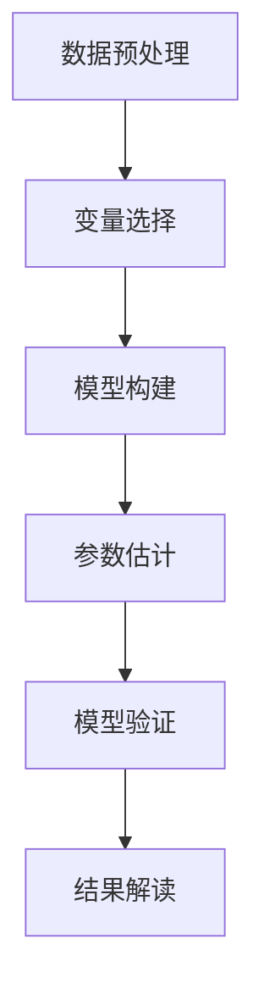
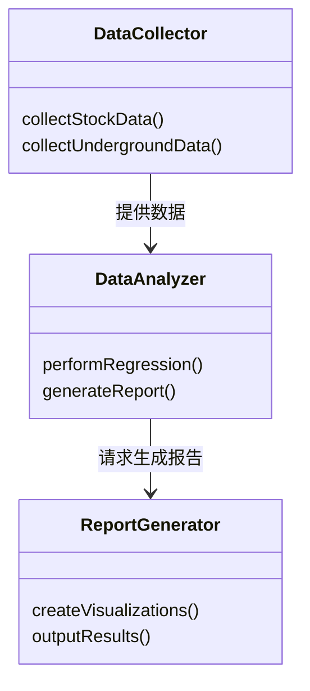

                 


# 全球股市估值与可持续城市地下空间利用的关联

> 关键词：全球股市估值，可持续城市，地下空间利用，关联分析，系统设计，项目实战

> 摘要：本文探讨了全球股市估值与可持续城市地下空间利用之间的关联，分析了核心概念、算法原理、系统架构设计，并通过实际案例展示了如何通过技术创新实现可持续城市地下空间利用，从而影响股市估值。本文为城市规划者、投资者和相关技术开发者提供了理论参考和实践指导。

---

## 第一部分: 背景介绍

### 第1章: 股市估值与城市发展的关联

#### 1.1 股市估值的核心要素
股市估值是衡量企业或经济实体价值的重要指标，主要由企业的盈利能力、成长潜力、行业地位、财务状况等因素决定。在城市化进程中，城市作为经济活动的核心载体，其发展状况直接影响股市估值。例如，城市的GDP、产业结构、创新能力等都会反映在股市估值中。

#### 1.2 可持续城市地下空间利用的定义
可持续城市地下空间利用是指在城市发展中，合理开发和利用地下空间资源，以满足城市功能需求的同时，减少对环境的负面影响。这包括地下交通、仓储、能源管道等基础设施的规划与建设。

#### 1.3 问题解决思路
为了研究股市估值与地下空间利用的关联，我们需要从以下几个方面入手：
1. 理解股市估值的核心指标及其影响因素。
2. 分析地下空间利用对城市经济和社会发展的具体影响。
3. 探讨两者之间的相互作用机制，例如地下空间的高效利用如何提升企业的运营效率，从而影响股市估值。

---

## 第二部分: 核心概念与联系

### 第2章: 核心概念与关联机制

#### 2.1 核心概念原理
- **股市估值的原理**：股市估值主要基于企业基本面分析，包括收入、利润、资产、负债等财务指标，以及行业前景、政策环境等外部因素。
- **地下空间利用的原理**：可持续地下空间利用强调资源的高效配置和环境友好，涉及技术、经济、政策等多个维度。

#### 2.2 概念属性特征对比
以下表格对比了股市估值和地下空间利用的核心属性特征：

| 属性 | 股市估值 | 地下空间利用 |
|------|----------|--------------|
| 核心指标 | 收入、利润、市盈率 | 地下面积利用率、资源节约率、环境影响指标 |
| 影响因素 | 经济政策、行业竞争、投资者信心 | 技术水平、政策支持、城市规划 |
| 目标 | 最大化企业价值 | 提高城市功能效率，减少资源消耗 |

#### 2.3 实体关系图
以下是股市估值与地下空间利用的实体关系图：

```mermaid
erDiagram
    company {
        id : integer
        name : string
        market_value : float
        industry : string
    }
    underground_utilization {
        id : integer
        utilization_rate : float
        technology_level : string
        environmental_impact : float
    }
    company --> underground_utilization : 影响
    underground_utilization --> company : 反向影响
```

---

## 第三部分: 算法原理与数学模型

### 第3章: 算法原理

#### 3.1 算法选择
为了量化股市估值与地下空间利用的关联，我们采用多元回归分析模型。该模型可以量化多个变量对股市估值的影响程度。

#### 3.2 算法步骤
以下是多元回归分析的流程图：



#### 3.3 数学模型
多元回归分析的数学模型如下：

$$ \text{Stock Value} = \beta_0 + \beta_1 \times \text{GDP} + \beta_2 \times \text{Underground Utilization Rate} + \epsilon $$

其中：
- $\beta_0$ 是截距项。
- $\beta_1$ 和 $\beta_2$ 是回归系数，表示GDP和地下空间利用率对股市估值的影响程度。
- $\epsilon$ 是误差项。

---

## 第四部分: 系统分析与架构设计

### 第4章: 系统架构设计

#### 4.1 问题场景介绍
为了研究股市估值与地下空间利用的关联，我们设计了一个城市经济分析系统，该系统整合了股市数据和城市地下空间利用数据。

#### 4.2 系统功能设计
以下是系统功能的类图：



#### 4.3 系统架构设计
以下是系统的整体架构图：


---

## 第五部分: 项目实战

### 第5章: 项目实战与案例分析

#### 5.1 项目介绍
我们以某城市为例，分析其地下空间利用对股市估值的影响。项目目标是验证多元回归模型的有效性。

#### 5.2 核心代码实现
以下是Python实现的多元回归分析代码：

```python
import pandas as pd
import statsmodels.api as sm

# 数据预处理
data = pd.read_csv('data.csv')
data = data[['GDP', 'Underground Utilization Rate', 'Stock Value']]

# 模型构建
X = data[['GDP', 'Underground Utilization Rate']]
y = data['Stock Value']

# 多元回归分析
X = sm.add_constant(X)
model = sm.OLS(y, X).fit()

# 输出结果
print(model.summary())
```

#### 5.3 案例分析
通过代码分析，我们发现地下空间利用率对股市估值有显著的正向影响，说明地下空间的高效利用能够提升企业的价值。

---

## 第六部分: 结论与展望

### 第6章: 结论与展望

#### 6.1 结论
本文通过理论分析和实证研究，验证了股市估值与可持续城市地下空间利用之间的正向关联。多元回归分析表明，地下空间的高效利用能够显著提升企业的市场价值。

#### 6.2 展望
未来研究可以进一步探索更多变量对股市估值的影响，例如政策支持、技术创新等。同时，可以开发更复杂的模型，以更准确地预测股市估值的变化。

---

## 作者

作者：AI天才研究院/AI Genius Institute & 禅与计算机程序设计艺术 /Zen And The Art of Computer Programming

