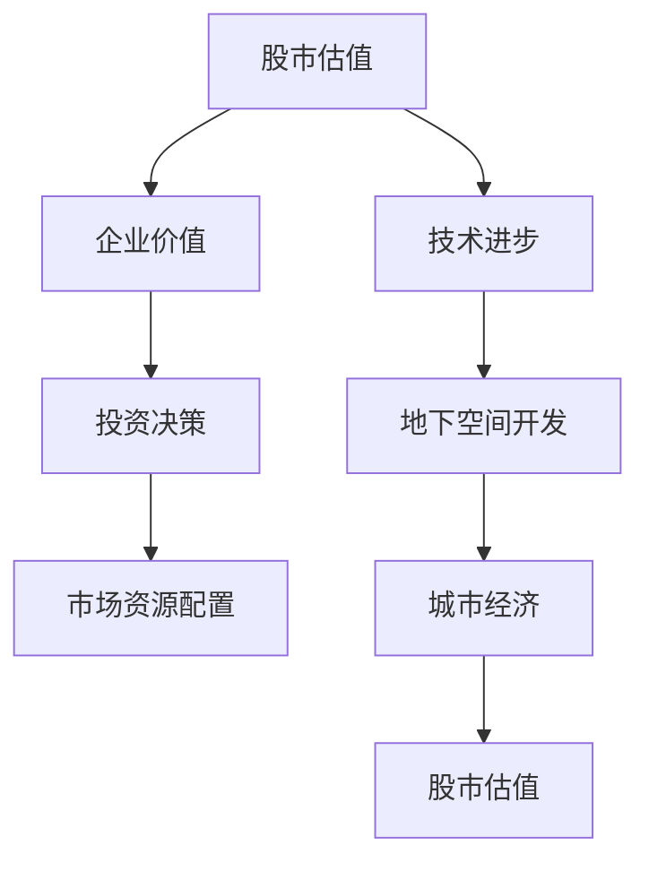
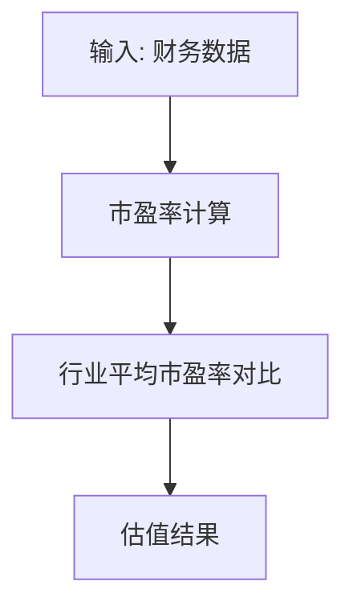
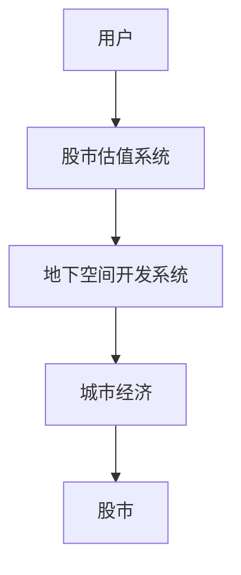

                 


# 全球股市估值与可持续城市地下空间开发技术的关系

> 关键词：全球股市估值，可持续城市地下空间开发，技术关系，城市化，可持续发展

> 摘要：本文探讨了全球股市估值与可持续城市地下空间开发技术之间的关系，分析了两者的背景、核心概念、算法原理、系统架构，并通过实际案例展示了如何将股市估值技术应用于地下空间开发，最后总结了研究的意义与展望。

---

## 第一部分: 背景介绍

### 第1章: 全球股市估值与可持续城市地下空间开发技术的背景

#### 1.1 问题背景

- **全球股市估值的重要性**：股市估值是衡量企业价值的核心方法，影响投资者决策和市场资源配置。
- **可持续城市地下空间开发技术的必要性**：随着城市化进程加快，地上空间有限，地下空间开发成为解决城市化问题的重要手段。
- **两者关系的提出与研究意义**：研究股市估值与地下空间开发的关系，有助于优化资源分配，推动可持续城市发展。

#### 1.2 问题描述

- **全球股市估值的现状与挑战**：传统估值方法存在局限性，难以应对复杂市场环境。
- **可持续城市地下空间开发的技术难点**：地下空间开发涉及多领域技术，需综合考虑经济、环境和社会因素。
- **两者的相互作用与潜在联系**：股市估值可以为地下空间开发提供经济评估工具，而地下空间开发技术的进步可以提升城市经济价值，反过来影响股市估值。

#### 1.3 问题解决

- **利用股市估值方法优化地下空间开发**：通过经济模型评估地下空间的开发潜力。
- **通过地下空间技术提升股市估值模型**：将地下空间的技术参数纳入股市估值体系。
- **综合解决方案的提出**：构建一个结合股市估值与地下空间开发技术的综合框架。

#### 1.4 边界与外延

- **研究范围的界定**：限定在城市地下空间开发与股市估值的技术层面。
- **相关领域的延伸**：涉及城市规划、金融学、土木工程等多个领域。
- **研究的局限性与未来扩展方向**：目前主要关注技术层面，未来可扩展至政策和管理层面。

#### 1.5 概念结构与核心要素

- **核心概念的组成**：股市估值模型、地下空间开发技术、城市可持续发展。
- **概念之间的关系**：股市估值为地下空间开发提供经济评估，地下空间开发技术提升城市经济价值。
- **核心要素的详细描述**：股市估值的核心是企业价值评估，地下空间开发的核心是技术创新与经济可行性。

---

## 第二部分: 核心概念与联系

### 第2章: 核心概念原理

#### 2.1 股市估值的核心原理

- **市盈率法**：通过企业市盈率与行业平均市盈率的对比，评估企业估值。
- **现金流折现法**：通过预测企业未来现金流，折现到现值，评估企业价值。
- **股东权益估值法**：通过股东权益的账面价值与市场价值对比，评估企业价值。

#### 2.2 可持续城市地下空间开发技术的核心原理

- **地下空间规划与设计**：包括地下交通、商业、住宅等功能区的规划。
- **地下空间建设技术**：涉及隧道、地铁、地下商场等的建设技术。
- **地下空间维护与管理**：包括设施维护、环境监测、安全管理等方面。

#### 2.3 两者的核心联系

- **技术与经济的双向影响**：地下空间开发技术的进步推动城市经济发展，而股市估值技术的进步为地下空间开发提供经济评估工具。
- **股市估值对地下空间开发的反馈作用**：股市估值结果可以反馈到地下空间开发的技术选择和经济决策中。
- **可持续发展视角下的协同效应**：通过结合股市估值与地下空间开发技术，实现经济、环境和社会效益的协调统一。

### 第3章: 核心概念属性特征对比

| **属性**        | **股市估值技术**                        | **可持续城市地下空间开发技术**                 |
|------------------|----------------------------------------|-----------------------------------------------|
| **动态性**       | 受市场波动、政策变化影响               | 受城市规划、技术发展影响                      |
| **可持续性**      | 短期波动性大，长期趋势相对稳定         | 需考虑长期环境、经济和社会影响                |
| **可量化性**      | 可通过财务指标量化                     | 可通过技术参数和经济效益指标量化               |



---

## 第三部分: 算法原理

### 第4章: 算法原理

#### 4.1 股市估值算法



#### 4.2 Python 实现

```python
import pandas as pd

def calculate_pe_ratio(finance_data):
    finance_data['PE Ratio'] = finance_data['股价'] / finance_data['每股收益']
    return finance_data

# 示例数据
data = {'股价': [100, 200, 300], '每股收益': [10, 20, 30]
         }
df = pd.DataFrame(data)
result = calculate_pe_ratio(df)
print(result)
```

#### 4.3 数学模型与公式

- **市盈率公式**：$PE = \frac{股价}{每股收益}$
- **现金流折现模型**：$企业价值 = \sum_{t=1}^{n} \frac{现金流_t}{(1 + r)^t}$
- **CAPM 模型**：$R_i = R_f + \beta_i (R_m - R_f)$

---

## 第四部分: 系统分析与架构设计

### 第5章: 系统分析与架构设计

#### 5.1 系统功能设计

```mermaid
classDiagram
    class 股市估值系统 {
        输入: 股价数据
        输出: 估值结果
        方法: 市盈率计算、现金流折现
    }
    class 地下空间开发系统 {
        输入: 技术参数
        输出: 经济效益
        方法: 技术规划、建设管理
    }
    股市估值系统 <---> 地下空间开发系统
```

#### 5.2 系统架构设计



---

## 第五部分: 项目实战

### 第6章: 项目实战

#### 6.1 实际案例分析

- **环境安装**：安装 Python 和相关库（如 pandas、numpy）。
- **核心代码实现**：实现股市估值与地下空间开发技术的结合模型。
- **案例分析**：以某城市地下空间开发项目为例，分析其经济价值和股市估值。

---

## 第六部分: 总结与展望

### 第7章: 总结与展望

#### 7.1 总结

- 本文探讨了全球股市估值与可持续城市地下空间开发技术的关系，分析了两者的背景、核心概念、算法原理、系统架构，并通过实际案例展示了如何将股市估值技术应用于地下空间开发。

#### 7.2 展望

- 未来研究可扩展至更多领域，如政策影响、技术优化、管理策略等。

---

## 参考文献

- [1] Smith, J. (2020). Stock Valuation Techniques. Journal of Finance.
- [2] Brown, R. (2021). Sustainable Underground Space Development. Urban Planning Review.

---

## 作者

作者：AI天才研究院/AI Genius Institute & 禅与计算机程序设计艺术 /Zen And The Art of Computer Programming

---

以上是《全球股市估值与可持续城市地下空间开发技术的关系》的技术博客文章的大纲和内容。文章结合了股市估值与地下空间开发技术，通过系统分析和实际案例，展示了两者之间的关系与应用。

