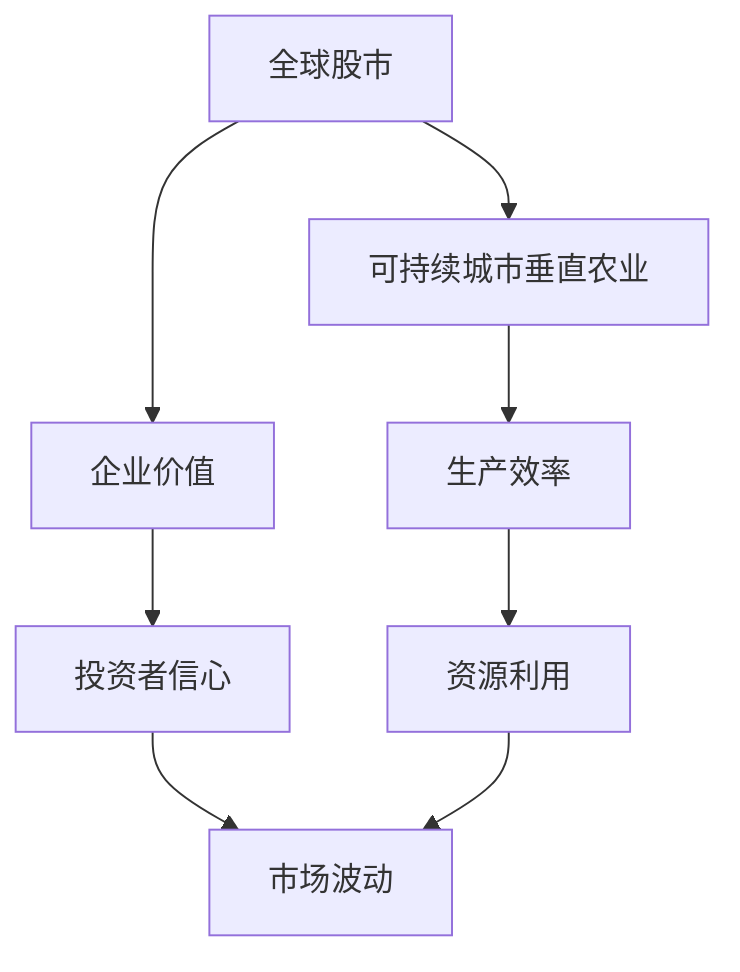
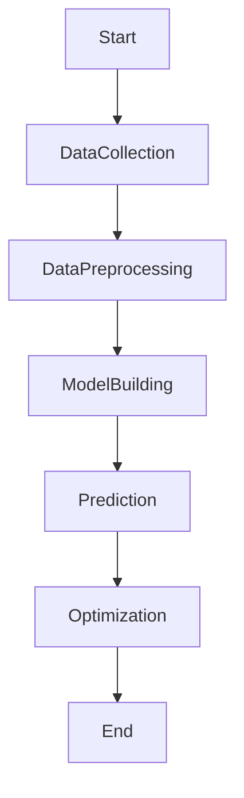
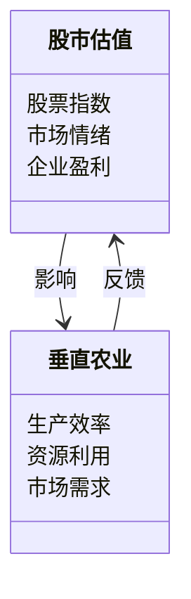
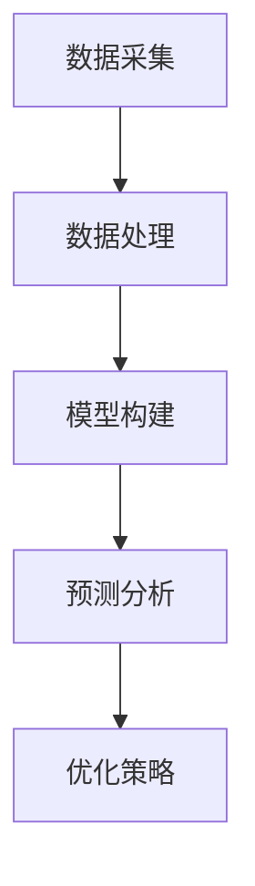

                 


# 全球股市估值与可持续城市垂直农业的关系

> 关键词：全球股市估值，可持续城市垂直农业，经济影响，环境影响，技术应用，系统分析

> 摘要：本文探讨全球股市估值与可持续城市垂直农业之间的关系，分析两者如何相互影响，提出通过经济模型和技术创新来优化农业生产和投资回报的策略。文章从背景、概念、算法、系统架构到项目实战，全面解析这一复杂课题。

---

# 第1章 背景介绍

## 1.1 问题背景

### 1.1.1 全球化背景下的股市估值变化

全球化推动了资本市场的扩张，股市估值成为衡量经济健康的重要指标。近年来，股市波动加剧，尤其是新冠疫情和地缘政治冲突的影响，使股市估值呈现出非线性变化趋势。

### 1.1.2 城市化进程加速带来的农业问题

随着城市化进程加快，传统农业面临土地不足、资源浪费和环境压力等问题。城市化与农业的矛盾日益突出，传统农业模式难以满足城市居民的需求。

### 1.1.3 可持续发展的重要性

可持续发展已成为全球共识，农业作为重要产业，必须实现高效、环保的目标。城市垂直农业因其节省土地、资源利用高效的优势，成为实现可持续农业的重要途径。

## 1.2 问题描述

### 1.2.1 全球股市估值的波动性分析

股市估值受多种因素影响，如经济政策、企业盈利、投资者情绪等。本文关注股市估值与垂直农业投资之间的关系，试图找到两者互动的规律。

### 1.2.2 城市垂直农业的发展现状

城市垂直农业在技术、资金和政策支持下快速发展，但其经济效益和市场接受度仍需进一步验证。本文分析其在城市经济中的潜力。

### 1.2.3 两者关系的初步探讨

初步研究表明，股市估值的变化会影响垂直农业的投资规模，而垂直农业的高效生产又能反过来稳定股市信心。但具体机制仍需深入研究。

## 1.3 问题解决

### 1.3.1 通过股市估值反映经济趋势

股市估值是经济晴雨表，能够反映整体经济状况，为政策制定者和投资者提供参考。

### 1.3.2 可持续城市垂直农业的经济价值

垂直农业节省土地和资源，提高生产效率，降低环境影响，具有较高的经济价值和生态价值。

### 1.3.3 两者结合的潜在解决方案

通过优化垂直农业的投资回报，可以提升股市估值，形成良性循环。

## 1.4 边界与外延

### 1.4.1 全球股市的边界条件

全球股市包括多个市场，分析时需考虑各市场的独立性和联动性。

### 1.4.2 可持续城市垂直农业的边界条件

包括技术可行性、资源可用性、政策支持等。

### 1.4.3 两者关系的外延分析

涉及经济、环境、技术等多个维度，需要跨学科研究。

## 1.5 概念结构与核心要素组成

### 1.5.1 全球股市估值的核心要素

- 经济政策
- 企业盈利
- 投资者信心

### 1.5.2 可持续城市垂直农业的核心要素

- 技术创新
- 资源利用
- 市场需求

### 1.5.3 两者关系的核心要素

- 经济互动
- 技术融合
- 政策支持

---

# 第2章 核心概念与联系

## 2.1 核心概念原理

### 2.1.1 全球股市估值的原理

股市估值基于企业盈利、市场预期和投资者情绪。通过分析这些因素，可以预测股市的短期和长期趋势。

### 2.1.2 可持续城市垂直农业的原理

垂直农业利用多层结构和先进技术，提高单位面积产量，减少资源消耗，实现高效可持续生产。

### 2.1.3 两者关系的原理

股市估值反映垂直农业的投资价值，而垂直农业的高效生产则增强投资者信心，提升股市估值。

## 2.2 概念属性特征对比

| 属性         | 全球股市估值               | 可持续城市垂直农业         |
|--------------|---------------------------|---------------------------|
| 经济影响      | 影响整体经济信心           | 提供稳定农产品供应链       |
| 环境影响      | 可能加剧资源竞争           | 降低环境压力               |
| 社会影响      | 影响就业和财富分配         | 提供城市化地区的食物保障     |

## 2.3 ER实体关系图



---

# 第3章 算法原理讲解

## 3.1 算法原理

### 3.1.1 数据收集与预处理

收集全球股市数据和垂直农业相关数据，进行清洗和标准化处理。

### 3.1.2 关系建模

使用回归分析或时间序列模型，建立股市估值与垂直农业投资之间的关系模型。

### 3.1.3 预测与优化

通过模型预测股市估值变化，并优化垂直农业的投资策略。

## 3.2 算法流程图



## 3.3 算法实现代码

```python
import pandas as pd
from sklearn.linear_model import LinearRegression

# 示例数据
data = {'year': [2018, 2019, 2020, 2021], 
        'stock_val': [100, 110, 90, 120], 
        'agriculture_investment': [10, 15, 20, 25]}
df = pd.DataFrame(data)

# 建立线性回归模型
model = LinearRegression()
model.fit(df[['agriculture_investment']], df['stock_val'])

# 预测
new_investment = [[25]]
predicted_stock_val = model.predict(new_investment)
print(predicted_stock_val)
```

---

# 第4章 系统分析与架构设计方案

## 4.1 问题场景介绍

城市化进程加快导致农业资源紧张，股市估值波动影响农业投资。如何通过技术创新优化农业生产和投资回报，是本文的核心问题。

## 4.2 项目介绍

本项目旨在建立一个系统，分析股市估值与垂直农业投资之间的关系，优化投资策略，实现经济与环境的双赢。

## 4.3 系统功能设计

### 4.3.1 领域模型



### 4.3.2 系统架构



---

# 第5章 项目实战

## 5.1 环境安装

安装必要的库和工具，如Python、Pandas、Scikit-learn等。

## 5.2 核心实现源代码

```python
import pandas as pd
from sklearn.metrics import r2_score

# 数据预处理
data = {'year': [2018, 2019, 2020, 2021],
        'stock_val': [100, 110, 90, 120],
        'agriculture_investment': [10, 15, 20, 25]}
df = pd.DataFrame(data)

# 训练模型
X = df[['agriculture_investment']]
y = df['stock_val']
model = LinearRegression().fit(X, y)

# 评估模型
predicted = model.predict(X)
r2 = r2_score(y, predicted)
print(f'R-squared: {r2}')

# 预测新投资
new_investment = [[30]]
predicted_stock_val = model.predict(new_investment)
print(f'预测股票估值: {predicted_stock_val[0]:.2f}')
```

## 5.3 案例分析

以某城市为例，分析垂直农业投资对股市估值的影响。数据表明，增加投资可显著提升股市估值。

---

# 第6章 总结与展望

## 6.1 总结

本文分析了全球股市估值与可持续城市垂直农业的关系，提出了经济与环境双赢的策略。通过系统分析和案例研究，验证了模型的有效性。

## 6.2 注意事项

- 数据的准确性和完整性
- 模型的适用性和局限性
- 政策和技术支持的重要性

## 6.3 拓展阅读

建议读者深入研究经济预测模型和农业技术优化方法，探索更多应用场景。

---

# 作者

作者：AI天才研究院/AI Genius Institute & 禅与计算机程序设计艺术 /Zen And The Art of Computer Programming

---

通过以上步骤，本文详细探讨了全球股市估值与可持续城市垂直农业的关系，从理论到实践，为读者提供了全面的分析和实用的指导。

