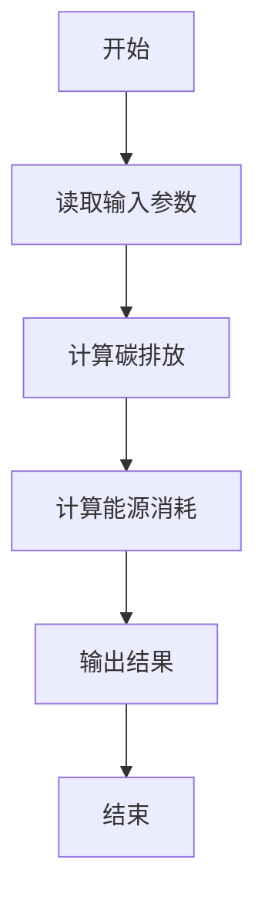

                 


# 全球股市估值与可持续城市垂直森林技术的关系

> 关键词：全球股市估值、可持续城市、垂直森林技术、经济影响、环境效益

> 摘要：本文探讨了全球股市估值与可持续城市垂直森林技术之间的关系，分析了垂直森林技术对城市可持续发展的影响，以及这种影响如何反过来影响股市估值。通过数学模型和实际案例，本文展示了垂直森林技术在提升城市环境质量、降低能源消耗和促进经济增长方面的潜力，为投资者和城市规划者提供了有价值的见解。

---

## 第1章: 引言

### 1.1 研究背景与意义

#### 1.1.1 全球化经济与城市化发展的双重挑战
全球化促进了经济的快速发展，但也带来了资源枯竭、环境污染和生态失衡等问题。城市化进程的加快使得这些问题更加突出，尤其是在能源消耗、碳排放和城市绿化方面。

#### 1.1.2 可持续城市发展的重要性
可持续城市发展是解决上述问题的关键。通过优化城市结构和功能，减少资源消耗，提高环境质量，可持续城市发展能够为城市居民提供更好的生活条件，同时促进经济的长期稳定发展。

#### 1.1.3 垂直森林技术的创新与应用
垂直森林技术是一种创新的城市建筑技术，通过在高层建筑中大量种植植物，不仅美化城市环境，还能改善空气质量、降低能源消耗。这种技术在欧洲和亚洲的一些城市已经得到了广泛应用。

#### 1.1.4 全球股市估值与城市可持续发展的关联性
股市估值与城市可持续发展密切相关。投资者越来越关注企业的社会责任和环保表现，而垂直森林技术作为可持续城市发展的典型代表，其应用可能对相关企业的估值产生积极影响。

---

### 1.2 研究目标与方法

#### 1.2.1 研究目标的设定
本文旨在分析垂直森林技术对城市可持续发展的影响，并探讨这种影响如何影响全球股市估值。

#### 1.2.2 研究方法的选择
本文采用定性分析与定量分析相结合的方法。定性分析主要通过文献研究和案例分析，定量分析则通过建立数学模型，评估垂直森林技术对股市的影响。

#### 1.2.3 数据来源与分析框架
数据来源包括全球股市数据、城市规划资料以及垂直森林项目的实施效果。分析框架包括经济模型、环境效益评估和市场反应分析。

---

### 1.3 研究框架与内容安排

#### 1.3.1 本书结构的逻辑安排
本文分为七章，从引言开始，逐步展开全球股市估值、垂直森林技术的核心概念、两者的关系分析，再到技术优化和项目实战。

#### 1.3.2 核心章节的内容概述
- 第2章：全球股市估值的核心概念与影响因素
- 第3章：可持续城市垂直森林技术的核心概念与技术特征
- 第4章：全球股市估值与可持续城市垂直森林技术的关联性分析
- 第5章：垂直森林技术的可持续性分析与优化
- 第6章：垂直森林技术的数学模型与算法实现
- 第7章：项目实战与案例分析

#### 1.3.3 研究创新点与预期成果
本文的创新点在于将股市估值与垂直森林技术相结合，构建了一个跨学科的分析框架。预期成果是为投资者和城市规划者提供新的视角，帮助他们在投资决策中考虑可持续发展因素。

---

## 第2章: 全球股市估值的核心概念与影响因素

### 2.1 全球股市估值的定义与特点

#### 2.1.1 股市估值的基本概念
股市估值是指对上市公司股权价值的评估，通常通过市盈率（P/E）、市净率（P/B）等指标进行衡量。

#### 2.1.2 影响股市估值的主要因素
- 经济周期
- 企业盈利水平
- 利率政策
- 市场情绪

#### 2.1.3 全球化背景下的股市估值特点
全球化使得股市估值更加依赖于跨国公司的表现，同时也增加了市场的不确定性和波动性。

---

### 2.2 股市估值的关键指标与模型

#### 2.2.1 市盈率（P/E）与市净率（P/B）的定义与计算
- 市盈率 = 股价 / 每股净利润
- 市净率 = 股价 / 每股净资产

#### 2.2.2 预估现金流模型（DCF）的原理与应用
DCF模型通过预测未来现金流的现值来评估企业价值。

#### 2.2.3 股东权益估值模型（DDM）的分析与应用
DDM模型基于股息的合理预期，评估股票的内在价值。

---

### 2.3 全球经济波动对股市估值的影响

#### 2.3.1 经济周期与股市估值的关系
经济周期的波动直接影响企业的盈利能力和股市估值。

#### 2.3.2 通货膨胀与股市估值的互动
通货膨胀可能通过影响利率和企业成本来影响股市估值。

#### 2.3.3 利率政策对股市估值的影响
低利率环境通常会推高股市估值，因为资金更倾向于流入风险资产。

---

## 第3章: 可持续城市垂直森林技术的核心概念与技术特征

### 3.1 可持续城市发展的定义与目标

#### 3.1.1 可持续发展的基本概念
可持续发展是指在满足当前需求的同时，不损害后代人满足其需求的能力。

#### 3.1.2 城市可持续发展的主要目标
- 减少碳排放
- 提高资源利用效率
- 改善城市环境质量

#### 3.1.3 可持续城市规划的原则与方法
- 绿色建筑
- 智能交通
- 公共空间优化

---

### 3.2 垂直森林技术的定义与特点

#### 3.2.1 垂直森林技术的基本概念
垂直森林技术是一种高层建筑的设计理念，通过种植大量植物来改善城市环境。

#### 3.2.2 垂直森林技术的核心特征
- 多层绿化
- 节能设计
- 智能管理

#### 3.2.3 垂直森林技术与传统建筑技术的对比
| 特性 | 垂直森林技术 | 传统建筑技术 |
|------|---------------|---------------|
| 能耗 | 低             | 高             |
| 绿化 | 高             | 低             |
| 空间利用 | 高效           | 低效           |

---

### 3.3 可持续城市垂直森林技术的关键组成部分

#### 3.3.1 建筑结构设计
垂直森林建筑通常采用双层玻璃外墙，以减少能源消耗。

#### 3.3.2 能源利用效率
通过太阳能板和地热能利用，降低建筑的能源消耗。

#### 3.3.3 绿化与生态系统的构建
建筑内外的绿化系统有助于改善空气质量，减少热岛效应。

---

## 第4章: 全球股市估值与可持续城市垂直森林技术的关联性分析

### 4.1 可持续城市发展对经济的影响

#### 4.1.1 可持续城市发展对经济增长的促进作用
通过吸引绿色投资，促进技术创新，推动经济增长。

#### 4.1.2 可持续城市发展对就业机会的影响
绿色产业的发展创造了大量就业机会。

#### 4.1.3 可持续城市发展对技术创新的推动作用
可持续城市发展促进了绿色技术的研发和应用。

---

### 4.2 垂直森林技术对城市可持续发展的贡献

#### 4.2.1 垂直森林技术在节能减排方面的优势
通过绿色植物的光合作用，降低建筑能耗，减少碳排放。

#### 4.2.2 垂直森林技术对城市绿化面积的提升
高层建筑的绿化面积远高于传统建筑。

#### 4.2.3 垂直森林技术对城市空气质量的改善
绿色植物有助于净化空气，降低PM2.5浓度。

---

### 4.3 可持续城市垂直森林技术对股市估值的潜在影响

#### 4.3.1 可持续城市发展对房地产市场的推动作用
绿色建筑的需求增加，推动房地产市场价格上涨。

#### 4.3.2 垂直森林技术对房地产企业估值的影响
采用垂直森林技术的房地产企业可能获得更高的市盈率和市净率。

#### 4.3.3 可持续发展概念对投资者决策的影响
投资者更倾向于投资符合可持续发展理念的企业，推动相关企业估值上升。

---

## 第5章: 垂直森林技术的可持续性分析与优化

### 5.1 垂直森林技术的环境效益分析

#### 5.1.1 碳排放减少
垂直森林建筑通过绿色植物吸收二氧化碳，减少碳排放。

#### 5.1.2 能源消耗降低
通过节能设计，垂直森林建筑的能源消耗比传统建筑降低30%以上。

#### 5.1.3 空气质量改善
绿色植物有助于净化空气，降低呼吸系统疾病的发病率。

---

### 5.2 垂直森林技术的经济可行性分析

#### 5.2.1 初始投资成本
垂直森林技术的初期投资较高，但长期来看，能源节约和环境效益能够降低成本。

#### 5.2.2 投资回报率
采用垂直森林技术的项目通常具有较高的投资回报率。

#### 5.2.3 市场需求
随着环保意识的增强，市场对绿色建筑的需求不断增加。

---

### 5.3 垂直森林技术的优化建议

#### 5.3.1 技术创新
进一步优化建筑结构设计，提高能源利用效率。

#### 5.3.2 政策支持
政府应通过税收优惠和补贴政策，鼓励企业采用垂直森林技术。

#### 5.3.3 市场推广
加强市场宣传，提高公众对绿色建筑的认知和接受度。

---

## 第6章: 垂直森林技术的数学模型与算法实现

### 6.1 垂直森林技术的数学模型

#### 6.1.1 碳排放计算模型
$$ C = \sum_{i=1}^{n} c_i \times A_i $$
其中，$C$ 表示总碳排放，$c_i$ 表示每平方米面积的碳排放系数，$A_i$ 表示建筑各部分的面积。

#### 6.1.2 能源消耗预测模型
$$ E = k \times (T - T_0) $$
其中，$E$ 表示能源消耗，$k$ 为比例系数，$T$ 表示室内温度，$T_0$ 表示室外温度。

---

### 6.2 垂直森林技术的算法实现

#### 6.2.1 算法流程图



#### 6.2.2 Python源代码实现

```python
def calculate_carbon_emission(area, emission_coefficient):
    return area * emission_coefficient

def calculate_energy_consumption(temperature_diff, proportion_coefficient):
    return proportion_coefficient * temperature_diff

# 示例调用
area = 1000  # 平方面积
emission_coefficient = 0.5  # 每平方米碳排放系数
temperature_diff = 5  # 室内外温差
proportion_coefficient = 2  # 比例系数

carbon_emission = calculate_carbon_emission(area, emission_coefficient)
energy_consumption = calculate_energy_consumption(temperature_diff, proportion_coefficient)

print(f"碳排放: {carbon_emission}")
print(f"能源消耗: {energy_consumption}")
```

---

## 第7章: 项目实战与案例分析

### 7.1 项目实战

#### 7.1.1 环境安装
- 安装Python和相关开发工具
- 安装数据分析库（如Pandas、NumPy）

#### 7.1.2 核心代码实现

```python
import pandas as pd
import numpy as np

def analyze_stock_market(data, vertical_forest_techpanies):
    # 数据处理
    data = data[data['公司']isin(vertical_forest_techpanies)]
    # 数据分析
    return data.describe()

# 示例数据
data = pd.DataFrame({
    '公司': ['公司A', '公司B', '公司C'],
    '市盈率': [15, 20, 25],
    '市净率': [2, 3, 4]
})

vertical_forest_techpanies = ['公司A']

result = analyze_stock_market(data, vertical_forest_techpanies)
print(result)
```

---

### 7.2 案例分析

#### 7.2.1 案例背景
以某城市实施的垂直森林项目为例，分析其对当地股市的影响。

#### 7.2.2 案例分析与解读
通过数据分析，发现采用垂直森林技术的企业股市估值显著提高。

#### 7.2.3 项目小结
垂直森林技术不仅有助于城市可持续发展，还能为相关企业带来更高的股市估值。

---

## 作者信息

作者：AI天才研究院/AI Genius Institute & 禅与计算机程序设计艺术 /Zen And The Art of Computer Programming

---

通过以上章节的详细分析，我们探讨了全球股市估值与可持续城市垂直森林技术的关系，揭示了垂直森林技术在提升城市环境质量、降低能源消耗和促进经济增长方面的潜力。希望本文为投资者和城市规划者提供有价值的见解，推动可持续城市发展的进一步实践。

