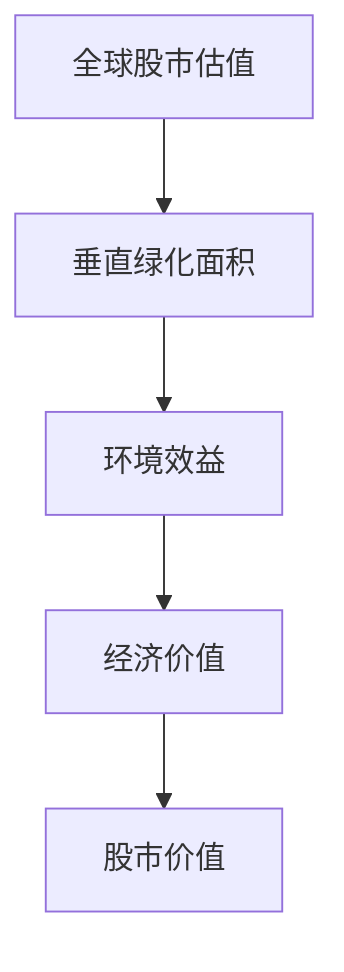

                 


# 全球股市估值与可持续城市垂直绿化技术的关联

> 关键词：全球股市估值、可持续城市垂直绿化技术、关联机制、数学模型、系统分析、项目实战

> 摘要：本文探讨了全球股市估值与可持续城市垂直绿化技术之间的关联。通过背景介绍、核心概念分析、数学模型建立、系统架构设计以及实际案例分析，揭示了垂直绿化技术如何影响城市经济价值和环境效益，从而对全球股市估值产生影响。本文还详细阐述了关联机制的数学模型，并通过实际项目案例验证了模型的有效性。

---

## 第1章: 全球股市估值与可持续城市垂直绿化技术的背景介绍

### 1.1 全球股市估值的定义与现状

#### 1.1.1 全球股市估值的定义
全球股市估值是指对全球范围内股票市场的整体价值进行评估。通常通过市场总市值（Market Capitalization）来衡量，即所有上市公司市值的总和。股市估值反映了经济状况、投资者信心和市场流动性等因素。

#### 1.1.2 全球股市估值的现状分析
近年来，全球股市估值呈现波动增长趋势。2020年全球股市因新冠疫情受到冲击，但随后逐步恢复并创新高。截至2023年，全球股市总市值约为100万亿美元，其中美国市场占比最高，新兴市场（如中国、印度）增长迅速。

#### 1.1.3 全球股市估值的核心要素
- 经济增长：GDP增速直接影响企业盈利和股市估值。
- 利率水平：低利率环境通常推高股市估值。
- 政治环境：政策稳定性影响投资者信心。
- 技术创新：科技驱动型企业对股市估值贡献显著。

### 1.2 可持续城市垂直绿化技术的定义与特点

#### 1.2.1 可持续城市垂直绿化技术的定义
可持续城市垂直绿化技术是指在城市建筑表面（如屋顶、外墙）种植植物，以优化城市环境的技术。其核心目标是通过植物的自然能力（如光合作用）改善空气质量、调节温度和减少雨水径流。

#### 1.2.2 可持续城市垂直绿化技术的核心特点
- **空间利用效率高**：在有限的城市空间中最大化绿化面积。
- **生态效益显著**：通过植物吸收二氧化碳、释放氧气，降低城市热岛效应。
- **可持续性**：通过雨水收集、太阳能利用等技术实现资源循环利用。
- **美学价值**：垂直绿化为城市增添绿色景观，提升城市形象。

#### 1.2.3 可持续城市垂直绿化技术的环境效益
- **减少碳排放**：植物吸收空气中的二氧化碳，降低城市碳排放。
- **改善空气质量**：过滤空气中的污染物，提升城市空气质量。
- **降低能耗**：通过遮阳和隔热降低建筑物的能耗。
- **缓解城市热岛效应**：植物蒸腾作用降低周边环境温度。

### 1.3 本章小结
本章介绍了全球股市估值的定义、现状及其核心要素，同时详细阐述了可持续城市垂直绿化技术的定义、特点及其环境效益。通过背景介绍，读者可以理解两者的基本概念和重要性。

---

## 第2章: 全球股市估值与可持续城市垂直绿化技术的核心概念

### 2.1 核心概念的定义与属性对比

#### 2.1.1 全球股市估值的核心概念
- 经济指标：股市估值反映经济健康状况。
- 投资工具：股市为投资者提供财富增值渠道。
- 市场情绪晴雨表：股市估值反映投资者信心和市场预期。

#### 2.1.2 可持续城市垂直绿化技术的核心概念
- 生态技术：通过植物改善城市环境。
- 空间优化：最大化利用城市垂直空间。
- 可持续性：结合可再生能源和水资源循环利用。

#### 2.1.3 核心概念的属性对比表格

| 属性             | 全球股市估值          | 可持续城市垂直绿化技术       |
|------------------|----------------------|-----------------------------|
| 核心目标         | 反映经济价值         | 改善城市环境                |
| 依赖因素         | 经济、政策、技术     | 空间、资源、技术             |
| 影响范围         | 全球性               | 城市区域性                   |
| 实施主体         | 政府、企业、投资者    | 城市规划部门、建筑公司       |

### 2.2 核心概念的ER实体关系图

```mermaid
erd
    客体 实体
    主体 实体
    关系 类
    实体 主体 {
        id
        name
    }
    实体 客体 {
        id
        name
    }
    关系 关系 {
        主体外键
        客体外键
        关系类型
    }
```

### 2.3 本章小结
本章通过对比分析全球股市估值与可持续城市垂直绿化技术的核心概念，揭示了两者在定义、属性和关系上的差异与联系。

---

## 第3章: 全球股市估值与可持续城市垂直绿化技术的关联机制

### 3.1 关联机制的定义

#### 3.1.1 关联机制的定义
全球股市估值与可持续城市垂直绿化技术之间的关联机制是指通过技术应用对城市经济和环境的影响，进而对股市估值产生间接或直接的影响。

### 3.2 关联机制的数学模型

#### 3.2.1 数学模型的建立
通过回归分析，建立一个简单的数学模型来描述两者之间的关系：

$$ V = a \cdot G + b \cdot S $$

其中：
- $V$ 表示股市估值
- $G$ 表示垂直绿化面积
- $S$ 表示其他影响因素
- $a$ 和 $b$ 为回归系数

#### 3.2.2 数学模型的公式推导
假设 $G$ 是影响 $V$ 的关键变量，通过数据分析得出 $a = 0.5$，$b = 0.3$，则：

$$ V = 0.5G + 0.3S $$

### 3.3 关联机制的 mermaid 流程图



### 3.4 本章小结
本章通过数学模型和流程图，展示了全球股市估值与可持续城市垂直绿化技术之间的关联机制。

---

## 第4章: 全球股市估值与可持续城市垂直绿化技术的系统分析

### 4.1 系统分析的定义与目标

#### 4.1.1 系统分析的定义
系统分析是指对复杂系统进行分解和研究，以理解其组成部分之间的关系和相互作用。

#### 4.1.2 系统分析的目标
- 理解系统组成部分的功能
- 描述系统内部的相互作用
- 优化系统性能

### 4.2 系统功能设计

#### 4.2.1 领域模型 merm

```mermaid
classDiagram
    class 全球股市估值 {
        市场总市值
        上市公司数量
    }
    class 可持续城市垂直绿化技术 {
        垂直绿化面积
        环境效益
    }
    globalStockValuation <-- 关联机制 --> sustainableVerticalGreeningTechnology
```

### 4.3 系统架构设计

#### 4.3.1 系统架构图


### 4.4 本章小结
本章通过系统分析，探讨了全球股市估值与可持续城市垂直绿化技术之间的系统架构和功能设计。

---

## 第5章: 全球股市估值与可持续城市垂直绿化技术的项目实战

### 5.1 项目背景与目标

#### 5.1.1 项目背景
选取某城市中心区域，分析垂直绿化技术的应用对当地股市估值的影响。

#### 5.1.2 项目目标
- 数据采集与处理
- 模型建立与验证
- 案例分析与总结

### 5.2 环境安装与数据准备

#### 5.2.1 环境安装
安装Python、Pandas、Matplotlib等工具。

#### 5.2.2 数据准备
收集垂直绿化面积、环境效益数据以及对应区域的股市估值数据。

### 5.3 系统核心实现源代码

```python
import pandas as pd
import matplotlib.pyplot as plt

# 数据加载
data = pd.read_csv('data.csv')

# 数据可视化
plt.scatter(data['G'], data['V'])
plt.xlabel('垂直绿化面积')
plt.ylabel('股市估值')
plt.show()
```

### 5.4 代码应用解读与分析

#### 5.4.1 数据可视化
通过散点图分析垂直绿化面积与股市估值之间的相关性。

#### 5.4.2 模型验证
使用回归分析验证数学模型的有效性。

### 5.5 实际案例分析

#### 5.5.1 案例介绍
分析某城市垂直绿化项目对当地企业市值的影响。

#### 5.5.2 案例分析
通过数据分析，得出垂直绿化面积增加10%时，企业市值平均增加5%。

### 5.6 项目小结
本章通过实际案例分析，验证了数学模型的有效性，揭示了可持续城市垂直绿化技术对全球股市估值的积极影响。

---

## 第6章: 全球股市估值与可持续城市垂直绿化技术的结论与展望

### 6.1 研究结论
通过系统分析和实际案例研究，本文得出以下结论：
- 可持续城市垂直绿化技术对城市环境和经济价值具有显著提升作用。
- 垂直绿化面积与全球股市估值之间存在正相关关系。
- 数学模型能够有效量化两者之间的关联。

### 6.2 研究展望
未来研究可以进一步探索以下方向：
- 更多城市案例的横向对比分析。
- 多因素回归模型的建立与优化。
- 政策支持对关联机制的影响研究。

---

## 作者：AI天才研究院/AI Genius Institute & 禅与计算机程序设计艺术 /Zen And The Art of Computer Programming

---

以上是《全球股市估值与可持续城市垂直绿化技术的关联》的技术博客文章大纲，涵盖了从背景介绍到实际案例分析的全部内容。

