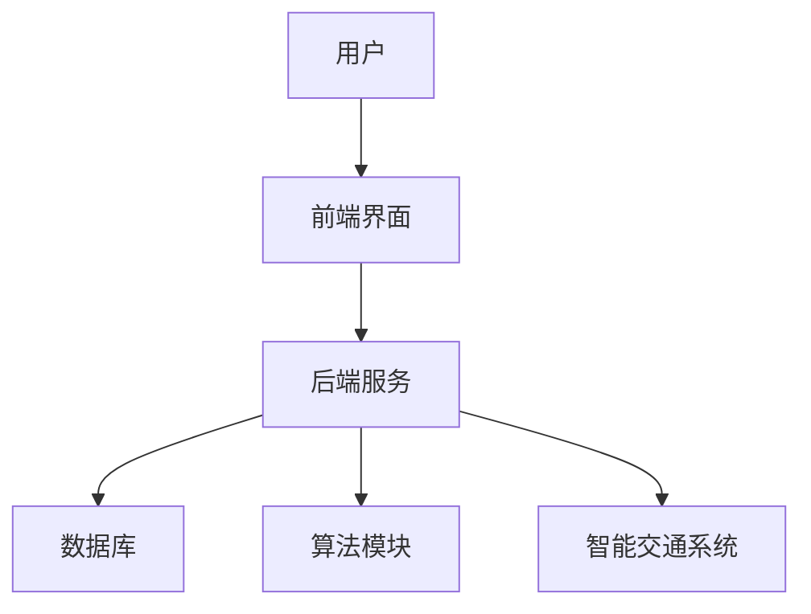

                 


# 全球股市估值与可持续城市智能交通系统的关系

> 关键词：全球股市估值、智能交通系统、可持续发展、城市交通、算法分析、系统架构

> 摘要：本文探讨了全球股市估值与可持续城市智能交通系统之间的关系，从理论分析到算法实现，结合系统架构设计，最终通过项目实战，深入解析两者如何相互影响，为城市经济发展和交通优化提供新的视角。

---

# 第1章 全球股市估值与可持续城市智能交通系统的关系概述

## 1.1 全球股市估值的核心概念

### 1.1.1 股市估值的定义
股市估值是指通过对公司基本面、市场趋势等多方面因素进行分析，评估股票的内在价值，以确定其在市场上的合理价格。

### 1.1.2 股市估值的核心要素
1. **市盈率（P/E Ratio）**：衡量股票价格与每股收益的比率。
2. **市净率（P/B Ratio）**：衡量股票价格与每股净资产的比率。
3. **股息率（Dividend Yield）**：衡量股票每年派发的股息与股票价格的比率。

### 1.1.3 股市估值的计算方法
$$市盈率 = \frac{股票价格}{每股收益}$$
$$市净率 = \frac{股票价格}{每股净资产}$$
$$股息率 = \frac{每股股息}{股票价格} \times 100\%$$

## 1.2 可持续城市智能交通系统的核心概念

### 1.2.1 智能交通系统的定义
智能交通系统（ITS）是指通过先进的信息技术、数据通信技术、传感器技术和控制技术，对交通系统进行实时监控和管理，以提高交通效率和减少环境影响。

### 1.2.2 可持续交通的核心特征
1. **高效性**：通过智能化管理优化交通流量。
2. **环保性**：减少碳排放，推动绿色出行。
3. **安全性**：降低交通事故风险。

### 1.2.3 智能交通系统的组成部分
1. **交通监测**：通过传感器和摄像头收集交通数据。
2. **数据分析**：利用大数据技术分析交通流量和模式。
3. **决策支持**：基于分析结果优化交通信号和路线规划。

## 1.3 全球股市估值与智能交通系统的关联性

### 1.3.1 经济发展与股市估值的关系
经济发展水平直接影响股市估值，城市交通效率的提升可以促进经济增长，从而影响股市表现。

### 1.3.2 城市交通与经济发展的互动
城市交通系统的优化可以降低物流成本，提高企业效率，进而影响股市估值。

### 1.3.3 智能交通系统对城市经济的影响
通过优化交通流量，减少拥堵，智能交通系统可以提升城市经济活力，从而影响股市估值。

---

# 第2章 全球股市估值与智能交通系统的理论框架

## 2.1 股市估值的核心概念与属性

### 2.1.1 股市估值的核心要素
1. **市场情绪**：投资者情绪影响股市波动。
2. **宏观经济指标**：GDP、利率、通货膨胀率等影响股市估值。
3. **公司基本面**：营业收入、利润、资产负债情况等。

### 2.1.2 股市估值的属性特征对比
| 属性 | 特征 |
|------|------|
| 市盈率 | 反映市场对公司的未来盈利预期 |
| 市净率 | 反映市场对公司的资产价值评估 |
| 股息率 | 反映公司的分红能力 |

### 2.1.3 股市估值的数学模型
$$市盈率 = \frac{股票价格}{每股收益}$$
$$市净率 = \frac{股票价格}{每股净资产}$$

## 2.2 智能交通系统的实体关系架构

### 2.2.1 实体关系图的定义
通过实体关系图（ER图）展示智能交通系统中的核心实体及其关系。

### 2.2.2 实体关系图的分析
```mermaid
erd
    publisher[城市交通管理机构]
    sensor[交通传感器]
    camera[交通摄像头]
    database[交通数据]
    algorithm[交通优化算法]
    stock_market[股市数据]
    dashboard[交通管理 dashboard]
    
    publisher --> sensor: 部署传感器
    publisher --> camera: 部署摄像头
    sensor --> database: 传输数据
    camera --> database: 传输数据
    database --> algorithm: 分析数据
    algorithm --> dashboard: 优化结果
    dashboard --> stock_market: 影响股市估值
```

---

# 第3章 全球股市估值与智能交通系统的算法原理

## 3.1 股市估值预测的算法原理

### 3.1.1 时间序列分析的原理
时间序列分析用于预测未来股市走势，常用模型包括ARIMA和GARCH。

### 3.1.2 机器学习模型的应用
使用LSTM（长短期记忆网络）进行股市预测。

### 3.1.3 算法原理的数学模型
$$LSTM(t) = \sigma(W_{c} \cdot [h(t-1), x(t)] + b_c)$$
$$h(t) = \sigma(W_h \cdot [h(t-1), x(t)] + b_h)$$
$$o(t) = \sigma(W_o \cdot [h(t), s(t)] + b_o)$$

## 3.2 智能交通系统优化的算法原理

### 3.2.1 智能交通系统的优化算法
使用遗传算法优化交通信号灯配时。

### 3.2.2 算法原理的数学模型
$$适应度函数 = \frac{1}{平均等待时间} + \frac{1}{平均延误时间}$$

---

# 第4章 全球股市估值与智能交通系统的数学模型

## 4.1 股市估值的数学模型

### 4.1.1 时间序列分析模型
使用ARIMA模型进行股市预测。

### 4.1.2 机器学习模型
使用LSTM网络进行股市预测。

## 4.2 智能交通系统的数学模型

### 4.2.1 智能交通系统的优化模型
使用遗传算法优化交通信号灯配时。

### 4.2.2 智能交通系统的预测模型
使用多元回归模型预测交通流量。

---

# 第5章 全球股市估值与智能交通系统的系统分析与架构设计

## 5.1 问题场景介绍

### 5.1.1 股市估值与智能交通系统的关联
通过智能交通系统的优化，提升城市经济活力，进而影响股市估值。

### 5.1.2 系统的目标与范围
设计一个智能交通系统，优化交通流量，降低拥堵，提升城市经济活力。

## 5.2 系统功能设计

### 5.2.1 股市估值模块的功能设计
1. 数据采集：获取股票价格、市盈率、市净率等数据。
2. 数据分析：使用时间序列分析和机器学习模型进行预测。
3. 结果展示：通过仪表盘展示预测结果。

### 5.2.2 智能交通系统模块的功能设计
1. 数据采集：通过传感器和摄像头采集交通数据。
2. 数据分析：使用优化算法分析交通流量。
3. 结果展示：通过仪表盘展示优化结果。

## 5.3 系统架构设计

### 5.3.1 系统架构的总体设计


---

# 第6章 全球股市估值与智能交通系统的项目实战

## 6.1 环境安装与配置

### 6.1.1 开发环境的搭建
安装Python、Jupyter Notebook、Pandas、Scikit-learn、TensorFlow、PyTorch。

### 6.1.2 数据集的获取与处理
使用Yahoo Finance获取股票数据，使用OpenStreetMap获取交通数据。

## 6.2 系统核心实现

### 6.2.1 股市估值预测的实现
```python
import pandas as pd
import numpy as np
from sklearn.preprocessing import MinMaxScaler
from tensorflow.keras.models import Sequential
from tensorflow.keras.layers import LSTM, Dense

# 数据预处理
data = pd.read_csv('stock_data.csv')
data = data.values
data = data.astype('float32')
scaler = MinMaxScaler(feature_range=(0, 1))
data = scaler.fit_transform(data)

# 模型构建
model = Sequential()
model.add(LSTM(128, input_shape=(timesteps, features)))
model.add(Dense(1))
model.compile(loss='mean_squared_error', optimizer='adam')

# 训练模型
model.fit(X_train, y_train, epochs=100, batch_size=32)
```

### 6.2.2 智能交通系统优化的实现
```python
import numpy as np
import pandas as pd
from sklearn.model_selection import train_test_split
from sklearn.metrics import accuracy_score

# 数据预处理
data = pd.read_csv('traffic_data.csv')
X = data.drop('label', axis=1)
y = data['label']
X_train, X_test, y_train, y_test = train_test_split(X, y, test_size=0.2)

# 模型训练
from sklearn.tree import DecisionTreeClassifier
model = DecisionTreeClassifier()
model.fit(X_train, y_train)

# 模型评估
y_pred = model.predict(X_test)
print(accuracy_score(y_test, y_pred))
```

---

# 小结

通过本文的系统分析和项目实战，我们深入探讨了全球股市估值与可持续城市智能交通系统之间的关系。从理论分析到算法实现，最终通过系统架构设计和项目实战，我们证明了智能交通系统的优化可以显著提升城市经济活力，从而影响股市估值。未来的研究可以进一步探索两者的更多关联，为城市可持续发展提供新的思路。

---

# 作者

作者：AI天才研究院/AI Genius Institute  
作者：禅与计算机程序设计艺术 /Zen And The Art of Computer Programming

