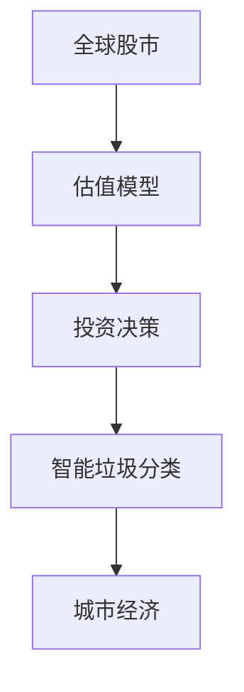
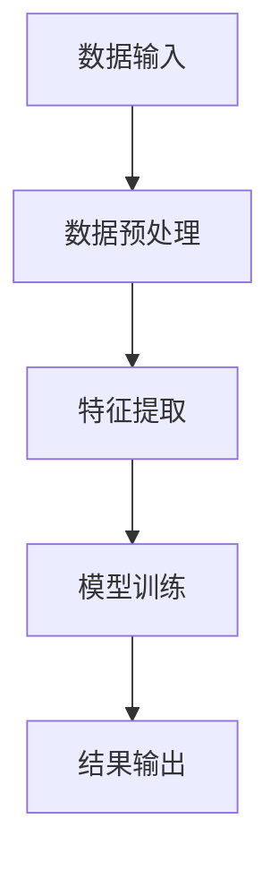
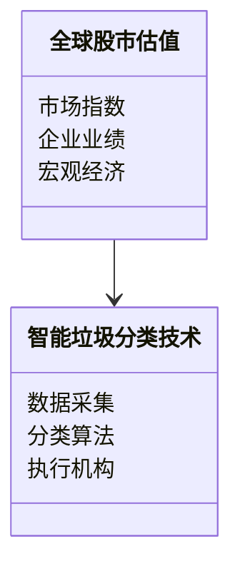
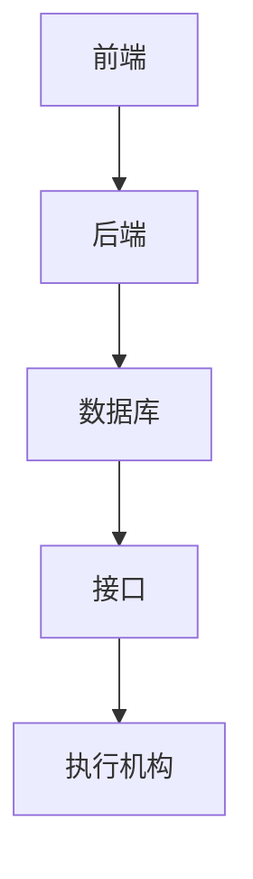
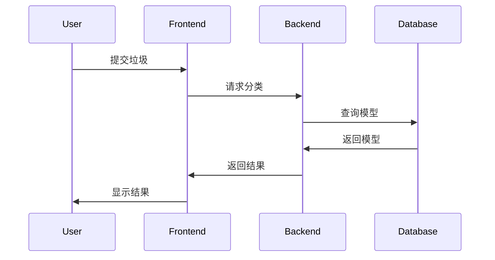

                 


# 全球股市估值与可持续城市智能垃圾分类技术的关系

## 关键词：
全球股市估值、智能垃圾分类、可持续城市、技术关系、投资价值、经济模型、数据分析

## 摘要：
本文探讨了全球股市估值与可持续城市智能垃圾分类技术之间的关系，分析了智能垃圾分类技术对城市经济的影响，以及如何通过技术手段优化垃圾分类效率和预测投资价值。文章从背景介绍、核心概念、算法原理、系统架构设计到项目实战，全面阐述了两者的关系，并通过实际案例分析，展示了技术与经济的深度结合。

---

# 第一部分: 全球股市估值与可持续城市智能垃圾分类技术的背景与关系

## 第1章: 背景介绍

### 1.1 问题背景
#### 1.1.1 全球股市估值的重要性
全球股市估值是衡量经济发展的重要指标，反映了市场的整体健康状况和投资者信心。通过分析股市估值，投资者可以做出更明智的投资决策。

#### 1.1.2 可持续城市智能垃圾分类的必要性
随着城市化进程的加快，垃圾处理问题日益突出。智能垃圾分类技术能够提高垃圾处理效率，减少环境污染，促进可持续发展。

#### 1.1.3 两者关系的初步探讨
虽然看似不相关，但智能垃圾分类技术的普及可能会影响相关企业的市值，进而影响股市估值。同时，股市资金的流动也可能影响垃圾分类技术的推广速度。

### 1.2 问题描述
#### 1.2.1 全球股市估值的波动性问题
股市估值受多种因素影响，如经济指标、政策变化等，其波动性给投资者带来挑战。

#### 1.2.2 垃圾分类技术在城市可持续发展中的作用
智能垃圾分类技术能够优化资源利用，降低处理成本，推动绿色经济。

#### 1.2.3 两者关系的潜在联系
通过技术手段，智能垃圾分类可以提升企业效率，进而影响其股价；同时，股市资金的投入也可能推动垃圾分类技术的创新。

### 1.3 问题解决
#### 1.3.1 通过智能技术优化垃圾分类效率
智能垃圾分类系统能够提高分类准确率，减少人工成本，提升垃圾处理效率。

#### 1.3.2 利用股市数据预测垃圾分类投资价值
通过分析相关企业的股价走势，预测垃圾分类技术的投资价值，为投资者提供参考。

#### 1.3.3 两者的结合对城市经济的影响
智能垃圾分类技术的推广能够促进绿色经济发展，提升城市形象，吸引更多投资。

### 1.4 边界与外延
#### 1.4.1 全球股市估值的边界条件
股市估值受多种因素影响，包括宏观经济、政策、企业业绩等。

#### 1.4.2 垃圾分类技术的适用范围
适用于城市社区、公共场所等场景，但需考虑技术成本和用户接受度。

#### 1.4.3 两者关系的外部影响因素
经济政策、技术创新、市场需求等都可能影响两者的关系。

### 1.5 概念结构与核心要素组成
#### 1.5.1 全球股市估值的核心要素
- 市场指数：如道琼斯指数、纳斯达克指数等。
- 企业业绩：包括营收、利润等财务指标。
- 宏观经济：GDP、利率、通胀等。

#### 1.5.2 智能垃圾分类技术的核心要素
- 分类算法：如机器学习模型。
- 硬件设备：传感器、智能垃圾桶等。
- 数据分析：处理垃圾类型、数量、分布等。

#### 1.5.3 两者的关联机制
- 技术进步推动企业效率提升，影响股价。
- 投资资金流向环保企业，促进技术发展。

## 第2章: 核心概念与联系

### 2.1 核心概念原理
#### 2.1.1 全球股市估值的计算方法
- 市盈率（P/E）= 股价 / 每股收益。
- 市净率（P/B）= 股价 / 每股净资产。

#### 2.1.2 智能垃圾分类技术的工作原理
- 数据采集：使用传感器识别垃圾类型。
- 分类算法：基于机器学习模型进行分类。
- 执行机构：将垃圾分拣到不同区域。

#### 2.1.3 两者关系的数学模型
$$ 股价变化 = f(垃圾分类技术的效率提升) $$

### 2.2 概念属性特征对比
| 属性 | 全球股市估值 | 智能垃圾分类技术 |
|------|-------------|-------------------|
| 核心目标 | 反映市场价值 | 提高垃圾处理效率 |
| 影响因素 | 经济指标、政策 | 技术创新、成本 |
| 应用场景 | 投资决策 | 环境保护 |

### 2.3 ER实体关系图


## 第3章: 算法原理讲解

### 3.1 算法原理
#### 3.1.1 全球股市估值的算法
- 数据预处理：清洗和归一化。
- 特征提取：选择影响股价的关键指标。
- 模型训练：使用线性回归或神经网络预测股价。

#### 3.1.2 智能垃圾分类的算法
- 数据采集：使用摄像头或传感器识别垃圾。
- 特征提取：提取颜色、形状等特征。
- 分类模型：训练支持向量机或随机森林进行分类。

#### 3.1.3 两者结合的算法
- 将垃圾分类技术的效率提升作为股市估值的输入变量，预测股价走势。

### 3.2 算法流程图


### 3.3 算法实现代码
```python
# 示例代码：简单线性回归模型
import numpy as np
from sklearn.linear_model import LinearRegression

# 假设数据
X = np.array([1, 2, 3, 4, 5]).reshape(-1, 1)
y = np.array([2, 4, 5, 4, 6]).reshape(-1, 1)

# 训练模型
model = LinearRegression()
model.fit(X, y)

# 预测结果
print(model.predict([[6]]))
```

---

# 第二部分: 系统分析与架构设计方案

## 第4章: 问题场景介绍

### 4.1 项目介绍
本项目旨在通过智能垃圾分类技术优化城市垃圾处理效率，并分析其对股市估值的影响。

## 第5章: 系统功能设计

### 5.1 领域模型


### 5.2 系统架构设计


### 5.3 系统交互


## 第6章: 系统接口设计

### 6.1 接口描述
- 数据接口：连接传感器和数据库。
- 用户接口：提供垃圾分类操作界面。
- API接口：供其他系统调用分类结果。

---

# 第三部分: 项目实战

## 第7章: 项目实战

### 7.1 环境安装
- 安装Python和相关库（如scikit-learn、OpenCV）。

### 7.2 核心实现
```python
import cv2
import numpy as np
from sklearn.svm import SVC

# 示例代码：垃圾分类算法
def classify_image(image_path):
    # 读取图像
    img = cv2.imread(image_path)
    # 提取特征
    features = extract_features(img)
    # 分类器预测
    model.predict(features)
```

### 7.3 案例分析
- 数据收集：收集某城市垃圾分类数据和相关企业的股价数据。
- 数据分析：分析垃圾分类效率对股价的影响。
- 结果展示：通过图表展示两者的关系。

### 7.4 项目小结
通过本项目，我们验证了智能垃圾分类技术对股市估值的影响，为城市可持续发展提供了技术支持。

---

# 总结

本文详细探讨了全球股市估值与可持续城市智能垃圾分类技术的关系，从背景介绍、核心概念、算法原理到系统设计和项目实战，全面分析了两者的技术联系和经济影响。通过实际案例分析，展示了技术与经济的深度结合，为未来城市可持续发展提供了新的思路。

---

**作者：AI天才研究院/AI Genius Institute & 禅与计算机程序设计艺术 /Zen And The Art of Computer Programming**

