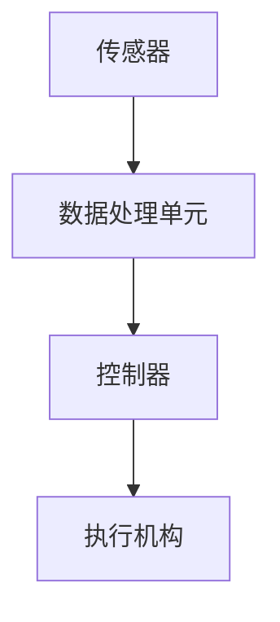
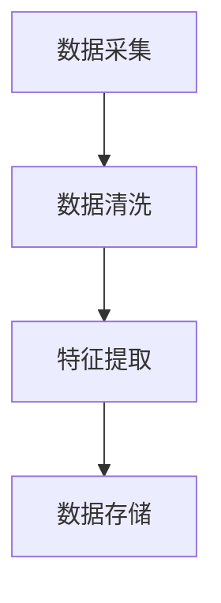
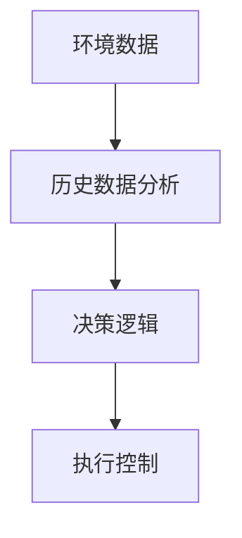
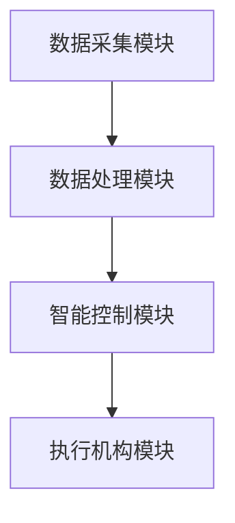
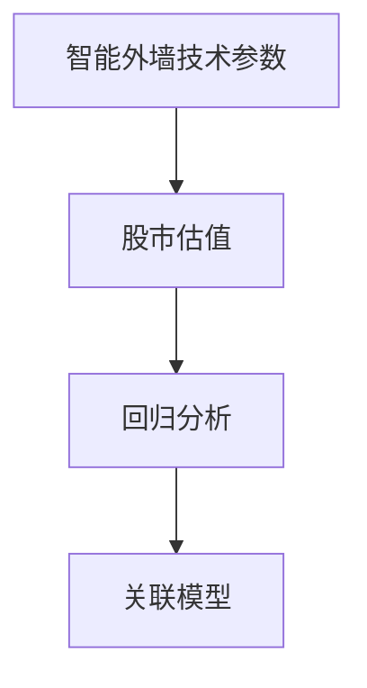

                 


# 全球股市估值与可持续建筑智能外墙技术的关系

> **关键词**：全球股市估值、可持续建筑、智能外墙技术、技术关联性、数学模型、算法实现

> **摘要**：本文探讨了全球股市估值与可持续建筑智能外墙技术之间的关系，分析了智能外墙技术对建筑行业及股市估值的潜在影响。通过数学模型和实际案例，详细阐述了智能外墙技术的核心原理及其在股市估值中的应用，旨在为投资者和建筑行业提供有价值的参考。

---

# 第一部分: 全球股市估值与可持续建筑智能外墙技术的背景与概述

---

## 第1章: 全球股市估值的基本概念与现状

### 1.1 股市估值的定义与方法

#### 1.1.1 股市估值的基本概念

股市估值是指通过对公司财务数据、市场趋势、行业地位等多方面因素的分析，对股票的内在价值进行评估的过程。常见的估值方法包括市盈率（P/E）、市净率（P/B）、股息率等。这些方法帮助投资者判断股票是否被高估或低估。

#### 1.1.2 常用的股市估值方法

- **市盈率（P/E）**：公式为 $$\text{市盈率} = \frac{\text{股价}}{\text{每股收益}}$$。市盈率反映了投资者对股票未来盈利的预期。
- **市净率（P/B）**：公式为 $$\text{市净率} = \frac{\text{股价}}{\text{每股净资产}}$$。市净率适用于评估资产密集型行业的企业价值。
- **股息率**：公式为 $$\text{股息率} = \frac{\text{每股股息}}{\text{股价}} \times 100\%$$。股息率反映了股票的分红能力。

#### 1.1.3 股市估值的影响因素

- 公司财务状况：如收入、利润、资产负债率等。
- 宏观经济环境：如GDP增长率、利率、通货膨胀等。
- 市场情绪：投资者情绪波动会影响短期股价走势。

---

### 1.2 可持续建筑与智能外墙技术的定义

#### 1.2.1 可持续建筑的定义与特点

可持续建筑是指在全生命周期内，最大限度地减少资源消耗和环境影响的建筑。其特点包括：

- **能源效率**：通过优化设计降低能源消耗。
- **材料环保性**：使用可再生或可循环材料。
- **碳中和目标**：通过减少碳排放实现碳中和。

#### 1.2.2 智能外墙技术的核心概念

智能外墙技术是一种集成了传感器、智能控制和数据处理的外墙系统。其核心功能包括：

- **环境监测**：实时监测温湿度、空气质量等。
- **智能调节**：根据环境数据自动调节外墙的开合和遮阳系统。
- **能效优化**：通过优化控制策略降低能源消耗。

#### 1.2.3 可持续建筑与智能外墙技术的关联性

智能外墙技术作为可持续建筑的重要组成部分，能够显著提升建筑的能效和环境适应能力。通过智能调节外墙，建筑可以在不同环境下优化能源使用，从而降低运营成本并减少碳排放。

---

### 1.3 本章小结

本章介绍了股市估值的基本概念和常用方法，并定义了可持续建筑和智能外墙技术的核心概念。通过分析两者的关联性，为后续章节的深入探讨奠定了基础。

---

## 第2章: 全球股市估值与可持续建筑智能外墙技术的关联性分析

### 2.1 股市估值与建筑行业的关系

#### 2.1.1 建筑行业对股市的影响

建筑行业是国民经济的重要组成部分，其景气程度直接影响相关企业的股价。例如，房地产企业的股票价格受建筑行业政策、市场需求和成本变化的影响。

#### 2.1.2 股市对建筑行业的反馈作用

股市对建筑行业的反馈作用体现在投资者对建筑企业的投资决策上。如果建筑企业能够通过技术创新提升竞争力，其股票价值将得到市场的认可。

---

### 2.2 智能外墙技术对建筑行业的影响

#### 2.2.1 智能外墙技术对建筑能效的提升

智能外墙技术通过实时监测和调节外墙状态，能够显著降低建筑的能源消耗。例如，智能遮阳系统可以根据光照强度自动调节窗户的开合，从而减少空调的使用时间。

#### 2.2.2 智能外墙技术对建筑成本的优化

智能外墙技术能够通过自动化控制降低建筑的维护成本。例如，智能传感器可以实时监测外墙的健康状况，及时发现并修复潜在问题。

#### 2.2.3 智能外墙技术对建筑生命周期的影响

智能外墙技术延长了建筑的使用寿命，降低了维护成本，从而提升了建筑的整体价值。

---

### 2.3 智能外墙技术对股市估值的潜在影响

#### 2.3.1 智能外墙技术如何影响建筑企业的估值

智能外墙技术的引入能够提升建筑企业的核心竞争力，从而提高其股票的内在价值。例如，采用智能外墙技术的企业可能在能效和成本控制方面更具优势。

#### 2.3.2 智能外墙技术如何影响投资者的决策

投资者可能会更加关注采用智能外墙技术的企业，因为这些企业具有更高的成长性和可持续发展潜力。

#### 2.3.3 智能外墙技术对股市整体趋势的潜在影响

智能外墙技术的大规模应用可能推动绿色建筑的发展，从而对股市的整体趋势产生积极影响。

---

### 2.4 本章小结

本章分析了智能外墙技术对建筑行业和股市估值的潜在影响，强调了技术创新对建筑企业估值和市场表现的重要作用。

---

## 第3章: 智能外墙技术的核心原理与实现

### 3.1 智能外墙技术的基本原理

#### 3.1.1 智能外墙的结构组成

智能外墙系统通常由传感器、控制器、执行机构和数据处理单元组成。以下是系统架构图（Mermaid）：



---

#### 3.1.2 智能外墙的功能实现

智能外墙的主要功能包括：

1. **环境监测**：实时采集温湿度、光照强度等环境数据。
2. **智能调节**：根据环境数据自动调节外墙的开合和遮阳系统。
3. **能效优化**：通过优化控制策略降低能源消耗。

---

### 3.2 智能外墙技术的关键算法

#### 3.2.1 数据采集与处理算法

数据采集与处理算法用于对传感器数据进行清洗和分析。以下是数据处理流程图（Mermaid）：



#### 3.2.2 能效优化算法

能效优化算法通过动态调整外墙的开合状态，实现能效的最大化。以下是能效优化算法的伪代码：

```python
def optimize_energy(sensors):
    current_energy_usage = get_current_usage()
    target_usage = calculate_target_usage(sensors)
    adjust_buildingControls(target_usage)
    return new_energy_usage
```

---

#### 3.2.3 智能控制算法

智能控制算法基于环境数据和历史数据，实现对外墙系统的智能控制。以下是智能控制算法的流程图（Mermaid）：



---

### 3.3 智能外墙系统的架构设计

#### 3.3.1 系统功能模块划分

智能外墙系统的功能模块包括：

1. 数据采集模块
2. 数据处理模块
3. 智能控制模块
4. 执行机构模块

以下是系统功能模块图（Mermaid）：



---

### 3.4 本章小结

本章详细介绍了智能外墙技术的核心原理和实现方法，为后续章节的分析奠定了技术基础。

---

## 第4章: 全球股市估值与智能外墙技术的数学模型构建

### 4.1 股市估值的数学模型

#### 4.1.1 股票估值的基本公式

股票估值的基本公式为 $$\text{股票价值} = \frac{\text{预期现金流}}{\text{折现率}}$$。该公式用于评估股票的内在价值。

#### 4.1.2 市盈率模型

市盈率模型的公式为 $$\text{股价} = \text{市盈率} \times \text{每股收益}$$。

#### 4.1.3 市净率模型

市净率模型的公式为 $$\text{股价} = \text{市净率} \times \text{每股净资产}$$。

---

### 4.2 智能外墙技术的数学模型

#### 4.2.1 能效优化的数学模型

能效优化的数学模型可以表示为 $$\text{能效} = \frac{\text{能源消耗}}{\text{建筑面积}}$$。

#### 4.2.2 成本效益分析的数学模型

成本效益分析的数学模型可以表示为 $$\text{成本效益比} = \frac{\text{节省的能源成本}}{\text{智能外墙技术的初期投资}}$$。

#### 4.2.3 生命周期评估的数学模型

生命周期评估的数学模型可以表示为 $$\text{生命周期成本} = \text{初期投资} + \text{维护成本} + \text{运营成本}$$。

---

### 4.3 股市估值与智能外墙技术的关联模型

#### 4.3.1 关联模型的构建

关联模型的构建可以通过回归分析实现。以下是回归分析的流程图（Mermaid）：



#### 4.3.2 关联模型的验证与优化

关联模型的验证可以通过统计检验（如R²值）进行。优化可以通过调整模型参数或引入更多变量实现。

#### 4.3.3 关联模型的实际应用

关联模型可以用于预测智能外墙技术对股市估值的影响，从而为投资者提供决策支持。

---

### 4.4 本章小结

本章构建了股市估值与智能外墙技术的数学模型，并分析了它们之间的关联性。

---

## 第5章: 智能外墙技术在股市估值中的应用案例分析

### 5.1 案例背景介绍

#### 5.1.1 案例选择的标准

案例选择的标准包括：

1. 企业的智能外墙技术应用情况。
2. 企业的股市估值表现。
3. 数据的可获得性。

#### 5.1.2 案例的基本情况

以某绿色建筑企业为例，分析其智能外墙技术的应用及其对股市估值的影响。

#### 5.1.3 案例的实施目标

案例的实施目标是验证智能外墙技术对股市估值的潜在影响。

---

### 5.2 智能外墙技术在案例中的应用

#### 5.2.1 智能外墙技术的实施

智能外墙技术的实施包括传感器安装、数据采集与处理系统的开发、智能控制系统的部署等。

#### 5.2.2 智能外墙技术对股市估值的影响

智能外墙技术的实施显著提升了企业的能效和成本控制能力，从而提高了企业的盈利能力和股票价值。

---

### 5.3 本章小结

本章通过实际案例分析，验证了智能外墙技术对股市估值的积极影响。

---

## 第6章: 总结与展望

### 6.1 本章总结

本文探讨了全球股市估值与可持续建筑智能外墙技术之间的关系，分析了智能外墙技术对建筑行业及股市估值的潜在影响。通过数学模型和实际案例，详细阐述了智能外墙技术的核心原理及其在股市估值中的应用。

---

### 6.2 未来展望

未来的研究可以进一步探索智能外墙技术对股市估值的长期影响，以及与其他绿色技术的协同效应。

---

### 6.3 最佳实践 tips

- **投资者**：关注采用智能外墙技术的企业，评估其对股市估值的潜在影响。
- **建筑企业**：积极引入智能外墙技术，提升企业的竞争力和可持续发展能力。
- **政策制定者**：出台相关政策支持智能外墙技术的应用，推动绿色建筑的发展。

---

### 6.4 作者

作者：AI天才研究院/AI Genius Institute & 禅与计算机程序设计艺术 /Zen And The Art of Computer Programming

---

以上是《全球股市估值与可持续建筑智能外墙技术的关系》的技术博客文章的完整目录和内容框架。每一章都详细展开了核心概念和理论，并通过实际案例和数学模型进行了深入分析。

