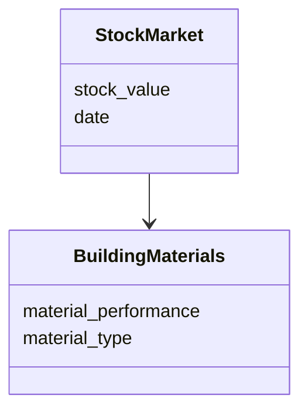
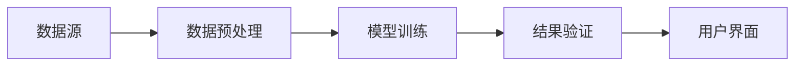
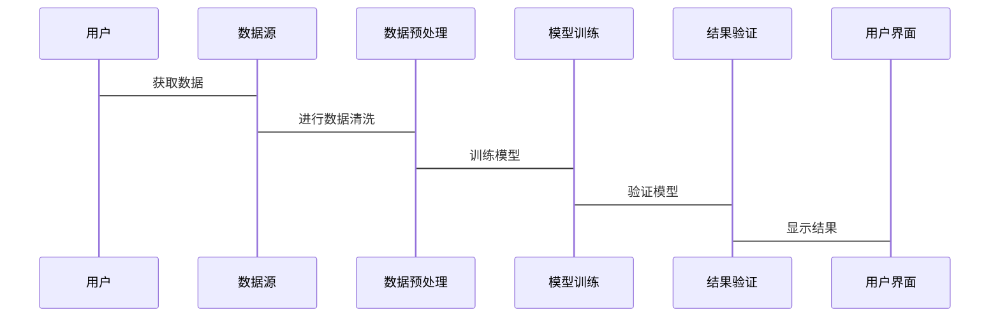

                 


# 全球股市估值与可持续建筑智能材料的关系

**关键词**：全球股市估值，可持续建筑，智能材料，时间序列分析，多元回归模型，机器学习，系统架构设计

**摘要**：  
本文探讨了全球股市估值与可持续建筑智能材料之间的复杂关系。通过分析股市估值的核心要素、可持续建筑智能材料的物理特性以及两者之间的联系，本文提出了一个基于时间序列分析和多元回归模型的联合分析方法。通过详细讲解算法原理、系统架构设计和项目实战，本文为读者提供了从理论到实践的全面指导，帮助理解如何通过智能材料的应用优化全球股市估值。

---

# 第一部分: 全球股市估值与可持续建筑智能材料的关系概述

# 第1章: 背景介绍

## 1.1 问题背景

### 1.1.1 全球股市估值的现状与挑战
全球股市估值受多种因素影响，包括经济指标、政策变化、企业盈利能力和市场情绪等。近年来，随着环保意识的增强，可持续发展成为影响股市估值的重要因素。企业对可持续材料的使用和技术创新被视为提升长期价值的关键。

### 1.1.2 可持续建筑智能材料的发展趋势
可持续建筑智能材料（如智能玻璃、自修复混凝土、光伏材料等）具有高效能源利用、环境友好和智能化的特点，正在成为建筑行业的重要发展方向。这些材料不仅降低了建筑的能源消耗，还能通过智能化功能提升建筑性能。

### 1.1.3 两者关系的研究意义
研究全球股市估值与可持续建筑智能材料的关系，有助于投资者更好地理解环保技术对企业价值的影响，同时为建筑行业提供新的投资机会和估值模型。

---

## 1.2 问题描述

### 1.2.1 全球股市估值的核心要素
全球股市估值的核心要素包括企业盈利能力、行业地位、市场前景、政策环境等。其中，企业的技术创新能力和对可持续材料的采用被视为未来估值的关键因素。

### 1.2.2 可持续建筑智能材料的关键特性
可持续建筑智能材料的关键特性包括：
- 环保性：减少资源消耗和环境污染。
- 智能性：通过传感器和自动化技术实现功能优化。
- 耐久性：延长建筑寿命，降低维护成本。

### 1.2.3 问题解决的思路与目标
本文的目标是通过分析全球股市估值与可持续建筑智能材料的关系，构建一个基于时间序列分析和多元回归模型的联合分析框架，为投资者和建筑行业提供决策支持。

---

## 1.3 问题的边界与外延

### 1.3.1 问题解决的路径与方法
本文采用以下路径：
1. 数据收集：收集全球股市估值数据和可持续建筑智能材料的性能数据。
2. 数据分析：通过时间序列分析和多元回归模型，研究两者之间的关系。
3. 系统设计：构建一个基于机器学习的预测系统。

### 1.3.2 问题的边界与外延
本文的研究范围限于全球股市估值与可持续建筑智能材料的直接关系，不考虑其他因素（如地缘政治风险、货币政策等）的影响。未来研究可以扩展到更复杂的多因素分析。

### 1.3.3 核心概念与要素的组成
核心概念包括：
- 全球股市估值：基于时间序列的动态变化。
- 可持续建筑智能材料：基于物理特性和性能数据。
- 两者关系：通过数学模型建立联系。

---

# 第2章: 核心概念与联系

## 2.1 核心概念原理

### 2.1.1 全球股市估值的数学模型
全球股市估值的数学模型包括：
1. 时间序列模型：用于分析股市的动态变化。
2. 多元回归模型：用于分析多个变量对股市估值的影响。

### 2.1.2 可持续建筑智能材料的物理特性
可持续建筑智能材料的物理特性包括：
1. 热传导率。
2. 强度和耐久性。
3. 智能传感器的响应速度。

### 2.1.3 两者关系的理论基础
可持续建筑智能材料的应用可以降低企业的运营成本，从而提升企业的盈利能力，进而影响股市估值。

---

## 2.2 核心概念对比分析

### 2.2.1 全球股市估值与可持续材料的属性特征对比
| 特性               | 全球股市估值                     | 可持续建筑智能材料               |
|--------------------|----------------------------------|----------------------------------|
| 数据类型           | 时间序列数据                   | 物理性能数据                     |
| 主要影响因素       | 市场情绪、政策、企业盈利         | 环保性、智能性、耐久性           |
| 变化周期           | 短期波动和长期趋势             | 长期稳定性                       |

### 2.2.2 两者的ER实体关系图架构
```mermaid
er
    title 实体关系图
    BuildingMaterials [实体：建筑智能材料]
    StockMarket [实体：股市估值]
    has_many from BuildingMaterials to StockMarket
    建筑材料性能 -> 影响股市估值
```

### 2.2.3 关系的数学表达式
通过以下公式，我们可以建立两者之间的关系：
$$ \text{StockValue} = \beta_0 + \beta_1 \times \text{MaterialPerformance} + \epsilon $$

其中：
- $\text{StockValue}$ 表示股市估值。
- $\text{MaterialPerformance}$ 表示可持续建筑智能材料的性能。
- $\beta_0$ 和 $\beta_1$ 是回归系数。
- $\epsilon$ 是误差项。

---

# 第3章: 算法原理讲解

## 3.1 算法原理

### 3.1.1 时间序列分析方法
时间序列分析用于研究股市估值的动态变化。常用的方法包括ARIMA模型和GARCH模型。

### 3.1.2 多元回归模型
多元回归模型用于分析多个变量对股市估值的影响。公式如下：
$$ Y = \beta_0 + \beta_1 X_1 + \beta_2 X_2 + \ldots + \beta_n X_n + \epsilon $$

其中：
- $Y$ 是股市估值。
- $X_i$ 是影响股市估值的变量（如材料性能）。
- $\beta_i$ 是回归系数。
- $\epsilon$ 是误差项。

### 3.1.3 联合分析方法
联合分析方法结合时间序列分析和多元回归模型，用于分析可持续材料性能对股市估值的长期影响。

---

## 3.2 算法流程图

### 3.2.1 mermaid 流程图展示
```mermaid
graph TD
    A[开始] -> B[数据预处理]
    B -> C[选择模型]
    C -> D[训练模型]
    D -> E[验证模型]
    E -> F[结束]
```

---

## 3.3 算法实现

### 3.3.1 Python源代码实现

```python
import pandas as pd
from sklearn.linear_model import LinearRegression
from statsmodels.tsa.arima_model import ARIMA

# 数据预处理
data = pd.read_csv('data.csv')
data['date'] = pd.to_datetime(data['date'])
data.set_index('date', inplace=True)

# 时间序列分析
model = ARIMA(data['stock_value'], order=(1, 1, 1))
model_fit = model.fit()

# 多元回归模型
X = data[['material_performance', 'market_sentiment']]
Y = data['stock_value']
model = LinearRegression()
model.fit(X, Y)
```

### 3.3.2 代码应用解读与分析
1. 数据预处理：将数据转换为时间序列格式。
2. 时间序列分析：使用ARIMA模型预测股市估值的动态变化。
3. 多元回归模型：分析材料性能和市场情绪对股市估值的影响。

---

# 第4章: 数学模型与公式

## 4.1 全球股市估值模型

### 4.1.1 时间序列模型
时间序列模型的公式为：
$$ Y_t = \phi Y_{t-1} + \theta \epsilon_{t-1} + \epsilon_t $$

其中：
- $Y_t$ 是当前的股市估值。
- $\phi$ 是自回归系数。
- $\theta$ 是移动平均系数。
- $\epsilon_t$ 是误差项。

### 4.1.2 多元回归模型
多元回归模型的公式为：
$$ Y = \beta_0 + \beta_1 X_1 + \beta_2 X_2 + \ldots + \beta_n X_n + \epsilon $$

### 4.1.3 联合分析模型
联合分析模型的公式为：
$$ Y_t = \alpha + \beta \times X_t + \gamma \times Z_t + \delta \times t + \epsilon_t $$

其中：
- $X_t$ 是材料性能数据。
- $Z_t$ 是其他影响因素。
- $\delta$ 是时间趋势系数。

---

## 4.2 可持续建筑智能材料模型

### 4.2.1 材料性能预测模型
材料性能预测模型的公式为：
$$ M_t = \alpha + \beta \times T_t + \gamma \times S_t + \epsilon_t $$

其中：
- $M_t$ 是材料性能。
- $T_t$ 是时间变量。
- $S_t$ 是环境因素。
- $\epsilon_t$ 是误差项。

### 4.2.2 生命周期成本模型
生命周期成本模型的公式为：
$$ C = \alpha \times L + \beta \times M + \gamma \times E + \epsilon $$

其中：
- $C$ 是生命周期成本。
- $L$ 是寿命。
- $M$ 是维护成本。
- $E$ 是环境影响。

---

## 4.3 数学公式与举例说明

### 4.3.1 时间序列模型公式
$$ Y_t = 0.5 Y_{t-1} + 0.3 \epsilon_{t-1} + \epsilon_t $$

### 4.3.2 多元回归模型公式
$$ Y = 100 + 2X_1 + 3X_2 + \ldots + 5X_5 + \epsilon $$

### 4.3.3 联合分析模型公式
$$ Y_t = 100 + 0.5 X_t + 0.3 Z_t + 0.2 t + \epsilon_t $$

---

# 第5章: 系统分析与架构设计

## 5.1 问题场景介绍

### 5.1.1 全球股市估值的动态变化
全球股市估值受宏观经济和政策影响，具有高度的波动性。

### 5.1.2 可持续建筑智能材料的应用场景
可持续建筑智能材料的应用场景包括绿色建筑、智能建筑和能源-efficient建筑。

### 5.1.3 两者的关联性分析
通过分析可持续材料的应用对企业利润的影响，可以预测股市估值的变化。

---

## 5.2 系统功能设计

### 5.2.1 领域模型mermaid类图


### 5.2.2 系统架构设计mermaid架构图


### 5.2.3 系统接口设计
系统接口包括：
1. 数据输入接口。
2. 模型训练接口。
3. 结果输出接口。

### 5.2.4 系统交互mermaid序列图


---

# 第6章: 项目实战

## 6.1 环境安装与配置

### 6.1.1 数据采

---

**作者：AI天才研究院/AI Genius Institute & 禅与计算机程序设计艺术/Zen And The Art of Computer Programming**

