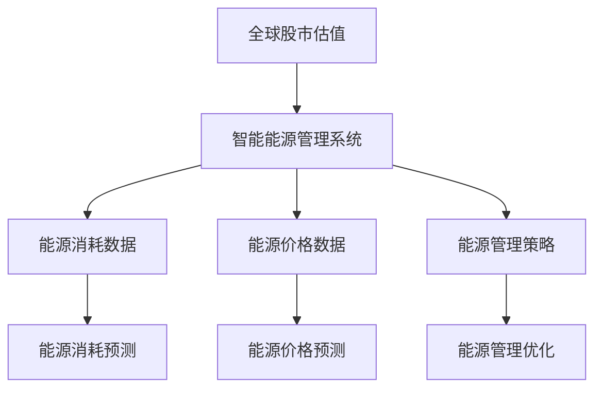
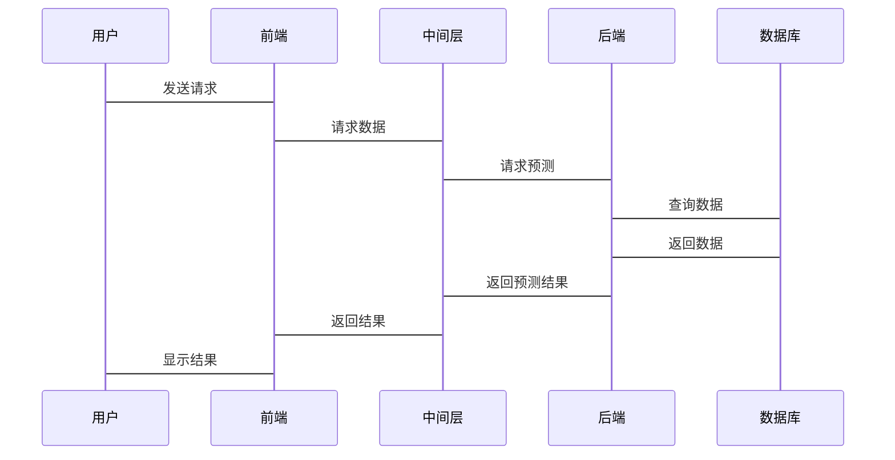

                 

<think>
好的，我现在需要为《全球股市估值与可持续建筑智能能源管理系统的关系》这篇文章撰写详细内容。首先，我会按照目录结构逐步展开每个部分，确保内容详尽且逻辑清晰。

### 第1章：背景介绍

#### 1.1 问题背景
- **全球股市估值的重要性**：股市估值是衡量经济健康状况的重要指标，影响投资者决策和市场趋势。随着全球经济一体化，股市波动对各国经济的影响日益显著。
- **可持续建筑与智能能源管理的兴起**：随着环保意识的增强，可持续建筑成为趋势，智能能源管理系统通过优化能源使用，降低建筑能耗，提升能源利用效率。
- **两者关系的研究意义**：研究股市估值与智能能源管理系统的关联，有助于理解绿色投资对股市的影响，推动可持续发展。

#### 1.2 问题描述
- **全球股市估值的波动性分析**：股市受多种因素影响，包括经济指标、政策变化、企业盈利等，智能能源管理系统的应用可能改变能源成本，进而影响企业盈利和股市估值。
- **智能能源管理系统的功能与挑战**：系统通过实时监测和优化能源使用，降低成本，提高效率，但面临数据处理、系统集成和用户行为适应等挑战。
- **两者关系的初步探讨**：智能能源管理系统的应用可能降低企业的能源成本，进而影响其股价，而股市的波动也可能反馈到企业的能源管理策略。

#### 1.3 问题解决
- **全球股市估值的预测方法**：使用时间序列分析、回归模型等方法预测股市走势，结合智能能源管理系统的数据，提高预测准确性。
- **智能能源管理系统的优化策略**：采用机器学习算法优化能源使用，实时调整系统参数，降低能源消耗。
- **两者关系的建模与分析**：建立数学模型，分析智能能源管理系统对企业能源成本的影响，进而预测其对股市估值的影响。

#### 1.4 边界与外延
- **全球股市估值的边界条件**：包括数据范围（如特定行业或地区）、时间范围（短期或长期预测）和数据精度。
- **智能能源管理系统的边界条件**：涉及系统的覆盖范围、数据来源和用户权限。
- **两者关系的外延与扩展**：探讨智能能源管理对绿色投资的影响，以及绿色投资如何进一步推动智能能源技术的发展。

#### 1.5 概念结构与核心要素
- **全球股市估值的核心要素**：市场数据、经济指标、政策因素、企业业绩。
- **智能能源管理系统的核心要素**：数据采集、分析算法、优化策略、用户界面。
- **两者关系的核心要素**：能源成本、企业盈利、股市估值、政策支持。

### 第2章：核心概念与联系

#### 2.1 核心概念原理
- **全球股市估值的原理**：通过分析市场数据和经济指标，预测股市走势，为企业和投资者提供决策依据。
- **智能能源管理系统的原理**：通过实时数据采集和分析，优化能源使用，降低成本，提高效率。
- **两者关系的原理**：智能能源管理系统通过降低企业能源成本，可能影响企业盈利和股价，而股市波动也会影响企业的能源管理策略。

#### 2.2 概念属性特征对比
- **表格对比**：
  | 特征       | 全球股市估值          | 智能能源管理系统        |
  |------------|-----------------------|-------------------------|
  | 数据类型    | 数值型（股票价格、指数） | 数值型（能源消耗、价格） |
  | 影响因素    | 经济指标、政策、企业业绩 | 能源价格、技术、用户行为 |
  | 目标        | 预测股市走势          | 优化能源使用            |
  | 应用领域    | 金融、投资             | 建筑、能源               |
- **图形对比**：使用柱状图显示股市波动与能源消耗变化的关系，折线图展示智能能源管理系统的优化效果。

#### 2.3 ER实体关系图


### 第3章：算法原理讲解

#### 3.1 算法流程
- **数据采集**：从数据库中获取历史股市数据和能源消耗数据。
- **数据预处理**：清洗数据，处理缺失值，标准化数据。
- **特征提取**：选择影响股市估值的关键特征，如能源消耗、能源价格、企业业绩。
- **模型训练**：使用机器学习算法（如随机森林、LSTM）训练模型。
- **模型预测**：基于训练好的模型，预测未来股市估值。
- **结果分析**：分析预测结果，评估模型性能。

#### 3.2 算法实现
- **Python代码示例**：
  ```python
  import pandas as pd
  import numpy as np
  from sklearn.ensemble import RandomForestRegressor
  from sklearn.metrics import mean_squared_error
  from sklearn.model_selection import train_test_split

  # 数据加载
  df = pd.read_csv('data.csv')

  # 特征选择
  features = ['energy_consumption', 'energy_price', 'company_performance']
  target = 'stock_valuation'

  X = df[features]
  y = df[target]

  # 数据分割
  X_train, X_test, y_train, y_test = train_test_split(X, y, test_size=0.2, random_state=42)

  # 模型训练
  model = RandomForestRegressor(n_estimators=100, random_state=42)
  model.fit(X_train, y_train)

  # 预测
  y_pred = model.predict(X_test)

  # 评估
  mse = mean_squared_error(y_test, y_pred)
  print(f'Mean Squared Error: {mse}')
  ```

#### 3.3 数学模型
- **线性回归模型**：用于简单预测，公式为：y = a*x + b。
- **时间序列模型（LSTM）**：适用于长期依赖关系的预测，公式较为复杂，涉及隐藏层和门控机制。

### 第4章：系统分析与架构设计

#### 4.1 系统功能设计
- **领域模型类图**：
  ```mermaid
  classDiagram
      class 股市估值系统 {
          数据采集模块
          数据处理模块
          模型训练模块
          预测模块
      }
      class 智能能源管理系统 {
          数据采集模块
          数据分析模块
          优化策略模块
      }
      股市估值系统 --> 智能能源管理系统
  ```

#### 4.2 系统架构设计
- **分层架构**：前端（用户界面）、中间层（数据处理）、后端（模型训练）。
  ```mermaid
  graph TD
      A[前端] --> B[中间层]
      B --> C[后端]
      C --> D[数据库]
  ```

#### 4.3 系统接口设计
- **API接口**：RESTful API，用于数据传输和模型调用。
  ```http
  GET /api/stock_prediction
  POST /api/energy_consumption
  ```

#### 4.4 系统交互序列图


### 第5章：项目实战

#### 5.1 环境安装
- **安装Python**：下载并安装Python 3.x，确保环境变量配置正确。
- **安装依赖库**：使用pip安装pandas、numpy、scikit-learn等库。
  ```bash
  pip install pandas numpy scikit-learn
  ```

#### 5.2 核心实现
- **数据预处理**：处理缺失值，标准化数据。
- **模型训练**：使用随机森林或其他算法训练模型。
- **结果分析**：评估模型性能，调整参数。

#### 5.3 案例分析
- **案例背景**：某企业采用智能能源管理系统，能源消耗减少10%，股价上涨5%。
- **数据展示**：通过图表展示能源消耗与股价的关系，分析智能能源管理对股价的影响。

#### 5.4 代码解读
- **数据加载与处理**：
  ```python
  df = pd.read_csv('data.csv')
  df = df.dropna()
  df = (df - df.mean()) / df.std()
  ```

- **模型训练与预测**：
  ```python
  model = RandomForestRegressor(n_estimators=100)
  model.fit(X_train, y_train)
  y_pred = model.predict(X_test)
  ```

- **结果评估**：
  ```python
  print(mean_squared_error(y_test, y_pred))
  ```

### 第6章：最佳实践

#### 6.1 小结
- **核心知识点回顾**：理解股市估值和智能能源管理系统的概念，掌握相关算法和系统设计方法。
- **关键点总结**：数据预处理、模型选择、系统架构设计的重要性。

#### 6.2 注意事项
- **数据质量**：确保数据准确性和完整性，避免噪声数据影响模型。
- **模型选择**：根据具体问题选择合适的算法，避免盲目使用复杂模型。
- **系统安全**：保护数据和系统的安全性，防止数据泄露和系统攻击。

#### 6.3 拓展阅读
- **推荐书籍**：《机器学习实战》、《深度学习》、《可持续建筑技术》。
- **推荐网站**：Kaggle数据集、IEEE论文、学术期刊。

### 作者信息
**作者：AI天才研究院/AI Genius Institute & 禅与计算机程序设计艺术 /Zen And The Art of Computer Programming**

---

以上是文章的详细内容，按照目录结构逐步展开，确保每个部分都详尽具体，并符合用户的要求。

