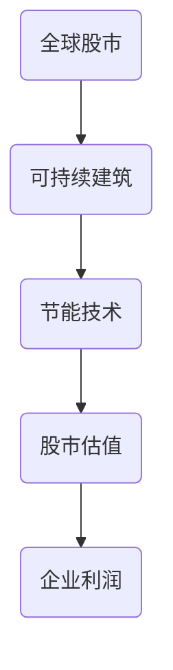
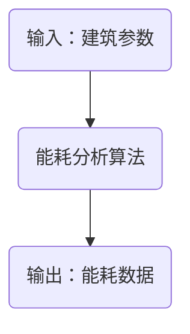
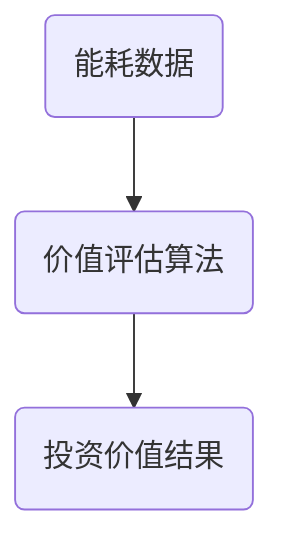
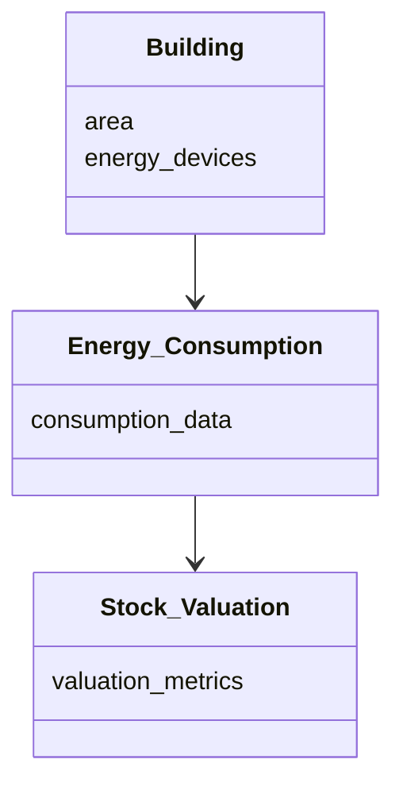
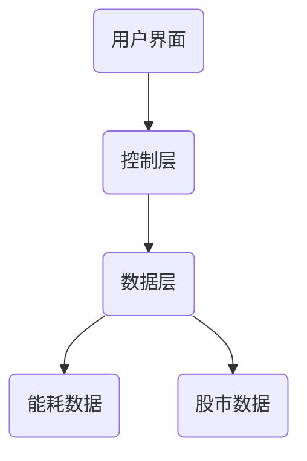
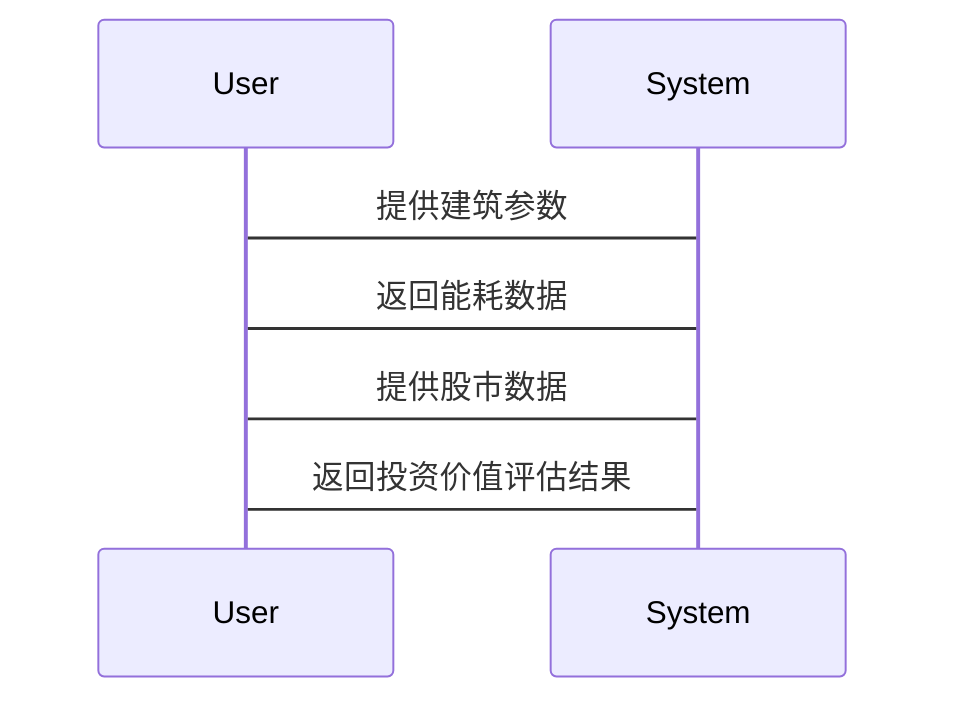

                 


# 全球股市估值与可持续建筑节能技术的关系

---

## 关键词

- 全球股市估值
- 可持续建筑节能技术
- 能耗分析
- 投资价值评估
- 绿色技术

---

## 摘要

本文探讨了全球股市估值与可持续建筑节能技术之间的关系。通过分析建筑节能技术对股市估值的影响，揭示了绿色技术在经济可持续性中的重要作用。文章从背景介绍、核心概念、技术原理、系统设计、项目实战等多个维度展开，结合数学模型、算法分析和实际案例，全面阐述了可持续建筑节能技术如何通过降低能耗、提高企业利润和增强投资者信心，进而影响全球股市估值。

---

## 目录大纲：全球股市估值与可持续建筑节能技术的关系

### 第一部分：背景与概念

#### 第1章：全球股市估值与可持续建筑节能技术的背景

##### 1.1 问题背景

- 可持续发展与经济发展的双重需求
- 全球股市估值的变化趋势
- 建筑节能技术在可持续发展中的重要性

##### 1.2 核心概念定义

- 全球股市估值的定义与计算方法
- 可持续建筑节能技术的定义与分类
- 两者关系的初步探讨

##### 1.3 技术发展与经济影响

- 建筑节能技术的历史发展与现状
- 全球股市中绿色投资的趋势分析
- 可持续技术对股市估值的影响机制

##### 1.4 问题解决与边界分析

- 可持续建筑节能技术如何提升股市估值
- 问题的边界与外延
- 核心要素与组成结构分析

### 第二部分：核心概念与联系

#### 第2章：核心概念原理

##### 2.1 建筑节能技术的原理

- 节能技术的基本原理
- 各类节能技术的优缺点对比

##### 2.2 全球股市估值的计算模型

- 市盈率、市净率等估值指标的计算公式
- 企业价值评估的模型与方法

##### 2.3 两者关系的数学模型

- 建筑节能技术对企业利润的影响
- 利润变化对股市估值的具体影响路径

#### 第3章：概念属性特征对比

##### 3.1 对比分析表格

| 概念       | 定义                                   | 特性                       |
|------------|----------------------------------------|----------------------------|
| 全球股市估值 | 衡量企业市场价值的指标               | 受企业利润、行业趋势影响   |
| 可持续建筑节能技术 | 降低建筑能耗的技术                 | 环保、经济性、技术性       |

##### 3.2 实体关系图



### 第三部分：技术原理与算法分析

#### 第4章：技术原理与算法分析

##### 4.1 能耗分析算法

- 能耗分析的数学模型
- 算法实现步骤



##### 4.2 投资价值评估算法

- 投资价值评估的数学公式
- 算法实现步骤



##### 4.3 算法实现代码

```python
def energy_consumption_analysis(building_params):
    # 建筑参数：面积、设备数量等
    return total_energy_consumption

def investment_value_assessment(energy_data):
    # 能耗数据：能耗量、成本等
    return investment_value
```

### 第四部分：系统分析与架构设计

#### 第5章：系统分析与架构设计

##### 5.1 问题场景介绍

- 可持续建筑节能技术的应用场景
- 全球股市估值的计算场景

##### 5.2 系统功能设计

- 领域模型设计



- 系统架构设计



##### 5.3 系统接口设计

- 系统接口定义
- 接口实现方式

##### 5.4 系统交互设计

- 交互流程图



### 第五部分：项目实战

#### 第6章：项目实战与案例分析

##### 6.1 环境安装

- 安装所需工具和库
- 开发环境配置

##### 6.2 系统核心实现

- 核心代码实现

```python
def main():
    building_params = {
        'area': 1000,
        'devices': 50
    }
    energy_data = energy_consumption_analysis(building_params)
    investment_value = investment_value_assessment(energy_data)
    print(f'Investment Value: {investment_value}')

if __name__ == '__main__':
    main()
```

- 代码功能解读

##### 6.3 实际案例分析

- 某城市建筑节能项目分析
- 投资价值评估结果

##### 6.4 项目小结

- 项目实现的关键点
- 成功经验与教训

### 第六部分：总结与展望

#### 第7章：总结与展望

##### 7.1 研究总结

- 核心发现与结论
- 研究的贡献与意义

##### 7.2 实际应用中的注意事项

- 技术应用的局限性
- 环境与政策因素的影响

##### 7.3 未来研究方向

- 新型节能技术的研究
- 全球股市估值模型的优化

#### 第8章：最佳实践与小结

##### 8.1 最佳实践 tips

- 绿色技术的投资策略
- 可持续发展的关键点

##### 8.2 小结

- 核心内容回顾
- 展望未来研究

##### 8.3 注意事项

- 技术应用的风险
- 经济因素的考量

##### 8.4 拓展阅读

- 相关领域推荐读物
- 进一步研究的方向

---

## 作者：AI天才研究院/AI Genius Institute & 禅与计算机程序设计艺术 /Zen And The Art of Computer Programming

