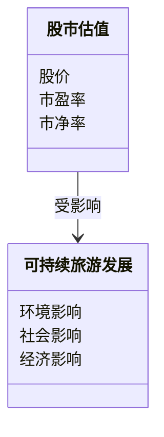
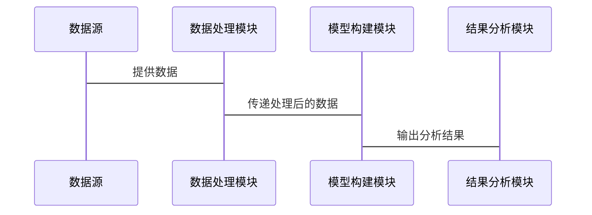

                 


# 全球股市估值与可持续旅游发展的关联

## 关键词：股市估值、可持续旅游发展、关联分析、经济影响、投资策略

## 摘要

全球股市估值与可持续旅游发展之间的关联是一个复杂而重要的课题。随着旅游业的不断增长和对可持续发展的关注增加，股市估值成为衡量旅游企业可持续性的重要指标。本文将分析股市估值与可持续旅游发展的核心概念、关联机制、影响因素，并通过案例和模型构建，探讨其在投资策略中的应用，为读者提供全面的见解。

---

# 目录大纲：《全球股市估值与可持续旅游发展的关联》

## 第一部分：背景与概述

### 第1章：全球股市估值与可持续旅游发展的关联概述

#### 1.1 背景介绍

- 1.1.1 全球股市估值的定义与现状
  - 股市估值是衡量企业价值的重要指标，包括市盈率、市净率等。
  - 全球股市估值受宏观经济、行业趋势和企业业绩的影响，呈现波动性。

- 1.1.2 可持续旅游发展的定义与现状
  - 可持续旅游发展强调在满足当代游客需求的同时，保护环境和促进当地社区的可持续发展。
  - 近年来，可持续旅游成为全球关注的焦点，尤其是在气候变化和资源短缺的背景下。

- 1.1.3 两者的关联性与研究意义
  - 可持续旅游发展影响企业的长期盈利能力，进而影响股市估值。
  - 研究两者的关系有助于投资者制定更有效的投资策略，推动旅游业的可持续发展。

#### 1.2 核心概念与联系

- 1.2.1 股市估值的核心概念
  - 股市估值是市场对企业的价值评估，反映市场对企业的未来盈利能力的预期。
  - 主要指标包括市盈率（P/E）、市净率（P/B）、股息率等。

- 1.2.2 可持续旅游发展的核心概念
  - 可持续旅游发展涉及经济、环境和社会三个维度。
  - 包括减少碳排放、保护文化遗产、促进当地经济发展等目标。

- 1.2.3 两者的核心联系与对比分析
  - 可持续旅游发展影响企业的长期盈利能力，进而影响股市估值。
  - 股市估值是衡量企业可持续发展能力的重要指标。

---

## 第二部分：核心概念与联系

### 第2章：核心概念与联系分析

#### 2.1 股市估值与可持续旅游发展的核心概念

- 2.1.1 股市估值的计算方法
  - 市盈率（P/E）= 股价 / 每股净利润
  - 市净率（P/B）= 股价 / 每股净资产
  - 股息率 = 每股股息 / 股价

- 2.1.2 可持续旅游发展的评价指标
  - 环境影响指数（如碳排放量）
  - 社会影响指数（如就业机会、社区参与度）
  - 经济影响指数（如收入增长、利润分配）

#### 2.2 核心概念的对比分析

- 2.2.1 股市估值与可持续旅游发展的属性特征对比
  | 特性         | 股市估值          | 可持续旅游发展      |
  |--------------|-------------------|--------------------|
  | 时间跨度     | 短期与长期结合    | 长期               |
  | 影响因素     | 宏观经济、行业、企业 | 环境、经济、社会    |
  | 衡量标准     | 价格、收益        | 环境保护、社会效益 |

- 2.2.2 股市估值与可持续旅游发展的ER实体关系图

```mermaid
erDiagram
    actor 投资者 {
        <属性> 股票代码
        <属性> 投资金额
    }
    actor 旅游企业 {
        <属性> 企业名称
        <属性> 可持续发展指标
    }
    actor 市场监管机构 {
        <属性> 监管政策
        <属性> 行业标准
    }
    actor 政府 {
        <属性> 政策法规
        <属性> 补贴与奖励
    }
    旅游企业 --> 投资者 : 提供投资机会
    旅游企业 --> 监管机构 : 遵守监管要求
    旅游企业 --> 政府 : 遵守政策法规
```

---

## 第三部分：关联机制与影响因素

### 第3章：关联机制分析

#### 3.1 股市估值与可持续旅游发展的关联机制

- 3.1.1 股市估值反映可持续旅游发展的能力
  - 可持续旅游发展能力强的企业通常具有较高的市盈率和市净率。
  - 投资者倾向于投资具有可持续发展能力的企业，以获取长期收益。

- 3.1.2 可持续旅游发展对股市估值的影响
  - 可持续旅游发展改善企业形象，吸引更多的投资者。
  - 环保政策的加强可能导致旅游企业成本增加，影响短期估值。

#### 3.2 影响因素分析

- 3.2.1 宏观经济因素
  - 经济增长速度影响旅游需求和企业盈利能力。
  - 利率水平影响股市整体估值。

- 3.2.2 旅游行业因素
  - 旅游市场需求的变化影响企业的收入和利润。
  - 行业竞争格局影响企业的市场份额和盈利能力。

- 3.2.3 政策与法规因素
  - 政府出台的环保政策可能增加企业的运营成本。
  - 法规的严格性影响企业的可持续发展能力。

---

## 第四部分：案例分析与模型构建

### 第4章：案例分析

#### 4.1 典型案例分析

- 4.1.1 国家层面的案例
  - 案例1：挪威的可持续旅游发展与股市估值
    - 挪威政府推动可持续旅游发展政策，相关旅游企业股票价格上升。
  - 案例2：中国的可持续旅游发展与股市估值
    - 中国出台多项环保政策，推动绿色旅游发展，相关企业市盈率提高。

- 4.1.2 企业层面的案例
  - 案例1：某国际酒店集团的可持续发展实践
    - 实施绿色建筑和环保措施，吸引更多的投资者，股价上升。
  - 案例2：某旅行社的可持续发展实践
    - 推动社区参与和文化遗产保护，增强企业形象，股价稳步增长。

#### 4.2 案例分析总结

- 4.2.1 案例的共同特征
  - 注重环境保护和社区参与。
  - 积极响应政策法规，推动可持续发展。

- 4.2.2 案例的启示与借鉴
  - 可持续旅游发展是企业长期发展的关键因素。
  - 投资者应关注企业的可持续发展能力。

### 第5章：模型构建与分析

#### 5.1 模型构建

- 5.1.1 模型设计思路
  - 构建一个包含经济、环境和社会因素的多维度模型。
  - 使用回归分析方法，量化各因素对股市估值的影响。

- 5.1.2 模型的数学表达式

$$ 股市估值 = \beta_0 + \beta_1 \times 环境影响 + \beta_2 \times 社会影响 + \beta_3 \times 经济影响 + \epsilon $$

其中：
- 环境影响：企业的碳排放量。
- 社会影响：社区参与度和就业机会。
- 经济影响：企业的收入和利润。

- 5.1.3 模型的验证与优化
  - 使用实证数据验证模型的准确性。
  - 根据验证结果优化模型参数。

---

## 第五部分：系统分析与架构设计

### 第6章：系统分析与架构设计方案

#### 6.1 问题场景介绍

- 问题背景：如何量化可持续旅游发展对股市估值的影响。
- 项目目标：构建一个量化模型，分析两者的关联性。
- 项目范围：包括数据收集、模型构建和结果分析。

#### 6.2 系统功能设计

- 6.2.1 领域模型设计（Mermaid类图）



- 6.2.2 系统架构设计（Mermaid架构图）

```mermaid
container 系统架构 {
    数据源
    数据处理模块
    模型构建模块
    结果分析模块
}
```

- 6.2.3 系统接口设计
  - 数据输入接口：接收股市数据和旅游发展数据。
  - 数据输出接口：输出模型结果和分析报告。

- 6.2.4 系统交互设计（Mermaid序列图）



---

## 第六部分：项目实战

### 第7章：项目实战

#### 7.1 环境安装

- 安装必要的工具和库：
  - Python 3.x
  - Pandas、NumPy、Scikit-learn
  - Matplotlib或Seaborn

#### 7.2 系统核心实现源代码

```python
import pandas as pd
import numpy as np
from sklearn.linear_model import LinearRegression

# 数据处理
data = pd.read_csv('tourism_sustainability.csv')

# 模型构建
model = LinearRegression()
features = data[['环境影响', '社会影响', '经济影响']]
target = data['股市估值']
model.fit(features, target)

# 结果分析
coefficients = pd.DataFrame({
    '特征': features.columns,
    '系数': model.coef_
})
print(coefficients)
```

#### 7.3 代码应用解读与分析

- 数据处理模块：读取数据并进行清洗和预处理。
- 模型构建模块：使用线性回归模型进行预测。
- 结果分析模块：输出模型的系数和评估指标。

#### 7.4 实际案例分析

- 分析某旅游企业的数据，预测其股市估值。
- 提供投资建议，基于模型结果。

#### 7.5 项目小结

- 项目总结：模型的有效性和局限性。
- 经验分享：数据收集和模型选择的关键点。

---

## 第七部分：最佳实践

### 第8章：最佳实践

#### 8.1 小结

- 可持续旅游发展是影响股市估值的重要因素。
- 投资者应关注企业的可持续发展能力。

#### 8.2 注意事项

- 数据的准确性和完整性是模型构建的关键。
- 模型的适用性和局限性需要充分考虑。

#### 8.3 拓展阅读

- 推荐阅读相关书籍和论文，深入理解股市估值和可持续旅游发展的关系。

---

## 结语

通过本文的分析，我们可以看到，全球股市估值与可持续旅游发展之间存在着密切的关联。投资者和企业都需要关注可持续发展，以实现长期的共赢。

---

## 作者信息

作者：AI天才研究院/AI Genius Institute & 禅与计算机程序设计艺术 /Zen And The Art of Computer Programming

---

以上是《全球股市估值与可持续旅游发展的关联》的详细目录大纲和部分章节内容。希望对您有所帮助！

