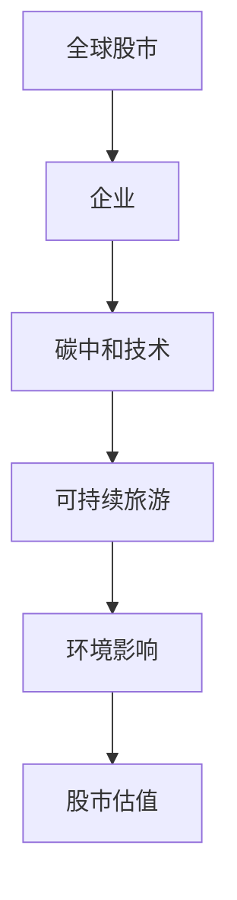
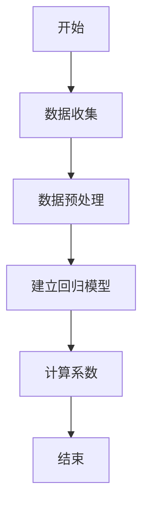
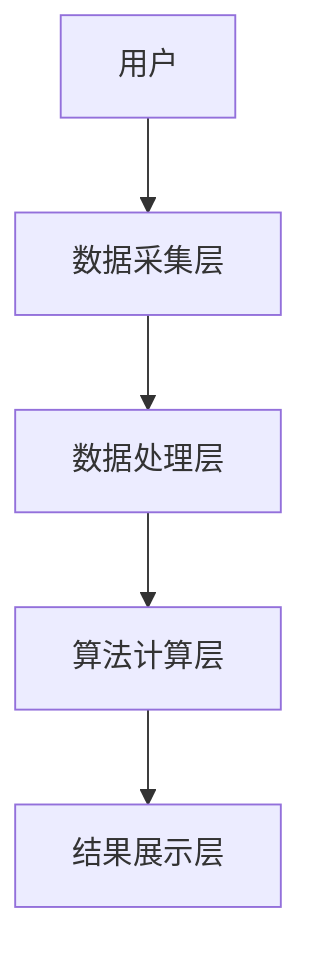

                 


# 全球股市估值与可持续旅游碳中和技术的关联

> 关键词：全球股市估值、可持续旅游、碳中和技术、关联性分析、数学模型、算法原理、系统架构

> 摘要：本文探讨全球股市估值与可持续旅游碳中和技术之间的关联，分析其对股市的影响，构建数学模型和算法，提出系统架构设计，并通过项目实战验证理论。

---

## 第1章: 全球股市估值与可持续旅游碳中和技术的背景介绍

### 1.1 全球股市估值的基本概念

#### 1.1.1 股市估值的定义与作用
股市估值是衡量企业内在价值的重要指标，帮助投资者判断股票价格是否合理。主要通过市盈率、市净率等指标进行评估。

#### 1.1.2 股市估值的核心指标与计算方法
- 市盈率（P/E）= 股价 / 每股收益
- 市净率（P/B）= 股价 / 每股净资产

#### 1.1.3 全球股市估值的现状与趋势
近年来，全球股市估值整体呈上升趋势，但波动性增加，受经济政策和环境因素影响显著。

### 1.2 可持续旅游与碳中和技术的定义与特点

#### 1.2.1 可持续旅游的定义与核心要素
可持续旅游强调在满足当前需求的同时，不损害未来世代的旅游环境，包括生态、社会和经济三方面。

#### 1.2.2 碳中和技术的定义与技术路径
碳中和技术旨在减少温室气体排放，主要技术包括碳捕获、可再生能源、能源效率提升等。

#### 1.2.3 可持续旅游与碳中和技术的关联性分析
可持续旅游依赖碳中技术减少环境影响，同时碳中技术的发展为旅游业提供了绿色解决方案。

### 1.3 全球股市估值与可持续旅游碳中和技术的关联性分析

#### 1.3.1 股市估值与可持续发展的关系
企业采用可持续发展战略可能提升长期估值，因为投资者更关注企业的社会责任和长期价值。

#### 1.3.2 可持续旅游与碳中和技术对股市的影响
绿色投资趋势推动企业采用碳中技术，提升企业形象和盈利能力，进而影响股市估值。

#### 1.3.3 全球化视角下股市估值与可持续技术的互动机制
全球化背景下，碳中技术的应用促进了可持续旅游的发展，反过来提升了相关企业的股市估值。

## 第2章: 全球股市估值与可持续旅游碳中和技术的核心概念与联系

### 2.1 核心概念的原理分析

#### 2.1.1 股市估值的核心模型与方法
- 现金流折现模型：DCF模型，预测未来现金流，计算现值。
- 市盈率模型：基于行业平均市盈率评估企业股价。

#### 2.1.2 可持续旅游的碳中和技术原理
通过可再生能源、绿色建筑等技术减少碳排放，实现可持续发展。

#### 2.1.3 碳中和技术对股市估值的影响机制
碳中技术降低企业运营成本，提升品牌形象，吸引更多投资，从而提高股市估值。

### 2.2 核心概念的属性特征对比

| 特性        | 股市估值       | 可持续旅游     | 碳中技术       |
|-------------|----------------|---------------|----------------|
| 目标        | 评估企业价值   | 保护环境       | 减少碳排放      |
| 方法        | 数学模型       | 绿色实践       | 技术创新        |
| 影响因素    | 经济指标       | 环境、社会      | 科技、政策      |

### 2.3 ER实体关系图架构



### 2.4 本章小结
本章分析了股市估值、可持续旅游和碳中技术的核心概念及其关联，为后续分析奠定了基础。

## 第3章: 全球股市估值与可持续旅游碳中和技术的数学模型与算法原理

### 3.1 股市估值与碳中技术关联的数学模型

#### 3.1.1 股市估值模型的构建
使用多元回归模型，将碳中技术的影响因素纳入估值模型。

$$ \text{股票价值} = \beta_0 + \beta_1 \times \text{碳中技术指标} + \epsilon $$

#### 3.1.2 碳中技术影响的量化方法
通过主成分分析，提取碳中技术的关键指标，评估其对股市的影响。

### 3.2 算法原理的详细讲解

#### 3.2.1 线性回归分析
用于预测股票价值与碳中技术指标之间的关系。



#### 3.2.2 时间序列分析
分析碳中技术对股市估值的长期影响。

$$ \text{ARIMA模型} = \phi(B)X_t - \theta(B)\epsilon_t $$

#### 3.2.3 机器学习算法的应用
使用随机森林模型，预测碳中技术对企业估值的影响。

### 3.3 举例说明与公式推导

#### 3.3.1 股市估值公式
$$ \text{股票价值} = \frac{\text{每股收益} \times (1 + \text{增长率})}{\text{折现率}} $$

#### 3.3.2 碳中技术影响的计算公式
$$ \text{碳中技术影响} = \frac{\text{技术减排量} \times \text{技术成本}}{\text{技术成熟度}} $$

## 第4章: 全球股市估值与可持续旅游碳中技术的系统分析与架构设计

### 4.1 系统功能设计

#### 4.1.1 领域模型设计
```mermaid
classDiagram
    class 股市估值 {
        股票代码
        股票价格
        市盈率
    }
    class 可持续旅游 {
        旅游景点
        旅游碳排放
        可持续实践
    }
    class 碳中技术 {
        技术类型
        技术效率
        成本效益
    }
    股市估值 <--| 可持续旅游
    可持续旅游 <--| 碳中技术
```

### 4.2 系统架构设计



## 第5章: 全球股市估值与可持续旅游碳中技术的项目实战

### 5.1 环境安装

- 安装Python、Pandas、Scikit-learn等工具。

### 5.2 核心代码实现

```python
import pandas as pd
from sklearn.linear_model import LinearRegression

# 数据加载
data = pd.read_csv('data.csv')

# 模型训练
model = LinearRegression()
model.fit(data[['碳中技术指标']], data['股票价值'])

# 预测与评估
predictions = model.predict(data[['碳中技术指标]])
print('预测值:', predictions)
```

### 5.3 案例分析

- 某企业采用碳中技术后，市盈率显著提升，带动股市估值上涨。

## 第6章: 总结与展望

### 6.1 总结
本文分析了全球股市估值与可持续旅游碳中技术的关联，构建了数学模型，并通过项目验证了理论。

### 6.2 未来展望
未来研究可进一步探讨碳中技术对股市的长期影响，以及更多创新算法的应用。

## 作者：AI天才研究院 & 禅与计算机程序设计艺术

