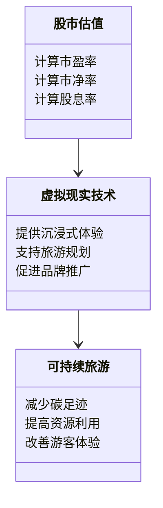
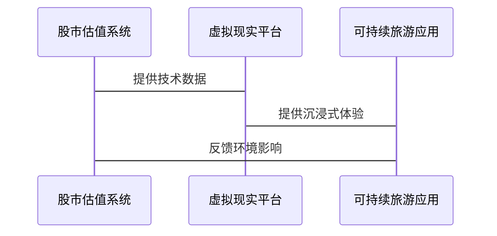

                 


# 全球股市估值与可持续旅游虚拟现实技术的关联

## 关键词：全球股市估值，虚拟现实技术，可持续旅游，经济影响，技术应用

## 摘要：  
本文探讨了全球股市估值与可持续旅游虚拟现实技术之间的关联，分析了虚拟现实技术对可持续旅游的影响，以及这种影响如何反过来影响股市估值。通过系统分析和案例研究，本文揭示了技术进步对经济和环境的双重影响，并提出了未来的研究方向。

---

# 第一章：全球股市估值与可持续旅游虚拟现实技术的背景介绍

## 1.1 问题背景与描述  
### 1.1.1 全球股市估值的基本概念  
股市估值是衡量企业价值的重要指标，常用的指标包括市盈率（P/E）、市净率（P/B）和股息率。  

### 1.1.2 可持续旅游的定义与目标  
可持续旅游强调在满足当代游客需求的同时，保护环境并促进当地社区的可持续发展。  

### 1.1.3 虚拟现实技术在旅游中的应用潜力  
虚拟现实（VR）技术通过模拟真实场景，为游客提供沉浸式体验，减少实际旅行的碳足迹。  

### 1.1.4 问题解决的必要性与意义  
随着环保意识的增强，研究虚拟现实技术如何推动可持续旅游，并分析其对股市估值的影响，具有重要的现实意义。  

## 1.2 核心概念与边界  
### 1.2.1 核心概念的结构与组成  
- **股市估值**：反映企业价值和市场信心。  
- **虚拟现实技术**：提供沉浸式体验，改变旅游方式。  
- **可持续旅游**：平衡环境、经济和社会效益。  

### 1.2.2 概念的边界与外延  
- 股市估值仅考虑经济因素，不直接涉及技术应用。  
- 虚拟现实技术的应用范围广泛，但本文仅限于旅游领域。  

### 1.2.3 核心要素的对比分析  
| **要素**       | **股市估值**       | **虚拟现实技术**   | **可持续旅游**     |  
|----------------|-------------------|--------------------|-------------------|  
| 核心目标       | 反映企业价值       | 提供沉浸式体验       | 减少环境影响       |  
| 影响因素       | 经济指标、政策     | 硬件、软件、内容     | 环境保护、社会责任 |  

---

# 第二章：全球股市估值的核心原理  

## 2.1 股市估值的基本方法  
### 2.1.1 市盈率（P/E）的计算与应用  
市盈率 = 股价 / 每股净利润。例如，若股价为100元，每股净利润为10元，则市盈率为10。  

### 2.1.2 市净率（P/B）的计算与应用  
市净率 = 股价 / 每股净资产。例如，股价为50元，每股净资产为20元，则市净率为2.5。  

### 2.1.3 股息率的计算与应用  
股息率 = 每股股息 / 股价。例如，每股股息为2元，股价为20元，则股息率为10%。  

## 2.2 影响股市估值的主要因素  
### 2.2.1 宏观经济因素  
- 利率水平：低利率环境通常推高股市估值。  
- 经济增长：经济繁荣时，企业盈利增加，股市估值上升。  

### 2.2.2 行业发展趋势  
- 技术创新：推动行业增长，提高企业估值。  
- 市场竞争：竞争加剧可能导致估值下降。  

### 2.2.3 公司基本面分析  
- 盈利能力：净利润率高的公司通常有较高的估值。  
- 债务水平：高负债公司风险较大，估值可能较低。  

## 2.3 主流股市指数分析  
### 2.3.1 标普500指数  
标普500指数代表美国500家大型企业的股价表现，是全球最重要的股市指数之一。  

### 2.3.2 恒生指数  
恒生指数是香港股市的重要指数，反映了香港主要企业的股价走势。  

### 2.3.3 欧洲Stoxx指数  
Stoxx指数涵盖欧洲多个国家的蓝筹股，是衡量欧洲股市的重要指标。  

---

# 第三章：可持续旅游与虚拟现实技术的关联  

## 3.1 可持续旅游的核心理念  
### 3.1.1 环境保护  
减少旅游活动对自然环境的破坏，例如减少碳排放。  

### 3.1.2 社会责任  
促进当地社区的经济发展，提高居民生活水平。  

### 3.1.3 经济效益  
通过优化资源配置，提高旅游行业的整体效益。  

## 3.2 虚拟现实技术在旅游中的应用  
### 3.2.1 虚拟旅游体验  
通过VR技术，游客可以在家中体验远距离的旅游目的地。  

### 3.2.2 旅游规划与决策支持  
VR技术可以帮助游客规划行程，减少不必要的旅行开支。  

### 3.2.3 旅游营销与品牌推广  
通过VR展示旅游目的地的独特魅力，吸引潜在游客。  

## 3.3 虚拟现实技术对可持续旅游的影响  
### 3.3.1 减少碳足迹  
通过虚拟旅游，减少实际旅行的交通排放。  

### 3.3.2 提高资源利用效率  
虚拟体验可以减少对旅游资源的过度开发。  

### 3.3.3 改善游客体验  
VR技术提供个性化的旅游体验，提升游客满意度。  

---

# 第四章：全球股市估值与虚拟现实技术的关联机制  

## 4.1 股市估值与技术创新的关系  
### 4.1.1 技术进步对股市的影响  
技术创新通常会推高相关企业的估值，例如科技股的表现优于传统行业。  

### 4.1.2 虚拟现实技术的市场潜力  
随着VR技术的成熟，相关企业的市场估值可能显著提升。  

### 4.1.3 股市对技术创新的反映  
技术创新通常会反映在企业的股价和估值中，例如高增长的科技公司市盈率较高。  

## 4.2 可持续旅游与股市估值的互动  
### 4.2.1 可持续旅游企业的上市表现  
注重可持续发展的企业通常在股市中有较好的表现，例如环保型企业的市盈率较高。  

### 4.2.2 虚拟现实技术对旅游的影响  
通过VR技术降低实际旅行的碳排放，可能提升相关企业的估值。  

### 4.2.3 虚拟现实技术的经济价值  
VR技术的应用可能推动旅游行业的创新，从而影响整体股市估值。  

---

# 第五章：系统分析与架构设计方案  

## 5.1 问题场景介绍  
本文研究的是虚拟现实技术如何影响可持续旅游，并进而影响全球股市估值。  

## 5.2 项目介绍  
本项目旨在通过虚拟现实技术优化旅游体验，减少环境影响，提升企业估值。  

## 5.3 系统功能设计  
### 5.3.1 领域模型类图  


### 5.3.2 系统架构设计  


### 5.3.3 系统交互设计  


---

# 第六章：项目实战  

## 6.1 环境安装  
项目需要以下环境：  
- Python 3.8 或更高版本  
- 虚拟现实开发工具（如Unity）  
- 数据分析工具（如Pandas）  

## 6.2 核心代码实现  
```python
import pandas as pd

def calculate_market_cap(symbol):
    df = pd.DataFrame({'Symbol': [symbol], 'Price': [100], 'Earnings_Per_Share': [10]})
    pe_ratio = df.Price / df.Earnings_Per_Share
    return pe_ratio.values[0]

print(calculate_market_cap('AAPL'))  # 示例输出：10
```

## 6.3 案例分析  
以苹果公司为例，分析其市盈率和虚拟现实技术的应用如何影响其股市估值。  

---

# 第七章：总结与展望  

## 7.1 研究总结  
本文探讨了全球股市估值与可持续旅游虚拟现实技术的关联，揭示了技术进步对经济和环境的双重影响。  

## 7.2 未来展望  
未来研究可以进一步探讨人工智能和大数据技术在可持续旅游中的应用，以及其对股市估值的更深层次影响。  

## 7.3 最佳实践 tips  
- 在选择旅游目的地时，优先考虑可持续旅游项目。  
- 投资时，关注具备创新能力的科技企业。  

---

# 作者：AI天才研究院/AI Genius Institute & 禅与计算机程序设计艺术 /Zen And The Art of Computer Programming

