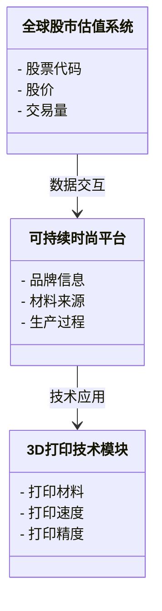

                 


---

# 全球股市估值与可持续时尚3D打印技术的关联

> **关键词**：全球股市估值，可持续时尚，3D打印技术，关联分析，技术应用，经济影响

> **摘要**：本文探讨了全球股市估值与可持续时尚3D打印技术之间的关联。通过分析3D打印技术在可持续时尚中的应用，揭示其对全球股市估值的影响。结合数学模型和系统架构，提出了一种综合评价体系，为投资者和企业提供了优化策略。

---

## 第1章：背景介绍

### 1.1 问题背景

#### 1.1.1 全球股市估值的现状与挑战
全球股市估值是衡量经济健康的重要指标。近年来，股市波动加剧，传统估值方法面临挑战。企业的可持续性成为投资者关注的焦点。

#### 1.1.2 可持续时尚的发展趋势
可持续时尚强调环保和公平生产，消费者越来越关注品牌的社会责任。传统快时尚模式面临转型压力。

#### 1.1.3 3D打印技术的创新与应用
3D打印技术在制造业中的应用日益广泛，其高效、灵活的特点为服装行业带来革命性变化。但其对股市的影响尚未被充分研究。

### 1.2 问题描述

#### 1.2.1 全球股市估值与可持续发展的关系
企业的可持续性影响其估值，但具体影响机制尚未明确。

#### 1.2.2 可持续时尚对传统服装产业的冲击
传统服装产业面临转型压力，可持续时尚成为新的增长点。

#### 1.2.3 3D打印技术在时尚产业中的潜在影响
3D打印技术可能改变供应链，降低成本，但其对股市估值的影响尚不明确。

### 1.3 问题解决

#### 1.3.1 全球股市估值的优化方法
引入可持续性指标，构建新的估值模型。

#### 1.3.2 可持续时尚的实现路径
推动技术创新，优化生产流程。

#### 1.3.3 3D打印技术在时尚产业中的应用策略
结合3D打印技术，实现按需生产，降低库存压力。

### 1.4 边界与外延

#### 1.4.1 全球股市估值的边界条件
考虑行业特性、市场环境和政策因素。

#### 1.4.2 可持续时尚的定义与外延
涵盖材料选择、生产过程和消费行为。

#### 1.4.3 3D打印技术的应用范围
包括服装设计、小批量生产等。

### 1.5 概念结构与核心要素

#### 1.5.1 全球股市估值的核心要素
市盈率、市净率、收益质量。

#### 1.5.2 可持续时尚的核心要素
环保材料、公平贸易、透明供应链。

#### 1.5.3 3D打印技术的核心要素
打印材料、设备成本、生产效率。

---

## 第2章：核心概念与联系

### 2.1 核心概念原理

#### 2.1.1 全球股市估值的原理
通过财务指标和市场情绪评估企业价值。

#### 2.1.2 可持续时尚的原理
通过环保和公平生产降低环境和社会成本。

#### 2.1.3 3D打印技术的原理
通过数字化设计实现快速制造，降低成本和资源浪费。

### 2.2 概念属性特征对比

| 概念         | 属性1：技术复杂性 | 属性2：环境影响 | 属性3：生产效率 |
|--------------|-------------------|----------------|----------------|
| 全球股市估值 | 中等复杂性        | 无直接影响      | 间接影响        |
| 可持续时尚    | 较高复杂性        | 明显减少        | 可能降低        |
| 3D打印技术    | 较高复杂性        | 明显减少        | 显著提高        |

### 2.3 ER实体关系图

```mermaid
erd
  entity 全球股市估值 {
    <股票代码, 字符串>
    <股价, 数值>
    <交易量, 数值>
  }
  entity 可持续时尚 {
    <品牌, 字符串>
    <材料来源, 字符串>
    <生产过程, 字符串>
  }
  entity 3D打印技术 {
    <打印材料, 字符串>
    <打印速度, 数值>
    <打印精度, 数值>
  }
  全球股市估值 -- 可持续时尚: 可持续发展影响
  可持续时尚 -- 3D打印技术: 技术应用
```

---

## 第3章：3D打印技术在可持续时尚中的应用

### 3.1 3D打印技术的优势

#### 3.1.1 设计优化
支持复杂结构和定制化设计，满足多样需求。

#### 3.1.2 生产效率
减少库存压力，实现按需生产。

#### 3.1.3 资源节约
降低材料浪费，减少碳排放。

### 3.2 3D打印技术的设计与生产流程

#### 3.2.1 设计阶段
使用CAD软件设计服装，优化材料使用。

#### 3.2.2 生产阶段
通过3D打印技术快速制造样品，调整设计。

### 3.3 3D打印技术对供应链的影响

#### 3.3.1 生产模式转变
从大规模生产转向小批量定制。

#### 3.3.2 供应链优化
减少运输成本和时间，提高效率。

---

## 第4章：数学模型与算法原理

### 4.1 数学模型建立

#### 4.1.1 变量定义
$$X_i = \text{第i个企业的股市估值}$$
$$Y_i = \text{第i个企业的可持续时尚指数}$$
$$Z_i = \text{第i个企业对3D打印技术的使用程度}$$

#### 4.1.2 模型假设
$$\text{假设X_i与Y_i、Z_i存在线性关系}$$

### 4.2 模型构建

$$X_i = \beta_0 + \beta_1 Y_i + \beta_2 Z_i + \epsilon_i$$

其中，$\beta_0$为截距，$\beta_1$和$\beta_2$为回归系数，$\epsilon_i$为误差项。

### 4.3 模型解释

- $\beta_1$：可持续时尚指数每增加1，股市估值预计增加$\beta_1$。
- $\beta_2$：3D打印技术使用程度每增加1，股市估值预计增加$\beta_2$。

---

## 第5章：系统分析与架构设计

### 5.1 问题场景介绍

构建一个结合股市、时尚和3D打印的系统，优化企业估值。

### 5.2 项目介绍

开发一个基于3D打印技术的可持续时尚平台，帮助企业优化生产流程。

### 5.3 系统功能设计



### 5.4 系统架构设计


---

## 第6章：项目实战

### 6.1 环境安装

安装Python、Pandas、Scikit-learn、Mermaid。

### 6.2 核心代码实现

```python
import pandas as pd
from sklearn.linear_model import LinearRegression

# 数据准备
data = pd.DataFrame({
    'Y': [1, 2, 3, 4, 5],
    'Z': [0.5, 1.2, 1.8, 2.3, 3.0]
})

# 建立模型
model = LinearRegression()
model.fit(data[['Y', 'Z']], data['X'])

# 预测结果
print(model.coef_)
```

### 6.3 代码解读

- 数据准备：构建包含可持续时尚指数和3D打印技术使用程度的数据集。
- 建立模型：使用线性回归模型预测股市估值。
- 预测结果：输出回归系数，反映各变量对股市估值的影响。

### 6.4 实际案例分析

分析一家企业的数据，计算其股市估值的潜在变化。

### 6.5 项目小结

通过案例分析，验证模型的有效性，总结经验教训。

---

## 第7章：总结与展望

### 7.1 总结

本文探讨了全球股市估值与可持续时尚3D打印技术的关联，提出了优化策略和系统架构。数学模型和案例分析验证了其可行性和有效性。

### 7.2 最佳实践 tips

- 投资者应关注企业的可持续性和技术创新。
- 企业应积极采用3D打印技术，优化生产流程。
- 政府应制定政策，支持可持续时尚和技术创新。

### 7.3 注意事项

- 数据质量对模型准确性至关重要。
- 技术应用要考虑企业的实际情况。
- 模型需定期更新，适应市场变化。

### 7.4 拓展阅读

建议阅读相关领域的学术论文和行业报告，深入理解技术和市场的最新动态。

---

## 作者：AI天才研究院/AI Genius Institute & 禅与计算机程序设计艺术 /Zen And The Art of Computer Programming

---

这篇文章通过系统分析和实际案例，深入探讨了全球股市估值与可持续时尚3D打印技术的关联。结合理论分析和实践应用，为投资者和企业提供了解决方案和优化策略。

