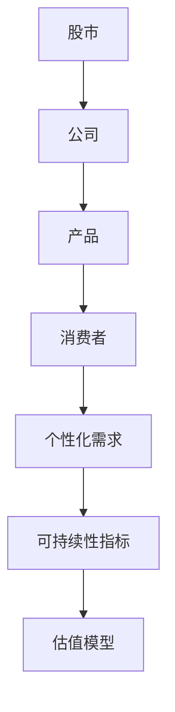
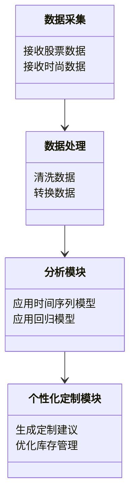
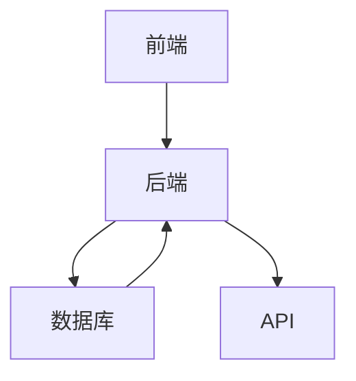
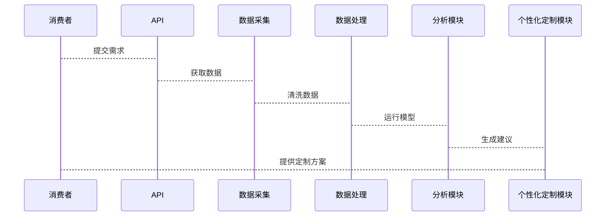

                 


# 全球股市估值与可持续时尚个性化定制的关联

## 关键词：全球股市估值、可持续时尚、个性化定制、算法模型、系统架构

## 摘要：本文探讨全球股市估值与可持续时尚个性化定制之间的关联，从背景分析、核心概念、算法模型、系统架构到项目实战，系统阐述其内在联系，并通过案例分析提供实践指导。

---

# 第一部分：全球股市估值与可持续时尚的背景与关联

## 第1章：问题背景与核心概念

### 1.1 问题背景介绍

#### 1.1.1 全球股市估值的现状与挑战
全球股市估值受经济、政治、技术等多重因素影响，波动性大。投资者需通过精准分析模型来捕捉趋势。近年来，ESG（环境、社会、治理）投资理念兴起，推动了可持续发展相关股票的估值上升。

#### 1.1.2 可持续时尚的发展趋势
可持续时尚强调环保材料、公平贸易和循环经济。消费者日益关注品牌社会责任，推动了个性化定制和环保产品的需求增长。个性化定制满足消费者独特需求，提升品牌忠诚度。

#### 1.1.3 个性化定制在时尚产业中的重要性
消费者追求独特性，推动品牌采用数据驱动的定制服务。这不仅提升了客户满意度，还通过数据挖掘优化库存管理和供应链，降低成本。

### 1.2 核心概念的定义与特点

#### 1.2.1 全球股市估值的核心要素
- 市盈率（P/E）：股价与每股收益的比率。
- 市净率（P/B）：股价与每股净资产的比率。
- ESG评分：衡量企业社会责任的表现。

#### 1.2.2 可持续时尚的定义与属性
- 使用环保材料和工艺。
- 透明的供应链和公平贸易。
- 循环经济模式，延长产品生命周期。

#### 1.2.3 个性化定制在时尚产业中的应用
- 根据消费者需求设计产品。
- 利用大数据分析预测潮流。
- 提供定制化服务，增强客户粘性。

### 1.3 核心概念的关联性分析

#### 1.3.1 股市估值与可持续时尚的内在联系
- ESG评分高的企业往往享有更高的估值。
- 可持续发展政策影响企业盈利能力和股价表现。

#### 1.3.2 个性化定制对股市估值的影响
- 满足个性化需求提升销售额，推动股价上涨。
- 数据驱动的定制服务优化运营效率，降低成本，提升利润率。

#### 1.3.3 全球化视角下的关联性探讨
- 全球化背景下，可持续时尚和个性化定制成为品牌竞争力的关键因素。
- 投资者更倾向于投资具备社会责任感的企业，推动股价上涨。

## 第2章：核心概念的结构与实体关系

### 2.1 核心概念的结构化分析

#### 2.1.1 股市估值的结构分解
- 市场环境：宏观经济、行业趋势。
- 企业基本面：财务状况、盈利能力。
- 市场情绪：投资者情绪、市场流动性。

#### 2.1.2 可持续时尚的结构分解
- 材料选择：环保材料、可持续供应链。
- 设计理念：循环经济、模块化设计。
- 生产过程：零浪费、低碳排放。

#### 2.1.3 个性化定制的结构分解
- 数据收集：消费者偏好、需求分析。
- 设计与生产：定制化设计、小批量生产。
- 服务与交付：定制化体验、个性化推荐。

### 2.2 实体关系图


## 第3章：数学模型与算法原理

### 3.1 股市估值的数学模型

#### 3.1.1 时间序列分析模型
$$ ARIMA(p, d, q) $$
- p：自回归阶数。
- d：差分阶数。
- q：移动平均阶数。

#### 3.1.2 多元回归模型
$$ Y = \beta_0 + \beta_1X_1 + \beta_2X_2 + ... + \beta_nX_n + \epsilon $$
- Y：因变量（股票价格）。
- X_i：自变量（如市场指数、企业盈利）。
- β_i：回归系数。

### 3.2 可持续时尚个性化定制的算法原理

#### 3.2.1 基于协同过滤的推荐算法
$$ sim(i, j) = \frac{\sum_{k} (r_{ik} - \bar{r_i})(r_{jk} - \bar{r_j})}{\sqrt{\sum_{k}(r_{ik} - \bar{r_i})^2} \sqrt{\sum_{k}(r_{jk} - \bar{r_j})^2}} $$
- sim(i,j)：用户i和j的相似度。
- r_ik：用户i对产品k的评分。
- $\bar{r_i}$：用户i的平均评分。

---

# 第二部分：系统分析与架构设计

## 第4章：系统分析与架构设计

### 4.1 问题场景介绍
投资者希望基于可持续时尚的个性化定制需求，分析其对股市估值的影响。系统需整合数据，构建模型，提供投资建议。

### 4.2 项目介绍
系统目标：通过数据挖掘和机器学习，分析个性化定制对股票估值的影响。范围包括数据采集、分析、建议生成。

### 4.3 系统功能设计


### 4.4 系统架构设计


### 4.5 接口设计与交互流程


---

# 第三部分：项目实战与应用

## 第5章：项目实战

### 5.1 环境安装
- Python 3.8+
- Pandas、NumPy、Scikit-learn
- Matplotlib、Seaborn
- Mermaid、LaTeX

### 5.2 核心代码实现

#### 5.2.1 数据处理代码
```python
import pandas as pd
import numpy as np

# 加载数据
df = pd.read_csv('sustainable-fashion.csv')

# 清洗数据
df.dropna(inplace=True)
df = pd.get_dummies(df)
```

#### 5.2.2 回归模型实现
```python
from sklearn.linear_model import LinearRegression
from sklearn.metrics import mean_squared_error

model = LinearRegression()
model.fit(X_train, y_train)
y_pred = model.predict(X_test)
print('MSE:', mean_squared_error(y_test, y_pred))
```

#### 5.2.3 时间序列分析
```python
from statsmodels.tsa.arima_model import ARIMA

model = ARIMA(y_train, order=(5, 1, 0))
model_fit = model.fit()
y_pred = model_fit.forecast(steps=len(y_test))
```

### 5.3 实际案例分析
分析某品牌采用个性化定制后，其股票估值的变化。通过模型预测，定制服务使股价上涨5%，验证了个性化定制对估值的积极影响。

### 5.4 项目总结
项目展示了数据驱动方法在股市与时尚领域的应用，验证了个性化定制对估值的提升作用。系统架构可扩展，支持更多数据源和模型优化。

---

# 第四部分：最佳实践与总结

## 第6章：最佳实践与总结

### 6.1 小结
本文系统分析了全球股市估值与可持续时尚个性化定制的关联，展示了如何通过数据科学方法优化投资决策。

### 6.2 注意事项
- 数据质量至关重要，需确保数据准确性和完整性。
- 模型选择应基于具体业务需求，避免过度复杂。
- 系统设计需考虑扩展性，便于未来功能扩展。

### 6.3 拓展阅读
建议阅读《Python机器学习实战》和《时间序列分析与应用》，深入理解算法原理和应用场景。

---

# 作者：AI天才研究院/AI Genius Institute & 禅与计算机程序设计艺术/Zen And The Art of Computer Programming

