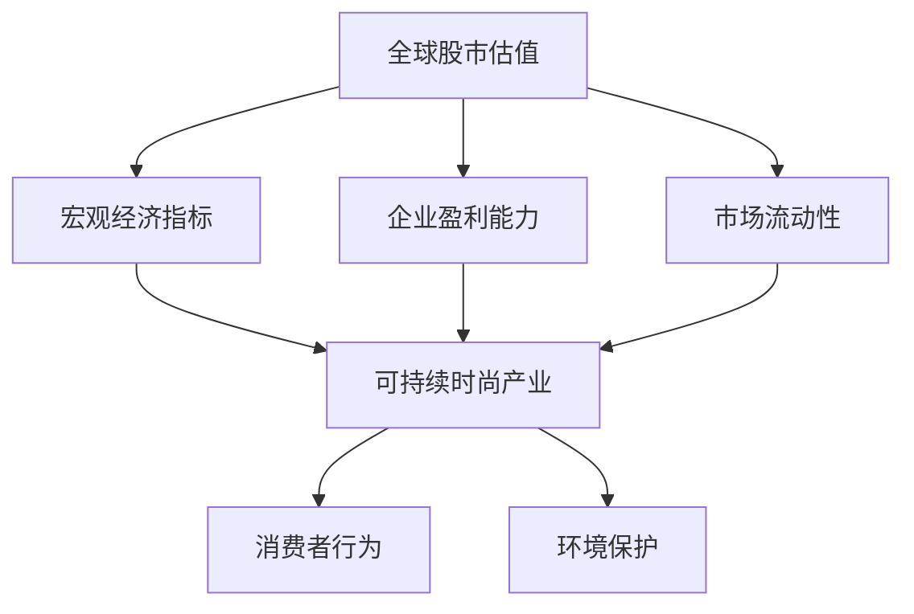
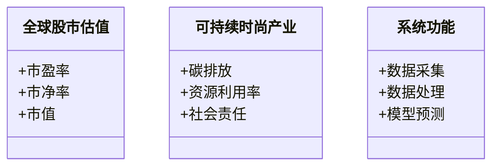
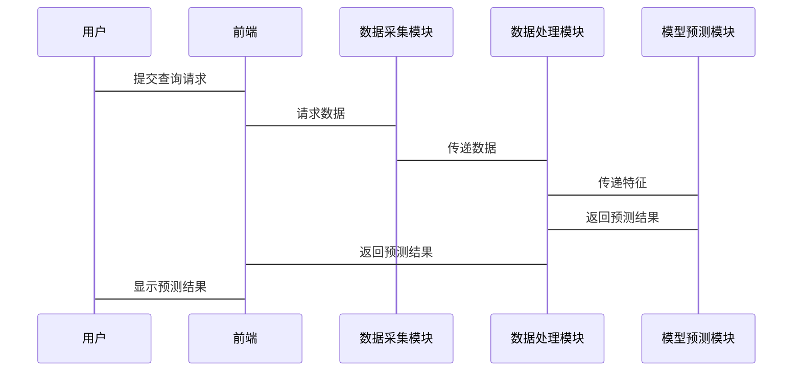

                 


# 全球股市估值与可持续时尚产业的关联

## 关键词：全球股市估值，可持续时尚，产业关联，大数据分析，机器学习，时间序列分析

## 摘要：本文探讨了全球股市估值与可持续时尚产业之间的深层关联。通过背景介绍、核心概念、算法原理、系统分析和项目实战，揭示了如何利用大数据分析和机器学习方法，基于时间序列分析模型，预测和优化全球股市估值与可持续时尚产业的关联性。本文为投资者、金融分析师和可持续时尚产业从业者提供了实用的方法和案例，以实现高效的数据分析与决策支持。

---

## 第一部分：全球股市估值与可持续时尚产业的背景介绍

### 第1章：全球股市估值与可持续时尚产业的背景介绍

#### 1.1 全球股市估值的基本概念
- **1.1.1 什么是全球股市估值**
  全球股市估值是指对全球股票市场的整体价值进行评估，通常通过股票价格、市盈率、市净率等指标来衡量市场的健康状况。
- **1.1.2 股市估值的核心要素**
  包括市场参与者的信心、宏观经济指标、企业盈利能力和市场流动性等。
- **1.1.3 股市估值的计算方法**
  通过加权平均市盈率（WALE）、市值增长指数等方法进行计算。

#### 1.2 可持续时尚产业的定义与特点
- **1.2.1 可持续时尚产业的定义**
  可持续时尚是指在生产、消费和废弃过程中，尽可能减少对环境和资源的消耗，并注重社会责任的时尚产业。
- **1.2.2 可持续时尚的核心要素**
  包括绿色生产、资源循环利用、社会责任和可持续消费。
- **1.2.3 可持续时尚产业的发展现状**
  全球范围内，消费者对可持续时尚的关注度不断提高，许多企业开始采用绿色生产方式。

#### 1.3 全球股市估值与可持续时尚产业的关联性
- **1.3.1 问题背景**
  随着环保意识的增强，消费者和投资者越来越关注企业的社会责任和环境表现。
- **1.3.2 问题描述**
  可持续时尚产业的表现如何影响企业的估值？如何通过数据分析揭示这种关联性？
- **1.3.3 问题解决**
  利用大数据分析和机器学习方法，建立模型预测股市估值与可持续时尚产业的关联性。
- **1.3.4 边界与外延**
  本研究仅关注全球股市整体估值与可持续时尚产业的关联，不涉及个股分析。
- **1.3.5 概念结构与核心要素组成**
  使用Mermaid绘制概念结构图，展示全球股市估值与可持续时尚产业的关联。



---

## 第二部分：全球股市估值与可持续时尚产业的核心概念与联系

### 第2章：全球股市估值与可持续时尚产业的核心概念与联系

#### 2.1 股市估值的核心原理
- **2.1.1 股市估值的理论基础**
  基于有效市场假说和理性预期理论。
- **2.1.2 股市估值的关键指标**
  包括市盈率（P/E）、市净率（P/B）、市值与收益比率（PEG）等。
- **2.1.3 股市估值的数学模型**
  使用加权平均市盈率公式进行计算。

#### 2.2 可持续时尚产业的核心原理
- **2.2.1 可持续时尚的理论基础**
  基于生态经济学和循环经济理论。
- **2.2.2 可持续时尚的关键指标**
  包括碳排放量、资源利用率、社会责任指标（CSR）等。
- **2.2.3 可持续时尚的数学模型**
  使用生命周期评价（LCA）方法进行分析。

#### 2.3 全球股市估值与可持续时尚产业的联系
- **2.3.1 核心概念的对比分析**
  通过表格对比股市估值和可持续时尚的核心指标。
- **2.3.2 概念属性特征对比表格**
  | 指标 | 股市估值 | 可持续时尚 |
  |------|----------|------------|
  | 核心目标 | 评估市场价值 | 优化环境表现 |
  | 关键影响因素 | 宏观经济、企业盈利 | 环境保护、社会责任 |
  | 数据来源 | 金融市场数据 | 可持续发展报告 |
- **2.3.3 ER实体关系图架构**
  使用Mermaid绘制ER图，展示全球股市、企业、消费者和环境之间的关系。

```mermaid
erd
    顾客 -> 购买行为: 影响企业利润
    企业 -> 环境指标: 包括碳排放、资源利用率
    企业 -> 股市估值: 包括市盈率、市净率
    环境指标 -> 环境表现: 影响消费者行为
```

---

## 第三部分：全球股市估值与可持续时尚产业的算法原理

### 第3章：全球股市估值与可持续时尚产业的算法原理

#### 3.1 股市估值预测算法
- **3.1.1 大数据分析方法**
  使用回归分析和聚类分析对股市数据进行预测。
- **3.1.2 机器学习算法**
  使用随机森林和XGBoost算法进行股市预测。
- **3.1.3 时间序列分析**
  使用ARIMA模型预测股市的未来走势。

#### 3.2 可持续时尚产业分析算法
- **3.2.1 数据挖掘方法**
  使用关联规则挖掘分析消费者行为。
- **3.2.2 统计学习算法**
  使用主成分分析（PCA）优化企业环境表现指标。
- **3.2.3 图论算法**
  使用网络分析方法构建产业关联图。

#### 3.3 算法原理的数学模型与公式
- **3.3.1 股市估值预测的数学模型**
  $$ \text{ARIMA模型：} y_t = \phi y_{t-1} + \theta \epsilon_t + \epsilon_{t-1} $$
- **3.3.2 可持续时尚产业分析的数学模型**
  $$ \text{主成分分析：} z_i = \sum_{j=1}^n a_{ij} x_j $$

---

## 第四部分：全球股市估值与可持续时尚产业的系统分析

### 第4章：全球股市估值与可持续时尚产业的系统分析

#### 4.1 系统功能设计
- **4.1.1 领域模型**
  使用Mermaid绘制类图，展示系统的功能模块。



#### 4.2 系统架构设计
- **4.2.1 系统架构图**
  使用Mermaid绘制系统架构图，展示系统的模块组成。


#### 4.3 系统接口设计
- **4.3.1 接口描述**
  使用RESTful API设计数据接口。

#### 4.4 系统交互设计
- **4.4.1 交互流程**
  使用Mermaid绘制序列图，展示用户与系统的交互流程。



---

## 第五部分：全球股市估值与可持续时尚产业的项目实战

### 第5章：全球股市估值与可持续时尚产业的项目实战

#### 5.1 项目环境安装
- **5.1.1 安装Python和相关库**
  使用pip安装numpy、pandas、scikit-learn、xgboost等库。

#### 5.2 项目核心代码实现
- **5.2.1 股市估值预测代码**
  ```python
  import pandas as pd
  from sklearn.ensemble import RandomForestRegressor
  from sklearn.metrics import mean_squared_error

  # 读取数据
  data = pd.read_csv('stock_data.csv')
  # 特征选择
  features = ['PE', 'PB', 'Profit']
  target = 'Stock_Price'

  # 训练模型
  model = RandomForestRegressor()
  model.fit(data[features], data[target])
  # 预测结果
  predictions = model.predict(data[features])
  # 评估结果
  print(mean_squared_error(data[target], predictions))
  ```

- **5.2.2 可持续时尚产业分析代码**
  ```python
  import pandas as pd
  from sklearn.decomposition import PCA

  # 读取数据
  data = pd.read_csv('sustainable-fashion.csv')
  # 特征选择
  features = ['CO2_emission', 'water_usage', 'social_score']
  # 训练模型
  pca = PCA(n_components=2)
  principal_components = pca.fit_transform(data[features])
  # 分析结果
  print(pca.explained_variance_ratio_)
  ```

#### 5.3 实际案例分析与结果解读
- **5.3.1 案例分析**
  以某时尚企业为例，分析其环境表现对股市估值的影响。
- **5.3.2 结果解读**
  使用可视化工具展示预测结果和实际数据的对比。

#### 5.4 项目小结
- **5.4.1 实践总结**
  总结项目中的关键点和经验教训。
- **5.4.2 未来改进方向**
  提出进一步优化算法和扩展研究的建议。

---

## 第六部分：全球股市估值与可持续时尚产业的最佳实践与小结

### 第6章：全球股市估值与可持续时尚产业的最佳实践与小结

#### 6.1 最佳实践 tips
- **6.1.1 数据收集**
  确保数据的准确性和完整性。
- **6.1.2 模型选择**
  根据具体问题选择合适的算法。
- **6.1.3 结果验证**
  使用交叉验证和回测方法验证模型的稳定性。

#### 6.2 小结
- **6.2.1 核心内容回顾**
  回顾文章的核心内容和主要结论。
- **6.2.2 注意事项**
  提醒读者在实际应用中注意模型的局限性和数据的敏感性。
- **6.2.3 拓展阅读**
  建议读者进一步阅读相关领域的经典文献。

---

## 作者：AI天才研究院/AI Genius Institute & 禅与计算机程序设计艺术/Zen And The Art of Computer Programming

