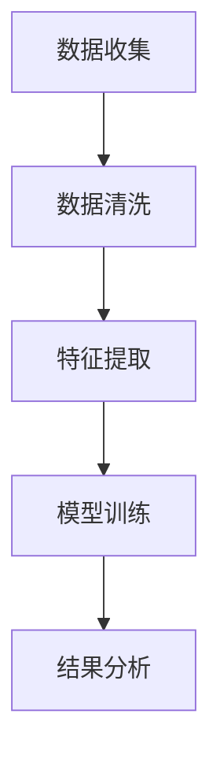

                 


# 全球股市估值与可持续时尚供应链的关联

## 关键词：全球股市估值，可持续供应链，供应链管理，股市分析，时尚产业

## 摘要：  
本文探讨了全球股市估值与可持续时尚供应链之间的深层关联。通过对可持续供应链的核心要素和全球股市估值的影响因素进行分析，揭示了可持续供应链如何通过减少环境和社会风险、提升企业治理结构，从而影响企业的市场价值。文章结合实际案例，采用数据分析和算法模型，深入阐述了两者之间的动态关系，并提出了相应的优化策略和实施建议。

---

## 目录大纲

1. [背景介绍](#背景介绍)
2. [核心概念与联系](#核心概念与联系)
3. [算法原理讲解](#算法原理讲解)
4. [系统分析与架构设计](#系统分析与架构设计)
5. [项目实战](#项目实战)
6. [最佳实践与小结](#最佳实践与小结)
7. [注意事项与拓展阅读](#注意事项与拓展阅读)

---

## 正文

### 第一部分：背景介绍

#### 1.1 问题背景

随着全球化进程的加速，企业的供应链管理已成为影响企业竞争力和市场价值的关键因素。特别是在时尚产业，供应链的复杂性（包括原材料采购、生产加工、物流配送等）使得企业面临更高的环境和社会风险。与此同时，全球股市投资者越来越关注企业的可持续性表现，认为这不仅影响企业的长期盈利能力，还会影响企业的市场估值。

#### 1.2 问题描述

传统供应链模式往往以成本最低为导向，忽视了环境和社会成本。这种做法可能导致企业面临更高的风险，例如原材料短缺、工人权益问题、环境污染等，这些都会直接影响企业的市场形象和投资者信心。而可持续供应链通过优化资源利用、减少碳足迹、提升社会责任履行能力，能够有效降低这些风险，从而提升企业的市场价值。

#### 1.3 问题解决

为了量化可持续供应链对全球股市估值的影响，我们需要构建一个综合模型，将企业的可持续性指标（如碳排放量、社会责任履行情况）与财务指标（如市盈率、市净率）进行关联分析。通过这种关联，投资者可以更好地评估企业的长期价值，企业也可以通过优化供应链管理来提升市场估值。

#### 1.4 边界与外延

- **边界**：本文仅关注时尚产业的供应链，不涉及其他行业。
- **外延**：可持续供应链的影响不仅限于环境和社责任，还包括企业治理结构、员工福利等方面。

---

### 第二部分：核心概念与联系

#### 2.1 全球股市估值的核心概念

全球股市估值是衡量企业市场价值的重要指标，常用的指标包括市盈率（P/E）、市净率（P/B）等。这些指标反映了市场对企业的信任程度和未来盈利能力的预期。

#### 2.2 可持续供应链的核心概念

可持续供应链强调在供应链的各个环节中，减少对环境的负面影响，同时确保社会公平和员工权益。核心要素包括：

1. **环境影响**：减少碳排放、减少资源消耗。
2. **社会影响**：保障员工权益、促进公平贸易。
3. **治理结构**：建立透明的供应链管理机制。

#### 2.3 对比分析

| **维度**       | **传统供应链**                   | **可持续供应链**                  |
|-----------------|----------------------------------|-----------------------------------|
| 环境影响         | 高，存在环境污染风险             | 低，通过优化减少环境影响           |
| 社会责任         | 低，可能忽视员工权益             | 高，注重社会责任和员工福利         |
| 治理结构         | 透明度低，可能存在管理漏洞       | 透明度高，治理结构完善             |
| 对股市估值影响   | 可能导致市场估值下降             | 可能提升市场估值                   |

#### 2.4 ER实体关系图

```mermaid
er
    entity 全球股市估值 {
        id
        股价
        市盈率
        市净率
    }
    entity 可持续供应链 {
        id
        供应商
        环境影响
        社会影响
        治理结构
    }
    全球股市估值 --> 可持续供应链 : 关联
```

---

### 第三部分：算法原理讲解

#### 3.1 数据收集与预处理

我们需要收集全球股市数据（如市盈率、市净率）和企业的供应链数据（如碳排放量、社会责任履行情况）。数据预处理包括数据清洗、特征提取等。

#### 3.2 关联性分析

使用回归分析模型，将企业的可持续性指标与股市估值指标进行关联。例如，建立一个线性回归模型：

$$ \text{市盈率} = \beta_0 + \beta_1 \times \text{碳排放量} + \epsilon $$

其中，$\beta_1$表示碳排放量对市盈率的影响程度。

#### 3.3 算法流程图



---

### 第四部分：系统分析与架构设计

#### 4.1 系统功能设计

- 数据采集模块：收集全球股市数据和供应链数据。
- 数据分析模块：进行关联性分析，生成报告。
- 可视化模块：展示分析结果。

#### 4.2 系统架构设计


---

### 第五部分：项目实战

#### 5.1 环境配置

需要安装Python、Pandas、Matplotlib等库。

#### 5.2 核心代码实现

```python
import pandas as pd
import numpy as np
import matplotlib.pyplot as plt

# 数据加载
data = pd.read_csv('stock_and_supply.csv')

# 数据预处理
data.dropna(inplace=True)
data['市盈率'] = data['市盈率'].astype(float)

# 模型训练
from sklearn.linear_model import LinearRegression
model = LinearRegression()
model.fit(data[['碳排放量']], data['市盈率'])

# 结果分析
print('回归系数:', model.coef_)
print('截距:', model.intercept_)

# 可视化
plt.scatter(data['碳排放量'], data['市盈率'])
plt.plot(data['碳排放量'], model.predict(data[['碳排放量]]), color='red')
plt.xlabel('碳排放量')
plt.ylabel('市盈率')
plt.show()
```

---

### 第六部分：最佳实践与小结

- **最佳实践**：企业在优化供应链时，应注重环境和社会因素，同时定期评估供应链的可持续性表现。
- **小结**：通过构建关联模型，我们发现可持续供应链能够显著提升企业的市场估值，特别是在时尚产业。

---

### 第七部分：注意事项与拓展阅读

- **注意事项**：本文仅针对时尚产业进行分析，其他行业可能有所不同。
- **拓展阅读**：建议进一步阅读关于供应链管理的经典著作，如《供应链管理：战略设计与实施》。

---

## 作者：AI天才研究院/AI Genius Institute & 禅与计算机程序设计艺术 /Zen And The Art of Computer Programming

