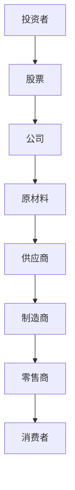
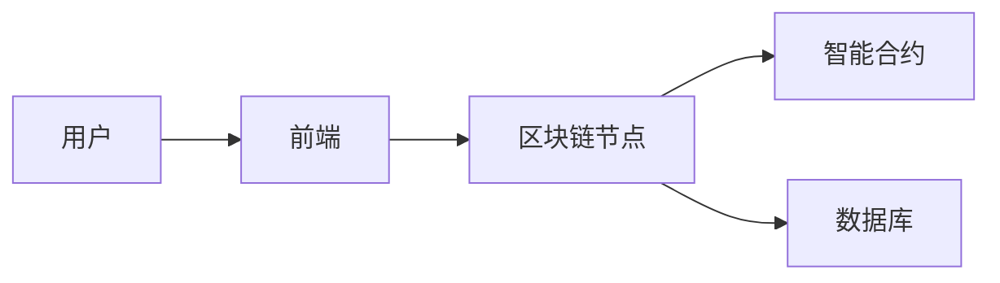
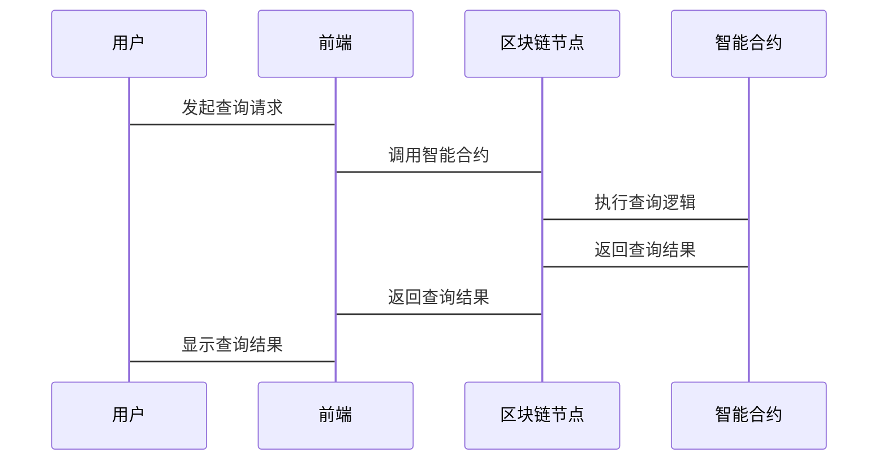

                 


# 全球股市估值与可持续时尚区块链溯源系统的关联

> 关键词：全球股市估值、可持续时尚、区块链、溯源系统、金融市场、技术应用

> 摘要：本文探讨了区块链技术在提升全球股市估值和实现可持续时尚产业溯源中的应用。通过分析区块链技术的核心原理，展示了其如何解决当前股市估值和时尚产业中的透明度问题，并提出了基于区块链的溯源系统的设计方案和实际应用案例。

---

## 第一章：背景介绍

### 1.1 问题背景

#### 1.1.1 全球股市估值的重要性
全球股市估值是衡量市场健康状况的重要指标，直接影响投资者决策和全球经济稳定性。传统估值方法依赖于历史数据和市场情绪，存在信息不对称和透明度不足的问题。

#### 1.1.2 可持续时尚的兴起
随着消费者对环保和社会责任的关注增加，可持续时尚成为行业趋势。然而，服装供应链的复杂性导致产品溯源困难，消费者难以验证产品的可持续性。

#### 1.1.3 区块链技术的潜力
区块链以其去中心化、不可篡改和透明性特点，为解决金融和供应链中的信任问题提供了新的解决方案。

### 1.2 问题描述

#### 1.2.1 当前股市估值的挑战
- 信息不对称导致估值偏差
- 数据造假和操纵影响市场公信力
- 缺乏实时透明的数据源

#### 1.2.2 可持续时尚的溯源问题
- 供应链复杂，难以追踪原材料来源
- 假冒伪劣产品充斥市场，影响品牌形象
- 消费者缺乏信任，限制可持续时尚的推广

#### 1.2.3 区块链技术在金融和时尚行业的应用现状
- 金融领域：区块链用于跨境支付、智能合约和去中心化金融（DeFi）
- 时尚行业：区块链用于产品溯源、品牌防伪和供应链管理

### 1.3 问题解决

#### 1.3.1 区块链技术如何解决股市估值问题
- 提供实时、透明的市场数据，降低信息不对称
- 防止数据篡改，确保估值模型的准确性
- 通过智能合约实现自动化交易和结算

#### 1.3.2 区块链技术如何实现时尚产业的可持续溯源
- 记录从原材料到成品的全生命周期信息，确保透明度
- 防止假冒伪劣产品，提升品牌信任度
- 为消费者提供可验证的供应链信息

### 1.4 边界与外延

#### 1.4.1 系统的边界
- 仅关注区块链技术在股市估值和时尚溯源中的应用
- 不涉及传统金融市场的其他问题（如监管政策）

#### 1.4.2 系统的外延与扩展性
- 可扩展到其他行业（如食品、药品）
- 可与其他技术（如物联网、人工智能）结合，提升系统功能

### 1.5 概念结构与核心要素

#### 1.5.1 核心概念的定义
- 区块链：分布式账本技术，确保数据不可篡改
- 智能合约：自动执行的数字协议
- 溯源系统：记录产品生命周期信息的系统

#### 1.5.2 核心要素的组成
- 数据存储：区块链节点存储交易和溯源数据
- 节点共识：通过共识机制确保数据一致性
- 应用接口：API接口供外部系统调用

---

## 第二章：核心概念与联系

### 2.1 全球股市估值的核心概念

#### 2.1.1 股市估值的定义
股市估值是通过对公司财务数据和市场指标的分析，估算公司股票的内在价值。

#### 2.1.2 股市估值的关键指标
- 市盈率（P/E Ratio）
- 市净率（P/B Ratio）
- 市销率（P/S Ratio）

#### 2.1.3 股市估值的计算方法
- 市盈率 = 股价 / 每股收益
- 市净率 = 股价 / 每股净资产

### 2.2 可持续时尚的核心概念

#### 2.2.1 可持续时尚的定义
可持续时尚是指在生产、消费和废弃过程中，减少对环境和社会的负面影响的时尚产业模式。

#### 2.2.2 可持续时尚的核心要素
- 环境友好：减少资源消耗和污染
- 社会责任：保障劳动者权益
- 经济效益：实现可持续商业模式

### 2.3 区块链溯源系统的核心概念

#### 2.3.1 区块链溯源系统的定义
区块链溯源系统是利用区块链技术记录产品从生产到消费的全生命周期信息的系统。

#### 2.3.2 区块链溯源系统的特点
- 不可篡改：数据一旦上链，无法被修改
- 可追溯：消费者可以追溯产品的来源
- 透明性：所有参与者都可以查看数据

### 2.4 核心概念的联系

#### 2.4.1 概念属性对比
| 概念       | 定义                                   | 特点                                   |
|------------|--------------------------------------|--------------------------------------|
| 全球股市估值 | 对公司股票价值的估算                | 基于财务数据和市场指标                 |
| 可持续时尚 | 环境和社会友好的时尚产业模式         | 减少资源消耗，保障劳动者权益           |
| 区块链溯源系统 | 记录产品生命周期信息的区块链系统     | 不可篡改，可追溯，透明性                |

#### 2.4.2 实体关系图


---

## 第三章：算法原理

### 3.1 区块链溯源系统的算法原理

#### 3.1.1 共识机制
- **工作量证明（PoW）**：通过计算找到哈希值，验证交易的有效性
- **权益证明（PoS）**：根据节点持有的代币数量分配记账权

#### 3.1.2 智能合约
- 智能合约是区块链上的自动执行程序，用于实现自动化的交易和结算

#### 3.1.3 数据存储与加密
- 数据以区块形式存储，每个区块包含交易记录和哈希指针
- 使用加密算法（如SHA-256）对数据进行签名和验证

### 3.2 数学模型与公式

#### 3.2.1 哈希函数
$$ H(x) = \text{哈希值} $$

#### 3.2.2 智能合约执行流程
1. 接收输入参数
2. 执行预设的逻辑
3. 返回输出结果

#### 3.2.3 区块链共识机制的数学模型
$$ P_i = \text{节点的概率} $$

### 3.3 代码实现

#### 3.3.1 区块链节点的Python实现
```python
class Block:
    def __init__(self, index, timestamp, data, prev_hash):
        self.index = index
        self.timestamp = timestamp
        self.data = data
        self.prev_hash = prev_hash
        self.hash = self.calculate_hash()

    def calculate_hash(self):
        return sha256(f"{self.index}{self.timestamp}{self.data}{self.prev_hash}".encode()).hexdigest()
```

#### 3.3.2 智能合约的Python实现
```python
def validate_transaction(sender, receiver, amount):
    if sender.balance >= amount:
        sender.balance -= amount
        receiver.balance += amount
        return True
    else:
        return False
```

---

## 第四章：系统分析与架构设计

### 4.1 系统功能设计

#### 4.1.1 数据采集模块
- 采集市场数据和产品信息
- 数据预处理和清洗

#### 4.1.2 溯源查询模块
- 提供产品溯源查询接口
- 返回产品生命周期信息

### 4.2 系统架构设计

#### 4.2.1 系统架构图


#### 4.2.2 模块交互图


---

## 第五章：项目实战

### 5.1 环境安装

#### 5.1.1 安装Python和区块链库
```bash
pip install eth-account eth-keyfile web3
```

#### 5.1.2 安装Solidity和Ganache
- 安装Solidity编译器
- 安装Ganache测试环境

### 5.2 核心代码实现

#### 5.2.1 智能合约实现
```solidity
// SPDX-License-Identifier: MIT
pragma solidity ^0.8.0;

contract SupplyChain {
    event ProductCreated(address indexed sender, uint256 indexed productId);
    
    struct Product {
        uint256 price;
        string name;
        address supplier;
        bool isVerified;
    }

    mapping(uint256 => Product) private products;

    function createProduct(uint256 productId, string memory name, uint256 price) public {
        products[productId] = Product(price, name, msg.sender, false);
        emit ProductCreated(msg.sender, productId);
    }

    function verifyProduct(uint256 productId) public {
        products[productId].isVerified = true;
    }
}
```

#### 5.2.2 Python接口实现
```python
from web3 import Web3, HTTPProvider

w3 = Web3(HTTPProvider('http://localhost:8545'))

contract_address = '0x...'
abi = [...]  # 智能合约ABI

def create_product(product_id, name, price):
    contract = w3.eth.contract(address=contract_address, abi=abi)
    tx = contract.functions.createProduct(product_id, name, price).transact()
    receipt = w3.eth.waitForTransactionReceipt(tx)
    return receipt

def verify_product(product_id):
    contract = w3.eth.contract(address=contract_address, abi=abi)
    tx = contract.functions.verifyProduct(product_id).transact()
    receipt = w3.eth.waitForTransactionReceipt(tx)
    return receipt
```

### 5.3 实际案例分析

#### 5.3.1 案例背景
某服装品牌希望通过区块链技术实现产品溯源，提升消费者信任度。

#### 5.3.2 实施步骤
1. 部署智能合约到区块链网络
2. 集成Python接口到企业系统
3. 接收并处理消费者的溯源请求

#### 5.3.3 实施效果
- 提高了产品透明度
- 减少了假冒伪劣产品的出现
- 提升了品牌形象和消费者信任

---

## 第六章：最佳实践与小结

### 6.1 最佳实践

#### 6.1.1 技术实现
- 使用成熟的区块链框架（如Ethereum、Hyperledger）
- 确保智能合约的安全性和可验证性

#### 6.1.2 项目管理
- 明确项目目标和范围
- 建立有效的沟通机制
- 制定风险管理计划

### 6.2 小结

本文探讨了区块链技术在提升全球股市估值和实现可持续时尚产业溯源中的应用。通过详细分析区块链技术的核心原理，展示了其如何解决当前股市估值和时尚产业中的透明度问题，并提出了基于区块链的溯源系统的设计方案和实际应用案例。

### 6.3 注意事项

#### 6.3.1 技术风险
- 区块链系统的性能瓶颈
- 智能合约的安全漏洞

#### 6.3.2 项目风险
- 项目实施成本高
- 用户接受度低

#### 6.3.3 操作风险
- 数据隐私问题
- 系统维护和更新的复杂性

### 6.4 拓展阅读

- 《区块链技术与金融创新》
- 《可持续时尚的未来》
- 《智能合约开发指南》

---

## 作者

作者：AI天才研究院/AI Genius Institute & 禅与计算机程序设计艺术 /Zen And The Art of Computer Programming

---

以上是《全球股市估值与可持续时尚区块链溯源系统的关联》的技术博客文章的完整目录和内容框架，确保文章结构清晰、内容详实、逻辑严谨，符合您的要求。如果需要进一步补充或调整，请随时告知！

